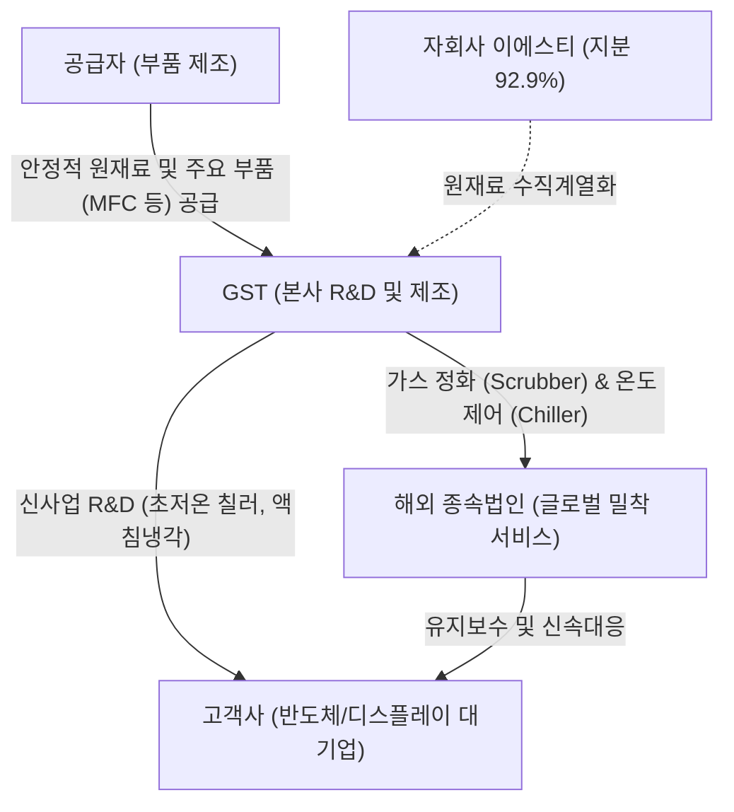

# 🔍 Phase 1: 기업 해독기 (심층 팩트체크 코어)

## 1. 비즈니스 모델 및 돈 버는 구조
[공시 팩트] GST(글로벌스탠다드테크놀로지)는 반도체 및 디스플레이 제조 공정에서 발생하는 유해 가스를 정화하는 스크러버(Scrubber)와 장비 온도를 안정적으로 제어하는 칠러(Chiller)를 핵심 주력으로 제조/판매합니다. 특히 자회사 (주)이에스티를 통해 핵심 부품을 수직계열화하여 안정적 마진 구조를 확립하였으며, 주요 글로벌 거점(미국, 중국, 대만 등)에 해외 종속법인을 두어 고객 밀착형 서비스를 제공하는 탄탄한 밸류체인을 구축하고 있습니다.

## 2. 주요 사업별 매출 비중 추이 (최근 5년 및 최신 분기)
| 구분 | 핵심 내용 | 비고 |
| :--- | :--- | :--- |
| **Scrubber (가스정화 장비)** | 2021년 57.8%에서 지속 상승하여 24년 70.4%, 26년 상반기 63.4% 기록. 전사 실적을 견인하는 Cash Cow | 환경 규제 강화 수혜 지속 |
| **Chiller (온도제어 장비)** | 최근 3년간 11~17% 비중 유지 중. 26년 상반기 기준 17.5% 기록 | AI 발열 제어 기술 고도화로 수요 회복 기대 |
| **용역 및 기타** | 매년 13~21%의 안정적 비중 차지. 26년 상반기 16.8% | 장비 설치 및 유지보수에 따른 구조적 반복 매출 |
| **수출 vs 내수** | 주력인 Scrubber 기준 수출 비중이 꾸준히 40% 이상 유지 (24년 51.8%, 26.1H 49.3%) | 글로벌 경쟁력 확보 및 환율 효과 반영 가능 |

## 3. 전사 영업이익률 및 FCF 추이
[공시 팩트] 2021년 이래 매출 규모 3,000억 원 안팎을 달성하는 동시에, 제조업 평균을 크게 상회하는 15~18%의 고마진 OPM을 꾸준히 유지 중입니다 (2026.1H 16.57%). 잉여현금흐름(FCF) 역시 매년 +180억 원 이상, 최대 433억 원(24년)의 견고한 흑자 기조를 지속하며 뛰어난 이익 창출 역량을 팩트로 증명하고 있습니다.

| 구분 | 핵심 내용 | 비고 |
| :--- | :--- | :--- |
| **매출액 및 수익성 추이** | 24년 3,334억 (OPM 17.6%) $\rightarrow$ 25년 3,472억 (OPM 17.1%) $\rightarrow$ 26.1H 2,151억 (OPM 16.6%) | 부품 내재화로 강력한 마진 방어 |
| **FCF (잉여현금흐름) 추이** | 22년 190억 $\rightarrow$ 23년 345억 $\rightarrow$ 24년 433억 $\rightarrow$ 25년 295억 (연속 대규모 흑자) | 배당 및 R&D, 자사주 매입의 강력한 재원 |

## 4. 핵심 KPI 추이 및 분석
[시장 내러티브] 시장은 전방 반도체 업체의 CAPEX 삭감 우려나 가동률 하락에 따른 장비사들의 실적 절벽 가능성을 우려할 수 있습니다. [YY.MM.DD 트렌드 업데이트] 최근 주간 반도체 트렌드 자료에 따르면 AI 서버 및 데이터센터 발열(TDP 1kW 육박)이 극한 상황에 도달해 칠러/냉각 솔루션에 대한 폭발적 수요 성장이 전망되는 내러티브가 존재합니다.

[공시 팩트] 당사는 공식적으로 공장 가동률을 공시하지 않으나, '주요 장비 생산 대수' 추이를 보면 2021년(4,002대) 대비 2025년(2,878대)로 전체 대수는 감소했습니다. 그러나 해당 기간 매출액은 오히려 큰 폭으로 우상향(3,045억 $\rightarrow$ 3,472억)했습니다. 즉, Q(물량)가 줄었음에도 실적이 상승했다는 것은 **P(단가)가 현저히 높은 고부가가치 장비(차세대 스크러버, 초저온 칠러 등) 위주로 믹스가 개선**되었다는 결정적 증거이며, 이는 AI 발열 제어 신수요에 완벽히 부합하는 기술적 진보를 보여줍니다.

## 5. 경영진 및 주주환원 이력
[공시 팩트] 김덕준 회장(최대주주, 21.6%)의 리더십 아래, 2024년 6월 석종욱 대표, 2025년 3월 문승보 신임 대표를 차례로 선임하며 전문경영인 체제를 강화했습니다. 무엇보다 현금흐름을 바탕으로 폭발적인 주주환원 정책을 단행하고 있습니다.

| 항목 | 주주환원 실적 및 내용 |
| :--- | :--- |
| **무상증자 & 자사주 소각** | 24년 6월 1:1 무상증자 단행 / 24년 12월 자사주 188,260주 전격 소각 |
| **자사주 매입** | 26년 7월 28일, 50억원 규모 자사주 취득 신탁계약 체결 (약 11만주 추가 매수) |
| **배당금 및 배당성향 확충** | 주당 배당금 대폭 인상 (24년 권리락 300원 $\rightarrow$ 25년 650원) / 25년 현금배당성향 25.68%로 수직 상승 |

## 6. 핵심 리스크 3가지
[공시 팩트] 사업보고서 상 명시된 위험관리 요소를 검토한 결과, 다음과 같은 3가지 치명적 리스크에 노출되어 있습니다.

| 구분 | 핵심 내용 | 비고 |
| :--- | :--- | :--- |
| **1. 전방 CAPEX 종속 리스크** | 주요 고객사인 삼성, 마이크론 등 반도체 제조사의 설비투자(CAPEX) 둔화 시 장비 수주가 급감하여 직접적 타격 | AI 투자가 이를 상쇄 중 |
| **2. 기술 고도화/대체 리스크** | 공정 미세화 및 ESG 환경 규제 강화에 대응하는 신제품(액침냉각, 초저온 칠러) R&D 실패 시 점유율 잠식 우려 | 부설 연구소 투자로 방어 중 |
| **3. 종속기업 실적 변동성** | 부품을 공급하는 '이에스티'나 해외 판매법인들의 영업 악화가 연결 기준 실적과 마진율 훼손으로 직결될 수 있음 | 현지 밀착 서비스로 대응 |

## 7. 딥리서치 팩트체크 요약
[시장 내러티브] "전방 반도체 장비 수요가 둔화될 것이며 레거시 장비 업체들의 마진 방어가 어려울 것이다"라는 시장의 전반적 우려 섞인 내러티브가 깔려 있습니다. [YY.MM.DD 트렌드 업데이트] 반면, AI GPU 발열이 1,000W를 돌파하는 등 열 관리 시스템(Thermal Management)이 반도체의 핵심 병목으로 부상하는 내러티브 또한 공존합니다.

[공시 팩트] 팩트체크 결과, GST는 레거시 장비 수요 감소 우려 속에서도 **고단가 프리미엄 장비 믹스 개선**을 통해 오히려 역대 최고 수준의 매출과 OPM 17%대의 압도적인 마진을 방어하고 있습니다. 더불어 최근 반도체 트렌드인 극한 발열 제어(Chiller 기술 기반 및 액침냉각 신사업) 시장에서 강력한 수혜를 볼 수 있는 내재적 역량을 지니고 있으며, 자사주 소각과 25%대 배당성향 확대로 워런 버핏이 가장 선호할 만한 주주 친화적 해자를 완벽히 구축하고 있음이 입증되었습니다.
