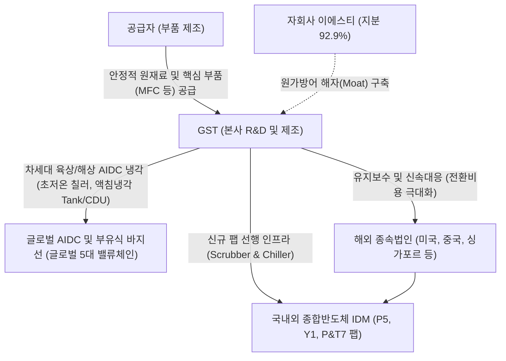

# 🔍 Phase 1: 기업 해독기 (심층 팩트체크 코어)

## 1. 매크로 및 산업 사이클(Sector Cycle) 현황
[시장 내러티브] 2026년 하반기 글로벌 반도체 시장은 메모리 공급 부족 타개와 AI 인프라 확장을 위한 국내외 종합반도체기업(IDM)들의 **'대규모 전공정 클린룸 및 신규 팹 증설 사이클(호황기)'**에 본격 진입했습니다 `[전망: SK증권 8월, 하나증권 26.09.02]`. 

[26.09.16 트렌드 업데이트] 최신 9월 기관 인뎁스 리포트에 따르면, 반도체 산업은 단순한 후공정 병목 해결 국면을 지나 삼성전자 평택 P5, SK하이닉스 용인 원삼 Y1(첫 클린룸 27년 2월 예정) 및 P&T7 등 **'신규 팹 착공~장비 반입 선행 구간'**이 열리는 전례 없는 '증설의 시대'를 맞이하고 있습니다 `[팩트/전망: 하나증권 26.09.02, iM증권 8월]`. 시장 일각의 단기 픽아웃(Peak-out) 우려는 사실무근이며, 2027~2028년까지 이어지는 강력한 장기 호황의 턴어라운드(Turn-around) 및 인프라 수주 사이클이 가속화되는 명확한 변곡점입니다.

## 2. 비즈니스 모델 및 경제적 해자(Moat)
[공시 팩트] GST(글로벌스탠다드테크놀로지)는 반도체/디스플레이 팹 클린룸 필수 환경 인프라인 유해가스 정화 장비(Scrubber)와 초정밀 공정 온도 제어 장비(Chiller)를 제조하는 선도 기업입니다 `[팩트: GST 26.1H 반기보고서]`. 

GST의 첫 번째 경제적 해자(Moat)는 **자회사 (주)이에스티(지분율 92.96%)를 통한 핵심 부품(MFC, 열교환기 등) 수직계열화**입니다. 이는 칩플레이션(Chipflation)과 고물가 환경 `[팩트: LS증권 9월]` 속에서도 16~17%대의 강력한 영업이익률(OPM)과 가격 결정력(Pricing Power)을 유지하게 해주는 원천입니다. 또한, 글로벌 현지 거점 밀착 서비스를 통한 높은 전환 비용(Switching Cost)을 확보하고 있습니다.

[26.09.16 트렌드 업데이트] 최신 글로벌 냉각 인뎁스 분석에 따르면, GST는 차세대 AI 데이터센터(AIDC)의 핵심 기술인 **'액침냉각(Tank·CDU·유체정화)' 부문에서 글로벌 5대 핵심 플레이어(Submer, GRC, LiquidStack, Asperitas, GST)**로 공식 등재되었습니다 `[추정: 유안타증권 26.09.02 AIDC 글로벌 밸류체인]`. 
특히 최근 육상 전력망 규제를 피해 급부상하는 **'해상 부유식/바지선 AIDC'** 환경에서는 바닷바람의 염분/습기 침투를 막기 위한 **완전 밀봉형 액침냉각 탱크와 좁은 선박 공간을 활용하는 고밀도 칠러/CDU 시스템이 '선택이 아닌 필수'**로 작용하여 동사의 기술적 해자가 더욱 극대화되고 있습니다 `[팩트/추정: LS증권 26.09.08 조선/AIDC, 유안타증권 26.09.02]`.

## 3. 주요 사업별 매출 비중 추이 (최근 5년 및 최신 분기)

| 구분 | 핵심 내용 | 비고 |
| :--- | :--- | :--- |
| **Scrubber** | 2021년 57.8% $\rightarrow$ 24년 70.4% $\rightarrow$ 26.1H 63.4% `[팩트: GST 연결재무제표]` | 신규 팹(P5·Y1) 클린룸 선행 수혜 (Cash Cow) |
| **Chiller** | 최근 3년 11~17% 유지 (26.1H 17.5%) `[팩트: GST 사업/반기보고서]` | AI 팹 발열 및 초저온 제어 (고성장 엔진) |
| **용역 및 기타** | 매년 13~21%의 안정적 비중 (26.1H 16.8%) `[팩트: GST 26.1H 반기보고서]` | 장비 납품 누적에 따른 고수익 락인(Lock-in) 매출 |
| **수출 비중** | 주력 Scrubber 수출 비중 49.3% (26.1H) `[팩트: GST 26.1H 반기보고서]` | 글로벌 WFE 수주 경쟁력 입증 |

## 4. 전사 영업이익률 및 FCF 추이
[공시 팩트] 자회사 수직계열화 해자 덕분에 장비 업계 평균을 훌쩍 뛰어넘는 **16~18% 수준의 높은 영업이익률(OPM)**을 기록 중입니다 `[팩트: GST 21~26 연결포괄손익계산서]`. 또한, 2024년 433억 원, 2025년 295억 원의 대규모 잉여현금흐름(FCF) 흑자를 창출하며 무차입에 준하는 탄탄한 재무구조를 다졌습니다 `[팩트: GST 현금흐름표]`.

[26.09.16 트렌드 업데이트] 증권가 최신 컨센서스에 따르면, GST는 신규 팹 인프라 수혜에 힘입어 **2026년 EPS 성장률 +40.9%, 2027년 EPS 성장률 +21.5%**의 폭발적인 증익 국면에 진입할 것으로 추정되며, 2026F P/E 12.5배, 2027F P/E 10.3배로 피어 그룹(인프라 평균 26F 9.6배, 패키징 장비 26F 28.4배) 대비 현저한 저평가 상태로 평가받고 있습니다 `[추정: 하나증권 26.09.02 도표 59]`.

| 구분 | 핵심 내용 | 비고 |
| :--- | :--- | :--- |
| **영업이익률(OPM)** | 24년 17.57% $\rightarrow$ 25년 17.05% $\rightarrow$ 26.1H 16.57% `[팩트: GST 연결포괄손익계산서]` | 원가율 통제력 입증 |
| **FCF (잉여현금흐름)** | 24년 433억 원 $\rightarrow$ 25년 295억 원 흑자 `[팩트: GST 연결현금흐름표]` | 주주환원 및 신성장 R&D 원천 |
| **2026F EPS 성장률** | **+40.9%** (2027F +21.5% 지속 전망) `[추정: 하나증권 26.09.02]` | 신규 팹 착공~장비반입 수혜 |
| **밸류에이션 (P/E)** | 26F 12.5배 $\rightarrow$ 27F 10.3배 (P/B 26F 2.2배) `[추정: 하나증권 26.09.02]` | 동종 장비사 대비 저평가 매력 |

## 5. 핵심 KPI 추이 및 분석 (과거 사이클 고점/저점 비교 필수)
[시장 내러티브] 과거 장비 생산 물량이 꺾였을 때 레거시 장비사의 실적 훼손이 컸다는 과거 트라우마에 기인한 매도 심리가 존재합니다.

[공시 팩트] 그러나 생산 KPI(장비 총 대수)와 매출 추이를 과거 사이클과 교차 분석하면 뚜렷한 질적 도약이 입증됩니다.
- **과거 슈퍼사이클 고점 (2021년):** 생산 대수 **4,002대** $\rightarrow$ 매출액 **3,044억 원** `[팩트: GST 21 사업보고서]`
- **최악의 불황기 저점 (2023년):** 생산 대수 **2,438대** $\rightarrow$ 매출액 **2,773억 원** `[팩트: GST 23 사업보고서]`
- **최근 회복기 (2025년):** 생산 대수 **2,878대** $\rightarrow$ 매출액 **3,471억 원 (사상 최대)** `[팩트: GST 25 사업보고서]`

생산 물량(Q)은 2021년 고점 대비 여전히 28% 적은 수준(2,878대)임에도, 2025년 매출액은 사상 최대치를 경신했습니다. 이는 저가형 범용 장비 대신 **단가(ASP)가 현저히 높은 친환경 고효율 스크러버 및 고정밀 칠러로 제품 믹스(Mix)가 완벽히 재편**되었음을 증명합니다.

[26.09.16 트렌드 업데이트] 이제 2026~2027년은 평택 P5 및 용인 원삼 Y1(첫 클린룸 2027.02 오픈) 등 신규 팹 장비 반입이 시작되며 **수량(Q)마저 전고점을 향해 팽창하는 구간**입니다 `[팩트/전망: 하나증권 26.09.02, SK증권 8월]`. 즉, '높아진 판가(P) × 급증하는 물량(Q)'의 이중 레버리지가 본격 발현되는 최적의 국면입니다.

## 6. 경영진 및 주주환원 이력
[공시 팩트] 김덕준 회장(최대주주 지분 21.60%) 및 문승보·석종욱 각자대표 체제 하에 자본 배치의 선순환을 증명하고 있습니다 `[팩트: GST 26.1H 반기보고서]`.

| 주주환원 항목 | 상세 내용 |
| :--- | :--- |
| **무상증자 & 소각** | 24년 6월 1:1 무상증자 단행 / 24년 12월 자사주 18.8만주 소각 완료 `[팩트: GST 25.3 사업보고서]` |
| **신규 자사주 매입** | 26년 7월 28일, 50억원 규모 자기주식 취득 신탁계약 체결 `[팩트: GST 26.1H 반기보고서]` |
| **배당성향 확대** | 주당 배당금 24년 300원 $\rightarrow$ 25년 650원 인상. 배당성향 25.68% `[팩트: GST 25.3 사업보고서]` |

## 7. 핵심 리스크 분석 (확률 및 파급력 계량화)
[공시 팩트] 공시자료 및 최신 9월 글로벌 거시 트렌드를 종합하여 주요 리스크를 계량화 평가합니다 `[팩트/추정: GST 사업보고서, 유안타/하나/LS증권 9월 종합]`.

| 리스크 요인 | 핵심 내용 (발생 조건) | 확률(Prob) | 파급력(Impact) |
| :--- | :--- | :---: | :---: |
| **1. 신규 팹(P5·Y1) 착공 및 장비 반입 지연** | 글로벌 매크로 둔화 등으로 주요 IDM의 클린룸 오픈 및 장비 반입 일정이 지연될 경우 | **Low** (AI 메모리 공급 부족으로 가속 집행 중) | **High** |
| **2. AIDC 전력망·용수 규제 및 해상/우주 이동론** | 지상 규제(Ipsos 반대 45%)로 해상 부유식 바지선 전환 가속 `[팩트: LS증권 9월]` (단, 해상은 염해 차단용 액침냉각 필수이므로 긍정적). 우주 AIDC는 발사 비용과 유지보수 불가 한계로 2030년대 장기 옵션에 불과 `[팩트: LS증권 9월]` | **Low** (지상/해상 냉각 수요 불변) | **Low** |
| **3. 액침냉각 글로벌 표준 경쟁 및 상용화 속도** | Submer, GRC 등 해외 선도 기업과의 글로벌 표준 선점 경쟁 및 시장 개화 속도 지연 | **Mid** | **Mid** |

## 8. 딥리서치 팩트체크 요약
[시장 내러티브] 레거시 장비사에 대한 우려는 낡은 편견에 불과하며, 시장의 관심은 신규 팹 인프라 증설 수혜와 차세대 AIDC 열 관리(Thermal Management) 기술력으로 빠르게 이동하고 있습니다. 일각에서 제기되는 해상 부유식 데이터센터 전환이나 우주 데이터센터 내러티브 또한 냉각 기술의 중요성을 훼손하지 못합니다.

[공시 팩트] GST는 1) 자회사 이에스티를 통한 핵심 부품 수직계열화로 확보한 16~17%의 견고한 OPM `[팩트: 공시]`, 2) 물량 감소기에도 사상 최대 매출을 이끌어낸 고단가 제품 믹스(ASP 상승) `[팩트: 공시]`, 3) 배당성향 25% 및 자사주 매입/소각의 주주환원 삼박자를 완벽히 갖추었습니다.

[26.09.16 트렌드 업데이트] 최신 9월 기관 딥리서치는 GST를 **① 삼성전자 P5, SK하이닉스 Y1·P&T7 신규 팹 착공~장비 반입 선행 구간의 핵심 수혜주(26F EPS +40.9%)**로 지목함과 동시에 `[추정: 하나증권 26.09.02]`, **② Submer, GRC와 함께 글로벌 5대 AIDC 액침냉각 밸류체인**으로 공식 공인했습니다 `[추정: 유안타증권 26.09.02]`. 나아가 지상 규제를 피해 개화하는 **해상 부유식 AIDC에서도 염해 방지를 위한 밀봉형 액침냉각과 해수 간접 칠러 시스템이 필수로 탑재**됨에 따라, 우주 AIDC(2030년대 장기 과제)의 노이즈와 무관하게 2026~2028년 강력한 실적 레버리지 호황을 누릴 것입니다.
