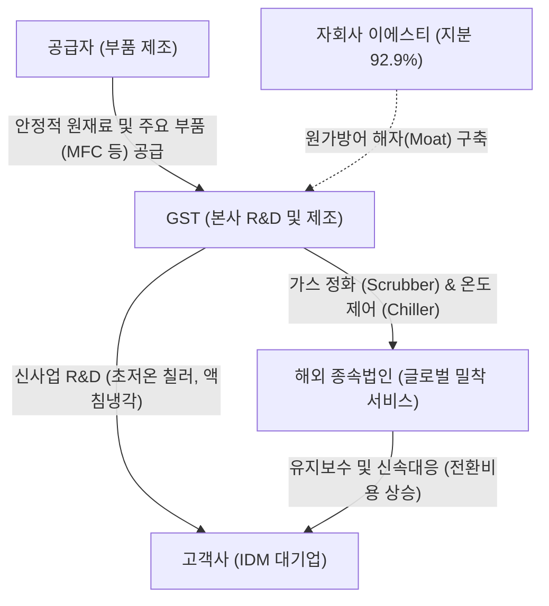

# 🔍 Phase 1: 기업 해독기 (심층 팩트체크 코어)

## 1. 매크로 및 산업 사이클(Sector Cycle) 현황
[시장 내러티브] 2026년 하반기 글로벌 반도체 시장은 메모리 공급 제약('외화내빈')을 타개하기 위해 국내외 종합반도체기업(IDM)들이 대규모 전공정 클린룸 완공 및 장비 반입을 가속화하는 **'슈퍼사이클(호황기)' 국면**에 진입했습니다 `[팩트/전망: SK증권 8월, LS증권 9월]`. 이는 후공정 중심에서 전공정 장비 및 특수 소재 기업으로 수혜가 확산되는 거대한 턴어라운드(Turn-around) 변곡점이며, 단기 픽아웃(Peak-out) 우려를 불식시키는 강력한 전공정 인프라 증설 사이클의 초입입니다 `[팩트/전망: SK증권 8월, LS증권 9월]`.

## 2. 비즈니스 모델 및 경제적 해자(Moat)
[공시 팩트] GST(글로벌스탠다드테크놀로지)는 반도체/디스플레이 제조 공정 및 클린룸의 필수 환경 인프라인 유해가스 정화 장비(Scrubber)와 공정 온도 제어 장비(Chiller)를 주력으로 제조합니다 `[팩트: GST 26.1H 반기보고서]`. 당사의 가장 강력한 경제적 해자(Moat)는 **자회사 (주)이에스티(지분율 92.96%)를 통한 핵심 부품(MFC 등) 수직계열화**입니다. 이를 통해 칩플레이션(Chipflation) 등 극심한 인플레이션 국면 `[팩트: LS증권 9월]` 속에서도 타사 대비 압도적인 원가 구조와 가격 결정력(Pricing Power)을 입증하고 있으며, 글로벌 현지 법인을 통한 유지보수(용역) 밀착 대응으로 고객의 전환 비용(Switching Cost)을 극대화하고 있습니다.

## 3. 주요 사업별 매출 비중 추이 (최근 5년 및 최신 분기)

| 구분 | 핵심 내용 | 비고 |
| :--- | :--- | :--- |
| **Scrubber** | 2021년 57.8% $\rightarrow$ 24년 70.4% $\rightarrow$ 26.1H 63.4% `[팩트: GST 21~26 연결재무제표]` | 전공정 클린룸 수혜 (Cash Cow) |
| **Chiller** | 최근 3년 11~17% 유지 (26.1H 17.5%) `[팩트: GST 24~26 사업/반기보고서]` | AI 발열 제어 모멘텀 (미래 동력) |
| **용역 및 기타** | 매년 13~21%의 안정적 비중 (26.1H 16.8%) `[팩트: GST 26.1H 반기보고서]` | 장비 셋업에 따른 락인(Lock-in) 매출 |
| **수출 비중** | 주력 Scrubber 수출 비중 49.3% (26.1H) `[팩트: GST 26.1H 반기보고서]` | WFE 글로벌 수주 경쟁력 입증 |

## 4. 전사 영업이익률 및 FCF 추이
[공시 팩트] 원가 방어 해자를 바탕으로 제조업 평균을 크게 상회하는 **15~18% 수준의 높은 영업이익률(OPM)**을 기록 중입니다 `[팩트: GST 21~26 연결포괄손익계산서]`. 또한, 매년 대규모 잉여현금흐름(FCF)을 창출하며 강력한 주주환원(자사주 매입 및 배당)의 재원을 마련하고 있습니다.

| 구분 | 핵심 내용 | 비고 |
| :--- | :--- | :--- |
| **영업이익률(OPM)** | 24년 17.57% $\rightarrow$ 25년 17.05% $\rightarrow$ 26.1H 16.57% `[팩트: GST 24~26 연결포괄손익계산서]` | 원가율 통제 입증 |
| **FCF (잉여현금흐름)** | 24년 433억 원 $\rightarrow$ 25년 295억 원 흑자 `[팩트: GST 24~25 연결 및 별도현금흐름표 합산 추정]` | 주주환원 여력 팽창 |

## 5. 핵심 KPI 추이 및 분석 (과거 사이클 고점/저점 비교 필수)
[시장 내러티브] 전방 반도체 장비 수요가 주춤하면 레거시 공정 장비사들의 펀더멘털이 크게 훼손될 것이란 의구심이 팽배합니다. 

[공시 팩트] 그러나 생산 KPI(장비 대수)를 과거 사이클과 직접 비교해 보면 정반대의 결론이 도출됩니다. 과거 반도체 슈퍼사이클 고점인 **2021년 장비 총 생산 대수는 4,002대**였으며, 최악의 불황기 저점인 **2023년은 2,438대**로 급감했습니다 `[팩트: GST 21~23 사업보고서 생산실적]`. 최근 **2025년 생산 수량은 2,878대**로 과거 고점 대비 여전히 28% 감소한 수준에 머물러 있습니다 `[팩트: GST 25 사업보고서 생산실적]`.
그럼에도 불구하고, **매출액은 2021년 3,044억 원에서 2025년 3,471억 원으로 사상 최대치를 경신**했습니다 `[팩트: GST 21~25 연결포괄손익계산서]`. 물량(Q)이 줄어든 상태에서도 매출(P*Q)과 이익률이 사상 최고에 도달했다는 것은, **단가(ASP)가 현저히 높은 프리미엄 친환경 장비로 제품 믹스(Product Mix)가 완벽하게 업그레이드되었음**을 의미합니다.

## 6. 경영진 및 주주환원 이력
[공시 팩트] 김덕준 회장(최대주주 지분 21.60%) 체제 하에 문승보/석종욱 공동 대표이사 체제로 책임 경영을 강화했으며, 압도적 현금 창출력을 바탕으로 주주환원을 대폭 늘리고 있습니다 `[팩트: GST 26.1H 반기보고서]`.

| 주주환원 항목 | 상세 내용 |
| :--- | :--- |
| **무상증자 & 소각** | 24년 6월 1:1 무상증자 단행 / 24년 12월 자사주 18.8만주(188,260주) 소각 `[팩트: GST 25.3 사업보고서 주요배당지표 주석]` |
| **신규 자사주 매입** | 26년 7월 28일, 주가 안정 목적 50억원 규모 자기주식 취득 신탁계약 체결 `[팩트: GST 26.1H 반기보고서 주주에 관한 사항]` |
| **배당성향 수직 상승** | 주당 배당금 650원으로 확대 / 25년 현금배당성향 25.68% 기록 `[팩트: GST 25.3 사업보고서 주요배당지표]` |

## 7. 핵심 리스크 분석 (확률 및 파급력 계량화)
[공시 팩트] 공시된 위험관리 요인 및 거시경제 트렌드를 종합하여 다음과 같이 리스크를 계량화합니다 `[팩트: GST 사업보고서 및 iM/LS증권 8~9월 거시전망 종합]`.

| 리스크 요인 | 핵심 내용 (발생 조건) | 확률(Prob) | 파급력(Impact) |
| :--- | :--- | :---: | :---: |
| **1. 전방 CAPEX 둔화 및 클린룸 완공 지연** | 주요 고객사(IDM)의 투자 지연 및 장비 반입 연기 시 수주 급감 직격탄 | **Low** (AI 슈퍼사이클로 증설 가속 중) | **High** |
| **2. 고금리 장기화(H4L) 매크로 충격** | 미 연준 중립금리 상향 등 매크로 충격에 따른 전방 인프라 투자 위축 | **Mid** | **Mid** |
| **3. 차세대 액침냉각 상용화 지연** | 신규 R&D 솔루션의 시장 개화가 늦어지거나 경쟁사(테스 등) 선점에 따른 잠식 | **Mid** | **Mid** |

## 8. 딥리서치 팩트체크 요약
[시장 내러티브] 시장은 여전히 일부 레거시 장비사들의 이익 훼손 가능성을 우려하나, 2026년 하반기는 반도체 클러스터 및 전공정 증설 사이클의 초입이라는 긍정적 뷰가 맞서고 있습니다.

[공시 팩트] GST는 1) 자회사 수직계열화로 확보한 17%대의 철벽같은 영업이익률 `[팩트: GST 공시]`, 2) 물량(Q) 하락을 이겨낸 압도적인 프리미엄 단가(P) 인상 증명 `[팩트: 매출 및 생산대수 교차검증]`, 3) 배당성향 25%와 자사주 소각이라는 주주 친화적 행보 `[팩트: GST 배당지표]`를 모두 갖추고 있습니다. 전공정 클린룸 장비 반입이 본격화되는 26년 하반기 증설 사이클 `[팩트: SK증권 8월 전망]`에서 폭발적인 EPS 성장이 기대되는 독보적 펀더멘털 보유 기업입니다.
