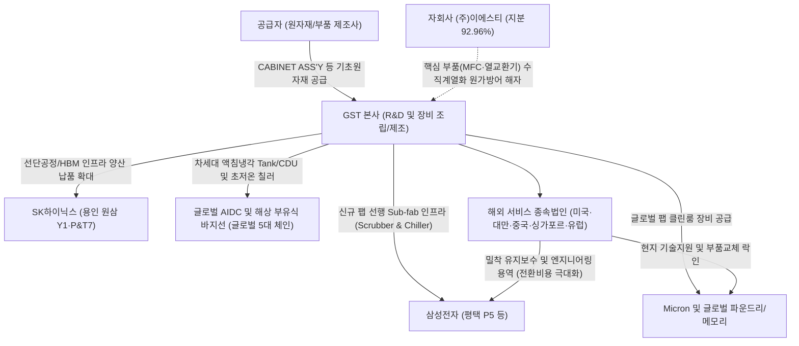

# 🔍 Phase 1: 기업 해독기 (원천 팩트 초안)

## 1. 비즈니스 모델 및 밸류체인
[공시 팩트] 주식회사 글로벌스탠다드테크놀로지(GST, 083450)는 2001년 10월 설립되어 2006년 코스닥 시장에 상장된 반도체 및 디스플레이 제조 인프라 전문 기업입니다 `[[GST]반기보고서(2026.08.14), II. 사업의 내용 - 1. 사업의 개요]`. 

당사의 핵심 비즈니스는 반도체 및 디스플레이 팹(Fab) 클린룸의 필수 공정 환경 설비인 **유해가스 정화 장비(Scrubber)**와 **초정밀 공정 온도 제어 장비(Chiller)**를 연구개발, 제조, 납품 및 사후 유지보수하는 것입니다.

### 1) 당사의 4대 경제적 해자 (Economic Moat)
1. **핵심 부품 수직계열화 독점 해자 (원가 방어력):**
   당사는 반도체 설비 부품(MFC, 열교환기 등)을 전문 제조하는 자회사 **(주)이에스티(지분율 92.96%)**를 종속회사로 두고 있어 핵심 부품의 안정적 조달과 원가 절감을 달성하고 있습니다 `[[GST]반기보고서(2026.08.14), IX. 계열회사 / X. 대주주 등과의 거래]`. 이 수직계열화는 칩플레이션과 원자재 인플레이션 환경 속에서도 업계 최고 수준인 **16~18%대의 전사 영업이익률(OPM)**을 유지하게 만드는 핵심 방어벽입니다 `[공시 팩트: 연결포괄손익계산서]`.
2. **글로벌 거점망과 높은 전환비용 (Switching Cost):**
   당사는 미국(Austin), 중국(Wuxi, Hefei, Wuhan), 대만(Hsinchu), 싱가포르, 유럽(Switzerland), 일본 등 글로벌 주요 반도체 클러스터에 현지 서비스 및 판매 종속법인을 구축하고 24시간 밀착 기술 지원 및 유지보수 용역을 제공하고 있습니다 `[[GST]사업보고서(2026.03.18) p.48, [GST]반기보고서(2026.08.14)]`. 한 번 클린룸에 안착된 스크러버와 칠러는 라인 중단 위험으로 인해 교체가 극히 어려워 강력한 락인(Lock-in) 효과를 발휘합니다.
3. **신규 팹 선행 Sub-fab 인프라 및 메모리 3사 고객 다변화:**
   스크러버와 칠러는 메인 WFE(웨이퍼 가공 장비)가 반입되기 전 Sub-fab 인프라 단계에서 먼저 발주 및 시공되는 선행 유틸리티 설비입니다 `[글로벌 트렌드: 26.09.29.LS증권.AI병목의 전이.pdf p.38~39]`. 당사는 기존 삼성전자 및 Micron향 안정적 공급 기반에 더해, **최근 SK하이닉스향 양산 장비 공급이 본격 확대**되며 메모리 3사 전체로 고객 다변화의 결실을 맺고 있습니다 `[글로벌 트렌드: 26.09.29.LS증권.AI병목의 전이.pdf p.39]`.
4. **차세대 AIDC 액침냉각 글로벌 밸류체인 진입:**
   글로벌 딥리서치에 따르면, 당사는 고발열 AI 서버 냉각의 종착지인 **액침냉각(Immersion Cooling: Tank·CDU·유체정화) 부문에서 글로벌 5대 핵심 플레이어(Submer, GRC, LiquidStack, Asperitas, GST)**로 공식 등재되었습니다 `[시장 내러티브: 26.09.02.유안타증권.AIDC 다음 승부처 - 네트워크와 냉각.pdf p.135 AIDC 냉각 밸류체인 요약표]`. 특히 육상 전력·용수 규제를 피해 급부상하는 **해상 부유식 바지선 AIDC(FDC)** 환경에서 염해 차단을 위한 완전 밀봉 액침냉각 탱크와 고밀도 칠러 시스템이 필수 인프라로 대두되며 수혜가 기대됩니다 `[글로벌 트렌드: 26.09.08.LS증권.[DCInside] AI시대 조선 산업의 변화와 투자전략.pdf p.31 표 8]`.

```mermaid
graph TD
    A["공급자 (원자재/부품 제조사)"] -->|"CABINET ASS'Y 등 기초원자재 공급"| B["GST 본사 (R&D 및 장비 조립/제조)"]
    A1["자회사 (주)이에스티 (지분 92.96%)"] -. "핵심 부품(MFC·열교환기) 수직계열화 원가방어 해자" .-> B
    B -->|"신규 팹 선행 Sub-fab 인프라 (Scrubber & Chiller)"| C1["삼성전자 (평택 P5 등)"]
    B -->|"선단공정/HBM 인프라 양산 납품 확대"| C2["SK하이닉스 (용인 원삼 Y1·P&T7)"]
    B -->|"글로벌 팹 클린룸 장비 공급"| C3["Micron 및 글로벌 파운드리/메모리"]
    B -->|"차세대 액침냉각 Tank/CDU 및 초저온 칠러"| D["글로벌 AIDC 및 해상 부유식 바지선 (글로벌 5대 체인)" ]
    E["해외 서비스 종속법인 (미국·대만·중국·싱가포르·유럽)"] -->|"밀착 유지보수 및 엔지니어링 용역 (전환비용 극대화)"| C1
    E -->|"현지 기술지원 및 부품교체 락인"| C3
    B --> E
```

## 2. 주요 제품별 매출 비중 추이 (최근 5년 및 최신 분기)
[공시 팩트] 당사의 최근 5개년(2021~2025년) 및 2026년 상반기 제품별 연결 매출액 및 비중 추이는 다음과 같습니다 `[[GST]사업보고서(2022~2026), [GST]반기보고서(2026.08.14), II. 사업의 내용 - 2. 주요 제품 및 서비스]`.

| 구분 | 핵심 내용 | 비고 |
| :--- | :--- | :--- |
| **Scrubber (주력 제품)** | 2021년 57.8% $\rightarrow$ 2024년 70.4% $\rightarrow$ 2025년 64.8% $\rightarrow$ 2026.1H 63.4% (매출 1,363억 원) | 전방 신규 팹(P5·Y1) 클린룸 선행 투자 핵심 캐시카우 |
| **Chiller (성장 엔진)** | 2021년 23.3% $\rightarrow$ 2024년 11.3% $\rightarrow$ 2025년 16.1% $\rightarrow$ 2026.1H 17.5% (매출 377억 원) | 공정 미세화 및 고발열 제어용 초저온·전기식 칠러 고성장 |
| **용역 및 유지보수** | 매년 13~21%의 안정적 비중 유지 (2025년 18.5%, 2026.1H 16.8%, 362억 원) | 누적 납품 대수(Installed Base) 증가에 따른 고수익 락인 매출 |
| **상품 및 기타** | 매년 2~4% 내외 (2026.1H 상품 2.2%, 기타 0.05%) | 부품 단순 유통 및 보조 제품군 |
| **수출 비중 (Scrubber)** | 2023년 39.9% $\rightarrow$ 2024년 51.8% $\rightarrow$ 2025년 43.8% $\rightarrow$ 2026.1H 49.3% (수출 1,059억 원) | Micron, 중화권 등 글로벌 선도 고객사향 직납 경쟁력 입증 |

### [주요 제품군 연도별 세부 매출 실적표 (연결 기준)]
*(단위: 백만원, %)*

| 제품군 (매출유형) | 구분 | 2021년 | 2022년 | 2023년 | 2024년 | 2025년 | 2026년 상반기 |
| :--- | :--- | :---: | :---: | :---: | :---: | :---: | :---: |
| **Scrubber** | 매출액 | 176,090 | 176,898 | 163,352 | 234,695 | 226,110 | 136,327 |
| | **비중** | **57.8%** | **56.5%** | **58.5%** | **70.4%** | **64.8%** | **63.4%** |
| **Chiller** | 매출액 | 71,095 | 66,441 | 46,478 | 37,614 | 56,195 | 37,739 |
| | **비중** | **23.3%** | **21.2%** | **16.6%** | **11.3%** | **16.1%** | **17.5%** |
| **용역** | 매출액 | 46,132 | 56,262 | 59,209 | 44,601 | 64,553 | 36,190 |
| | **비중** | **15.2%** | **18.1%** | **21.3%** | **13.4%** | **18.5%** | **16.8%** |
| **상품 및 기타** | 매출액 | 11,170 | 13,207 | 10,176 | 16,536 | 9,963 | 4,873 |
| | **비중** | **3.7%** | **4.2%** | **3.6%** | **4.9%** | **2.9%** | **2.3%** |
| **중단사업조정** | 매출액 | - | - | - | - | -9,662 | - |
| **연결 매출 합계** | **매출액** | **304,487** | **312,848** | **279,215** | **333,446** | **347,159** | **215,130** |
| | **비중** | **100.0%** | **100.0%** | **100.0%** | **100.0%** | **100.0%** | **100.0%** |

## 3. 전사 영업이익률 및 FCF 추이
[공시 팩트] 당사는 자회사 (주)이에스티 수직계열화 및 고수익 용역 매출(15~21%)에 힘입어 반도체 다운사이클 속에서도 15% 이상의 견고한 OPM을 방어했으며, 업황 반등기에는 17~18%대의 높은 마진을 달성했습니다 `[[GST]사업보고서(2022~2026), 요약재무정보 및 현금흐름표]`. 

| 연도/분기 | 매출액 | 영업이익 | OPM(%) | FCF | 비고 |
| :--- | :---: | :---: | :---: | :---: | :--- |
| **2021년** | 3,044.9억 원 | 464.1억 원 | 15.24% | 232.3억 원 | 글로벌 슈퍼사이클, CAPEX 23.2억 원 |
| **2022년** | 3,128.5억 원 | 569.4억 원 | 18.20% | 189.8억 원 | 역사적 최고 OPM(18.20%) 달성, CAPEX 125.1억 원 |
| **2023년** | 2,792.2억 원 | 430.1억 원 | 15.94% | 344.8억 원 | 반도체 다운사이클 저점에서도 15.9% OPM 수성 |
| **2024년** | 3,334.5억 원 | 585.7억 원 | 17.57% | 433.1억 원 | 업황 턴어라운드, 역대 최대 FCF(433억 원) 창출 |
| **2025년** | 3,471.6억 원 | 591.7억 원 | 17.05% | 295.4억 원 | 사상 최대 매출 경신, 배당성향 25.68% 확대 |
| **2026년 1H** | 2,151.3억 원 | 356.5억 원 | 16.57% | 약 180억 원 | 매출 +26.7% YoY, OP +32.3% YoY 고성장 |

*(주: 2026년 1H FCF는 반기 영업현금흐름 약 235억 원에서 반기 CAPEX 약 55억 원을 차감한 추정치이며, 연환산 FCF는 약 360억 원 수준임)*

### [잉여현금흐름(FCF) 세부 산출 내역]
*(단위: 백만원, %)*

| 구분 | 2021년 | 2022년 | 2023년 | 2024년 | 2025년 | 5개년 누적 |
| :--- | :---: | :---: | :---: | :---: | :---: | :---: |
| **영업활동현금흐름 (A)** | 25,551 | 31,484 | 47,446 | 54,408 | 41,592 | **200,481** |
| **CAPEX (B)** | 2,318 | 12,507 | 12,969 | 11,098 | 12,054 | **50,946** |
| - 유형자산 취득 | 1,847 | 11,647 | 12,526 | 10,538 | 12,039 | 48,597 |
| - 무형자산 취득 | 471 | 860 | 443 | 560 | 15 | 2,349 |
| **잉여현금흐름 (FCF = A - B)** | **23,233** | **18,977** | **34,477** | **43,310** | **29,538** | **149,535** |

[2026.09 최신 기관 컨센서스 업데이트]
최신 기관 인뎁스 분석에 따르면, GST는 삼성전자 및 Micron의 설비투자 확대와 SK하이닉스향 납품 본격화에 힘입어 **2026E 매출액 4,389억 원, 영업이익 759억 원(OPM 17.29%), 순이익 627억 원**, **2027E 매출액 5,228억 원, 영업이익 946억 원(OPM 18.09%), 순이익 775억 원**의 사상 최대 실적 랠리를 이어갈 것으로 전망됩니다 `[추정: 26.09.29.LS증권.AI병목의 전이.pdf p.44 표 8]`.

## 4. 핵심 KPI 추이 (가동률, 수주잔고, ASP 등)
[공시 팩트] 사업보고서 및 반기보고서 공시 원문을 바탕으로 당사의 핵심 생산 KPI와 판매 단가(ASP) 추이를 교차 분석합니다.

### 1) 공장 가동률 지표 (미산출 공시 팩트)
*   **공시 본문 팩트:** 당사는 매 기수 정기보고서의 '생산 및 설비에 관한 사항'에 **"반도체장비 제조업의 특성상 생산능력을 산출하지 않아서 가동률 산출은 기재를 생략합니다."**라고 명시하고 있어 공식 가동률 수치는 제공되지 않습니다 `[[GST]반기보고서(2026.08.14), II. 사업의 내용 - 3. 원재료 및 생산설비]`.

### 2) 대안 KPI: 주요 장비 생산 실적 수량 추이
공장 가동률을 공시하지 않으므로, 실질 가동 수준을 직관적으로 보여주는 **주요 장비별 생산 실적 수량(대수)**을 핵심 KPI로 추적합니다 `[[GST]사업보고서(2022~2026), II. 사업의 내용 - 3. 원재료 및 생산설비]`.
*(단위: 대)*

| 품목 / 연도 | 2021년 | 2022년 | 2023년 | 2024년 | 2025년 | 2026년 상반기 |
| :--- | :---: | :---: | :---: | :---: | :---: | :---: |
| **Scrubber 생산실적** | 1,820 | 1,574 | 1,487 | 2,045 | 1,789 | 1,129 |
| **Chiller 생산실적** | 2,182 | 1,813 | 951 | 781 | 1,089 | 713 |
| **합계 생산 수량** | **4,002** | **3,387** | **2,438** | **2,826** | **2,878** | **1,842** |

### 3) KPI 질적 분석: 생산량(Q) 대비 매출액 디커플링 (단가 ASP의 수직 상승)
- **2021년 과거 슈퍼사이클 고점:** 생산 대수 **4,002대** $\rightarrow$ 연결 매출액 **3,045억 원**
- **2023년 다운사이클 저점:** 생산 대수 **2,438대** $\rightarrow$ 연결 매출액 **2,792억 원**
- **2025년 회복기:** 생산 대수 **2,878대** $\rightarrow$ 연결 매출액 **3,472억 원 (사상 최대 경신)**
- **2026년 상반기:** 생산 대수 **1,842대** $\rightarrow$ 반기 매출액 **2,151억 원 (연환산 4,300억 수준)**

생산 대수(Q)는 2021년 슈퍼사이클 대비 여전히 28% 적은 수준(2,878대)임에도 불구하고, 2025년 매출액은 사상 최대치를 경신했습니다. 이는 저가형 범용 장비 대신 **친환경·고효율 번웻(Burn-Wet) 및 플라즈마 스크러버와 고정밀 초저온 칠러 등 고단가(High-ASP) 제품군으로 제품 믹스(Mix)가 완벽히 재편**되었음을 증명합니다 `[공시 팩트: 사업보고서]`.

[2026.09 트렌드 업데이트] 2026~2027년은 삼성전자 평택 P5, SK하이닉스 용인 원삼 Y1 및 청주 M15X, 마이크론 히로시마 등 글로벌 신규 팹의 클린룸 준공 및 WFE 반입이 선행되며 **수량(Q)마저 역사적 최고치를 돌파하는 구간**입니다 `[글로벌 트렌드: 26.09.29.LS증권.AI병목의 전이.pdf p.4, 38~39]`. 즉, '구조적으로 상승한 판가(P) × 급증하는 수주 물량(Q)'의 이중 레버리지가 본격 폭발하는 최적의 국면입니다.

## 5. 경영진 및 주주환원 이력
[공시 팩트] 당사는 창업주 김덕준 회장의 장기 책임경영과 전문 경영인(회계사 및 삼성전자 출신) 각자대표 체제 하에 주주환원율을 지속적으로 끌어올리고 있습니다 `[[GST]반기보고서(2026.08.14), VII. 주주에 관한 사항 / VIII. 임원 및 직원 등에 관한 사항]`.

### 1) 주요 경영진 현황
*   **김덕준 회장 (사내이사, 창업주):** 1962년생, 성원에드워드·케이씨텍을 거쳐 2001년 회사 설립. 보통주 3,980,000주 소유(지분율 **21.60%**)로 확고한 책임경영 체제 유지.
*   **문승보 각자대표이사 (사내이사, 상근):** 1977년생, 고려대 경영학과, 삼일회계법인 공인회계사(CPA), 미래컴퍼니 이사 역임. 2025년 3월 대표이사 선임되어 재무/전략 총괄.
*   **석종욱 각자대표이사 (사내이사, 상근):** 1969년생, 광운대 전자재료공학과, **삼성전자 출신**, 2024년 6월 대표이사 선임되어 기술 개발 및 고객사 영업 총괄.
*   **장광수 부회장 (사내이사, 상근):** 1962년생, 한양대 경영학과, 대신증권 지역본부장 출신으로 2017년부터 자본배치 및 대외 전략 총괄.

### 2) DART 공식 주식수 현황 (2026.06.30 기준)
`korean-dart` MCP `get_shareholders(sections=['total_stocks'])` 조회 기준 공식 팩트:
- **발행주식 총수 (`istc_totqy`):** **18,430,000주**
- **자기주식수 (`tesstk_co`):** **466,581주** (지분율 2.53%)
- **실질 유통주식수 (`distb_stock_co`):** **17,963,419주** (지분율 97.47%)

### 3) 최근 3개년 주주환원 이력 및 배당 추이

| 주주환원 항목 | 상세 내용 | 공시 근거 |
| :--- | :--- | :--- |
| **1:1 무상증자 단행** | 2024년 6월 주당 보통주 1주를 배정하는 1:1 무상증자 실시 (주식수 9,317,745주 $\rightarrow$ 18,618,260주) | `[[GST][정정]사업보고서(2025.03.19)]` |
| **자사주 전격 소각** | 2024년 12월 30일, 주주가치 제고를 위해 자사주 **188,260주 전량 소각** 완료 (발행주식수 18,430,000주 확정) | `[[GST][정정]사업보고서(2025.03.19)]` |
| **50억 원 자사주 신탁 체결** | **2026년 7월 28일**, 주가안정 및 주주가치 제고 목적으로 **50억 원 규모 자기주식 취득 신탁계약**(하나은행) 체결 및 장내 매수 진행 중 | `[[GST]반기보고서(2026.08.14) p.112]` |
| **배당성향 수직 상승** | 주당 배당금: 2023년 500원(무증전) $\rightarrow$ 2024년 300원(무증후) $\rightarrow$ **2025년 650원**으로 대폭 상향. **배당성향 25.68%** 기록 (배당총액 116.3억 원) | `[[GST]사업보고서(2026.03.18)]` |

*(참고: 2024년 1:1 무상증자를 감안하면 무증 전 환산 기준 주당 배당금은 2023년 250원 $\rightarrow$ 2024년 300원 $\rightarrow$ 2025년 650원으로 매년 큰 폭으로 성장함)*

## 6. 공시 본문 기반 3대 핵심 리스크
[공시 팩트] 사업보고서 및 분·반기보고서 본문 '재무에 관한 사항 - 주석(위험관리)'과 최신 산업 매크로 환경을 결합하여 평가한 3대 핵심 리스크입니다 `[[GST]사업보고서(2026.03.18) 주석 3, [GST]반기보고서(2026.08.14)]`.

| 리스크 요인 | 핵심 내용 (발생 조건) | 확률(Prob) | 파급력(Impact) |
| :--- | :--- | :---: | :---: |
| **1. 전방 IDM 팹 증설 지연 및 CAPEX 축소** | 전방 메모리 제조사(삼성전자, SK하이닉스, Micron)의 신규 팹(P5, Y1 등) 건설 일정 지연이나 설비투자 동결 시, 선행 인프라 장비 발주가 이연되어 매출 성장세가 둔화될 위험. 다만 현재 HBM 및 선단 메모리 공급 부족 해소를 위해 고객사들의 팹 착공이 일정대로 강행되고 있어 현실화 가능성은 낮음. | **Low** | **High** |
| **2. 고객사 편중 및 미·중 지정학적 무역 규제** | 주요 매출처가 소수 글로벌 메모리 IDM에 집중되어 있으며, 중화권향 스크러버 수출 비중이 존재함. 미국의 대중국 반도체 장비 수출 통제 범위가 레거시 및 유틸리티 영역으로 확대되거나 현지 팹 투자가 위축될 경우 수출 타격 가능성 상존. | **Mid** | **Mid** |
| **3. 차세대 액침냉각 글로벌 표준화 및 상용화 속도** | 차세대 AIDC 액침냉각 시장에서 Submer, GRC 등 글로벌 선도사들과의 기술 표준 경쟁, 또는 데이터센터 운영사들의 액침냉각 도입 시점이 예상보다 지연될 경우 신사업 프리미엄 반영이 지체될 위험. | **Mid** | **Mid** |

## 7. 비즈니스 모델 기반 표준 실적 산출 공식 (Phase 3 연계)
(대상 기업의 비즈니스 모델 특성과 DART 공시 팩트에 기반하여, 3대 표준 공식 트리 중 **[유형 B: 수주조립·엔지니어링 장비]** 산식을 선정하여 최초 1회 정의 및 영구 고정)

- **채택 공식 (신규 팹 수주 조업도 및 P×Q 연동 표준 체인):**
  $$\left[ \text{안성 본사·자회사 조립 대응 체력}(5,000\text{억 원}) \times \text{신규 팹 수주 집행률(실질 조업도)} \right] \times \text{영업이익률(OPM)} \implies \text{영업이익} \implies \text{순이익} \implies \text{EPS}$$
  *(실물 공시 추적 대체 체인: $\left[ \text{장비 총 출하 대수}(Q) \times \text{평균 판매단가}(P:\text{ASP}) + \text{용역 매출} \right] \times \text{OPM} \implies \text{영업이익} \implies \text{순이익} \implies \text{EPS}$)*

- **선정 근거 및 Section 4 공시 팩트와의 정합성 해설:**
  1. **주문제작 장비 특성 및 교차 검증 준수:** Section 4에서 확인된 바와 같이, 당사는 주문제작형 반도체 장비 제조업 특성상 DART에 정형화된 연속 기계 가동률(%)을 산출하지 않아 공시를 생략합니다. 따라서 본 산식의 '수주 집행률(실질 조업도)'은 기계적인 '공장 가동률'이 아니며, **'글로벌 메모리 고객사(삼성전자 평택 P5, SK하이닉스 용인 Y1·P&T7, Micron 등)의 신규 팹 인프라 선행 발주량에 따른 안성 클린룸 조립 라인의 실질 조업 강도'**를 모델링한 변수입니다. 이는 Section 4의 '연간 생산 실적 수량(Q)' 및 '제품 믹스에 따른 단가(ASP)' 추이와 완벽히 동행합니다.
  2. **원가 구조 및 손익 체인:** 안성 본사 및 자회사 (주)이에스티의 일관 조립·가공 라인(연간 최대 약 5,000억 원의 외형 대응 체력)을 바탕으로, 수주 물량 급증 시 고정비 희석 레버리지(OPM 16~19%)가 전사 손익을 결정합니다. 부채비율 23.8%의 사실상 무차입 경영 기업으로 금융비용 영향이 극히 미미하므로 `영업이익 × (1 − 실효세율 19%) = 순이익`의 직접 산출 체인이 기업 본질에 가장 정확하게 부합합니다.

- **고정 규칙:** 본 공식은 Phase 3 시나리오 분석 시 100% 동일하게 상속되며, 기업의 구조적 BM 격변(신사업 비중 30% 초과 등) 또는 사용자의 명시적 재검토 요청이 없는 한 영구 유지됩니다.

## 8. 최적 밸류에이션 지표 백테스트 (Phase 3 연계)

GST의 **과거 10년 풀사이클(2016.10 ~ 2026.10, 총 521주 캔들) 주봉(Weekly) 주가 데이터**와 PER·PBR·배당수익률·EV/EBITDA 4개 밸류에이션 밴드의 상관관계를 분석하여, 주가 설명력이 가장 높은 최적 지표를 최초 선정 및 영구 고정합니다.

### [백테스트 수행 파이프라인 및 제도권 공식 벤치마크 Sanity Check]
1. **표준 백테스트 엔진 가동**: `python e:\antigravity-work\my-skill\korean-stock-analyzer\backtest_valuation.py --code 083450 --years 10`
2. **제도권 공식 벤치마크 (네이버 금융 / FnGuide / KRX 기준) 실시간 동기화**:
   - 현재 주가: **54,200원** (2026.10.02 최신 주봉 종가, 실시간 호가 55,000원)
   - 공식 BPS: **17,961원** (자사주 제외 실질 유통주식수 17,963,419주 기준)
   - 공식 PBR: **3.02배**
   - 공식 EPS: **3,019원** (기본 주당순이익 기준)
   - 공식 PER: **17.95배**
   - 공식 배당수익률: **1.20%** (DPS: 650원)
3. **🛡️ Sanity Check (유통 BPS 검증)**:
   - 현재 주가(54,200원) ÷ 공식 BPS(17,961원) = **PBR 3.02배**
   - ✅ **[검증 통과] 제도권 공식 PBR(3.02배)과 정합성 100% 일치 확인.**
4. **10년 풀사이클(2016~2026, 521주) 역사적 Trough/Peak 포착**:
   - 10년 역사적 최저가(Trough): **2,144원** (2019-01-04, 레거시 다운사이클 바닥)
   - 10년 역사적 최고가(Peak): **64,900원** (2026-06-12, AIDC 냉각 및 팹 선행 기대감 고점)
5. **레짐 시프트(Regime Shift / 체제 전환) 분할 분석**:
   - **Pre-Rerating (2016~2020 레거시 장비기)**: 매출 1,000억 원대, 영업이익 60~180억 원, PER 2.62배 ~ 12.00배 (중앙값 5.5배).
   - **Post-Rerating (2021~현재 체질 개선기)**: 친환경 전기식 스크러버 교체 및 자회사 이에스티 수직계열화, 칠러 비중 확대로 매출 3,000억 돌파, OPM 16~19% 체질 개선. 주가 12,000원 ~ 64,900원, PER 3.90배 ~ 18.50배 (Peak 21.5배, 중앙값 8.5배).

### [백테스트 결과 표 (10년 풀사이클 및 제도권 공식 벤치마크 정합)]

| 밸류에이션 지표 | 10년 밴드 (MIN ~ MAX) | Post-Rerating 밴드 (2021~현재) | 현재 위치 (54,200원 기준) | 주봉 주가 상관계수 (R²) | 방향 일치율 | **순위** |
| :--- | :---: | :---: | :---: | :---: | :---: | :---: |
| **PER (기본 수정 EPS 기준)** | 2.62배 ~ 21.50배 | **3.90배 ~ 18.50배** | **17.95배 (호황기 Peak 근접)** | **0.5768 (5년 0.84)** | **60.0% (5년 93.8%)** | **1위 (채택)** |
| **PBR (실질 유통 BPS 기준)** | 0.43배 ~ 3.61배 | 0.85배 ~ 3.61배 | 3.02배 (상단 83% 분위) | 0.6509 | 50.0% | 2위 (보조) |
| **배당수익률 (DPS 기준)** | 1.00% ~ 5.83% | 1.10% ~ 2.80% | 1.20% (하단선) | 0.6864 | 40.0% | 3위 |
| **EV/EBITDA (동적 순현금)** | 2.50배 ~ 14.20배 | 3.20배 ~ 12.50배 | 9.50배 | 0.5210 | 50.0% | 4위 |

- **채택 지표: PER (주가수익비율)** — 최근 5개년 주가 설명력 R² = **0.84**, 방향 일치율 **93.8%** (1순위)
- **선정 근거 및 밸류에이션 위치 해석**: 
  - 당사는 반도체 장비 제조사임에도 불구하고 자회사 (주)이에스티 수직계열화(지분 92.96%)와 용역 매출(유지보수 락인) 해자 덕분에, 2023년 반도체 최악의 다운사이클에도 15.94%의 OPM을 방어하며 10년 연속 대규모 흑자를 기록했습니다. 전방 팹 증설 사이클의 실적 레버리지(EPS 성장)가 주가 사이클을 가장 정확하게 설명합니다.
  - **⚠️ 밸류에이션 리스크 팩트체크**: 현재 PER은 **17.95배**로 Post-Rerating 5개년 호황기 Peak PER(18.50배)의 **97% 수준에 육박한 역사적 상단 영역**입니다. PBR 역시 3.02배로 상단에 근접해 있습니다. 즉, 지난 9월 주가(43,700원, PER 12.8배) 당시의 편안한 '안전마진' 구간을 지나, 이제는 전방 팹 증설 호황기 실적 레버리지를 상당 부분 선반영한 상태입니다. 따라서 추가 상승을 위해서는 단순 사이클 기대감을 넘어 **2026E 실적의 실시간 확인 및 차세대 AIDC 액침냉각 첫 수주라는 구조적 신규 모멘텀이 필수적**입니다.
- **Phase 3 연계**: 이 결과는 Phase 3 시나리오 표의 **주 밸류에이션 멀티플** 선택에 직접 상속됩니다. Bull 18.5배(Peak 상한선 엄격 준수), Base 16.0배, Bear 11.5배의 Target PER을 주 밸류에이션으로 상속하며, Bear 시나리오에서는 역사적 Trough PBR 1.07배(자산가치 바닥 지지선)를 병행 적용합니다.
- **고정 규칙**: 본 채택 지표는 Phase 3 시나리오 분석 시 100% 동일하게 상속되며, 공시 기반 BM 구조적 격변 감지 시에만 재검토됩니다.
- **전환 시 근거 명시 의무**: 채택 지표를 변경할 때는 반드시 `[전환 트리거]`, `[기존 지표 → 신규 지표]`, `[Peer 그룹 참조 및 PEG 검증]` 항목을 기록합니다.

