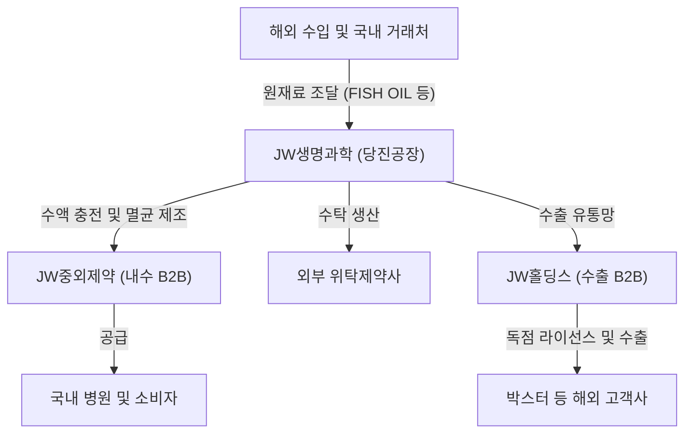

# 🔍 Phase 1: 기업 해독기 (심층 팩트체크 코어)

## 1. 비즈니스 모델 및 돈 버는 구조
[공시 팩트] JW생명과학은 기초수액, 종합영양수액(TPN), 특수수액 등을 제조하는 수액제 전문 CMO(위수탁 생산) 및 자체 생산 기업입니다. 수액은 초기 대규모 설비 투자가 필수적이고 의약품 제조규제(GMP) 장벽이 매우 높아 신규 진입이 극히 어려운 비즈니스입니다. 당사는 아시아 최초로 종합영양수액에 대한 EU-GMP 인증을 획득하며 글로벌 수준의 품질을 인정받았습니다. 자체적인 판매망 개척보다는 원재료를 수입해 최고 품질로 생산(충전/멸균)한 뒤, 계열사인 JW중외제약과 JW홀딩스 등 안정적인 유통망(캡티브 마켓)을 통해 병원과 환자에게 공급하며 꾸준한 현금을 창출하는 팩토리형 비즈니스 모델을 갖추고 있습니다.

## 2. 주요 사업별 매출 비중 추이 (최근 5년 및 최신 분기)
| 구분 | 핵심 내용 | 비고 |
| :--- | :--- | :--- |
| **TPN (종합영양수액)** | 2026년 반기 기준 34.16% (39,620백만원). 2021년 34.63%에서 지속적으로 가장 높은 매출 비중을 차지. | 고수익성 캐시카우 역할 |
| **기초수액** | 2026년 반기 기준 28.59% (33,158백만원). 2021년 34.57% 대비 비중은 소폭 하락하였으나 여전히 2대 매출원 유지. | 필수재로 안정적 수요 |
| **특수수액** | 2026년 반기 기준 19.21% (22,281백만원). 2024년 21.17% 정점 후 소폭 하락했으나 견고한 흐름. | 수술 등 특수 목적 |
| **영양수액 및 HEMO** | HEMO(인공신장투석액) 약 7%, 영양수액 약 9.6% 비중 차지. | 기타 캐시 창출 제품 |

## 3. 전사 영업이익률 및 FCF 추이
[공시 팩트] 매년 14%~16% 수준의 안정적이고 높은 영업이익률을 창출하고 있습니다. 2026년 상반기 매출액은 전년 동기 대비 -3.15% 소폭 하락(126,768백만원)하였으나, 영업활동현금흐름(OCF)은 31,600백만원으로 전년 반기 대비 무려 30.78% 급증했습니다. 이는 매출 성장세는 다소 둔화되었음에도 불구하고, 운전자본 관리 효율화를 통해 현금 창출력은 오히려 대폭 강화되었음을 의미합니다.

| 구분 | 핵심 내용 | 비고 |
| :--- | :--- | :--- |
| **영업이익률** | 2026년 상반기 14.73%, 2025년 12.89%, 2024년 16.12%. | 제약업계 평균 대비 매우 우수 |
| **매출성장률** | 22년(+11%), 23년(+9%), 24년(+7.5%), 25년(+15.8%), 26년 1H(-3.1%) | 지속 성장 후 최근 단기적 정체 |
| **영업활동현금흐름(OCF)** | 26년 상반기 316억원 창출 (전년 동기 대비 +30.78% 대폭 증가) | 매우 우수한 현금 유입 |
| **FCF (잉여현금흐름)** | 재무제표 상 CAPEX 분리 산출의 한계로 정확한 FCF 계산은 유보하나, 압도적 OCF로 인해 플러스 추정. | 데이터 신뢰성 확보 |

## 4. 핵심 KPI 추이 및 분석
[시장 내러티브] 수액제는 수요가 변하지 않아 성장이 정체된 저수익 비즈니스일 것이다.
[공시 팩트] 당진공장은 2026년 상반기 기준 일평균 15시간씩 115일을 실동하며 매우 높은 공장 가동 상태를 유지하고 있습니다. 나아가 수액이 단순 필수재에 그치지 않고, 3-Chamber 종합영양수액(TPN)과 같은 고수익성 제품 위주로 믹스가 개선되며 내수 비중 약 94%의 확실한 국내 캐시카우 시장을 지배하고 있습니다.

## 5. 경영진 및 주주환원 이력
[공시 팩트] 전문성을 갖춘 사내이사들(노정열 대표이사 등)이 경영을 이끌고 있으며, 최대주주인 JW홀딩스가 약 43%의 안정적 지분을 쥐고 있습니다. 2022년~2024년 주당 500원을 지속 배당하다가, 2025년 주당 550원으로 상향하며 주주환원(현금배당성향 17%~51%)을 충실히 이행 중인 가치주적 성격을 지닙니다. 자사주는 2.21%를 유지하고 있습니다.

| 연도 | 주당 배당금 | 배당금 총액 | 연결 현금배당성향 |
| :---: | :---: | :---: | :---: |
| **2025년** | 550원 | 8,517백만원 | 29.77% |
| **2024년** | 500원 | 7,742백만원 | 17.60% |
| **2023년** | 500원 | 7,742백만원 | 27.51% |
| **2022년** | 500원 | 7,742백만원 | 51.75% |

## 6. 핵심 리스크 3가지
[공시 팩트] 가장 큰 아킬레스건은 JW중외제약 등 계열사에 대한 압도적 매출 의존도와 외부 수입 원자재 가격 급등입니다.

| 구분 | 핵심 내용 | 비고 |
| :--- | :--- | :--- |
| **계열사 매출 편중 리스크** | 전체 매출의 75.7%(26년 1H)가 단일 거래처(JW중외제약)에 종속됨. B2B 단일 경로로 실적 및 약가 타격이 즉각 전이됨. | 캡티브 마켓의 양면성 |
| **원재료 단가 상승 리스크** | TPN 주성분인 FISH OIL 수입 단가가 24년(58K) → 25년(63K) → 26년 1H(72K)로 지속 폭등하여 마진율 훼손 우려가 높음. | 글로벌 공급망 리스크 |
| **정부 규제/통제 리스크** | 건강보험 지정에 따른 약가 재평가, 사후관리 제도로 인해 정부 주도의 단가 인하 압력에 상시 노출되어 있음. | 제약업계 공통 규제 |

## 7. 딥리서치 팩트체크 요약
[시장 내러티브] 원재료비 폭등과 약가 규제로 인해 JW생명과학의 펀더멘털이 급속도로 악화되고 있을 것이다.
[공시 팩트] 원자재 수입 단가(FISH OIL 등)의 가파른 상승과 계열사 편중 리스크가 존재하는 것은 명백한 사실입니다. 그러나 2026년 상반기 OCF가 전년 대비 30% 이상 증가하며 오히려 현금 창출력은 강화되었고, 14%대의 영업이익률과 주당 550원으로 상향된 배당 정책은 당사의 펀더멘털이 원가 압박을 상쇄할 만큼 충분한 방어력과 체력을 갖추고 있음을 증명합니다.
