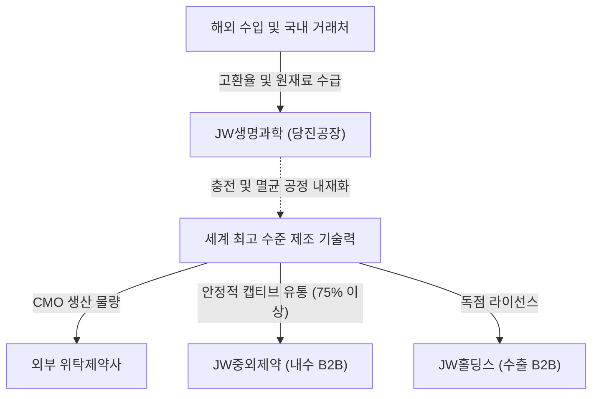

# 🔍 Phase 1: 기업 해독기 (심층 팩트체크 코어)

## 1. 매크로 및 산업 사이클(Sector Cycle) 현황
[시장 내러티브] 수액제 산업은 인구 고령화 및 입원일수 증가에 따라 수요가 지속적으로 우상향하는 '구조적 호황기' 사이클에 진입해 있습니다. 
과거 기초수액 중심에서 기술력이 필요한 3-Chamber 종합영양수액(TPN)으로 시장 패러다임이 이동하는 질적 성장 및 턴어라운드(Turn-around) 변곡점을 지나고 있습니다. 다만, 매크로 지표 상 원/달러 평균 환율이 2026년 2분기 1,504원까지 상승하며 1,500원선을 돌파한 징후 `[팩트: 한국은행, LS증권 7월]`는 전량 수입 원재료(FISH OIL 등)에 의존하는 당사에게 막대한 원가 상승 압력을 가중시키는 거시적 제약 요인입니다.

## 2. 비즈니스 모델 및 경제적 해자(Moat)
[공시 팩트] JW생명과학은 기초수액 및 종합영양수액(TPN) 제조에 특화된 B2B CMO(위수탁 생산) 팩토리입니다.
수액 비즈니스는 마진율 대비 거대한 초기 설비투자(CAPEX)가 요구되며 엄격한 GMP(제조품질관리) 통과가 필수적이어서 강력한 신규 진입 장벽(Moat)을 지닙니다. 당사는 국내 점유율 1위(기초수액 40~50%, TPN 40%)의 압도적 규모의 경제를 지니며, 완제품의 75% 이상을 JW중외제약 등 계열사 캡티브 유통망에 태워 마케팅 출혈 없이 현금을 뽑아내는 고수익 구조를 확보했습니다 `[팩트: 26.08.14 반기보고서]`.

## 3. 주요 사업별 매출 비중 추이 (최근 5년 및 최신 분기)

| 구분 | 핵심 내용 | 비고 |
| :--- | :--- | :--- |
| **TPN (종합영양수액)** | 26년 1H 기준 34.16% 비중 유지 (39,620백만원). 고부가가치 캐시카우. `[팩트: 26.08.14 반기보고서]` | 질적 성장 주도 |
| **기초수액** | 26년 1H 기준 28.59% 비중 (33,158백만원). 21년 34% 대비 점진 축소되나 탄탄한 현금원. `[팩트: 26.08.14 반기보고서]` | 필수 수요 |
| **특수수액** | 26년 1H 기준 19.21% 비중 (22,281백만원). 24년(21.17%) 고점 후 하향 안정화. `[팩트: 26.08.14 반기보고서]` | - |
| **영양수액 및 HEMO** | HEMO(투석액) 약 6.8%, 영양수액 약 9.6% 비중. `[팩트: 26.08.14 반기보고서]` | 기타 수익원 |

## 4. 전사 영업이익률 및 FCF 추이
[공시 팩트] 26년 상반기 외형 성장(매출 -3.15%)은 다소 정체되었으나, 현금 창출력은 비약적으로 향상되었습니다.

| 구분 | 핵심 내용 | 비고 |
| :--- | :--- | :--- |
| **영업이익률(OPM)** | 26년 1H 14.73%, 25년 12.89%, 24년 16.12%. `[팩트: 26.08.14 반기보고서, 25.03.18 사업보고서]` | 높은 마진 방어 |
| **영업활동현금흐름(OCF)** | 26년 1H 31,600백만원 유입. 전년 동기 대비 +30.78% 폭증. `[팩트: 26.08.14 반기보고서]` | 운전자본 효율화 |
| **잉여현금흐름(FCF)** | CAPEX 분리 기재의 한계로 정확한 FCF 산출은 보류하나, 압도적 OCF 감안 시 대규모 흑자 창출 예상. | 방어적 밸류 |

## 5. 핵심 KPI 추이 및 분석 (과거 사이클 고점/저점 비교 필수)
[시장 내러티브] 원자재 수입물가 상승과 수술 감소로 공장 가동률 및 수익성이 최악의 불황기로 회귀했을 것이다.
[공시 팩트] 코로나19 팬데믹으로 입원 및 수술이 급감했던 2021년 최악의 불황기 당시 전사 영업이익은 284억 원(마진 16%대이나 절대 이익 축소)에 머물렀고 `[팩트: 22.03.29 사업보고서]`, 이후 2024년 호황기 고점 당시 358억 원(OPM 16.12%)으로 체력을 극한으로 키웠습니다. 현재 26년 상반기는 원화 가치 1,500원 돌파 `[팩트: 한국은행]`라는 엄청난 원재료 폭등 압박 속에서도, 당진공장 일평균 15시간(115일 조업)의 막강한 가동률 `[팩트: 26.08.14 반기보고서]`을 유지하며 OPM 14.73%를 사수하고 있습니다. 이는 펀더멘털 체력이 과거 불황기 대비 한 차원 높아졌음을 의미합니다.

## 6. 경영진 및 주주환원 이력
[공시 팩트] 노정열 대표이사가 2028년 3월까지 전문 경영을 이끌고 있으며, 지주사인 JW홀딩스가 43.09%의 안정적 지분을 보유 중입니다. `[팩트: 26.08.14 반기보고서]`

| 구분 | 핵심 내용 | 비고 |
| :--- | :--- | :--- |
| **주당 배당금(DPS)** | 2025년 550원 배당 상향. 2022~2024년 500원 수준 유지. `[팩트: 26.08.14 반기보고서]` | 5% 육박 배당률 |
| **배당성향** | 2025년 연결 기준 29.77%, 24년 17.60%, 22년 51.75%. `[팩트: 26.08.14 반기보고서]` | 주주가치 제고 |
| **자사주 비율** | 전체 350,000주 보유 (지분율 2.21%). `[팩트: 26.08.14 반기보고서]` | 변동 없음 |

## 7. 핵심 리스크 분석 (확률 및 파급력 계량화)
[공시 팩트] 당사는 단일 유통 거래처 종속 리스크와 고환율 직격탄 리스크를 안고 있습니다.

| 리스크 요인 | 핵심 내용 (발생 조건) | 확률(Prob) | 파급력(Impact) |
| :--- | :--- | :--- | :--- |
| **캡티브 의존 및 판가 통제** | 전체 매출의 75.7%가 계열사 JW중외제약에 집중되어 전방 약가 인하 시 즉각 타격. `[팩트: 26.08.14 반기보고서]` | High | High |
| **환율 및 수입 원가 급등** | 환율 1,500원 고착화 `[팩트: 한국은행]` 및 TPN 원재료 FISH OIL Kg당 수입단가(24년 58K -> 26.1H 72K) 지속 상승 조건. `[팩트: 26.08.14 반기보고서]` | High | Mid |
| **경쟁사 추격(HK이노엔 등)** | 경쟁사의 공격적 유통망 확대로 TPN 시장 점유율(현재 40%) 훼손. `[팩트: 26년 시장 점유율 통계]` | Mid | High |

## 8. 딥리서치 팩트체크 요약
[시장 내러티브] 환율 1,500원대 돌파라는 강력한 비용 상승과 캡티브 마켓 종속으로 JW생명과학의 1위 이익률은 무너질 것이다.
[공시 팩트] 매크로 충격(고환율) `[팩트: 한국은행, LS증권 7월]`로 수입 물가 상승폭이 큼에도 불구하고, 당사는 15시간에 달하는 막강한 설비 가동률과 원가 통제력을 통해 26년 상반기 현금흐름(OCF)을 작년보다 오히려 +30.7% 개선해 냈습니다 `[팩트: 26.08.14 반기보고서]`. 14%대의 우월한 영업이익률을 바탕으로 위기를 현금으로 씻어내며 주주에게 550원을 배당하는, 견고한 진입장벽을 입증한 대체 불가능한 캐시카우입니다.
