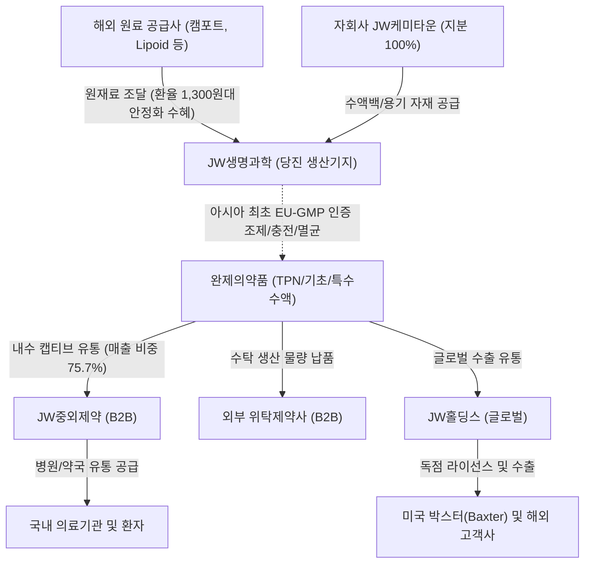

# 🔍 Phase 1: 기업 해독기 (원천 팩트 초안)

## 1. 비즈니스 모델 및 밸류체인
[공시 팩트] 당사는 전문의약품인 기초수액, TPN(종합영양수액), 특수수액 등을 전문으로 생산 및 판매하는 수액제 전문 CMO 및 자체 브랜드 제조 기업입니다 `[팩트: 26년 반기보고서 p.4, 13]`. 아시아 최초로 종합영양수액(TPN) 생산시설에 대한 EU-GMP 인증을 획득하였으며, 글로벌 수액제조사인 미국 박스터(Baxter)사와 독점 라이선스아웃 및 수출계약을 체결하여 글로벌 시장에서 품질 역량을 인정받고 있습니다 `[팩트: 26년 반기보고서 p.13]`. 

수액제는 마진 대비 대규모 초기 설비투자(CAPEX)와 엄격한 의약품 품질관리(GMP) 규제가 요구되는 대표적인 장치산업으로, 신규 경쟁자의 진입이 원천 차단되는 강력한 경제적 해자(Moat)를 가집니다. 당사는 조달된 원재료(FISH OIL 등)를 당진공장에서 자체 조제·충전·멸균하여 완제품을 생산한 후, 전체 매출의 75.7% 이상을 계열사인 JW중외제약 등 안정적인 캡티브 유통망에 공급함으로써 판촉·영업비용 출혈 없이 고수익을 확보하는 B2B 팩토리형 비즈니스 구조를 구축하고 있습니다 `[팩트: 26년 반기보고서 p.13]`. 한편, 2026년 3월 정기주총을 통해 글로벌 CDMO 사업 기반 마련을 위한 "투자, 경영자문 및 컨설팅업"과 생산공정 에너지 자립 및 원가 절감을 위한 "열병합발전 및 자가발전 공급업"을 신규 사업목적으로 추가하였습니다 `[팩트: 26년 반기보고서 p.10]`.

> **[26.09.16 글로벌 트렌드 델타 업데이트 🌐]**  
> 2026년 2분기까지 1,500원대 중반을 기록하며 원가 압박을 가중시키던 원/달러 환율이 **3Q26(9월) 들어 1,300원대 중반 수준으로 급격한 원화 강세(약 10% 하락)로 전환**되었습니다 `[팩트: 한국은행, 한화투자증권 9월 유통 리포트 p.11]`. 이는 전량 수입에 의존하던 핵심 원재료(FISH OIL 등)의 조달 비용을 경감시키고 수입 물가 하락에 따른 마진 스프레드를 구조적으로 개선하는 거시적 호재로 반전되었습니다.

## 2. 주요 제품별 매출 비중 추이 (최근 5년 및 최신 분기)
[공시 팩트] 2021년부터 2026년 상반기까지 별도 제품 및 상품 매출 기준, 고부가가치 품목인 종합영양수액(TPN)이 지속적으로 1위 비중을 유지하며 전사 수익성 개선을 견인하고 있습니다 `[팩트: 26년 반기보고서 p.13, 26년 사업보고서 p.149, 24년 사업보고서 p.67, 22년 사업보고서 p.85]`.

| 구분 | 핵심 내용 | 비고 |
| :--- | :--- | :--- |
| **TPN (종합영양수액)** | 2021년 56,824백만원(34.63%) → 2023년 70,876백만원(34.91%) → 2025년 84,760백만원(36.22%) → 2026년 반기 39,620백만원(34.16%) | 위너프주 등 핵심 고수익 캐시카우 `[팩트: 26년 반기 p.13]` |
| **기초수액** | 2021년 56,730백만원(34.57%) → 2023년 63,773백만원(31.41%) → 2025년 66,927백만원(28.60%) → 2026년 반기 33,158백만원(28.59%) | 중외엔에스주사액 외 필수 수요 품목 `[팩트: 26년 반기 p.13]` |
| **특수수액** | 2021년 23,021백만원(14.03%) → 2023년 30,818백만원(15.18%) → 2024년 46,822백만원(21.17%) → 2026년 반기 22,281백만원(19.21%) | 크린조, 관류용 멸균증류수 등 `[팩트: 26년 반기 p.13]` |
| **영양수액** | 2021년 10,666백만원(6.50%) → 2023년 17,678백만원(8.71%) → 2025년 18,987백만원(8.11%) → 2026년 반기 11,131백만원(9.60%) | 닥터라민주 등 아미노산 보급용 `[팩트: 26년 반기 p.13]` |
| **HEMO (투석액)** | 2021년 14,970백만원(9.12%) → 2023년 16,280백만원(8.02%) → 2025년 16,812백만원(7.18%) → 2026년 반기 7,871백만원(6.79%) | 인공신장투석 관류액 헤모비덱스 외 `[팩트: 26년 반기 p.13]` |
| **기타** | 2021년 1,898백만원(1.16%) → 2024년 4,244백만원(1.92%) → 2026년 반기 1,931백만원(1.66%) | 목사멘틴듀오시럽 등 |

## 3. 전사 영업이익률 및 FCF 추이
[공시 팩트] 연결 손익계산서 및 현금흐름표 상에서 실제 취득한 유형·무형자산(CAPEX)을 영업활동현금흐름(OCF)에서 차감하여 산출한 FCF(잉여현금흐름) 추이입니다 `[팩트: 26년 반기보고서 p.35, 37, 26년 사업보고서 p.35, 38, 23년 사업보고서 p.35, 36]`.

| 연도/분기 | 매출액 | 영업이익 | OPM(%) | FCF | 비고 |
| :--- | :--- | :--- | :--- | :--- | :--- |
| **2021년** | 169,817백만원 | 28,417백만원 | 16.73% | 10,769백만원 | OCF 302억 - CAPEX 194억 `[팩트: 23년 사업보고서]` |
| **2022년** | 188,931백만원 | 27,089백만원 | 14.34% | 5,835백만원 | OCF 141억 - CAPEX 83억 `[팩트: 23년 사업보고서]` |
| **2023년** | 206,860백만원 | 30,862백만원 | 14.92% | 29,307백만원 | OCF 376억 - CAPEX 83억 `[팩트: 26년 사업보고서]` |
| **2024년** | 222,478백만원 | 35,858백만원 | 16.12% | 40,445백만원 | OCF 507억 - CAPEX 102억 (역대 최대 FCF) `[팩트: 26년 사업보고서]` |
| **2025년** | 257,829백만원 | 33,244백만원 | 12.89% | 27,103백만원 | OCF 405억 - CAPEX 134억 `[팩트: 26년 사업보고서]` |
| **2026년 반기** | 126,768백만원 | 18,671백만원 | 14.73% | 26,526백만원 | OCF 316억 - CAPEX 51억 (반기만으로 전년 연간치 육박) `[팩트: 26년 반기]` |

## 4. 핵심 KPI 추이 (가동률, 수주잔고, ASP 등)
[공시 팩트]
*   **공장 가동 현황 및 생산 실적**: 
    - 당진공장은 1일 15시간(실동시간) 기준, 2026년 상반기(2분기 누적) 115일 조업을 수행하였습니다 `[팩트: 26년 반기보고서 p.15]`.
    - 완제의약품 생산실적은 2024년 148백만개 → 2025년 151백만개 → 2026년 상반기 누적 84백만개로, 연환산 시 약 168백만개(+11.2% YoY) 수준으로 확대되며 높은 공장 가동 상태를 유지 중입니다 `[팩트: 26년 반기보고서 p.15]`.
*   **주요 제품 판매가격(ASP) 변동 추이**:
    - **위너프페리-1085ML(TPN)**: 2024년 16,140원 → 2025년 16,140원 → 2026년 2분기 15,310원 (-5.1% 조정) `[팩트: 26년 반기보고서 p.13]`
    - **엔에스주사액-500ML(기초수액)**: 2024년 680원 → 2025년 697원 → 2026년 2분기 708원 (+4.1% 인상) `[팩트: 26년 반기보고서 p.13]`
*   **핵심 원재료 매입단가 추이 및 환율 변곡점**:
    - **FISH OIL (수입 원재료)**: 2024년 58,632원 → 2025년 63,163원 → 2026년 2분기 72,030원/Kg으로 가파른 상승세를 기록했습니다 `[팩트: 26년 반기보고서 p.15]`.
    - **CT703 (수액백자재 국내 매입)**: 2024년 360,000원 → 2025년 360,000원 → 2026년 2분기 417,723원 (+16.0%) `[팩트: 26년 반기보고서 p.15]`
    - **[26.09.16 글로벌 트렌드 델타 업데이트]**: 2026년 9월 원/달러 환율이 1,500원대에서 1,300원대 중반으로 약 10% 급락함에 따라 `[팩트: 한화투자증권 9월 p.11]`, 당사의 재고자산 회전 시차(약 65일)를 거쳐 4분기부터 수입 원재료 매입단가 및 매출원가의 가파른 하향 안정화가 본격화될 전망입니다.

## 5. 경영진 및 주주환원 이력
[공시 팩트] 
*   **경영진 현황**: 노정열 대표이사(품질보증부서장/제품플랜트장 역임, 자회사 JW케미타운 대표 겸직, 임기 2028.03)를 필두로, 함은경 사내이사(JW중외제약 대표 겸직), 나숙희 사내이사(JW홀딩스 사내이사 겸직) 등 계열사 시너지를 극대화하는 전문 제약 경영진 체제로 운영되고 있습니다 `[팩트: 26년 반기보고서 p.41, 43]`.
*   **지분 구조**: 총 발행주식수 15,834,554주 중 최대주주인 JW홀딩스 외 특수관계인이 6,823,772주(43.09%)를 보유하여 지배력이 확고하며, 자기주식은 350,000주(2.21%)를 보유하고 있어 유통주식수는 15,484,554주입니다 `[팩트: 26년 반기보고서 p.37, 40]`.

| 사업연도 | 1주당 배당금 | 배당금 총액 | 연결 배당성향 | 비고 |
| :---: | :---: | :---: | :---: | :--- |
| **2025년 (제32기)** | **550원** | 8,517백만원 | **29.77%** | 전년 대비 주당 배당금 50원 전격 인상 `[팩트: 26년 반기 p.37]` |
| **2024년 (제31기)** | 500원 | 7,742백만원 | 17.60% | 당기순이익 440억원 달성 `[팩트: 26년 사업보고서 p.146]` |
| **2023년 (제30기)** | 500원 | 7,742백만원 | 27.51% | 당기순이익 281억원 달성 `[팩트: 26년 사업보고서 p.146]` |
| **2022년 (제29기)** | 500원 | 7,742백만원 | 51.75% | 당기순이익 150억원 대비 고배당 유지 `[팩트: 25년 사업보고서 p.146]` |

*   *참고*: 최근 3개년 내 추가적인 자사주 매입이나 소각 이력은 발생하지 않았습니다 `[팩트: 26년 반기보고서 p.38]`.

## 6. 공시 본문 기반 3대 핵심 리스크
[공시 팩트] 사업보고서 및 분·반기보고서 본문 상에 기재된 위험요인을 토대로 평가한 3대 핵심 리스크입니다 `[팩트: 26년 반기보고서 p.13, 15, 36]`.

| 리스크 요인 | 핵심 내용 (발생 조건) | 확률(Prob) | 파급력(Impact) |
| :--- | :--- | :--- | :--- |
| **계열사(JW중외제약) 캡티브 편중 리스크** | 제33기 2분기 기준 별도 매출의 **75.7% 이상**이 계열회사인 JW중외제약 단일 거래처에 종속되어 있습니다 `[팩트: 26년 반기보고서 p.13]`. 전방 유통사인 JW중외제약의 영업실적 변동이나 유통 전략 변화 발생 시 당사 매출 및 채권 회수에 직격탄으로 전이될 구조적 위험이 존재합니다. | **High** | **High** |
| **수입 원재료(FISH OIL 등) 단가 및 환율 변동** | 3-Chamber TPN 주원료인 FISH OIL의 매입단가가 2024년 58,632원 → 2026년 상반기 72,030원/Kg까지 상승했으나 `[팩트: 26년 반기보고서 p.15]`, **[26.09.16 트렌드 업데이트]** 원/달러 환율이 1,500원대에서 1,300원대 중반으로 약 10% 급락함에 따라 `[팩트: 한화투자증권 9월 p.11]` 환율 직격탄 위험은 대폭 경감되었습니다. DART 사업보고서 주석 환율 민감도상 **"환율 10% 하락 시 당기손익 약 34억 1,400만 원 증가"** `[팩트: 26년 사업보고서 p.101]`가 입증되어 있어, 원가 훼손 리스크는 상당 부분 통제 가능한 수준으로 완화되었습니다. | **Mid** *(기존 High)* | **Low** *(기존 Mid)* |
| **정부의 보험약가 사후관리 및 상한가 규제** | 의약품 제조업 특성상 보건복지부가 고시하는 건강보험 급여상한금액의 규제를 직접 받습니다 `[팩트: 26년 반기보고서 p.36]`. 약가 사후관리 및 약가 재평가 등 정부 주도의 약가 인하 정책이 본격 시행될 경우 완제품 판가 하락으로 직결되어 전사 영업이익률을 훼손할 수 있습니다. | **Mid** | **High** |
