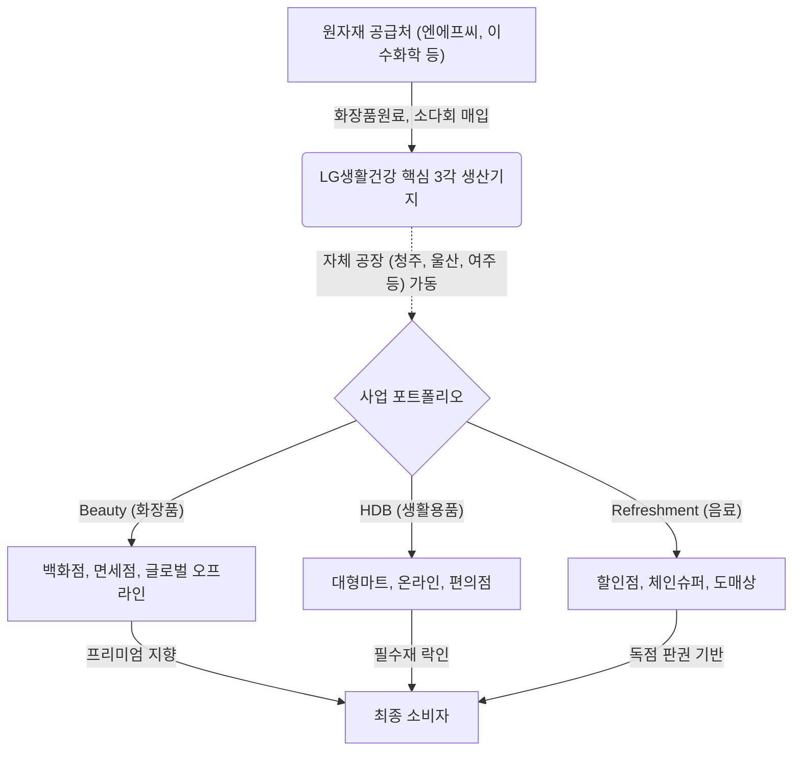

# 🔍 Phase 1: 기업 해독기 (심층 팩트체크 코어)

## 1. 매크로 및 산업 사이클(Sector Cycle) 현황
[시장 내러티브] 
글로벌 K-뷰티 산업은 과거 중국 면세/따이궁에 의존하던 수출 생태계에서 완전히 벗어나, 미국(얼타, 타겟, 코스트코)과 유럽 오프라인 메인스트림 채널을 직접 공략하며 연일 사상 최고치를 경신하는 **'수출 재가속화 및 제2라운드 확장 국면'**에 돌입했습니다 `[팩트: 주간트렌드(화장품섹터 26.08)]`. 그러나 이러한 전례 없는 호황은 에이피알, 한국콜마, 코스맥스 등 중소 인디 및 ODM 브랜드 주도로 폭발하고 있습니다. 과거 2015년 K-뷰티 전체 시가총액의 90% 이상을 지배했던 LG생활건강 등 레거시 대기업의 시장 내 비중은 현재 30%대 초반까지 쪼그라들며, 산업의 대호황 속에서 역설적으로 **'구조적 쇠퇴 방어 및 턴어라운드 모색기'**에 놓여 있는 혹독한 사이클입니다.

## 2. 비즈니스 모델 및 경제적 해자(Moat)
[공시 팩트] 
LG생활건강은 뷰티(화장품), HDB(생활용품), 리프레시먼트(음료)의 3각 포트폴리오를 통해 이익 변동성을 방어하는 안정적인 구조를 갖추고 있습니다 `[팩트: 26.1Q 분기보고서]`. 한류 럭셔리 붐이 일던 시기에는 '후(Whoo)' 등 프리미엄 화장품 브랜드의 막강한 가격 결정력이 절대적 해자였으나, 중국 리스크로 뷰티 부문이 붕괴된 현재는 코카콜라 등의 독점적 음료 판권과 일상 필수재 밸류체인이 전사 이익의 하방을 지지하는 기초 해자(Moat) 역할을 묵묵히 수행 중입니다.

## 3. 주요 사업별 매출 비중 추이 (최근 5년 및 최신 분기)
2026년 1분기부터 닥터그루트, 유시몰 등 일부 뷰티성 생필품이 HDB에서 Beauty 부문으로 이관되어 반영되었습니다.

| 구분 | 핵심 내용 | 비고 |
| :--- | :--- | :--- |
| **Beauty (화장품)** | '21년 54.9% → '26.1Q 48.9% (7,711억 원) | `[팩트: 26.1Q 분기보고서]` 중국향 럭셔리 수요 부진으로 매출 볼륨 및 전사 비중 급감 |
| **HDB (생활용품)** | '21년 25.4% → '26.1Q 25.2% (3,979억 원) | `[팩트: 26.1Q 분기보고서]` 생필품 수요 둔화이나 뷰티 부문 이관 효과 혼재 |
| **Refreshment (음료)** | '21년 19.7% → '26.1Q 25.9% (4,076억 원) | `[팩트: 26.1Q 분기보고서]` 뷰티 부문의 실적 붕괴를 충실히 방어하는 핵심 캐시카우로 부상 |

## 4. 전사 영업이익률 및 FCF 추이
[공시 팩트] 
중국 쇼크와 원자재가 상승이 겹치며 수익성이 크게 훼손된 이후, 최근 미약한 반등을 모색 중입니다.

| 구분 | 핵심 내용 | 비고 |
| :--- | :--- | :--- |
| **영업이익률 (OPM)** | '21년 15.94% → '25년 2.69% → '26.1Q 6.84% | `[팩트: 26.1Q 분기보고서]` 25년 최악의 저점을 지나 26년 1분기 원가 절감 노력 등으로 소폭 반등 |
| **연결 FCF (단순계산)** | '21년 6,523억 원 → '26.1Q 660억 원 | `[팩트: 26.1Q 분기보고서]` 절대적인 이익 볼륨 붕괴(영업활동현금흐름 반토막)로 창출 현금 둔화 |

## 5. 핵심 KPI 추이 및 분석 (과거 사이클 고점/저점 비교 필수)
[시장 내러티브] 
소비재 제조업의 핵심 KPI는 생산 설비의 원가율을 결정짓는 '공장 가동률'입니다.
[공시 팩트] 
핵심 화장품 라인인 청주 공장의 가동률은 과거 슈퍼사이클 고점('21년 82.2%) 수준에 근접한 81.7%를 유지하며 선방하고 있습니다 `[팩트: 26.1Q 분기보고서]`. 그러나 HDB(생활용품)를 생산하는 **울산 공장의 가동률은 2021년 65.0%에서 2026년 1분기 40.9%** `[팩트: 26.1Q 분기보고서]`로 완전히 붕괴되었습니다. 이는 오프라인 대형마트 폐점과 고마진 브랜드의 뷰티 이관 여파가 물리적 공장 유휴화 리스크(고정비 부담)로 직결되고 있음을 숫자로 명확히 방증합니다.

## 6. 경영진 및 주주환원 이력
[공시 팩트] 
최대주주 주식회사 LG(34.74%) 지배 하에 주가 하락 방어를 위한 자사주 소각에 적극 나섰습니다.

| 구분 | 핵심 내용 | 비고 |
| :--- | :--- | :--- |
| **주당 배당금 추이** | '22년 4,000원 → '25년 2,000원 | `[팩트: 26.1Q 분기보고서]` 급격한 실적 둔화에 따른 배당금 삭감 불가피 |
| **자사주 이익소각** | 2025년 중 총 307.9만 주 대규모 소각 (4월, 9월 2차례) | `[팩트: 26.1Q 분기보고서]` 최대주주 지분율을 자연 상승(34.03%→34.74%)시킨 대규모 유통주식수 감축 액션 |

## 7. 핵심 리스크 분석 (확률 및 파급력 계량화)
[공시 팩트] 
| 리스크 요인 | 핵심 내용 (발생 조건) | 확률(Prob) | 파급력(Impact) |
| :--- | :--- | :---: | :---: |
| **중국 내수 침체 장기화** | 궈차오(애국소비) 열풍 및 경제 둔화로 고마진 럭셔리 '후' 라인업 실적 회복 지연 | High | High |
| **에이본 라이선스 대형 소송** | 미국 법인에서 진행 중인 에이본(Avon)과의 상표권 계약 위반 소송(약 700억 상당) 패소 시 우발채무 현실화 | Mid | Mid |
| **울산 공장 유휴화 (고정비)** | HDB 생활용품 생산 물량 지속 감소로 울산공장 가동률 추가 하락 시 한계비용 붕괴 | Mid | High |

## 8. 딥리서치 팩트체크 요약
[시장 내러티브] 
북미 오프라인 채널(얼타, 타겟) 입점 등 K-뷰티 수출 대호황 트렌드가 LG생활건강의 실적을 즉각 견인할 것이라는 장밋빛 전망이 일부 존재하나 실상은 전혀 다릅니다.

[공시 팩트] 
K-뷰티 르네상스 수혜의 90% 이상은 인디 브랜드 기획사(에이피알 등)와 OEM/ODM 공장(한국콜마, 코스맥스 등)에 온전히 집중되어 있습니다 `[팩트: 주간트렌드(화장품섹터 26.08)]`. LG생활건강은 2026.1Q 기준 OPM 6.84% 수준으로 과거 15%대의 영광을 회복하지 못한 채 길고 고통스러운 턴어라운드를 모색하고 있습니다. 글로벌 유통채널 다변화가 어느 정도 진행 중이나, 여전히 유휴화된 울산공장(가동률 40.9%)의 악성 고정비 해소와 북미 종속법인의 체질 개선 완수 여부가 LG생활건강 기업가치 리레이팅의 진짜 핵심 관건입니다.
