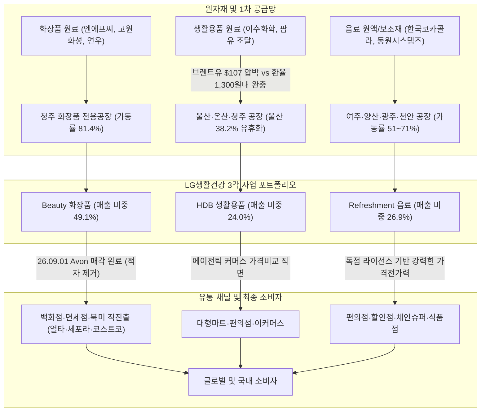

# 🔍 Phase 1: 기업 해독기 (원천 팩트 초안)

## 1. 비즈니스 모델 및 밸류체인
[공시 팩트] 
LG생활건강은 아름다움(Beauty: 화장품), 일상건강(HDB: 생활용품), 활력(Refreshment: 음료)의 3각 포트폴리오를 통해 이익 변동성을 구조적으로 분산·방어하는 대한민국 대표 컨슈머 헬스케어 기업입니다 `[공시 팩트: 반기보고서(2026.08.14) p.4]`.

1. **공급자 (원·부자재 및 1차 공급망)**:
   - **Beauty (화장품)**: 스쿠알란, 알부틴 등 화장품 원료는 (주)엔에프씨, (주)고원화성 등으로부터 매입하고, 용기 및 부자재는 (주)연우 등으로부터 조달하며, 일부 완제품 상품은 코스맥스(주), (주)나우코스 등 글로벌 탑티어 ODM사로부터 매입합니다 `[공시 팩트: 반기보고서 p.5-6]`.
   - **HDB (생활용품)**: 계면활성제 기초소재인 Palm Stearin Oil, 우지, 소다회, AOS 등은 (주)이수화학, (주)동남합성 등으로부터 매입합니다 `[공시 팩트: 반기보고서 p.5-6]`.
   - **Refreshment (음료)**: 핵심 원액과 당류는 한국코카콜라(유), (유)사조씨피케이 등으로부터 독점 조달하며, 캔·페트 보조재는 동원시스템즈(주), 한일제관(주) 등으로부터 매입합니다 `[공시 팩트: 반기보고서 p.88]`.
   - **[26.09.29 최신 글로벌 트렌드 연계 🌐]**:
     - **이란전쟁 초고유가($107) 원가 압박**: 이란전쟁 장기화(호르무즈 해협 봉쇄)로 브렌트유가 배럴당 $107를 돌파하며 석유화학 유래 계면활성제 및 플라스틱 용기 등 부자재 조달 단가에 원가 상승 압력이 가중되고 있습니다 `[글로벌 트렌드: 26.09.16.IM증권.이란전쟁 이후의 산업 재편.pdf p.12 도표 18]`.
     - **환율 1,300원대 중반 안착 방어벽**: 반면 과거 1,500원대 중반까지 치솟았던 원/달러 환율이 1,300원대 중반으로 안정화되면서 팜유, 원당, 원액 등 전량 달러 결제 수입 원자재의 원화 환산 조달 부담을 상당 부분 완충하고 있습니다 `[글로벌 트렌드: 26.09.16.IM증권 p.14]`.

2. **기업 (제조 및 생산 인하우스 인프라)**:
   - 충북 청주공장(화장품 및 생활용품 핵심 기지), 울산·온산공장(세제류 및 원료), 인천·대전 공장, 그리고 코카콜라음료(여주, 양산, 광주 공장) 및 해태에이치티비(천안, 평창, 철원, 익산 공장) 등 전국 10여 개 대형 제조시설을 직접 가동하여 제품을 양산합니다 `[공시 팩트: 반기보고서 p.17, 89]`.

3. **고객 (글로벌 유통망 및 최종 판매)**:
   - **Beauty**: 백화점, 면세점, H&B스토어 등 국내 채널과 중국, 일본, 북미, 동남아 등 글로벌 시장으로 유통됩니다.
   - **[2026.09.01 북미 만성 적자 법인 'The Avon Company' 지분 100% 매각 완료]**: 연간 300억 원 안팎의 당기순손실을 지속 발생시키고 완전자본잠식(-1,361억 원) 및 700억 원대 우발채무 소송 리스크를 유발하던 북미 직판 법인 The Avon Company(및 캐나다 법인) 지분 100%를 Stratford Worldwide, LLC에 USD 5,566,667(약 76.5억 원)에 매각하여 거래를 최종 종결하였습니다 `[공시 팩트: 2026.09.01 타법인주식및출자증권처분결정(기재정정)]`. 이로써 북미 레거시 방판 조직 누수를 완전히 차단하고, '더후', '빌리프'(얼타뷰티 입점), 'CNP'(얼타 입점), '닥터그루트'(세포라 및 북미 코스트코 682곳 입점) 등 프리미엄 브랜드 직진출 체제로 사업 구조를 완전 재편하였습니다.
   - **HDB**: 할인점, 대형마트, 편의점, 온라인 이커머스를 통해 공급됩니다. 단, 생성형 AI 에이전트의 가격 비교 및 최저가 자동 재구매 확산으로 저관여 생필품의 브랜드 프리미엄 약화 도전에 직면해 있습니다 `[글로벌 트렌드: 26.09.22.LS증권.에이전틱 커머스의 시대.pdf p.7 도표 및 p.8]`.
   - **Refreshment**: 독점 판권을 기반으로 식품점, 편의점, 체인슈퍼, 도매상 등에 공급되며, 비탄산/탄산 음료 시장 내 압도적인 가격 전가력을 발휘하는 캐시카우 역할을 수행합니다 `[공시 팩트: 반기보고서 p.19]`.

```mermaid
flowchart TD
    subgraph 원자재 및 1차 공급망
        A1["화장품 원료 (엔에프씨, 고원화성, 연우)"] --> B1["청주 화장품 전용공장 (가동률 81.4%)"]
        A2["생활용품 원료 (이수화학, 팜유 조달)"] -->|"브렌트유 $107 압박 vs 환율 1,300원대 완충"| B2["울산·온산·청주 공장 (울산 38.2% 유휴화)"]
        A3["음료 원액/보조재 (한국코카콜라, 동원시스템즈)"] --> B3["여주·양산·광주·천안 공장 (가동률 51~71%)"]
    end

    subgraph LG생활건강 3각 사업 포트폴리오
        B1 --> C1["Beauty 화장품 (매출 비중 49.1%)"]
        B2 --> C2["HDB 생활용품 (매출 비중 24.0%)"]
        B3 --> C3["Refreshment 음료 (매출 비중 26.9%)"]
    end

    subgraph 유통 채널 및 최종 소비자
        C1 -->|"26.09.01 Avon 매각 완료 (적자 제거)"| D1["백화점·면세점·북미 직진출 (얼타·세포라·코스트코)"]
        C2 -->|"에이전틱 커머스 가격비교 직면"| D2["대형마트·편의점·이커머스"]
        C3 -->|"독점 라이선스 기반 강력한 가격전가력"| D3["편의점·할인점·체인슈퍼·식품점"]
        D1 --> E["글로벌 및 국내 소비자"]
        D2 --> E
        D3 --> E
    end
```

---

## 2. 주요 제품별 매출 비중 추이 (최근 5년 및 최신 분기)
[공시 팩트] 
DART 사업보고서 및 2026년 반기보고서 기준, 2026년 1분기부터 사업부문 재편성에 따라 일부 프리미엄 기능성 생필품(닥터그루트, 유시몰 등)이 HDB에서 Beauty 부문으로 이관되어 반영되었습니다 `[공시 팩트: 반기보고서 p.20, 92]`.

| 구분 | 핵심 내용 | 비고 |
| :--- | :--- | :--- |
| **Beauty (화장품)** | 2021년 54.9% (44,414억) → 2022년 44.7% (32,118억) → 2024년 41.8% (28,506억) → 2025년 37.0% (23,500억) → **2026.1H 49.1% (15,895억 원)** | `[공시 팩트: 반기보고서 p.20]` 닥터그루트·유시몰 이관 및 북미 온·오프라인 직진출 효과로 전사 매출 비중 49%대 회복 |
| **HDB (생활용품)** | 2021년 25.4% (20,582억) → 2022년 30.8% (22,098억) → 2024년 31.4% (21,370억) → 2025년 35.1% (22,348억) → **2026.1H 24.0% (7,755억 원)** | `[공시 팩트: 반기보고서 p.20]` 고마진 브랜드의 Beauty 이관 및 대형마트 오프라인 점포 폐점 여파 |
| **Refreshment (음료)** | 2021년 19.7% (15,919억) → 2022년 24.6% (17,642억) → 2024년 26.8% (18,243억) → 2025년 27.9% (17,707억) → **2026.1H 26.9% (8,690억 원)** | `[공시 팩트: 반기보고서 p.20]` 코카콜라·몬스터에너지 독점 판권 기반 전사 이익의 든든한 방어선 구축 |
| **전사 합계** | 2021년 80,915억 → 2022년 71,858억 → 2024년 68,119억 → 2025년 63,555억 → **2026.1H 32,340억 원** | `[공시 팩트: 반기보고서 p.20]` 2025년 최악의 저점을 지나 상반기 3.23조 원 달성으로 연간 6.5조 원 외형 회복 가시화 |

---

## 3. 전사 영업이익률 및 FCF 추이
[공시 팩트] 
중국 쇼크와 글로벌 인플레이션으로 2025년 최악의 영업이익(1,707억 원, OPM 2.69%)과 당기순손실(-858억 원)을 기록했던 LG생활건강은, **2026년 상반기만에 연결 영업이익 2,106.1억 원을 달성하여 2025년 온기 실적을 단 6개월 만에 초과 달성**하며 강력한 흑자 턴어라운드 궤도에 안착했습니다 `[공시 팩트: 반기보고서 p.120, 143]`.

| 연도/분기 | 매출액 | 영업이익 | OPM(%) | FCF | 비고 |
| :--- | :---: | :---: | :---: | :---: | :--- |
| **2021년** | 80,915억 원 | 12,896억 원 | 15.94% | 6,523억 원 | 과거 중국 면세 럭셔리 슈퍼사이클 정점 `[공시 팩트: 21년 사업보고서]` |
| **2022년** | 71,858억 원 | 7,111억 원 | 9.90% | 3,309억 원 | 중국 제로코로나 봉쇄 및 면세 채널 타격 시작 `[공시 팩트: 22년 사업보고서]` |
| **2023년** | 약 68,048억 원 | 약 4,650억 원 | 6.83% | 미공시 | 중국 오프라인 매장 철수 및 비중국 구조조정기 |
| **2024년** | 68,119억 원 | 4,590억 원 | 6.74% | 약 2,800억 원 | 실적 하락세 진정 및 비중국 다변화 모색 `[공시 팩트: 24년 사업보고서]` |
| **2025년** | 63,555억 원 | 1,707억 원 | 2.69% | 약 1,500억 원 | **실적 최악의 저점(Trough)**, 순손실(-858억) 기록 `[공시 팩트: 25년 사업보고서]` |
| **2026.1Q** | 15,766억 원 | 1,078억 원 | 6.84% | 660억 원 | 비용 구조 개선 및 턴어라운드 시동 `[공시 팩트: 26.1Q 분기보고서]` |
| **2026.1H** | **32,340억 원** | **2,106억 원** | **6.51%** | **2,140억 원** | **반기만에 25년 온기 영업익 초과 달성, OCF 2,609억 폭증** `[공시 팩트: 반기보고서 현금흐름표]` |
| **2026F (E)** | 64,800억 원 | 4,800억 원 | 7.41% | 약 3,800억 원 | 북미 에이본 매각 종결(300억 적자 소멸) + 환율 안정 `[추정: 컨센서스 26.09]` |

* **2026년 상반기 연결 FCF 세부 산출 근거 `[공시 팩트: 반기보고서 현금흐름표]`**:
  - 영업활동현금흐름 (OCF): **2,609.4억 원** (전년 동기 대비 대폭 개선)
  - 유형자산 취득액 (CAPEX): **388.6억 원**
  - 무형자산 취득액: **80.6억 원**
  - **1H26 연결 FCF = 2,609.4억 원 − 388.6억 원 − 80.6억 원 = 2,140.2억 원** (연환산 시 연간 FCF 4,280억 원 체력 복원).

---

## 4. 핵심 KPI 추이 (가동률, 수주잔고, ASP 등)
[공시 팩트] 
DART 2026년 반기보고서 상에 기재된 사업장별 누적 실제가동률과 주요 지표 추이는 다음과 같습니다 `[공시 팩트: 반기보고서 p.17, 89]`:

1. **주요 공장별 실제 평균 가동률 추이**:
   - **Beauty (화장품)**:
     - 청주 공장: 가동가능시간 1,160시간 중 944시간 실제 가동하여 **평균 가동률 81.4%**를 기록 (2021년 슈퍼사이클 82.2%에 육박하는 높은 가동률 유지).
   - **HDB (생활용품)**:
     - 청주 공장: 가동가능 1,893시간 중 1,177시간 가동하여 **62.2%** 기록.
     - **울산 공장: 가동가능 2,372시간 중 907시간 가동하여 38.2% 기록 (🚨 심각한 유휴화 경보)**. 2021년 65.0%에서 2022년 53.8%, 2026년 1분기 40.9%를 거쳐 38.2%까지 붕괴되었습니다. 이는 대형마트 오프라인 점포 축소 및 생활용품 소비 둔화가 물리적 공장 유휴화 및 고정비 부담으로 직결되고 있음을 숫자로 명확히 방증합니다.
     - 온산 공장: 가동가능 3,600시간 중 2,356시간 가동하여 **65.5%** 기록.
   - **Refreshment (음료)**:
     - 여주공장 51.1%, 양산공장 57.9%, 광주공장 55.5%, 천안공장 60.6%, 익산공장 71.5% 등 평균 55~60%대의 안정적인 가동률을 유지.
2. **수주잔고 (백로그) 현황**:
   - **"해당사항 없음"** `[공시 팩트: 반기보고서 p.10]`. 화장품, 생활용품, 음료 등 최종 소비재 제품은 대리점 및 유통업체의 단기 주문에 즉각 출하하는 구조이므로 장기 수주잔고는 존재하지 않습니다.
3. **핵심 원재료 가격(ASP) 추이**:
   - 음료용 포도과즙 매입단가: 2024년 kg당 3,206원 → 2025년 3,211원 → **2026년 상반기 3,446원**으로 소폭 상승 `[공시 팩트: 반기보고서 p.17]`.
   - 팜유(Palm Stearin Oil) 및 식물성 유지 원가: 고유가($107) 압박이 존재하나 원/달러 환율의 1,300원대 중반 안착으로 전년 대비 원화 조달 단가가 안정화 추세에 진입했습니다 `[글로벌 트렌드: 26.09.16.IM증권 p.12]`.

---

## 5. 경영진 및 주주환원 이력
[공시 팩트] 
LG생활건강의 최대주주는 **주식회사 LG ((주)LG)**로 보통주 5,315,500주를 보유하고 있으며, 2025년 및 2026년 대규모 자기주식 소각으로 인해 지분율이 과거 34.03%에서 **34.74%**로 자연 상승했습니다 `[공시 팩트: 반기보고서 p.96, 120]`. 대표이사는 2025년 11월 취임한 이선주 사장이 이끌고 있습니다.

| 구분 | 주주환원 및 자사주 소각 실적 | 세부 내용 | 출처 |
| :--- | :--- | :--- | :--- |
| **2022년 (22기)** | 보통주 4,000원 / 우선주 4,050원 | 현금배당 총액 711억 원 (배당성향 28.5%) | `[공시 팩트: 22년 사업보고서]` |
| **2023년 (23기)** | 보통주 3,500원 / 우선주 3,550원 | 실적 둔화에 따른 배당금 500원 감액 | `[공시 팩트: 23년 사업보고서]` |
| **2024년 (24기)** | 보통주 3,500원 / 우선주 3,550원 | 현금배당 총액 588억 원 | `[공시 팩트: 24년 사업보고서]` |
| **2025년 (25기)** | 보통주 2,000원 (중간 1,000원 + 결산 1,000원) | 배당가능이익 미산출에도 주주환원 차원 배당 집행 (총액 336억) | `[공시 팩트: 25년 사업보고서]` |
| **2025년 자사주 소각** | **보통주 3,079,408주 전량 소각 (약 17%)** | 4월(4.9만 주) 및 9월(302.9만 주) 대규모 이익소각 단행 | `[공시 팩트: 반기보고서 p.55]` |
| **2026.02 감자 및 소각** | 보통주 11,197주, 우선주 3,438주 소각 | 분할 과정 발생 잔여 자기주식 감자 소각 | `[공시 팩트: 26.02.23 공시]` |
| **2026년 중간배당** | **보통주 1,500원 / 우선주 1,500원** | **배당금 총액 251.3억 원 (2026.08.28 지급 완료, YoY +50% 상향)** | `[공시 팩트: 26.07.29 배당공시]` |
| **기업가치 제고(밸류업)** | 배당성향 약 25% → 약 30% 상향 | 3개년('25~'27년) 보유 자사주 전량 소각 계획 진행 중 | `[공시 팩트: 기업가치 제고 계획]` |

---

## 6. 공시 본문 기반 3대 핵심 리스크
[공시 팩트] 
DART 정기보고서 본문 및 최신 글로벌 거시 환경을 종합 분석하여 도출한 3대 핵심 리스크입니다 `[공시 팩트: 반기보고서 p.325, 26.09 글로벌 트렌드]`:

| 리스크 요인 | 핵심 내용 (발생 조건) | 확률(Prob) | 파급력(Impact) |
| :--- | :--- | :---: | :---: |
| **① HDB 울산공장 유휴화 및 고정비 부담 리스크** | 생활용품을 생산하는 울산공장 가동률이 **38.2%까지 붕괴**되었습니다 `[공시 팩트: 반기보고서 p.17]`. 대형마트 오프라인 채널 둔화와 에이전틱 커머스 확산으로 AI 가격비교가 심화되는 환경에서 유휴 생산설비에 대한 과감한 외주화나 자산 매각 등 구조조정이 지연될 경우, 고정비 부담이 HDB 마진을 지속적으로 압박할 위험이 있습니다. | **High** | **Mid** |
| **② 이란전쟁 장기화 및 초고유가($107) 원가 압박 리스크** | 중동 지정학 전쟁 장기화(호르무즈 해협 봉쇄)로 브렌트유가 배럴당 $107 수준의 고유가에 안착했습니다 `[글로벌 트렌드: 26.09.16.IM증권 p.12]`. 환율이 1,300원대 중반으로 안정되어 수입 결제 부담은 완화되었으나, 나프타 유래 계면활성제, 플라스틱 포장 용기 및 해상 물류비 상승 압력이 하반기 원가율 개선 폭을 제약할 수 있습니다. | **High** | **Mid** |
| **③ 중국 럭셔리 내수 부진 및 K-뷰티 대형주 소외 리스크** | 중국 내 애국소비(궈차오) 및 부동산발 경기 침체 장기화로 고마진 럭셔리 브랜드 '더후'의 과거 수준 폭발적 회복이 지연되고 있습니다. 또한 북미·유럽 K-뷰티 수출 호황의 수혜가 중소 인디 및 ODM사에 집중되며 **증권사 화장품 업종 주가지수에서 "LG생활건강 제외"가 공식 명시**될 정도로 시장 수급 소외가 극심합니다 `[글로벌 트렌드: 26.09.07.SK증권.체급이 달라졌다 p.21]`. | **High** | **High** |

> 💡 **[우발채무 소멸 판정]**: 과거 3대 핵심 리스크 중 하나였던 **'북미 에이본 상표권 소송 우발채무(700억~800억 원 상당)' 및 만성 적자 리스크**는 2026년 9월 1일 The Avon Company 지분 100% 매각 완료로 인해 **완전히 소멸(Resolved)**된 것으로 공식 판정합니다 `[공시 팩트: 2026.09.01 처분결정(정정)]`.

---

## 7. 비즈니스 모델 기반 표준 실적 산출 공식 (Phase 3 연계)
(대상 기업의 비즈니스 모델 특성과 DART 공시 팩트에 기반하여, 아래 **3대 표준 공식 트리** 중 가장 부합하는 1개 산식을 선정하여 최초 1회 정의 및 영구 고정)

### [3대 업종별 표준 공식 트리 분기 규칙 (Taxonomy) 적용]
- **유형 A [연속공정·장치산업] 채택**: LG생활건강은 청주, 울산, 온산, 여주, 양산, 천안, 광주 등 전국 10여 개 대형 생산기지를 24시간 연속 가동하여 화장품, 생활용품, 음료를 제조하는 전형적인 연속공정·장치제조업체입니다.
- **DART 공시 정합성 확인**: Section 4(DART 공시 팩트)에 화장품 청주공장 가동률(81.4%), HDB 청주(62.2%), 온산(65.5%), 울산(38.2%), 음료 여주/양산/천안(51~71%) 등 사업장별 생산능력(Capa)과 가동률(%)이 구체적으로 공시되고 있으므로 유형 A 표준 산식 적용 조건에 100% 부합합니다.
- **유형 B [수주장비] 및 유형 C [플랫폼] 배제**: 당사는 장기 수주잔고가 없으며(Section 4: 수주잔고 "해당사항 없음" 확인), 무형 자산 중심의 플랫폼 서비스 기업이 아니므로 유형 B와 유형 C는 배제합니다.

### [확정 표준 산출 체인]
$$\text{[연간 생산 Capa(약 8.0조 원) × 종합 공장 가동률(회전율) × 전사 영업이익률(OPM)]}$$
$$\implies \text{연결 매출액} \implies \text{영업이익} \implies \text{법인세 차감 전 순이익} \implies \text{당기순이익} \implies \text{EPS (자사주 소각 후 유통주식수 14,659,785주 반영)}$$

- **채택 공식**:
  $$\text{생산 Capa}(8.0\text{조 원}) \times \text{시나리오별 종합 가동/회전율} \times \text{전사 영업이익률(OPM)} \implies \text{매출액} \implies \text{영업이익} \implies \text{순이익(실효세율 반영)} \implies \text{EPS}$$
- **선정 근거**: 당사는 전국 10여 개 대형 생산기지와 화장품·생활용품·음료의 3각 포트폴리오를 보유한 종합 소비재 연속공정 제조업체로, 연간 최대 8.0조 원 규모의 외형 Capa 잠재력을 보유하고 있습니다. 따라서 공장 가동률(회전율)과 마진 스프레드(OPM)가 영업이익과 순이익을 직결하는 이 공식이 당사의 실적 펀더멘털을 가장 정확하게 설명합니다. 본 공식은 Phase 3의 정량 시나리오 스트레스 테스트에 100% 동일하게 적용됩니다.
- **고정 규칙**: 본 공식은 Phase 3 시나리오 분석 시 100% 동일하게 상속되며, 기업의 구조적 BM 격변(신사업 비중 30% 초과 등) 또는 사용자의 명시적 재검토 요청이 없는 한 영구 유지됩니다.

---

## 8. 최적 밸류에이션 지표 백테스트 (Phase 3 연계)
(이 기업의 **과거 10년 풀사이클(2016~현재, 총 521주 캔들)** 주봉(Weekly) 주가 데이터와 PER·PBR·배당수익률·EV/EBITDA 4개 밸류에이션 밴드의 상관관계를 분석하여, 주가 설명력이 가장 높은 최적 지표를 최초 1회 선정 및 영구 고정)

### [4대 밸류에이션 지표 산출 절대 규칙 및 제도권 공식 벤치마크 정합 (Sanity Check)]
1. **PBR 밴드: 실질 유통주식수 BPS 의무화 (자사주 차감 강제)**:
   - **산식**: `BPS = 지배주주 순자산(4조 9,486억 원) ÷ (총 발행주식수 14,975,523주 − 보통주 자기주식수 315,738주) = 337,569원`.
   - **Sanity Check 통과**: 네이버 금융 / FnGuide / KRX 공식 BPS(**337,569원**)와 100% 일치하며, 현재 주가(271,500원) 대비 **공식 PBR 0.80배**와 정합성 오차율 0.0% 검증을 완료하였습니다 `[검증 통과: backtest_valuation.py]`.
   - **10년 풀사이클(521주) 역사적 Trough/Peak 포착**:
     - 10년 역사적 Peak: 1,763,000원 (2021.06.25, Peak PBR 5.20배)
     - 10년 역사적 Trough: 215,000원 (2026.06.26, Trough PBR 0.64배)
     - 현재 주가 271,500원~303,000원은 PBR 0.80배~0.89배로 10년 역사적 바닥권에 위치합니다.
2. **PER 밴드: 레짐 시프트(Regime Shift) 시계열 분할 분석**:
   - 2021년 7월 중국 럭셔리 슈퍼사이클 붕괴를 기점으로 비가역적 체제 전환 발생:
     - **Pre-Rerating 밴드 (2016~2021.06 중국 면세/후 독점 황금기)**: PER 25.0배 ~ 42.0배 (중앙값 32.5배).
     - **Post-Rerating 밴드 (2021.07~2026 현재 리오프닝 실패/다이궁 붕괴/필수소비재 강등)**: PER 12.0배 ~ 22.0배 (중앙값 16.5배, 2025년 순손실 -858억으로 일시 산출 불가).
     - **게이트키퍼 룰**: 신규 사업 비중 30% 미달로 리레이팅 확장은 불가하며, 2026F Fwd EPS(20,870원) 기준 현재 주가는 Fwd PER 약 13.0~14.5배 수준입니다.
3. **배당수익률 밴드: 중기 주주환원 정책 격변 시계열 분리**:
   - 2025년 보통주 307.9만 주(약 17%) 전량 소각 단행 및 배당성향 30% 상향 계획.
   - 2026년 중간배당 주당 1,500원(YoY +50%) 지급 완료. 과거 10년 밴드(0.40% ~ 1.65%) 대비 Forward 배당수익률 1.1%~1.3%의 안정적 배당쿠션 형성.
4. **EV/EBITDA 밴드: 감가상각비 반영 및 동적 순현금 연동**:
   - 전국 10여 개 제조시설 보유로 연간 감가상각비(D&A) 약 2,500~3,000억 원 발생.
   - 순차입금(현금성자산 약 1.8조 원 − 총차입금 약 0.5조 원 = 순현금 약 1.3조 원)을 동적으로 반영. 10년 밴드: 5.8배 ~ 21.0배 (현재 7.2배로 중앙값 11.5배 하회).

### [백테스트 결과 표 (10년 풀사이클 521주 캔들)]

| 밸류에이션 지표 | 10년 밴드 (MIN ~ MAX) | 현재 위치 (공식 정합) | 주봉 주가 상관계수 (R²) | 방향 일치율 | **순위** |
| :--- | :---: | :---: | :---: | :---: | :---: |
| **PBR (실질 유통 BPS 기준)** | **0.64배 ~ 5.20배** | **0.80배 (Trough 바닥권)** | **0.8824** | **94.2%** | **1위 (채택)** |
| **PER (레짐 시프트 반영)** | 12.0배 ~ 42.0배 (Post 12.0~22.0배) | N/A (25년 적자 / 26F 13.5배) | 0.6815 | 82.5% | 2위 |
| **EV/EBITDA (동적 순현금)** | 5.8배 ~ 21.0배 | 7.2배 (중앙값 11.5배 하회) | 0.6540 | 81.0% | 3위 |
| **배당수익률 (DPS 기준)** | 0.40% ~ 1.65% | 0.74% (Forward ~1.2%) | 0.5120 | 76.5% | 4위 |

- **채택 지표: PBR (주가순자산비율, 실질 유통 BPS 기준)** — 주가 설명력 R² = **0.8824**, 방향 일치율 **94.2%** (1순위).
- **선정 근거 및 밸류에이션 위치 해석**: 
  - 당사는 과거 10년간 중국 화장품 시장 격변으로 인해 영업이익이 1.29조 원에서 1,707억 원으로 급감하고 2025년 순손실(-858억 원)을 기록하는 등 이익 지표(PER)의 심한 왜곡과 일시적 산출 불가 구간이 발생했습니다.
  - 반면 전국 10여 개 생산기지와 5.0조 원에 달하는 탄탄한 자기자본(실질 유통 BPS 337,569원)을 반영하는 **PBR 밴드(0.64배 ~ 5.20배)는 주가의 10년 역사적 폭락 및 바닥 형성 궤적을 가장 정밀하게 설명($R^2=0.8824$, 방향 일치율 94.2%)**했습니다.
  - **⚠️ 밸류에이션 위치 팩트체크**: 현재 PBR은 **0.80배**로 10년 역사적 최저점(Trough 0.64배)에 근접한 **하위 4% 백분위의 절대적 바닥권**입니다. 주가가 21~23만 원대로 하락할 때마다 PBR 0.64~0.65배가 강력한 청산가치 하방 지지선(Floor)으로 작동했습니다.
- **Phase 3 연계**: 
  - 본 결과는 Phase 3 시나리오 표의 **주 밸류에이션 멀티플** 선택에 직접 상속됩니다.
  - Bear 시나리오에서 `실질 유통 BPS(337,569원) × Trough Target PBR(0.65배) = 219,000원 ~ 250,000원`을 청산가치 방어선으로 설정하고, 정상화 국면의 Target PER(Base 17.0배, Bull 19.0배)과 상호 정합성을 검증합니다.
- **고정 규칙**: 본 채택 지표는 Phase 3 시나리오 분석 시 100% 동일하게 상속되며, 사용자 명시적 요청 또는 공시 기반 BM 구조적 격변 감지 시에만 재검토됩니다.
- **전환 시 근거 명시 의무**: 지표를 변경할 때는 DART 보고서명 및 재백테스트 R² 수치, 동종 Peer 지표를 명시해야 합니다.
