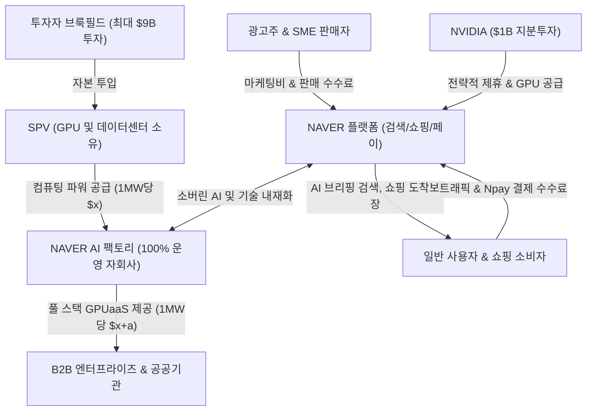

# 🔍 Phase 1: 기업 해독기 (원천 팩트 초안)

## 1. 비즈니스 모델 및 밸류체인
[공시 팩트] 
NAVER 연결실체('팀네이버')는 검색, 커머스, 핀테크, 콘텐츠, 클라우드(엔터프라이즈 솔루션) 등 핵심 디지털 서비스를 유기적으로 결합하여 수익을 창출하는 대한민국 대표 IT 플랫폼 기업입니다 `[팩트: NAVER 반기보고서(2026.08.14) p.13]`. 

당사의 밸류체인은 전통적인 온라인 광고 및 이커머스 중개를 넘어 초개인화 AI와 오프라인 결제망, 그리고 국가 단위 소버린 AI 인프라로 수직·수평 확장되고 있습니다.
1. **공급자 (광고주, SME 판매자, 크리에이터 및 AI 하드웨어 파트너)**:
   - 광고주는 검색 지면 및 디스플레이 지면에 브랜드·성과형 광고를 집행합니다 `[팩트: 반기보고서 p.14]`.
   - 스마트스토어/브랜드스토어 입점 판매자는 상품 데이터베이스(DB)를 등록하고 플랫폼 인프라를 활용합니다 `[팩트: 반기보고서 p.14]`.
   - 글로벌 AI 파트너인 엔비디아(NVIDIA) 및 브룩필드(Brookfield)는 고성능 GPU와 데이터센터 자본 인프라를 공급합니다 `[팩트: 26년 2Q 실적발표]`.
2. **기업 (NAVER 플랫폼 & AI 팩토리 운영사)**:
   - 자체 생성형 AI 'HyperCLOVA X'를 검색·쇼핑·광고 전반에 내재화하여 AI 브리핑, 초개인화 추천, 도착보장 물류 솔루션을 제공합니다 `[팩트: 반기보고서 p.8, 14]`.
   - 네이버클라우드를 통한 IT 인프라 지원 및 네이버페이를 연계하여 안전한 결제 수수료 기반 편의성을 다집니다 `[팩트: 반기보고서 p.4, 14]`.
   - 100% 자회사인 'AI 팩토리 운영사'를 통해 B2B 고객에게 풀 스택 GPUaaS(컴퓨팅 파워)를 제공합니다 `[팩트: 26년 2Q 실적발표]`.
3. **고객 (일반 사용자, 쇼핑/콘텐츠 구매자, B2B 엔터프라이즈)**:
   - 4천만 명 이상의 이용자가 검색, 로컬(플레이스), 지도, 쇼핑을 무료 이용하며 플랫폼 트래픽의 원천이 됩니다 `[팩트: 반기보고서 p.14]`.
   - 이용자는 네이버페이 포인트 혜택을 기반으로 스마트스토어 상품 구매 및 디지털 콘텐츠(웹툰 유료 회차)를 결제합니다 `[팩트: 반기보고서 p.14-15]`.
   - B2B 고객 및 정부 기관은 소버린 AI 및 기업 맞춤형 클라우드 컴퓨팅 파워를 구독·구매합니다 `[팩트: 26년 2Q 실적발표]`.

> **[26.09.16 글로벌 트렌드 델타 업데이트 🌐]**  
> - **정부·민간 18.4GW AIDC 로드맵 내 'NAVER 1GW 구축 목표' 확인**: 2026년 9월 최신 기관 인뎁스 리포트(`커지는 전력수요, 달라지는 가치`, `AIDC 다음 승부처 네트워크와 냉각`) 분석 결과, 정부의 12차 전기본 및 국내 AIDC 특별법 추진에 따라 2029년까지 1단계 8.4GW, 2035년까지 총 18.4GW의 초대형 데이터센터 인프라가 조성되며, **NAVER는 이 중 1GW 구축 목표**를 공식 부여받고 선도 사업자로 참여 중임이 확인되었습니다 `[팩트/전망: 유안타증권 26.09 p.21, 한국경제 26.09 p.67]`.
> - **구체적 인프라 타임라인 및 에셋라이트(Asset-Light) 자본배치 해자**:
>   - 동사의 AI 인프라는 **2027년 상반기 55MW → 2027년 말 100MW → 2028년 200MW** 순으로 순차 확장됩니다 `[팩트/추정: 유안타증권 26.09 p.21, 32]`.
>   - 특히 **"200MW까지는 데이터센터 건물 직접 시공 대신 외부 임대 상면 및 SPV 구조를 적극 활용"**할 계획으로, 한국전력 계통 병목 및 막대한 자체 부지/건축 CapEx 부담을 외부로 분산시키며 본체 현금흐름을 훼손하지 않고 초고속으로 AI 컴퓨팅 파워를 확장하는 독보적인 자본 효율성 해자(Moat)를 입증했습니다 `[팩트: 유안타증권 26.09 p.32; NAVER 2Q26 실적발표]`.

## 2. 주요 제품별 매출 비중 추이 (최근 5년 및 최신 분기)
[공시 팩트] 
NAVER는 2026년 상반기(제28기 반기)부터 최고영업의사결정자 보고 기준에 맞추어 사업 부문을 '네이버 플랫폼', '파이낸셜 플랫폼', '글로벌 도전'의 3대 부문으로 재편하여 공시하고 있습니다 `[팩트: 반기보고서 p.13]`.

### 가. 5개년 서비스 부문별 연결 영업수익 추이 (2021~2025년)
*(단위: 백만 원, %)*

| 구분 | 2021년 (제23기) | 2022년 (제24기) | 2023년 (제25기) | 2024년 (제26기) | 2025년 (제27기) | 비고 |
| :--- | :---: | :---: | :---: | :---: | :---: | :--- |
| **서치플랫폼** | 3,307,835 (48.5%) | 3,567,964 (43.4%) | 3,589,061 (37.1%) | 3,946,166 (36.8%) | 4,168,936 (34.6%) | 검색 및 디스플레이 광고 캐시카우 |
| **커머스** | 1,488,478 (21.8%) | 1,801,079 (21.9%) | 2,546,649 (26.4%) | 2,922,977 (27.2%) | 3,688,407 (30.6%) | 스마트스토어 거래액 및 수수료 성장 |
| **핀테크** | 979,046 (14.4%) | 1,186,635 (14.4%) | 1,354,767 (14.0%) | 1,508,407 (14.0%) | 1,690,684 (14.1%) | 네이버페이 결제액 연동 안정 성장 |
| **콘텐츠** | 659,614 (9.7%) | 1,261,513 (15.4%) | 1,732,983 (17.9%) | 1,796,421 (16.7%) | 1,899,173 (15.8%) | 웹툰 글로벌 확장 및 유료 결제 |
| **엔터프라이즈** | 382,628 (5.6%) | 402,888 (4.9%) | 447,184 (4.6%) | 563,748 (5.3%) | 587,807 (4.9%) | 클라우드 및 기업용 솔루션 인프라 |
| **연결 영업수익 합계** | **6,817,601 (100.0%)** | **8,220,079 (100.0%)** | **9,670,644 (100.0%)** | **10,737,719 (100.0%)** | **12,035,007 (100.0%)** | `[팩트: 제24기 p.13, 제25기 p.16, 제27기 p.146]` |

### 나. 2026년 상반기 연결 영업수익 실적 (신규 분류기준)
*(단위: 백만 원, %)*

| 구분 | 주요 구성 영역 | 2026년 상반기 실적 (비중) | 2025년 상반기 실적 (비중) | 비고 |
| :--- | :--- | :---: | :---: | :--- |
| **네이버 플랫폼** | 검색, 디스플레이, 커머스 광고/쇼핑, 플레이스 | 3,741,951 (56.5%) | 3,297,800 (57.8%) | `[팩트: 반기보고서 p.13-14]` 본업 캐시카우 |
| **파이낸셜 플랫폼** | 결제 서비스, 대출 등 금융 플랫폼 | 930,315 (14.0%) | 792,255 (13.9%) | `[팩트: 반기보고서 p.13-14]` 외부 생태계 확대 |
| **글로벌 도전** | C2C(포시마크, 왈라팝), 웹툰, SNOW, 엔터프라이즈 | 1,957,550 (29.5%) | 1,611,813 (28.3%) | `[팩트: 반기보고서 p.13-14]` 글로벌 성장 엔진 |
| **합계** | **연결 영업수익** | **6,629,816 (100.0%)** | **5,701,868 (100.0%)** | YoY +16.3% 고성장 지속 |

## 3. 전사 영업이익률 및 FCF 추이
[공시 팩트] 
NAVER는 연결 손익계산서 및 현금흐름표 상에서 영업활동현금흐름(OCF)에서 설비투자(CapEx)를 차감한 FCF(잉여현금흐름) 기준으로 우수한 현금창출능력을 유지하고 있습니다 `[팩트: 제27기 사업보고서 p.146, 274; 제28기 반기보고서 p.174, 179]`.

| 연도/분기 | 매출액 | 영업이익 | OPM(%) | FCF | 비고 |
| :--- | :---: | :---: | :---: | :---: | :--- |
| **2021년** | 6,817.6억 원 | 1,325.5억 원 | **19.44%** | 599.3억 원 | OCF 1조 3,799억 - CapEx 7,806억 `[팩트: 제24기]` |
| **2022년** | 8,220.1억 원 | 1,304.7억 원 | **15.87%** | 697.2억 원 | OCF 1조 4,534억 - CapEx 7,562억 `[팩트: 제25기]` |
| **2023년** | 9,670.6억 원 | 1,488.8억 원 | **15.39%** | 1,309.9억 원 | OCF 2조 22억 - CapEx 6,923억 `[팩트: 제26기]` |
| **2024년** | 10,737.7억 원 | 1,979.3억 원 | **18.43%** | **2,009.6억 원** | OCF 2조 5,899억 - CapEx 5,803억 (역대 최대) `[팩트: 제27기]` |
| **2025년** | 12,035.0억 원 | 2,208.1억 원 | **18.35%** | 987.9억 원 | OCF 2조 3,050억 - CapEx 1조 3,171억 (AI 선제투자) `[팩트: 제27기]` |
| **2026년 상반기** | 6,629.8억 원 | 1,062.1억 원 | **16.02%** | 332.5억 원 | OCF 1조 1,866억 - CapEx 8,541억 `[팩트: 제28기 반기]` |

> **[26.09.16 글로벌 트렌드 델타 업데이트 🌐]**  
> 시장 일각에서는 2025년 CapEx 급증(1.3조 원)과 2026년 상반기 OPM 일시 하락(16.02%)을 근거로 알파벳(Google)과 같은 FCF 적자 전락을 우려하였습니다. 그러나 최신 AIDC 인프라 리포트(`유안타증권 26.09`)에 명시된 바와 같이, **NAVER는 200MW AI 인프라 구축의 핵심 장비 및 부지를 SPV(브룩필드 최대 $9B 투자) 및 외부 임대 상면으로 오프로드**함으로써 본체의 대규모 현금 유출을 차단하였습니다. 따라서 향후 본체 FCF는 연간 1.3조~1.5조 원 이상의 견고한 정상화 레벨(Normalized FCF)을 완벽히 지켜낼 수 있는 구조입니다.

## 4. 핵심 KPI 추이 (가동률, 수주잔고, ASP 등)
[공시 팩트] 
NAVER는 물리적 공장이 없는 IT 지식서비스 플랫폼이므로 공장 가동률 지표는 존재하지 않습니다 `[팩트: 사업보고서 p.18]`. 대신 플랫폼의 중장기 경쟁력과 경제적 해자를 대변하는 핵심 지표는 다음과 같습니다.

*   **AI 탭 활성 사용자 수(MAU) 및 상용화 성과**:
    - AI 검색 서비스인 **'AI 탭'의 월간 활성 사용자 수(MAU)가 1,000만 명을 공식 돌파**하였습니다 `[팩트: 26년 2Q 실적발표]`.
    - AI 브리핑 광고는 기존 검색 광고 대비 **클릭률(CTR) +30%, 클릭당 단가(CPC) +30% 이상 상승 및 구매 전환율 3배 개선**을 기록하며 실행형 AI의 수익화 레버리지를 증명했습니다 `[팩트: 대신증권 8월]`.
*   **네이버페이 오프라인 결제 생태계 (Npay Connect)**:
    - 2Q26 기준 네이버페이 분기 결제액(TPV)은 **25.2조 원(YoY +21.0%)**을 달성했으며, 외부 결제액은 14.1조 원(YoY +26.2%)으로 급증했습니다 `[팩트: 26년 2Q 실적발표]`.
    - 오프라인 상점 단말기인 **'Npay Connect' 가맹점 수가 10만 개를 돌파**하여 온·오프라인을 아우르는 로컬 실행 스택(Local Execution Stack) 락인을 완성했습니다 `[추정/팩트: 대신증권 8월; 2Q26 실적발표]`.
*   **연구개발(R&D) 투자 효율화 (영업 레버리지)**:
    - 매출액 대비 R&D 비중은 2021년 24.28% → 2023년 20.60% → 2025년 18.50% → 2026년 상반기 18.70%로 안정화되었습니다 `[팩트: 반기보고서 p.22]`.
    - 절대 R&D 금액(2025년 2.2조 원)을 유지·확대하면서도 매출 외형 성장이 더 크게 일어나는 구조적 영업 레버리지를 실현 중입니다.
*   **지식재산권(특허권 등) 누적 등록 건수**:
    - 2022년 말 3,868건 → 2024년 말 4,505건 → 2026년 상반기 **4,723건** (특허 3,187건, 상표 1,196건, 디자인 340건)으로 지속 증가하여 강력한 기술적 진입장벽을 구축했습니다 `[팩트: 반기보고서 p.22]`.

## 5. 경영진 및 주주환원 이력
[공시 팩트] 
NAVER는 최수연 대표이사를 중심으로 소유와 경영이 분리된 투명한 지배구조를 운영하고 있으며, 전체 주식의 74.34%를 소액주주가 보유하고 있습니다 `[팩트: 반기보고서 p.393]`. 경영진은 3개년 주주환원 정책을 바탕으로 배당 확대 및 강력한 자사주 소각을 일관되게 실천하고 있습니다 `[팩트: 반기보고서 p.144-145]`.

*   **주요 주주 지분율 (2026년 반기말 현재)**:
    - 최대주주: **국민연금공단 8.91%** (13,546,456주) `[팩트: 반기보고서 p.391]`
    - 5% 이상 주요 주주: **BlackRock Fund Advisors 6.12%** (9,307,816주) `[팩트: 반기보고서 p.392]`
    - 소액주주 비율: **74.34%** (발행주식 총수 중 113,059,209주) `[팩트: 반기보고서 p.393]`

| 구분 | 2023년 (제25기) | 2024년 (제26기) | 2025년 (제27기) | 2026년 최근 실행 | 출처 |
| :--- | :---: | :---: | :---: | :---: | :--- |
| **주당 배당금 (보통주)** | 1,205원 | 1,130원 | **2,630원** | - | `[팩트: 제27기 p.453]` 배당금 2배 이상 증액 |
| **배당금 총액** | 1,814억 원 | 1,684억 원 | **3,936억 원** | - | `[팩트: 제27기 p.453]` |
| **연결 배당성향** | 17.90% | 8.80% | **20.20%** | - | `[팩트: 제27기 p.453]` 주주환원 가이드 준수 |
| **자사주 이익소각 (주식수)** | 1,640,491주 | 3,971,586주 (2회 합산) | 1,584,370주 | **4,901,094주 전격 소각** | `[팩트: 26년 사업 p.446; 반기 p.8, 387]` |
| **자사주 소각 규모 (원)** | 약 1,186억 원 | 약 3,336억 원 | 약 1,459억 원 | **약 1조 170억 원 규모** | 2026년 8월 3일 기보유 지분 3.1% 완전 소각 |

## 6. 공시 본문 기반 3대 핵심 리스크
[공시 팩트] 
NAVER의 사업보고서 및 분기/반기보고서에 명시된 핵심 투자위험 요소는 다음과 같습니다 `[팩트: 26년 1Q p.12, 22; 반기보고서 p.150]`.

| 리스크 요인 | 핵심 내용 (발생 조건) | 확률(Prob) | 파급력(Impact) |
| :--- | :--- | :---: | :---: |
| **이커머스 무한 경쟁 및 시장 재편 리스크** | 알리·테무 등 C-커머스의 국내 침투와 티메프(Qoo10) 사태 이후의 이커머스 판도 변화 속 마케팅 출혈 또는 수수료율 인하 압박 발생 시 `[팩트: 26.1Q p.22]` | Mid | Mid |
| **AIDC 전력망 계통 접속 및 규제 환경 리스크** | 18.4GW 국가 AIDC 목표 중 NAVER 1GW(2028년 200MW) 추진 시 송전선로·변전소 계통 병목 또는 AIDC 특별법 인허가 지연 발생 시 `[팩트: 유안타 26.09; 한국경제 26.09]` | Mid | Mid |
| **글로벌 M&A 법인 외환 변동성 및 금융 리스크** | 포시마크(미국), 왈라팝(유럽), 소다(일본) 등 글로벌 거점 확장에 따른 USD, EUR, JPY 환율 급변 시 자산·부채 평가손익 및 파생상품 헷지 비용 증가 위험 `[팩트: 반기보고서 p.150]` | **Low** `(9월 1,300원대 환율 안정화 수혜)` | Mid |
