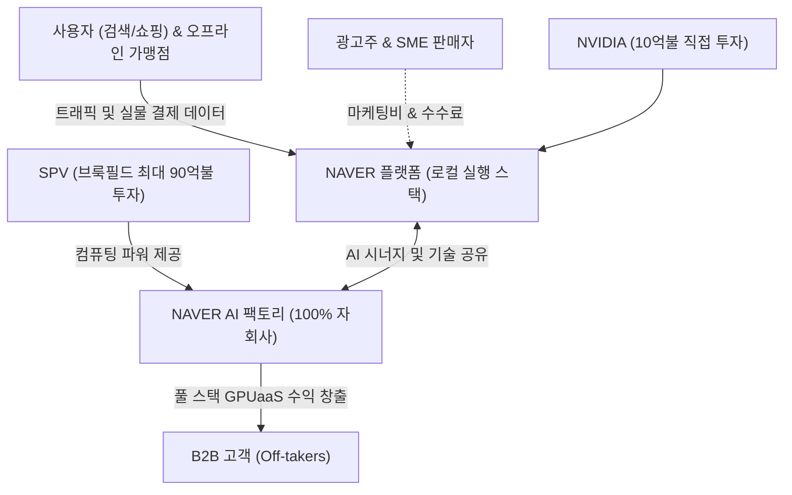

# 🔍 Phase 1: 기업 해독기 (심층 팩트체크 코어)
*(26.08.31 최신 트렌드 및 2Q26 IR 완벽 반영본)*

## 1. 매크로 및 산업 사이클(Sector Cycle) 현황
[시장 내러티브] 
글로벌 AI 산업은 단순 챗봇을 넘어 'Agentic AI' 시대로 진입하며 막대한 전력과 컴퓨팅 자본 조달 병목에 직면했습니다. 이에 따라 플랫폼 시장은 두 갈래로 찢어지는 **'양극화 및 구조적 재편기'** 국면에 있습니다. 단순 정보 요약 플랫폼들은 트래픽 붕괴를 겪는 반면, 예약·지도·결제 등 실물 경제와 맞닿은 **'로컬 실행 스택(Local Execution Stack)'**을 보유한 플랫폼들은 AI를 무기로 수익성 **턴어라운드(Turn-around)** 및 폭발적 도약을 시작하고 있습니다. 특히 막대한 AI 인프라 투자금을 '엔비디아 중심의 순환금융(Bank of NVDA)'과 민간 자본을 통해 오프로드하는 거시적 금융 자본의 대이동이 일어나고 있습니다.

## 2. 비즈니스 모델 및 경제적 해자(Moat)
[공시 팩트] 
NAVER의 돈 버는 구조는 전통적인 검색/커머스 생태계(네이버 플랫폼 2Q26 매출 1.9조 원, +12.3% YoY) [팩트: 26년 2Q 실적발표]에서 **'소버린 AI 및 GPUaaS 풀 스택 프로바이더'**로 진화했습니다. 
경제적 해자는 두 가지 축입니다. 첫째, 10만 개를 돌파한 Npay Connect 가맹점 [추정/팩트: 대신증권 8월 리포트]과 AI 탭 1천만 MAU가 결합된 완벽한 **'로컬 실행 스택'** 전환 비용입니다. 둘째, 엔비디아($1B 지분투자) 및 브룩필드(최대 $9B SPV 투자)와의 전략적 연합으로 구축된 **'AI 팩토리'** 구조입니다 [팩트: 26년 2Q 실적발표]. 이 고도의 금융/기술 설계는 경쟁사가 감히 모방할 수 없는 막강한 **자본 효율성 및 원가 우위(Cost Advantage)** 해자를 완성했습니다.

## 3. 주요 사업별 매출 비중 추이 (최근 5년 및 최신 분기)

| 구분 | 핵심 내용 | 비고 |
| :--- | :--- | :--- |
| **네이버 플랫폼 (구 서치/커머스)** | 2Q26 매출 1조 9,022억 원 (YoY +12.3%) [팩트: 26년 2Q 실적발표] | AI 브리핑 도입 효과로 광고 CTR +30%, 구매전환율 3배 개선 증명 [추정: 대신증권 8월] |
| **파이낸셜 플랫폼** | 2Q26 결제액(TPV) 25.2조 원 (YoY +21.0%) [팩트: 26년 2Q 실적발표] | 외부 생태계 및 오프라인 연계 성장이 폭발적 |
| **글로벌 도전 (C2C/엔터프라이즈)** | 2Q26 매출 1조 159억 원 (YoY +24.4%) [팩트: 26년 2Q 실적발표] | C2C(왈라팝 등 편입) 74.9% 초고속 성장 견인 |

## 4. 전사 영업이익률 및 FCF 추이
[공시 팩트] 

| 구분 | 핵심 내용 | 비고 |
| :--- | :--- | :--- |
| **영업이익률 (OPM)** | 2025년 18.3% 도달 후, 26년 1Q 16.7% → 2Q 15.4%로 단기 조정 [팩트: 26년 2Q 실적발표] | AI 인프라 선제 확보를 위한 일시적 비용 증가 |
| **잉여현금흐름 (FCF)** | 2Q26 기준 460억 원, 1Q26 3,200억 원 창출 (25년 연간 약 1조 원 수준) [팩트: 26년 2Q 실적발표] | 향후 AI 팩토리 투자는 SPV가 부담하므로 NAVER 본체의 FCF 훼손 우려 해소 |

## 5. 핵심 KPI 추이 및 분석 (과거 사이클 고점/저점 비교 필수)
[시장 내러티브] 
성숙기에 도달한 인터넷 포털의 트래픽은 감소 중이라는 우려가 팽배하나, 실제 로컬 커머스와 융합된 AI 에이전트 트래픽은 완전히 새로운 차원의 KPI 곡선을 그리고 있습니다.

[공시 팩트] 
핵심 KPI인 'AI 탭 월간 활성 사용자(MAU)'는 단숨에 1,000만 명을 돌파했습니다 [팩트: 26년 2Q 실적발표]. 또한 오프라인 생태계 확장 지표인 'Npay Connect 가맹점'은 10만 개를 넘어서며 [추정: 대신증권 8월], 과거 단순 온라인 결제액(TPV) 중심의 KPI를 온·오프라인 통합 로컬 스택 지표로 진화시켰습니다. R&D 비중은 21년 초호황기 24%대에서 현재 18% 후반으로 효율화되어 영업 레버리지가 굳건합니다.

## 6. 경영진 및 주주환원 이력
[공시 팩트] 
경영진은 막대한 AI 투자 속에서도 극단적인 자본 배치의 묘수를 보여주고 있습니다. SPV를 통해 외부 자본(브룩필드)을 유치하여 인프라를 구축하는 동시에, 본체의 잉여현금은 주주가치 제고에 전액 투입했습니다. 

| 주주환원 지표 | 24년 (제26기) | 25년 (제27기) | 26년 최근 업데이트 |
| :--- | :--- | :--- | :--- |
| **주당 배당금** | 1,130원 | 2,630원 | - |
| **자사주 이익소각** | 3,971,586주 | 1,584,370주 | 26년 8월 3일, **4,901,094주 (약 1조 170억 원)** 초대규모 소각 완료 [팩트: 26년 2Q 실적발표] |

## 7. 핵심 리스크 분석 (확률 및 파급력 계량화)
[공시 팩트] 

| 리스크 요인 | 핵심 내용 (발생 조건) | 확률(Prob) | 파급력(Impact) |
| :--- | :--- | :--- | :--- |
| **AI CapEx에 따른 잉여현금 고갈** | 200MW 대규모 데이터센터 구축에 수조 원 소요 [팩트: 유안타/대신 8월] | **Low** | Low |
| **설명:** 브룩필드(90억 불) 주도의 SPV 구조가 확정됨에 따라 본체 현금 유출 리스크 원천 차단 |
| **이커머스 경쟁 및 구조조정** | C-커머스 공세 지속 및 내수 소비 둔화 [팩트: 26년 분기보고서] | Mid | Mid |
| **설명:** 다만 Npay Connect 오프라인 확장과 로컬 생태계 결합으로 타격 최소화 방어선 구축 완료 |

## 8. 딥리서치 팩트체크 요약
[시장 내러티브] 
시장은 NAVER가 막대한 AI 투자(CapEx)로 인해 알파벳(Google)처럼 단기 FCF 적자 수렁에 빠지고, 수익성이 영구 훼손될 것이라 두려워합니다. 

[공시 팩트] 
최신 26년 2Q IR 및 8월 매크로 딥리서치 데이터는 이 비관론을 완전히 부수어 버립니다. NAVER는 'AI 팩토리' 사업을 위해 엔비디아와 직접 혈맹을 맺고, 90억 불에 달하는 무거운 CapEx 부담은 SPV(브룩필드)로 오프로드하는 **'천재적인 자본 조달(Bank of NVDA) 구조'**를 창조했습니다 [팩트: 26년 2Q 실적발표]. 그 결과 본체는 1조 원이 넘는 엄청난 잉여현금을 온전히 자사주 소각(490만 주)에 쏟아부을 수 있었습니다. 단순 포털을 넘어 GPUaaS와 로컬 실행 스택을 모두 거머쥔 NAVER는 글로벌 빅테크조차 부러워할 압도적 해자를 완성한 상태입니다.
