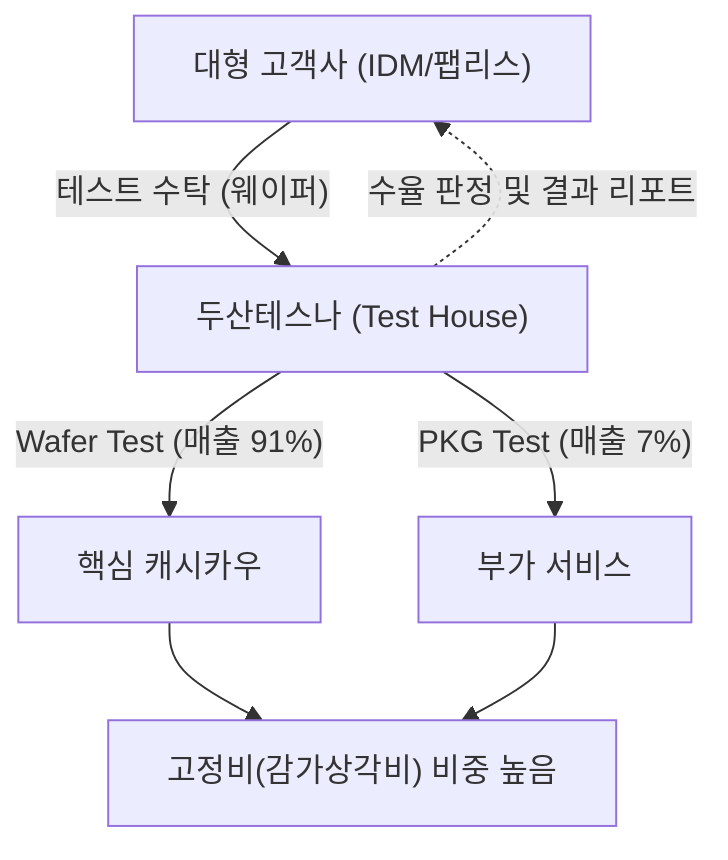

# 🔍 Phase 1: 기업 해독기 (심층 팩트체크 코어)

## 1. 매크로 및 산업 사이클(Sector Cycle) 현황
[시장 내러티브] 현재 반도체 산업은 AI와 HBM(고대역폭메모리)을 중심으로 극단적인 '외화내빈(外華內貧)' 사이클을 겪고 있습니다. 글로벌 빅테크의 AI 인프라 자본 지출 증가로 선단 공정과 HBM에는 자본이 쏠리고 있으나, 기존 범용(Legacy) 및 모바일/세트 수요에 의존하는 시스템 반도체(비메모리) 부문은 뚜렷한 회복세를 보이지 못하고 있습니다. 
두산테스나가 속한 국내 비메모리 후공정(OSAT) 및 테스트 산업은 전방 스마트폰 수요 부진과 단일 대형 고객사의 파운드리 점유율 정체 여파로 **'침체기 바닥 통과 국면'**에 놓여 있습니다. 아직 확실한 턴어라운드(Turn-around) 시그널은 부재하며, 모바일 수요 회복이나 고객사의 수주 확대가 나타나야만 실질적인 가동률 회복을 기대할 수 있는 픽아웃 이후의 깊은 골짜기입니다.

## 2. 비즈니스 모델 및 경제적 해자(Moat)
[공시 팩트] 두산테스나는 가공이 완료된 반도체 웨이퍼 상태에서 테스트를 수행하는 Wafer Test(매출 비중 91.66%)를 핵심 캐시카우로 삼는 후공정 테스트 전문 기업입니다. 일반 제조업과 달리 원/부재료 매입이 없으며, 고객사로부터 주문을 수시로 받아 테스트만 수행하는 구조입니다. `[팩트: 26.1Q 반기보고서, 14페이지]`
이들의 경제적 해자는 **'선제적 대규모 장비 투자에 따른 진입장벽'**과 **'대형 고객사와의 긴밀한 생태계 종속'**에서 나옵니다. 막대한 CAPEX를 감당할 수 있는 소수 기업만이 시장에 남을 수 있습니다. 그러나 이 해자는 반대로 전방 수요 둔화 시 감가상각비 폭탄(역레버리지)으로 돌아오는 양날의 검이기도 합니다.

## 3. 주요 사업별 매출 비중 추이 (최근 5년 및 최신 분기)

| 구분 | 핵심 내용 | 비고 |
| :--- | :--- | :--- |
| **Wafer Test** | 2021년 92.2% → 2026년 반기 91.6% 유지 | 회사 매출의 절대적 비중 차지 (안정적 캐시카우) |
| **PKG Test** | 2021년 7.8% → 2026년 반기 7.2% | 보조적 테스트 용역 |
| **DP (Die Preparation)** | 2023년 4.2% → 2026년 반기 1.1% | 2026년 7월 영업 중단 결정 (수익성 제고 목적) |

## 4. 전사 영업이익률 및 FCF 추이
[공시 팩트] 두산테스나는 과거 대규모 투자를 단행하였으나, 2024년 이후 수익성 급락을 겪고 있습니다. 2025년에는 매출이 18.5% 역성장하며 영업이익률이 적자(-0.31%)로 전환되었습니다. 2026년 상반기에 매출 반등과 흑자전환(9.72%)을 이루어냈으나, 과거 호황기(26%) 대비로는 현격히 낮습니다. FCF의 경우 2025년 CAPEX 투자를 극단적으로 줄이면서 1,244억원의 흑자를 기록하였으나, 성장을 담보하는 재투자가 멈춘 불황형 흑자의 성격이 강합니다. `[팩트: 26.1Q 반기보고서, 21페이지]`

| 구분 | 핵심 내용 | 비고 |
| :--- | :--- | :--- |
| **영업이익률** | 21년 26.04% → 24년 10.16% → 25년 -0.31% → 26년 반기 9.72% | 침체기 직격탄 후 소폭 회복 |
| **CAPEX** | 22년 2,566억원 정점 → 25년 227억원 급감 | 불황기 투자 축소 |
| **FCF (잉여현금흐름)** | 22년 -884억원 → 25년 +1,244억원 → 26년 반기 +149억원 | CAPEX 감축에 따른 기저효과 |

## 5. 핵심 KPI 추이 및 분석 (과거 사이클 고점/저점 비교 필수)
[시장 내러티브] 테스트 업체 실적의 선행지표는 전적으로 '가동률'에 달려있습니다. 시장에서는 재고 조정 마무리에 따른 가동률 회복을 기대하고 있으나, 특정 고객사의 스마트폰/AP 출하 부진이 회복의 발목을 잡고 있습니다.

[공시 팩트] 핵심 KPI인 **Wafer Test 가동률**은 슈퍼 사이클 고점이었던 **2021~2022년 68~71%** 수준이었습니다. 그러나 스마트폰 및 세트 수요 침체로 최악의 불황기인 **2025년 45.5%**까지 추락했습니다. 2026년 반기 기준 **57.8%**로 최악의 국면은 벗어났으나, 고점 대비 여전히 저조합니다. 과거 호황기의 가동률 및 수익성(OPM 26%)을 되찾기 위해서는 10%p 이상의 추가 가동률 상승이 절실한 상황입니다. `[팩트: 26.1Q 반기보고서, 8페이지]`

## 6. 경영진 및 주주환원 이력
[공시 팩트] 최대주주는 두산포트폴리오홀딩스(주)로 38.69%의 지분을 보유하고 있습니다. 주주환원 정책은 매우 보수적으로, 매년 보통주 1주당 160원이라는 고정된 배당(총 27억~30억원 수준)만을 지급하고 있습니다. 최근 3년 이내 자기주식 이익 소각 실적은 없으며, 임직원 보상(RSU) 목적으로만 자사주를 처분하여 주주가치 제고 효과는 극히 미미합니다. `[팩트: 26.1Q 반기보고서, 211페이지]`

| 구분 | 주주환원 내용 | 금액 / 수량 | 비고 |
| :--- | :--- | :--- | :--- |
| **현금배당 (23~25년)** | 주당 160원 현금배당 | 총액 약 27~30억원 유지 | 실적 무관 고정 배당 유지 |
| **자사주 소각** | 해당사항 없음 | 0주 | 주주환원 소극적 |
| **자사주 처분** | 임직원 RSU 보상용 처분 (26년 2월) | 7,095주 (주당 68,200원) | 자사주 물량 유출 |

## 7. 핵심 리스크 분석 (확률 및 파급력 계량화)
[공시 팩트] 두산테스나는 매출구조의 편중과 장치산업의 특성상 리스크가 매우 뚜렷한 기업입니다. 매출의 94.8%가 단일 고객사에 집중되어 있어 협상력이 전무하며, 가동률 하락 시 막대한 감가상각비가 실적을 짓누릅니다. `[팩트: 26.1Q 반기보고서, 31페이지]`

| 리스크 요인 | 핵심 내용 (발생 조건) | 확률(Prob) | 파급력(Impact) |
| :--- | :--- | :--- | :--- |
| **단일 대형 고객사 편중** | 특정 고객사향 매출 비중 94.8%. 고객사 비메모리 부진 시 직격탄 | High | High |
| **고정비(감가상각비) 역레버리지** | 장치 산업 특성상 가동률 50% 하회 시 대규모 영업적자 발생 | Mid | High |
| **전방 세트/모바일 업황 부진** | AI 인프라 외 범용 칩/스마트폰 출하량 부진 장기화 | Mid | Mid |

## 8. 딥리서치 팩트체크 요약
[시장 내러티브] AI 서버 인프라에 쏠린 투자(Cash Capex) 사이클 속에서 모바일/레거시 비메모리에 대한 소외 현상이 나타나고 있으며, 국내 테스트 후공정 밸류체인은 이로 인한 가동률 바닥 통과를 힘겹게 인내하고 있습니다.

[공시 팩트] 공시 데이터 확인 결과, 두산테스나는 2025년 가동률 45.5%, 영업이익 적자(-0.31%)라는 최악의 저점을 통과하여 2026년 상반기 제한적 반등(가동률 57.8%, OPM 9.7%)을 시도하고 있습니다. 수익성 악화를 방어하기 위해 수익성이 떨어지는 DP 사업부를 과감히 중단(2026.07)하고 투자를 급감시켜 FCF 흑자를 만들었으나, 완연한 호황기로 진입하기 위한 유의미한 수주 확대 및 가동률 반등 시그널은 공시상 아직 확정되지 않았습니다. `[팩트: 26.1Q 반기보고서 종합]`
