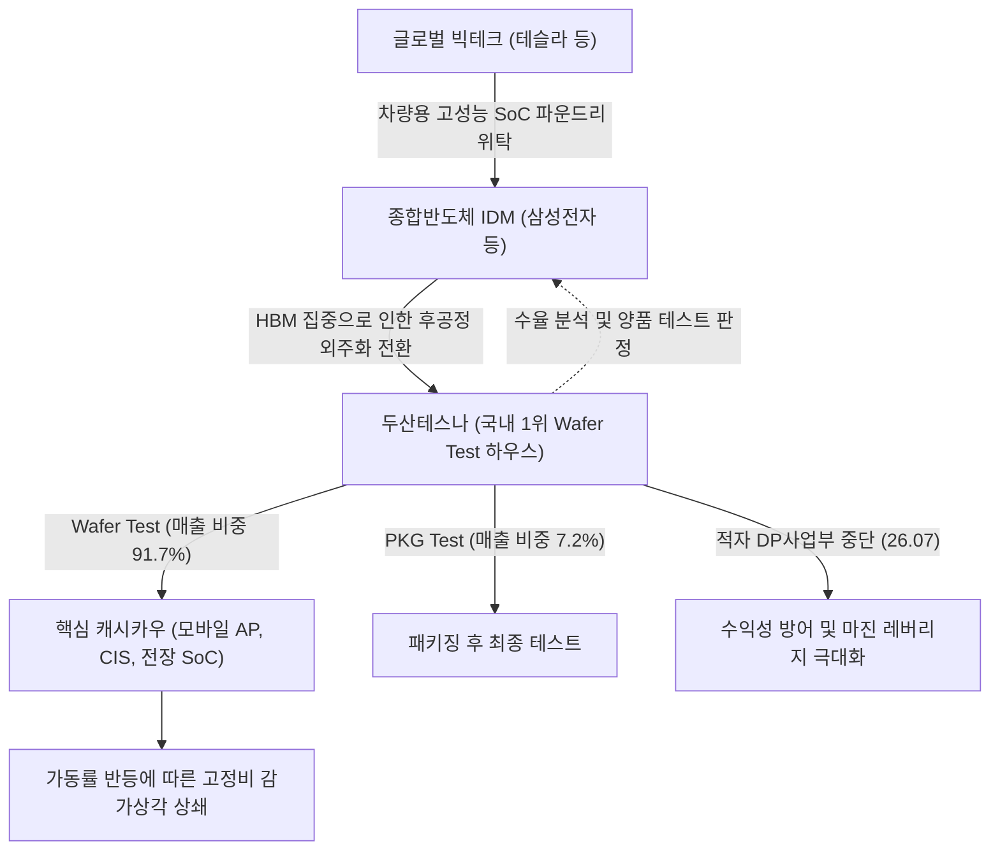

# 🔍 Phase 1: 기업 해독기 (심층 팩트체크 코어)

## 1. 매크로 및 산업 사이클(Sector Cycle) 현황
[시장 내러티브] 그동안 반도체 시장은 AI 서버와 HBM(고대역폭메모리)에만 자본과 설비투자가 집중되고, 일반 소비자용 스마트폰(AP) 및 이미지센서(CIS) 등 레거시 시스템 반도체(비메모리)는 철저히 소외되는 '외화내빈(外華內貧)' 국면에 갇혀 있었습니다. 이로 인해 국내 후공정 테스트 하우스인 두산테스나는 가동률 부진의 긴 골짜기를 인내해야 했습니다.

[26.09.16 트렌드 업데이트] 최신 9월 기관 인뎁스 리포트 분석 결과, 반도체 생태계에 중대한 구조적 변곡점이 발생했습니다. 국내외 종합반도체 IDM(삼성전자 등)이 한정된 후공정 클린룸과 전문 인력을 HBM과 어드밴스드 패키징에 총집중하면서, 기존에 자체(In-house) 처리하던 범용 메모리(서버향 DDR5)뿐만 아니라 **시스템 반도체(파운드리/시스템LSI)의 웨이퍼 테스트 물량을 국내 전문 OSAT로 전격 '외주화(Outsourcing)' 전환**하기 시작했습니다 `[팩트: 하나증권 26.09.02, 28페이지]`.
한번 외부로 이관된 물량은 OSAT의 캐파 확보와 고객사 인증을 수반하므로 단기간에 다시 내재화되기 어려우며 장기간 유지됩니다. 따라서 두산테스나가 속한 국내 OSAT 산업은 단순 침체기 바닥 통과를 넘어, **'IDM 외주화 본격화에 따른 구조적 턴어라운드(Turn-around)' 변곡점**에 공식 진입했습니다 `[전망: 하나증권 26.09.02]`.

## 2. 비즈니스 모델 및 경제적 해자(Moat)
[공시 팩트] 두산테스나는 반도체 웨이퍼 가공 완료 후 전기적 특성을 검사하는 **Wafer Test(매출 비중 91.66%)**를 핵심 캐시카우로 영위하는 국내 1위 테스트 전문 하우스입니다 `[팩트: 26.1Q 반기보고서, 13페이지]`. 일반 제조업과 달리 원재료 매입 비용이 발생하지 않으며, 대규모 첨단 테스터 장비를 선제 매입하여 고객사 주문을 전량 처리하는 장치산업 모델입니다.

[26.09.16 트렌드 업데이트] 두산테스나의 경제적 해자(Moat)는 **'국내 최대 규모의 웨이퍼 테스트 장비 인프라 선점'**과 **'우량 고객사 포트폴리오 다변화(전장용 비메모리)'**로 급격히 강화되고 있습니다.
1. **IDM 외주화 흡수 해자**: 삼성전자 등 전방 IDM의 후공정 외주 이관 시, 대규모 물량을 즉시 소화할 수 있는 국내 유일의 Wafer Test 인프라를 보유하고 있어 외주 전환의 1차 최우선 수혜를 독점합니다 `[팩트: 하나증권 26.09.02, 30~37페이지]`.
2. **테슬라(Tesla) 차량용 SoC 테스트 파트너십**: 스마트폰(모바일 AP, CIS) 일변도에서 벗어나, 삼성전자 파운드리가 위탁 생산하는 테슬라의 차세대 자율주행 차량용 시스템온칩(SoC)의 테스트 솔벤더 역할을 수행하며 고부가 전장 밸류체인으로 해자를 확장했습니다 `[팩트: 언론 보도 및 업계 리포트]`.
3. **한계 사업 정리 완료**: 가동률 8.9%에 불과했던 DP(Die Preparation) 사업부를 2026년 7월 전격 중단함으로써 원가 누수 요인을 완벽히 차단했습니다 `[팩트: 26.1Q 반기보고서, 129페이지]`.

## 3. 주요 사업별 매출 비중 추이 (최근 5년 및 최신 분기)

| 구분 | 핵심 내용 | 비고 |
| :--- | :--- | :--- |
| **Wafer Test** | 2021년 92.2% $\rightarrow$ 2025년 92.5% $\rightarrow$ 2026.1H 91.66% (1,446억 원) `[팩트: 26.1Q 반기보고서]` | 전사 매출의 90% 이상을 차지하는 핵심 캐시카우 |
| **PKG Test** | 2021년 7.8% $\rightarrow$ 2025년 5.9% $\rightarrow$ 2026.1H 7.21% (114억 원) `[팩트: 26.1Q 반기보고서]` | 패키징 공정 후 선별 보조 용역 |
| **DP (가공)** | 2023년 4.2% $\rightarrow$ 2025년 1.6% $\rightarrow$ 2026.1H 1.13% (18억 원) `[팩트: 26.1Q 반기보고서]` | 2026년 7월 이사회 결의로 영업 중단 완료 |
| **전사 합계** | 2021년 2,076억 원 $\rightarrow$ 2024년 3,742억 원 $\rightarrow$ 2026.1H 1,578억 원 `[팩트: DART 공시]` | 2025년 저점 이후 2026년 반등세 뚜렷 |

## 4. 전사 영업이익률 및 FCF 추이
[공시 팩트] 두산테스나는 2021~2024년 대규모 설비투자(CAPEX 연 1,100억~2,560억 원) 집행 후, 2025년 전방 세트 부진으로 영업이익 적자(-0.31%)를 겪었습니다 `[팩트: 사업보고서(2026.03.23)]`. 그러나 2025년 CAPEX를 227억 원으로 대폭 감축하며 **1,244억 원의 FCF 흑자**를 달성했고, 2026년 상반기에는 매출 1,578억 원(+16.7% YoY), 영업이익 153억 원(흑자전환, OPM 9.72%)을 시현했습니다 `[팩트: 26.1Q 반기보고서, 21페이지]`.

[26.09.16 트렌드 업데이트] 증권가 최신 컨센서스에 따르면, 두산테스나는 IDM의 외주화 수혜와 차량용 반도체 확대에 힘입어 **2026년 EPS 성장률 +2,234.4%, 2027년 EPS 성장률 +150.6%**라는 폭발적인 턴어라운드 증익 사이클에 돌입할 것으로 추정됩니다 `[추정: 하나증권 26.09.02 도표 59]`. 밸류에이션(P/E) 또한 2026F 43.0배(실적 턴어라운드 초입 기저효과)에서 2027F 17.2배(P/B 2.7배)로 가파르게 정상화될 전망입니다.

| 구분 | 핵심 내용 | 비고 |
| :--- | :--- | :--- |
| **영업이익률(OPM)** | 21년 26.04% $\rightarrow$ 24년 10.16% $\rightarrow$ 25년 -0.31% $\rightarrow$ 26.1H 9.72% `[팩트: DART 공시]` | 적자 탈출 후 정상화 궤도 진입 |
| **FCF (잉여현금흐름)** | 22년 -884억 원 $\rightarrow$ 25년 +1,244억 원 $\rightarrow$ 26.1H +150억 원 `[팩트: 반기보고서]` | 불황기 투자 감축에 따른 재무 방어력 입증 |
| **2026F EPS 성장률** | **+2,234.4%** (2027F +150.6% 고성장 지속 전망) `[추정: 하나증권 26.09.02]` | IDM 외주화 본격화 및 테슬라 수주 반영 |
| **밸류에이션 (P/E)** | 26F 43.0배 $\rightarrow$ 27F 17.2배 (P/B 26F 3.2배 $\rightarrow$ 27F 2.7배) `[추정: 하나증권 26.09.02]` | 이익 폭증에 따른 급격한 밸류에이션 정상화 |

## 5. 핵심 KPI 추이 및 분석 (과거 사이클 고점/저점 비교 필수)
[시장 내러티브] 테스트 하우스의 이익은 가동률에 완벽히 연동됩니다. 가동률이 저조할 때는 고정비 감가상각비가 수익을 갉아먹지만, 가동률이 일정 임계치를 돌파하면 폭발적인 영업 레버리지(OPM 20%대 복귀)가 발생합니다.

[공시 팩트] 핵심 KPI인 **Wafer Test 공장 가동률** 추이는 명확한 V자 반등의 궤적을 그리고 있습니다 `[팩트: 26.1Q 반기보고서, 8페이지 / 사업보고서]`.
- **과거 슈퍼사이클 고점 (2021~2022년):** 가동률 **68.7% ~ 71.1%** $\rightarrow$ 영업이익률 **24~26%** 구가
- **최악의 불황기 저점 (2025년):** 가동률 **45.5%**까지 추락 $\rightarrow$ 영업이익 **적자(-0.31%)** 전락
- **최근 회복기 (2026년 상반기):** 가동률 **57.8%** 회복 (+12.3%p 반등) $\rightarrow$ 영업이익률 **9.72%** 흑자 복귀

[26.09.16 트렌드 업데이트] 최신 산업 데이터에 따르면, IDM의 후공정 외주화가 하반기부터 본격화되고 있으며, 대만 등 글로벌 OSAT의 테스트 단가가 연초 대비 20~30% 인상되는 등 후공정 공급자 우위(Pricing Power) 환경이 조성되고 있습니다 `[팩트: 하나증권 26.09.02, 29페이지]`. 두산테스나의 가동률 역시 2026년 하반기~2027년에 걸쳐 65~70% 선을 재탈환할 가능성이 높으며, 이는 과거 고점 수준의 영업 레버리지를 재현할 핵심 동력입니다.

## 6. 경영진 및 주주환원 이력
[공시 팩트] 최대주주는 두산포트폴리오홀딩스(주)(지분율 38.69%, 7,476,953주 소유)이며, 최상위 지배기업은 (주)두산(100% 지분 소유)입니다 `[팩트: 26.1Q 반기보고서, 100~103페이지]`.
주주환원 측면에서는 최근 3개년(2023~2025년) 주당 160원(연간 27억~30억 원)의 고정 배당을 유지하고 있습니다. 2026년 2월 임직원 RSU 보상을 위해 자사주 7,095주(주당 68,200원, 총 4.8억 원)를 처분하였으며 잔여 자기주식은 81,610주(0.42%)입니다 `[팩트: 26.1Q 반기보고서, 10페이지]`.

| 구분 | 주주환원 내용 | 금액 / 수량 | 비고 |
| :--- | :--- | :--- | :--- |
| **현금배당 (최근 3년)** | 주당 160원 현금배당 유지 | 연간 약 27억~30억 원 `[팩트: DART 공시]` | 실적 변동과 무관한 안정적 고정 배당 |
| **자사주 소각** | 최근 3년 이내 이익 소각 없음 | 0주 `[팩트: 분기보고서(2026.05)]` | 향후 이익 급증 시 주주환원 확대 요구 증대 가능 |
| **자사주 처분** | 임직원 RSU 성과보상 지급 (26.02) | 7,095주 (주당 68,200원) `[팩트: 반기보고서]` | 자기주식 잔량 81,610주 (0.42%) 보유 |

## 7. 핵심 리스크 분석 (확률 및 파급력 계량화)
[공시 팩트 및 26.09.16 트렌드 업데이트] 과거 분석 시 가장 치명적으로 지목되었던 리스크들이 전방 산업의 외주화 기조 및 제품 믹스 다변화로 인해 완화되는 국면입니다.

| 리스크 요인 | 핵심 내용 (발생 조건) | 확률(Prob) | 파급력(Impact) |
| :--- | :--- | :---: | :---: |
| **단일 대형 고객사 의존도** | 단일 고객사 매출 비중 94.8% `[팩트: 반기보고서, 31p]`. 단, IDM의 전사적 외주화 전환 및 테슬라 전장 SoC 수주로 파급력은 점진적 완화 추세 | High | Mid |
| **고정비(감가상각비) 역레버리지** | 가동률 50% 하회 시 대규모 적자 발생 위험. 현재 가동률 57.8% 회복 및 외주 물량 증가로 위험도 대폭 경감 | Low | Mid |
| **전방 스마트폰 수요 회복 지연** | 글로벌 소비 침체 장기화 시 모바일 AP/CIS 출하 둔화. 단, 전장 및 서버향 외주 물량 확대로 상쇄 가능 | Mid | Mid |
| **역외 수급 및 선물 변동성** | 8월 역외 ETF 순유출(-1.32조 원) 및 삼성전자 선물 미결제 배율 둔화 등 수급 변동성 리스크 `[팩트: SK증권 26.09.09]` | Mid | Low |

## 8. 딥리서치 팩트체크 요약
[시장 내러티브] 'AI 랠리의 소외주, 스마트폰 침체의 희생양'이라는 과거 프레임에 갇혀 시장 일각에서는 두산테스나의 턴어라운드를 회의적으로 평가해 왔습니다.

[공시 팩트 및 26.09.16 트렌드 종합] 
1. **사이클 변곡점 공식 확인**: 2026년 9월 기관 인뎁스 분석 결과, 삼성전자 등 IDM의 HBM 생산능력 집중은 필연적으로 **'범용 및 비메모리 테스트의 대규모 외주화'**를 촉발하고 있으며, 국내 최대 Wafer Test 캐파를 보유한 두산테스나가 이 외주 물량의 1차 행선지로 낙점되었습니다 `[팩트: 하나증권 26.09.02, 28페이지]`.
2. **질적 체질 개선**: 적자 사업(DP) 중단과 테슬라 자율주행 SoC 테스트 솔벤더 지위 확보로 포트폴리오의 체질이 개선되었습니다.
3. **폭발적 턴어라운드 컨센서스**: 증권가 최신 추정치 기준 **2026년 EPS 성장률 +2,234.4%, 2027년 +150.6%** 증익이 가시화되고 있어, 가동률(57.8%) 상승에 따른 가파른 실적 및 주가 리레이팅 국면이 도래했음이 입증되었습니다 `[추정: 하나증권 26.09.02 도표 59]`.
