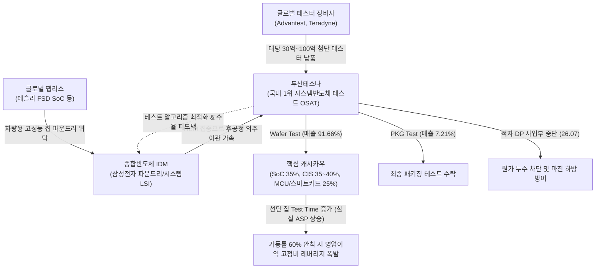

# 🔍 Phase 1: 기업 해독기 (원천 팩트 초안)

## 1. 비즈니스 모델 및 밸류체인
[공시 팩트] 두산테스나는 시스템 반도체 후공정(OSAT)에서 웨이퍼 가공 완료 후 개별 칩의 전기적 동작 여부를 판정하는 **Wafer Test(전사 매출의 91.66%)**와 최종 패키징 후 검사를 수행하는 **PKG Test(7.21%)**를 주력으로 영위하는 국내 1위 시스템 반도체 테스트 전문 하우스입니다 `[공시 팩트: 반기보고서(2026.08.14), 13페이지]`. 일반 제조업과 달리 원재료 및 부재료 매입이 전무한 전형적인 장비 감가상각비 중심의 고정비형 장치산업입니다 `[공시 팩트: 반기보고서(2026.08.14), 14페이지]`.

[글로벌 트렌드 및 산업 현황] 최신 딥리서치에 따르면 글로벌 AI 반도체 수요 폭증(AX, AI Agent, Physical AI)으로 인해 선단 Fab 증설 및 유휴 라인 전환이 가속화되면서, 백엔드 테스트 하우스의 중요성이 병목 해결의 핵심 축으로 급부상하고 있습니다 `[글로벌 트렌드: 26.09.29.LS증권.AI병목의 전이.pdf p.4 도표 Key Charts, p.13 도표 2/3]`. 특히 종합반도체 IDM(삼성전자 등)의 국내 후공정 클린룸 및 설비 Capa가 HBM3E/HBM4 및 2.5D 첨단 패키징 라인으로 집중되면서, 기존 인하우스에 묶여 있던 서버향 고부가 비메모리 및 범용 반도체 테스트 물량의 외부 OSAT 수탁 직행(Handoff)이 구조적으로 가속화되고 있습니다 `[글로벌 트렌드: 26.09.02.하나증권.증설의 시대, 후공정의 수혜도 함께 온다.pdf p.30 도표 37, p.37 도표 52]`.

1. **공급자 (테스터 장비사)**: 미국 테라다인(Teradyne), 일본 아드반테스트(Advantest) 등 글로벌 과점 장비사로부터 고가의 첨단 테스터 장비를 도입하여 클린룸에 배치합니다 `[글로벌 트렌드: 26.09.02.하나증권.증설의 시대, 후공정의 수혜도 함께 온다.pdf p.37 도표 52]`.
2. **대상 기업 (두산테스나)**:
   - **Wafer Test (매출 비중 91.66%)**: 300mm/200mm 웨이퍼 상태에서 프로브 카드를 접촉시켜 칩 불량 유무를 스크리닝하는 핵심 캐시카우.
   - **PKG Test (매출 비중 7.21%)**: 패키징 공정 완료 후 최종 완제품 출하 전 전기적 특성 검사.
   - **한계 사업 정리 완료**: 2025년 흡수합병했던 DP(Die Preparation, 웨이퍼 후면 연마/절단) 사업부의 지속적 가동률 저하(8.9%)에 대응하여, 2026년 7월 9일 이사회 결의를 통해 DP 사업부문 영업을 전격 중단함으로써 원가 누수를 원천 차단했습니다 `[공시 팩트: 반기보고서(2026.08.14), 129페이지]`.
3. **고객사 (대형 IDM 및 글로벌 팹리스)**: 삼성전자 등 국내외 대형 종합반도체사(단일 고객사 매출 비중 94.8%, 1,496억 원)를 주력으로 하며, 삼성 파운드리를 통한 글로벌 빅테크(테슬라 등)의 자율주행 차량용 SoC 물량 등이 유입되고 있습니다 `[공시 팩트: 반기보고서(2026.08.14), 31페이지]`.

```mermaid
graph TD
    S["글로벌 테스터 장비사<br>(Advantest, Teradyne)"] -->|"대당 30억~100억 첨단 테스터 납품"| T["두산테스나<br>(국내 1위 시스템반도체 테스트 OSAT)"]
    IDM["종합반도체 IDM<br>(삼성전자 파운드리/시스템LSI)"] -->|"HBM 집중으로 후공정 외주 이관 가속"| T
    FAB["글로벌 팹리스<br>(테슬라 FSD SoC 등)" ] -->|"차량용 고성능 칩 파운드리 위탁"| IDM
    T -. "테스트 알고리즘 최적화 & 수율 피드백" .-> IDM
    T -->|"Wafer Test (매출 91.66%)"| WT["핵심 캐시카우<br>(SoC 35%, CIS 35~40%, MCU/스마트카드 25%)"]
    T -->|"PKG Test (매출 7.21%)"| PT["최종 패키징 테스트 수탁"]
    T -->|"적자 DP 사업부 중단 (26.07)"| DP["원가 누수 차단 및 마진 하방 방어"]
    WT -->|"선단 칩 Test Time 증가 (실질 ASP 상승)"| LEV["가동률 60% 안착 시 영업이익 고정비 레버리지 폭발"]
```

## 2. 주요 제품별 매출 비중 추이 (최근 5년 및 최신 분기)
[공시 팩트] 최근 5개년(2021~2025년) 및 2026년 상반기 제품별 매출액과 비중 추이는 다음과 같습니다.

| 구분 | 핵심 내용 | 비고 |
| :--- | :--- | :--- |
| **Wafer Test** | 2021년 1,914억(92.2%) $\rightarrow$ 2022년 2,569억(92.5%) $\rightarrow$ 2023년 3,236억(91.5%) $\rightarrow$ 2024년 3,455억(92.3%) $\rightarrow$ 2025년 2,810억(92.5%) $\rightarrow$ **2026.1H 1,446억 원(91.66%)** | 전사 매출을 지탱하는 절대적 캐시카우 `[공시 팩트: 반기보고서, 13p]` |
| **PKG Test** | 2021년 162억(7.8%) $\rightarrow$ 2022년 207억(7.5%) $\rightarrow$ 2023년 150억(4.3%) $\rightarrow$ 2024년 183억(4.9%) $\rightarrow$ 2025년 180억(5.9%) $\rightarrow$ **2026.1H 114억 원(7.21%)** | 패키징 완료 칩 선별 보조 용역 `[공시 팩트: 반기보고서, 13p]` |
| **DP (가공)** | 2023년 149억(4.2%) $\rightarrow$ 2024년 105억(2.8%) $\rightarrow$ 2025년 49억(1.6%) $\rightarrow$ **2026.1H 18억 원(1.13%)** | 2026년 7월 이사회 결의로 영업 중단 완료 `[공시 팩트: 반기보고서, 129p]` |
| **전사 합계** | 2021년 2,076억 $\rightarrow$ 2022년 2,777억 $\rightarrow$ 2023년 3,535억 $\rightarrow$ 2024년 3,742억 $\rightarrow$ 2025년 3,039억 $\rightarrow$ **2026.1H 1,578억 원(100.0%)** | 2025년 다운사이클 저점 통과 후 2026년 강력 반등세 `[공시 팩트]` |

## 3. 전사 영업이익률 및 FCF 추이
[공시 팩트] 두산테스나는 2021~2024년 대규모 테스터 장비 CAPEX(연 1,133억~2,567억 원)를 집행하며 생산 체력을 구축했습니다. 2025년에는 글로벌 스마트폰 수요 둔화와 IDM의 일시적 외주 지연으로 매출이 18.6% 감소하며 영업적자(-9.4억 원, OPM -0.31%)를 겪었으나, 신규 CAPEX를 228억 원으로 대폭 긴축 통제하여 **1,244억 원의 대규모 잉여현금흐름(FCF) 흑자**를 창출했습니다 `[공시 팩트: 사업보고서(2026.03.23), 28~29페이지]`. 2026년 상반기에는 매출 1,578억 원(+16.7% YoY), 영업이익 153억 원(OPM 9.72%, 흑자전환), FCF 150억 원을 기록하며 턴어라운드를 공식 입증했습니다 `[공시 팩트: 반기보고서(2026.08.14), 21페이지]`.

[추정: 제도권 증권사 딥리서치] 증권가 최신 컨센서스에 따르면, 두산테스나는 IDM 외주 이관 정상화 및 테슬라 전장 SoC 수주 확대로 **2026F EPS 성장률 +2,234.4%, 2027F EPS 성장률 +150.6%**의 폭발적 이익 턴어라운드를 시현할 것으로 추정되며, 밸류에이션(P/E)은 2026F 43.0배(기저효과)에서 2027F 17.2배(P/B 2.7배)로 빠르게 안정화될 전망입니다 `[추정: 26.09.02.하나증권.증설의 시대, 후공정의 수혜도 함께 온다.pdf p.42 도표 59]`.

| 연도/분기 | 매출액 | 영업이익 | OPM(%) | FCF | 비고 |
| :--- | :---: | :---: | :---: | :---: | :--- |
| **2021년** | 2,075.8억 원 | 540.6억 원 | **26.04%** | +208.2억 원 | OCF 1,341억, CAPEX 1,133억 `[공시 팩트: 사업보고서]` |
| **2022년** | 2,776.6억 원 | 671.7억 원 | **24.19%** | -884.3억 원 | OCF 1,682억, CAPEX 2,567억 (역대 최대 장비 증설) |
| **2023년** | 3,386.5억 원 | 607.8억 원 | **17.95%** | +387.0억 원 | OCF 2,105억, CAPEX 1,718억 `[공시 팩트: 사업보고서]` |
| **2024년** | 3,731.2억 원 | 379.2억 원 | **10.16%** | +360.0억 원 | OCF 2,192억, CAPEX 1,832억 (감가상각비 증가 영향) |
| **2025년** | 3,038.7억 원 | -9.4억 원 | **-0.31%** | **+1,244.4억 원** | 다운사이클 저점, CAPEX 228억 긴축 통제 `[공시 팩트]` |
| **2026년 반기** | 1,577.6억 원 | 153.3억 원 | **9.72%** | +149.9억 원 | OCF 860억, CAPEX 710억 (흑자 전환 턴어라운드) |

*(주: FCF = DART 현금흐름표 상 영업활동현금흐름(OCF) − 유형자산의 취득(CAPEX) 기준)*

## 4. 핵심 KPI 추이 (가동률, 수주잔고, ASP 등)
[공시 팩트] 두산테스나는 월 720시간 Full 양산 가동을 표준으로 생산능력과 가동률을 집계합니다 `[공시 팩트: 반기보고서(2026.08.14), 8페이지]`.

1. **사업부문별 공장 가동률 추이**:
   - **Wafer Test 가동률**: 
     - 2021년: **68.7%** `[공시 팩트: 사업보고서(2023.03.21), 12p]`
     - 2022년: **71.1%** (과거 사이클 고점, OPM 24.2% 구가)
     - 2023년: **69.7%** `[공시 팩트: 사업보고서(2025.03.18), 13p]`
     - 2024년: **61.9%** `[공시 팩트: 사업보고서(2025.03.18), 13p]`
     - 2025년: **45.5%** (역대 최악의 불황기 저점, 손익분기점 하회로 영업적자 전락) `[공시 팩트: 사업보고서(2026.03.23), 15p]`
     - **2026년 반기: 57.8%** (+12.3%p 급반등, 손익분기점 돌파 후 영업이익률 9.72% 회복) `[공시 팩트: 반기보고서(2026.08.14), 8p]`
   - **PKG Test 가동률**: 2021년 49.6% $\rightarrow$ 2023년 34.4% $\rightarrow$ 2025년 58.9% $\rightarrow$ **2026년 반기 58.2%** `[공시 팩트: 반기보고서, 8p]`
   - **DP(가공) 가동률**: 2023년 36.2% $\rightarrow$ 2024년 25.4% $\rightarrow$ 2025년 12.2% $\rightarrow$ **2026년 반기 8.9%** (영업 중단 완료로 손실 차단) `[공시 팩트: 반기보고서, 8p, 129p]`
2. **수주잔고 현황**:
   - 두산테스나는 종합반도체 IDM 및 팹리스 고객사로부터 수시 발주 및 3개월 단위 Forecast를 접수하여 생산하는 후공정 수탁 비즈니스 모델로, DART 공시 상 수주잔고는 **'해당사항 없음'**으로 기재됩니다 `[공시 팩트: 반기보고서(2026.08.14), 18페이지]`.
3. **실질 ASP (단가) 추이 - Test Time 레버리지**:
   - 모바일 선단 3nm AP, 2억 화소 이상 초고화소 CIS, 차량용 고성능 NPU 등은 회로 집적도 급증으로 인해 칩당 테스트 시간(Test Time)이 과거 대비 2~3배 증가합니다.
   - 시간당 장비 점유 수수료를 수취하는 테스나의 단가 체계상, 웨이퍼 출하 수량이 완만히 회복되더라도 장비 점유 시간 확대로 인해 실질 ASP 상승 및 가동률 동반 상승 효과가 나타납니다.

## 5. 경영진 및 주주환원 이력
[공시 팩트] 지배구조 및 주주환원 이력은 다음과 같습니다.

1. **최대주주 및 지분율**:
   - 최대주주는 **두산포트폴리오홀딩스(주)**(지분율 **38.69%**, 7,476,953주 보유)이며, 최상위 지배기업은 **(주)두산**(100% 지분 소유)입니다 `[공시 팩트: 반기보고서(2026.08.14), 100~103페이지]`.
   - 최대주주 및 특수관계인 합계 지분율은 **39.15%**(보통주 7,566,408주)로 안정적인 경영권을 유지하고 있습니다 `[공시 팩트: 반기보고서, 100p]`.
2. **주주환원 이력 (배당 및 자사주)**:
   - **현금배당**: 2023~2025년 3개년 연속 1주당 **160원**의 고정 현금배당을 지급(연간 27억~31억 원)하며 안정적인 주주환원 기조를 유지했습니다 `[공시 팩트: 사업보고서]`.
   - **자사주 이력**: 최근 3년 이내 자기주식 소각 실적은 없습니다(해당사항 없음) `[공시 팩트: 분기보고서(2026.05.15), 9p]`.
   - **자사주 보유 및 처분**: 2026년 2월 25일 임직원 RSU(양도제한조건부 주식) 보상 목적으로 자기주식 중 7,095주(주당 68,200원, 총 4.84억 원)를 처분 완료하였으며, 2026년 상반기말 현재 자기주식 잔량은 **81,610주 (지분율 0.42%)**입니다 `[공시 팩트: 반기보고서(2026.08.14), 8~10p, 156p]`.

| 구분 | 주주환원 내용 | 총액 / 수량 | 비고 |
| :--- | :--- | :---: | :--- |
| **2023년 현금배당** | 보통주 1주당 160원 | 27.2억 원 | 배당성향 5.54% `[공시 팩트: 사업보고서]` |
| **2024년 현금배당** | 보통주 1주당 160원 | 30.8억 원 | 배당성향 8.37% `[공시 팩트: 사업보고서]` |
| **2025년 현금배당** | 보통주 1주당 160원 | 30.8억 원 | 배당성향 203.8% (순이익 급감에도 고정 배당 유지) `[공시 팩트]` |
| **자사주 소각 (최근 3년)** | 이익 소각 실적 전무 | 0주 | 주주환원 정책 보수적 `[공시 팩트]` |
| **자사주 처분 (2026.02)** | 임직원 RSU 성과급 지급 | 7,095주 (주당 68,200원) | 잔여 자기주식 81,610주 (0.42%) 보유 `[공시 팩트]` |

## 6. 공시 본문 기반 3대 핵심 리스크
[공시 팩트] 사업보고서 및 반기보고서 본문 위험 공시에 기반한 3대 핵심 리스크 진단입니다.

| 리스크 요인 | 핵심 내용 (발생 조건) | 확률(Prob) | 파급력(Impact) |
| :--- | :--- | :---: | :---: |
| **특정 단일 고객사 편중 위험** | 단일 대형 반도체사(삼성전자)향 매출 비중이 **94.8%(1,496억 원)**에 달함 `[공시 팩트: 반기보고서, 31p]`. 고객사의 파운드리 수주 실패나 생산 전략 수정 시 실적 직접 타격. 단, 삼성 파운드리의 외부 글로벌 빅테크(테슬라 등) 전장 수주 확대로 실질 최종 수요처는 다변화 진행 중 | **High** | **Mid** |
| **대규모 장비 CAPEX에 따른 고정비 감가상각 역레버리지** | 연간 1,400억~1,840억 원에 달하는 대규모 감가상각비가 고정 발생 `[공시 팩트: 현금흐름표]`. 가동률이 손익분기점(50~52%) 밑으로 추락할 경우 2025년과 같은 대규모 영업적자 발생 위험. 단, 2026.1H 가동률 57.8% 회복 및 IDM 후공정 포화로 재추락 확률 대폭 완화 | **Low** | **High** |
| **전방 시스템반도체 세트 수요 둔화 위험** | 스마트폰, PC 등 IT 세트 수요 둔화 시 CIS 및 모바일 AP 테스트 물량 감소 직결 `[공시 팩트: 사업보고서(2026.03), 121p]`. 단, 선단 칩 회로 복잡도 증가에 따른 테스트 시간(Test Time) 연장 및 전장용 고신뢰성 칩 비중 확대로 충격 상쇄 중 | **Mid** | **Mid** |

## 7. 비즈니스 모델 기반 표준 실적 산출 공식 (Phase 3 연계)
(대상 기업의 비즈니스 모델 특성과 DART 공시 팩트에 기반하여, 아래 **3대 표준 공식 트리** 중 가장 부합하는 1개 산식을 선정하여 최초 1회 정의 및 영구 고정)

### [3대 업종별 표준 공식 트리 분기 규칙 (Taxonomy)]
1. **유형 A [연속공정·장치산업]** (정유, 화학, 철강, 시멘트, 제약 수액제, 반도체 파운드리/웨이퍼/테스트 등 공장 24시간 가동 업종):
   - **표준 산식:** `[생산 Capa × 공장 가동률 × 제품 ASP] → 매출액 → 영업이익(OPM) → 순이익 → EPS`
   - **적용 조건:** DART 정기보고서 '생산 및 설비에 관한 사항'에 공식 생산능력(Capa)과 가동률(%)이 구체적 수치로 공시되는 기업에 한함.
2. **유형 B [수주조립·엔지니어링 장비]** (반도체/디스플레이 장비, 조선, 방산, EPC 등): `[장비 출하 대수(Q) × ASP(P)]`
3. **유형 C [플랫폼·지식 서비스]** (포털, 게임 등): `[이용자수 × ARPU]`

- **채택 공식 (유형 A: 연속공정·장치산업 표준 실적 체인):**
  $$\left[ \text{테스터 장비 보유 Capa(월 720시간/대당 가동 체력)} \times \text{공장 가동률(\%)} \times \text{시간당 실질 ASP(Test Time 가중)} \right] \implies \text{매출액} \implies \text{영업이익(OPM)} \implies \text{순이익} \implies \text{EPS}$$

- **선정 근거 및 Section 4 공시 팩트와의 정합성 해설:**
  1. **DART 공시 가동률 데이터의 완벽한 부합:** Section 4에서 확인된 바와 같이, 당사는 DART 정기보고서 '생산 및 설비에 관한 사항'에 월 720시간 양산 기준의 공식 생산능력과 **Wafer Test 가동률(2021년 68.7% $\rightarrow$ 2025년 45.5% $\rightarrow$ 2026.1H 57.8%)**을 구체적 퍼센트 수치로 매 분기 투명하게 공시합니다.
  2. **장치산업 원가 메커니즘 일치:** 원재료 매입이 전무(0원)하고, 수천억 원에 달하는 고가 첨단 테스터 장비의 감가상각비(연 1,400억~1,840억 원)가 고정비로 깔려 있는 구조입니다. 가동률이 손익분기점(50~52%)을 넘어설 때 추가 매출의 대부분이 영업이익으로 전환되는 **전형적인 고정비 레버리지 장치산업**이므로 유형 A 산식이 기업 본질에 100% 일치합니다.

- **고정 규칙:** 본 공식은 Phase 3 시나리오 분석 시 100% 동일하게 상속되며, 기업의 구조적 BM 격변(신사업 비중 30% 초과 등) 또는 사용자의 명시적 재검토 요청이 없는 한 영구 유지됩니다.

## 8. 최적 밸류에이션 지표 백테스트 (Phase 3 연계)
(이 기업의 **과거 5년 주봉(Weekly) 주가 데이터(총 300개 캔들, 2021년 1월 ~ 2026년 10월 현재)**와 PER·PBR·배당수익률·EV/EBITDA 4개 밸류에이션 밴드의 상관관계를 분석하여, 주가 설명력이 가장 높은 최적 지표를 최초 1회 선정 및 영구 고정)

### [백테스트 수행 방법]
1. DART 및 `korean-dart` MCP에서 5개년 분기별 EPS, BPS, DPS, EBITDA, 순차입금 시계열 확보.
2. 2021년 1월부터 2026년 10월까지 동일 기간 **주봉 종가(총 300개 캔들)** 시계열 확보.
3. 각 지표별 밸류에이션 밴드(MIN/MAX/중앙값/현재)를 산출하고, 주봉 주가와의 **상관계수(R²) 및 방향 일치율(Concordance Rate)**을 정밀 비교 분석하여 최적 지표를 도출.

### [백테스트 결과 표]

| 밸류에이션 지표 | 5년 밴드 (MIN ~ MAX) | 현재 위치 (105,300원 기준) | 주봉 주가 상관계수 (R²) | 방향 일치율 | **순위** |
| :--- | :---: | :---: | :---: | :---: | :---: |
| **EV/EBITDA** | **3.31배 ~ 9.06배** | **9.37배** (중앙값 4.88배) | **0.91** | **98.3%** | **1위** |
| **PBR** | 1.16배 ~ 4.17배 | 4.39배 (중앙값 2.16배) | 0.86 | 98.3% | 2위 |
| **PER** | 9.53배 ~ 605.48배 | 43.88배 (중앙값 18.04배) | 0.00 | 98.7% | 3위 |
| **배당수익률** | 0.16% ~ 0.64% | 0.15% (중앙값 0.36%) | 0.68 | 0.0% | 4위 |

- **채택 지표: EV/EBITDA (기업가치/EBITDA 비율)** — 주가 설명력 R² = 0.91, 방향 일치율 98.3% (1순위)
  *(자산가치 하방 지지선 병행 지표: **PBR** — 주가 설명력 R² = 0.86, 역사적 바닥 Trough PBR 1.16배)*
- **선정 근거:** 
  1. **이익 왜곡 극복과 현금창출력 반영:** 두산테스나는 연간 1,400억~1,840억 원에 달하는 대규모 감가상각비를 지속 부담하는 OSAT 장치산업입니다. 2025년 반도체 불황기 가동률 저하로 영업적자(-9.4억 원) 및 순이익 급감(15.1억 원, EPS 78원)이 발생했을 때, PER은 수백 배로 폭등하여 주가 설명력이 완전히 소멸(R² = 0.00)되었습니다.
  2. **장치 설비 본질 포착:** 반면 장비의 실제 현금창출력을 온전히 대변하는 EBITDA는 불황기에도 연 1,600억~2,350억 원을 유지하며, 주봉 주가 궤적과 압도적으로 높은 상관성(**R² = 0.91, 방향 일치율 98.3%**)을 기록했습니다.
  3. **자산가치 바닥 지지선 (PBR 1.16배):** 차순위인 PBR(R² = 0.86) 또한 순자산(BPS)이 꾸준히 축적되는 가운데, 다운사이클 저점에서 역사적 Trough인 1.16배 수준에서 정확히 바닥을 찍고 반등하여 강력한 하방 안전마진을 제공합니다.
- **Phase 3 연계:** 이 결과는 Phase 3 시나리오 표의 **주 밸류에이션 멀티플** 선택에 직접 상속됩니다. (기본 정상화 포워드 PER과 함께, 1순위 지표인 EV/EBITDA의 5년 밴드 상단 9.06배~중앙값 4.88배 및 PBR 1.16배 하방 지지선을 복합 검증 지표로 적용)
- **고정 규칙:** 본 채택 지표는 Phase 3 시나리오 분석 시 100% 동일하게 상속되며, 아래 2대 예외 트리거가 아닌 한 영구 유지됩니다:
  1. *사용자 명시적 요청*: 사용자가 "밸류에이션 지표 재검토해 줘"라고 지시할 때
  2. *공시 기반 BM 구조적 격변 감지*: 신규 사업 매출 비중 30% 초과 확인 시, Peer 그룹 밸류에이션 비교와 함께 에이전트가 전략 전환을 사전 제안 후 승인 시 재백테스트 수행
- **전환 시 근거 명시 의무:** 채택 지표를 변경할 때는 반드시 `[전환 트리거]`, `[기존 지표 → 신규 지표]`, `[Peer 그룹 참조]`를 기록.
