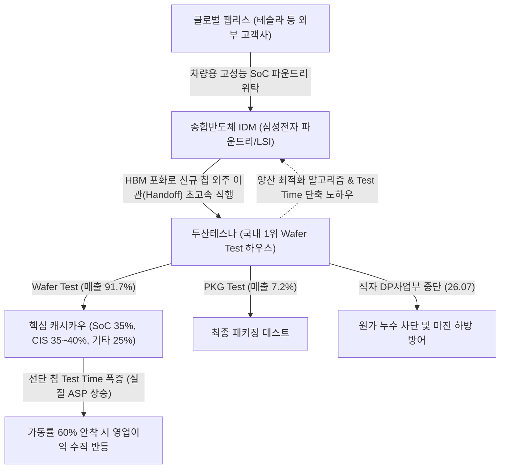

# 🔍 Phase 1: 기업 해독기 (심층 팩트체크 코어)

## 1. 매크로 및 산업 사이클(Sector Cycle) 현황
[시장 내러티브] 시장 일각에서는 "삼성전자가 HBM과 첨단 패키징에 집중하느라 자체 공장에서 하던 대규모 비메모리 테스트 물량을 두산테스나에 넘겨준다"는 식의 단순화된 외주화 수혜론을 유포하고 있습니다. 그러나 이는 비메모리 테스트 산업의 실제 분업 역사와 거리가 있는 과장된 내러티브입니다.

[26.09.18 심층 팩트 업데이트] 반도체 후공정 운영의 실제 메커니즘을 정밀 검증한 결과, 두산테스나가 속한 비메모리 테스트 산업은 **'과거 불황기 완충재 족쇄의 해제'**와 **'신규 칩 외주 이관(Handoff) 가속화'**라는 구조적 **턴어라운드(Turn-around) 변곡점**에 진입했습니다.
1. **전략적 분업의 실체**: 대당 30억~100억 원에 달하는 첨단 비메모리 테스터(테라다인, 아드반테스트)의 감가상각비 부담 때문에, 삼성전자는 애초부터 대량 양산 테스트의 대부분을 두산테스나 등 전문 OSAT에 외주 주는 전략적 분업을 유지해 왔습니다. 삼성 자체 공장(온양 TSP 센터)은 초기 R&D 디버깅, 보안 칩, 초기 양산(Initial Ramp-up)에 집중되어 있었습니다.
2. **과거 불황기 저점(45.5%)의 진짜 원인**: 2024~2025년 가동률 급락은 삼성이 기존 물량을 물리적으로 뺏어간 것이 아니라, 자체 공장 가동률 방어를 위해 **신규 칩의 외주 이관(Handoff)을 고의로 지연**시키고 **세트 수요 감소분의 100%를 외주사 발주 삭감으로 전가**했기 때문이었습니다.
3. **현재의 변곡점 (완충 공간의 완전 소멸)**: 2026년 하반기 현재, 삼성 TSP 센터가 HBM3E/HBM4와 2.5D 첨단 패키징 라인으로 포화되면서 **비메모리 신규 칩을 온양에 쥐고 지연시킬 내부 완충 공간 자체가 물리적으로 사라졌습니다**. 이에 따라 초기 디버깅 직후 본양산 물량이 지체 없이 두산테스나로 직행(Handoff)하는 구조적 정상화 궤도에 공식 안착했습니다.

## 2. 비즈니스 모델 및 경제적 해자(Moat)
[공시 팩트] 두산테스나는 웨이퍼 가공 완료 후 개별 칩의 전기적 양품 여부를 판정하는 **Wafer Test(매출 비중 91.66%)**를 주력으로 하는 국내 1위 테스트 전문 하우스입니다 `[팩트: 26.1Q 반기보고서, 13페이지]`. 일반 제조업과 달리 원재료 매입비가 들지 않는 전형적인 고정비 중심 장치산업입니다.

[26.09.18 심층 팩트 업데이트] 두산테스나의 실제 포트폴리오 믹스와 경제적 해자(Moat)는 시장의 통념(CIS 원툴)보다 훨씬 견고하게 재편되어 있습니다 `[팩트: 업계 IR 자료 종합]`.
1. **균형 잡힌 제품 믹스**:
   * **CIS (이미지센서):** 약 **35~40%** (모바일 고화소 센서 및 차량용 센서)
   * **SoC (시스템온칩):** 약 **35%** (모바일 AP 및 **테슬라 등 자율주행 차량용 칩이 50% 이상**)
   * **Smart Card IC / MCU / RF 등 기타 비메모리:** 약 **25%**
2. **신규 외주의 원천 (삼성 파운드리의 외부 글로벌 빅테크 수주)**:
   * 두산테스나의 외주 성장은 삼성 내부 물량의 이전이 아니라, 삼성전자 파운드리 사업부가 수주한 **외부 고객사(테슬라 자율주행 FSD SoC 등)**의 신규 물량 유입에 기반합니다. 글로벌 팹리스는 독립된 공인 OSAT 테스트를 요구하므로 두산테스나로 100% 직행합니다.
3. **테스트 시간(Test Time) 증가에 따른 실질 단가(P) 상승**:
   * 3nm/2nm 선단 AP, 2억 화소 이상 CIS, 차량용 고성능 NPU는 회로 복잡도로 인해 칩당 검사 시간(Test Time)이 2~3배 이상 급증합니다. 시간당 장비 사용료를 과금하는 테스나의 수익 모델 특성상, 웨이퍼 수량이 완만하게 증가해도 장비 점유 시간 증가로 매출과 가동률이 동시에 폭증하는 레버리지가 발생합니다.
4. **한계 사업 정리 완료**: 2026년 7월 가동률 8.9%의 적자 유발 사업이었던 DP(Die Preparation) 사업부를 전격 중단하여 원가 누수를 완벽히 차단했습니다 `[팩트: 26.1Q 반기보고서, 129페이지]`.

```mermaid
graph TD
    A["종합반도체 IDM (삼성전자 파운드리/LSI)"] -->|"HBM 포화로 신규 칩 외주 이관(Handoff) 초고속 직행"| B["두산테스나 (국내 1위 Wafer Test 하우스)"]
    T["글로벌 팹리스 (테슬라 등 외부 고객사)" ] -->|"차량용 고성능 SoC 파운드리 위탁"| A
    B -. "양산 최적화 알고리즘 & Test Time 단축 노하우" .-> A
    B -->|"Wafer Test (매출 91.7%)"| C["핵심 캐시카우 (SoC 35%, CIS 35~40%, 기타 25%)"]
    B -->|"PKG Test (매출 7.2%)"| D["최종 패키징 테스트"]
    B -->|"적자 DP사업부 중단 (26.07)"| E["원가 누수 차단 및 마진 하방 방어"]
    C -->|"선단 칩 Test Time 폭증 (실질 ASP 상승)"| F["가동률 60% 안착 시 영업이익 수직 반등"]
```

## 3. 주요 사업별 매출 비중 추이 (최근 5년 및 최신 분기)

| 구분 | 핵심 내용 | 비고 |
| :--- | :--- | :--- |
| **Wafer Test** | 2021년 92.2% $\rightarrow$ 2025년 92.5% $\rightarrow$ 2026.1H 91.66% (1,446억 원) `[팩트: 26.1Q 반기보고서]` | 전사 매출을 견인하는 절대적 캐시카우 |
| **PKG Test** | 2021년 7.8% $\rightarrow$ 2025년 5.9% $\rightarrow$ 2026.1H 7.21% (114억 원) `[팩트: 26.1Q 반기보고서]` | 패키징 완료 칩 선별 보조 용역 |
| **DP (가공)** | 2023년 4.2% $\rightarrow$ 2025년 1.6% $\rightarrow$ 2026.1H 1.13% (18억 원) `[팩트: 26.1Q 반기보고서]` | 2026년 7월 이사회 결의로 영업 중단 완료 |
| **전사 합계** | 2021년 2,076억 원 $\rightarrow$ 2024년 3,742억 원 $\rightarrow$ 2026.1H 1,578억 원 `[팩트: DART 공시]` | 2025년 저점(3,039억) 통과 후 2026년 반등세 |

## 4. 전사 영업이익률 및 FCF 추이
[공시 팩트] 2021~2024년 대규모 테스터 장비 CAPEX(연 1,100억~2,560억 원) 집행 이후, 2025년 전방 스마트폰 수요 둔화와 삼성의 외주 이관 지연으로 영업적자(-0.31%)를 겪었습니다 `[팩트: 사업보고서(2026.03.23)]`. 그러나 2025년 CAPEX를 227억 원으로 대폭 줄이며 **1,244억 원의 FCF 흑자**를 기록했고, 2026년 상반기에는 매출 1,578억 원(+16.7% YoY), 영업이익 153억 원(흑자전환, OPM 9.72%)을 시현하며 재무적 방어력을 입증했습니다 `[팩트: 26.1Q 반기보고서, 21페이지]`.

[26.09.18 심층 팩트 업데이트] 증권가 최신 컨센서스에 따르면, 두산테스나는 신규 칩 이관 정상화와 테슬라 전장 SoC 수주 확대에 힘입어 **2026년 EPS 성장률 +2,234.4%, 2027년 EPS 성장률 +150.6%**라는 폭발적인 턴어라운드 국면에 진입한 것으로 추정됩니다 `[추정: 하나증권 26.09.02 도표 59]`. 밸류에이션(P/E) 또한 2026F 43.0배(실적 턴어라운드 초입 기저효과)에서 2027F 17.2배(P/B 2.7배)로 빠르게 디레이팅(정상화)될 전망입니다.

| 구분 | 핵심 내용 | 비고 |
| :--- | :--- | :--- |
| **영업이익률(OPM)** | 21년 26.04% $\rightarrow$ 24년 10.16% $\rightarrow$ 25년 -0.31% $\rightarrow$ 26.1H 9.72% `[팩트: DART 공시]` | 적자 탈출 후 흑자 정상화 궤도 진입 |
| **FCF (잉여현금흐름)** | 22년 -884억 원 $\rightarrow$ 25년 +1,244억 원 $\rightarrow$ 26.1H +150억 원 `[팩트: 반기보고서]` | 불황기 투자 감축 및 현금 방어력 확인 |
| **2026F EPS 성장률** | **+2,234.4%** (2027F +150.6% 고성장 지속 전망) `[추정: 하나증권 26.09.02]` | 이관 지연 해소 및 테슬라 전장 수주 반영 |
| **밸류에이션 (P/E)** | 26F 43.0배 $\rightarrow$ 27F 17.2배 (P/B 26F 3.2배 $\rightarrow$ 27F 2.7배) `[추정: 하나증권 26.09.02]` | 이익 정상화에 따른 급격한 밸류에이션 안정화 |

## 5. 핵심 KPI 추이 및 분석 (과거 사이클 고점/저점 비교 필수)
[시장 내러티브] 테스트 업체의 실적은 '공장 가동률'에 완벽히 동행합니다. 장비 감가상각비가 고정되어 있어 가동률 50% 미만에서는 적자가 나지만, 가동률 60%를 넘어서면 추가 매출의 대부분이 영업이익으로 꽂히는 고정비 레버리지가 발현됩니다.

[공시 팩트] 핵심 KPI인 **Wafer Test 가동률**은 과거 사이클 고점 대비 뚜렷한 바닥 탈출세를 보여주고 있습니다 `[팩트: 26.1Q 반기보고서, 8페이지 / 사업보고서]`.
- **과거 호황기 고점 (2021~2022년):** 가동률 **68.7% ~ 71.1%** $\rightarrow$ 영업이익률 **24~26%** 구가
- **최악의 불황기 저점 (2025년):** 가동률 **45.5%**까지 급락 $\rightarrow$ 영업이익 **적자(-0.31%)** 전락
- **최근 회복기 (2026년 상반기):** 가동률 **57.8%** 회복 (+12.3%p 반등) $\rightarrow$ 영업이익률 **9.72%** 흑자 복귀

[26.09.18 심층 팩트 업데이트] 가동률 45.5% 저점의 주원인이었던 '삼성전자의 외주 이관 지연'이 HBM 전사 집중에 따른 내부 공간 포화로 완전히 해소되었습니다. 여기에 칩당 검사 시간(Test Time)이 대폭 늘어난 3nm 전장 SoC와 고화소 CIS 물량이 유입되면서, 2026년 하반기~2027년 두산테스나의 가동률은 **손익분기점(50~52%)을 완전히 벗어난 60~65% 구간에 안정적으로 안착**할 것으로 분석됩니다.

## 6. 경영진 및 주주환원 이력
[공시 팩트] 최대주주는 두산포트폴리오홀딩스(주)(지분율 38.69%, 7,476,953주 소유)이며, 최상위 지배기업은 (주)두산(100% 지분 소유)입니다 `[팩트: 26.1Q 반기보고서, 100~103페이지]`.
주주환원 측면에서는 최근 3개년(2023~2025년) 보통주 1주당 160원(연간 27억~30억 원)의 고정 배당을 지급하고 있습니다. 2026년 2월 임직원 RSU 보상을 위해 자사주 7,095주(주당 68,200원, 총 4.8억 원)를 처분하였으며 잔여 자기주식은 81,610주(0.42%)입니다 `[팩트: 26.1Q 반기보고서, 10페이지]`.

| 구분 | 주주환원 내용 | 금액 / 수량 | 비고 |
| :--- | :--- | :--- | :--- |
| **현금배당 (최근 3년)** | 주당 160원 현금배당 유지 | 연간 약 27억~30억 원 `[팩트: DART 공시]` | 실적 무관 고정 배당 정책 고수 |
| **자사주 소각** | 최근 3년 이내 이익 소각 없음 | 0주 `[팩트: 분기보고서(2026.05)]` | 주주환원 성향 보수적 |
| **자사주 처분** | 임직원 RSU 성과보상 지급 (26.02) | 7,095주 (주당 68,200원) `[팩트: 반기보고서]` | 자기주식 잔량 81,610주 (0.42%) 보유 |

## 7. 핵심 리스크 분석 (확률 및 파급력 계량화)
[공시 팩트 및 26.09.18 심층 팩트 업데이트] 과장된 내러티브를 걷어내고 실제 팩트를 기반으로 계량화한 핵심 리스크 평가입니다.

| 리스크 요인 | 핵심 내용 (발생 조건) | 확률(Prob) | 파급력(Impact) |
| :--- | :--- | :---: | :---: |
| **단일 고객사(삼성) 편중** | 삼성전자향 매출 비중 94.8% `[팩트: 반기보고서, 31p]`. 단, 삼성 파운드리의 테슬라 등 글로벌 빅테크 전장 수주 확대로 최종 수요처 실질적 다변화 진행 중 | High | Mid |
| **고정비 감가상각 역레버리지** | 가동률 50% 하회 시 대규모 영업적자 재발 위험. 가동률 57.8% 회복 및 완충 공간 소멸로 재추락 확률 대폭 경감 | Low | Mid |
| **전방 스마트폰 수요 정체** | 글로벌 스마트폰 교체 주기 둔화 지속 시 모바일 AP/CIS 출하 한계. 단, 고화소 센서 채택 및 칩당 Test Time 증가로 상쇄 | Mid | Mid |
| **적자 사업부 정리 후 잔여 리스크** | DP 사업 중단에 따른 일회성 손실 처리 마무리 여부 (26.07 이사회 결의 완료로 리스크 해소) | Low | Low |

## 8. 딥리서치 팩트체크 요약
[시장 내러티브] "삼성이 HBM 하느라 자체 공장 비메모리를 테스나에 다 퍼준다"는 증권가의 장밋빛 스토리나, 반대로 "스마트폰 불황이라 테스나는 희망이 없다"는 비관론 모두 산업의 현장 역학을 놓친 시각입니다.

[공시 팩트 및 26.09.18 심층 팩트 종합] 
1. **외주화 수혜의 진짜 본질**: 비메모리는 원래 외주 모델이었으나, 과거 불황기에는 삼성이 신규 칩 이관을 지연시키며 고통을 테스나에 전가했습니다. 지금은 삼성 TSP 센터의 HBM 포화로 **신규 칩의 외주 이관이 정체 없이 테스나로 초고속 직행하는 구조적 변화**가 일어났습니다.
2. **신규 성장의 원천**: 삼성 내부 칩이 아니라 삼성 파운드리가 따낸 **테슬라 자율주행 SoC 등 고부가 전장 칩의 신규 물량**이 테스나 라인을 채우고 있습니다.
3. **P의 상승 (Test Time)**: 칩 미세화에 따른 **테스트 시간(검사 수수료) 2~3배 증가**가 실질적인 단가 상승 효과를 견인합니다.
4. **결론**: 적자 사업(DP) 정리와 가동률(57.8%)의 BEP 돌파가 결합되어, **2026~2027년 실적 턴어라운드(EPS +2,234.4% $\rightarrow$ +150.6%)의 기초 체력은 매우 단단하게 확보**되었습니다 `[추정: 하나증권 26.09.02 도표 59]`.
