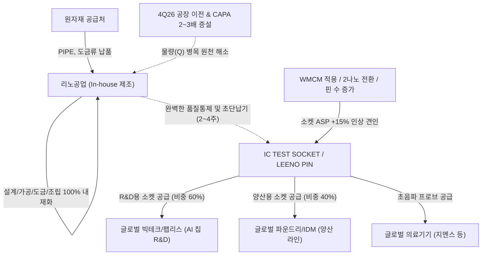

# 🔍 Phase 1: 기업 해독기 (심층 팩트체크 코어)

## 1. 매크로 및 산업 사이클(Sector Cycle) 현황

[시장 내러티브] 
현재 글로벌 반도체 및 IT 산업은 하이퍼스케일러들의 AI 인프라 투자 지속과 Agentic AI 확산에 따라 고성능 반도체 수요가 견인하는 **수퍼 사이클 초기~중반 국면**에 위치해 있습니다. 글로벌 빅테크들이 고부가가치 AI 칩 및 다변화된 애플리케이션으로 이동함에 따라, 반도체의 성능을 검증하는 테스트 부품에 대한 요구 사양(초미세 Pitch, 고대역폭, 고방열)도 한층 고도화되고 있어 프리미엄 테스트 소켓 수요 폭발이 기대됩니다.

[26.09.16 트렌드 업데이트] 최신 9월 기관 딥리서치(대신증권 26.09.01, 하나증권 26.09.02 등) 및 산업 사이클 타임라인 분석 결과, 반도체 생태계는 단순한 HBM 후공정 병목 해결 국면을 지나 삼성전자 평택 P5, SK하이닉스 용인 원삼 Y1(첫 클린룸 2027년 2월 예정) 및 P&T7 등 **'신규 팹 착공~장비 반입 선행 구간'**이 열리는 전례 없는 '증설의 시대'를 맞이하고 있습니다 `[팩트/전망: 하나증권 26.09.02, iM증권 8월]`.
특히 패키지 및 모듈 공정 전반에서 다이 밀도 증가, 3D 적층 구조 전환, 전수 번인(Burn-in) 테스트 도입 등 **'테스트 강도(Test Intensity)의 구조적 상승'**이 확정되면서 소켓/핀 수요를 구조적으로 견인하고 있습니다 `[팩트: 하나증권 26.09.02, 35 및 41페이지]`. 
나아가 리노공업의 실적은 전방 IT 세트의 단순 출하량보다 **'글로벌 빅테크의 AI 반도체 자체 개발(ASIC) 및 신규 칩 R&D 프로젝트 수'**에 직결되는 구조로, 모바일 세트 수요 둔화와 무관하게 칩 개발 프로젝트 폭증에 따른 독자적 호황기(Turn-around)에 공식 진입했습니다 `[팩트: 대신증권 26.09.01, 53페이지]`.

## 2. 비즈니스 모델 및 경제적 해자(Moat)

[공시 팩트] 
리노공업은 전량 수입에 의존하던 검사용 프로브(LEENO PIN)와 반도체 검사용 소켓(IC TEST SOCKET)을 국산화하여 891개의 글로벌 IT 고객사에 납품하는 소모성 테스트 부품 핵심 기업입니다 (2025년 기준 해외 수출 비중 79.8%, 2026.2Q 기준 83.7%) `[팩트: 26년 반기보고서, p.16, p.21]`. 
이 기업의 가장 강력한 **경제적 해자(Moat)**는 미세조립, 초정밀가공, 도금 등 10개 이상의 전 공정을 100% 내재화한 **인하우스(In-house) 완전 수직계열화 생산 시스템**에 있습니다 `[팩트: 26년 반기보고서, p.8]`. 이를 통해 주문 후 일반 제품은 10일 이내, 특별 주문품은 2~4주 이내 납품이라는 **초단납기(Quick Delivery)**를 실현하며 글로벌 팹리스 및 종합반도체 고객사를 완벽히 Lock-in 하고 있습니다 `[팩트: 26년 반기보고서, p.23]`. 이러한 다품종 소량 주문제작 방식은 판가 전가력을 극대화하여 반도체 부품업계에서 독보적인 40% 후반~50%대의 압도적 영업이익률을 지속 달성하게 하는 원천 경쟁력입니다.

[26.09.16 트렌드 업데이트] 최신 9월 기관 딥리서치는 리노공업의 경제적 해자가 다음 3가지 요인으로 인해 한 단계 더 격상되었음을 공인했습니다:
1. **R&D 소켓 비중 60%의 강력한 경기 방어력**: 리노공업의 소켓 출하량 중 **R&D(개발용) 대 양산 비중은 1Q26 기준 6 대 4로 개발용이 더 큽니다** `[팩트: 대신증권 26.09.01, 53페이지]`. 세트 수요가 둔화되어도 고객사의 신제품 칩 R&D는 멈추지 않으며, 빅테크의 AI 반도체 내재화로 개발 프로젝트 수 자체가 늘어나는 수혜를 누립니다.
2. **WMCM 및 2나노 전환에 따른 ASP +15% 상승**: 2H26 북미 플래그십 모바일 AP에 **WMCM(Wafer-level Multi-Chip Module)**이 적용되면서 소켓 내 핀 수가 급증하여 **소켓 ASP가 전작 대비 15% 내외 상승**할 것으로 추정됩니다 `[추정: 대신증권 26.09.01, 53페이지]`. 2나노 전환 및 고성능 컴퓨팅(HPC)용 대면적 소켓 수요 또한 판가에 강력한 우호 요인입니다.
3. **4Q26 CAPA 2~3배 대규모 증설 및 공장 이전**: 쏟아지는 글로벌 AI 칩 R&D 수요에 대응하여 동사는 **2026년 4분기 본사 공장 이전과 함께 생산능력(CAPA)을 2~3배로 대폭 확장**할 계획이며, 향후 폭증할 양산 및 개발 물량 병목을 완벽히 선제 차단합니다 `[팩트: 대신증권 26.09.01, 53페이지]`.

## 3. 주요 사업별 매출 비중 추이 (최근 5년 및 최신 분기)

| 구분 | 핵심 내용 | 비고 |
| :--- | :--- | :--- |
| **IC TEST SOCKET 류** | 2021년 57.27% → 2025년 65.48% → 2026.1H **68.48%** (지속 상승) `[팩트: 반기보고서 p.16]` | 고부가가치 AI/HPC/모바일 반도체 검사용. 전사 마진 및 매출 성장을 견인 |
| **LEENO PIN 류** | 2021년 33.59% → 2025년 23.38% → 2026.1H **23.25%** `[팩트: 반기보고서 p.16]` | 이차전지 테스트핀 및 반도체 프로브 포함. 견조한 캐시카우 |
| **의료기기 부품류** | 2021년 8.17% → 2025년 10.24% → 2026.1H **7.65%** `[팩트: 반기보고서 p.16]` | 글로벌 지멘스 등 장기 공급. 안정적 사업 다각화 포트폴리오 |

## 4. 전사 영업이익률 및 FCF 추이

[공시 팩트] 
리노공업은 장기간 차입금이 전혀 없는 100% **무차입 경영**을 지속하고 있습니다 `[팩트: 반기보고서 p.24]`. 압도적인 영업활동현금흐름 창출력과 효율적인 설비투자 구조로 인해 잉여현금흐름(FCF)이 매년 1,000억 원 안팎으로 안정적으로 누적되고 있습니다.

[26.09.16 트렌드 업데이트] 최신 제도권 증권가(대신증권 26.09.01, 하나증권 26.09.02) 추정치에 따르면, 리노공업은 고부가 제품 믹스 개선에 힘입어 **사상 최초로 연간 영업이익 2,000억 원 및 OPM 50%대 안착**이라는 경이로운 실적 퀀텀 점프를 달성할 것으로 전망됩니다:
- **2026F**: 매출 **4,633억 원**(+24.4% YoY), 영업이익 **2,313억 원**(+30.7% YoY, **OPM 49.9%**), 당기순이익 1,991억 원, EPS 2,613원(+31.0%), P/E 25.1배 `[추정: 대신증권 26.09.01, 53페이지]`
- **2027F**: 매출 **5,583억 원**(+20.5% YoY), 영업이익 **2,814억 원**(+21.7% YoY, **OPM 50.4%**), 당기순이익 2,317억 원, EPS 3,041원(+16.4%), P/E 21.5배 `[추정: 대신증권 26.09.01, 하나증권 26.09.02]`

| 구분 | 핵심 내용 | 비고 |
| :--- | :--- | :--- |
| **전사 영업이익률(OPM)** | 21년 41.80% → 24년 44.65% → 25년 47.51% → 26.1H **49.73%** `[팩트: 공시]` | 고부가 Coaxial 및 AI 대면적 소켓 비중 확대로 사상 최고치 경신 |
| **FCF (잉여현금흐름)** | 2021년 약 854억 → 2023년 약 418억(저점) → 2025년 **약 1,195억** `[팩트: 사업보고서]` | 무차입 경영 속 매년 막대한 순현금 유입 지속 |
| **2026F 실적 컨센서스** | 매출 4,633억 원 / **영업이익 2,313억 원 (OPM 49.9%)** `[추정: 대신증권 26.09.01]` | 2H26 북미 AP향 WMCM 적용 ASP +15% 효과 반영 |
| **2027F 실적 컨센서스** | 매출 5,583억 원 / **영업이익 2,814억 원 (OPM 50.4%)** `[추정: 대신증권 26.09.01]` | 4Q26 CAPA 2~3배 증설 후 물량(Q) 본격 램프업 |
| **밸류에이션 (P/E)** | 26F 25.1~26.0배 → 27F 21.5~22.5배 (P/B 26F 5.7~5.8배) `[추정: 대신/하나증권]` | 과거 호황기 평균 P/E(30배) 대비 밸류에이션 매력 확보 |

## 5. 핵심 KPI 추이 및 분석 (과거 사이클 고점/저점 비교 필수)

[시장 내러티브] 
소부장 부품 기업은 전방 경기 침체 시 가동률 급락과 판가 하락으로 마진이 훼손된다는 편견이 있습니다.

[공시 팩트] 
다품종 주문생산 특성상 공장 가동률과 수주잔고 대신, 실물 KPI인 **제품군별 연간 생산실적(EA)**을 과거 사이클과 교차 분석하면 뚜렷한 질적 도약이 입증됩니다 `[팩트: 각 사업보고서 및 반기보고서 p.18]`:
- **과거 슈퍼 사이클 고점 (2022년)**: PIN 생산 1.34억 개, SOCKET 31만 개 $\rightarrow$ 매출 3,224억 원, OPM 42.38%
- **최악의 불황기 저점 (2024년)**: PIN 생산 5,428만 개, SOCKET 13만 개 $\rightarrow$ 매출 2,781억 원, OPM 44.65%
- **최근 회복기 (2026년 상반기)**: PIN 생산 3,557만 개, SOCKET 11만 개 $\rightarrow$ 반기 매출 2,429억 원, **OPM 49.73%**

생산 물량(Q)은 2022년 고점 대비 아직 회복되는 초기 국면임에도, 영업이익률은 22년 42%대에서 26년 상반기 49.73%로 사상 최고치를 경신했습니다. 이는 저가형 범용 부품 대신 **단가(ASP)가 현저히 높은 프리미엄 소켓으로 제품 믹스가 완벽하게 업그레이드되었음**을 증명합니다.

[26.09.16 트렌드 업데이트] 최신 기관 데이터에 따르면, 리노공업의 소켓은 R&D 비중이 60%에 달하여 전방 세트 출하량 변동에 직접적인 타격을 받지 않으며 `[팩트: 대신증권 26.09.01]`, 글로벌 OSAT 외주 테스트 단가 또한 연초 대비 20~30% 인상되는 등 후공정 공급자 우위(Pricing Power)가 강화되고 있습니다 `[팩트: 하나증권 26.09.02, 29페이지]`. 
여기에 4Q26 본사 이전과 함께 **CAPA가 2~3배로 대폭 확장**되면 `[팩트: 대신증권 26.09.01]`, 2027년부터는 고단가(P) 유지와 더불어 억눌렸던 물량(Q)마저 폭발적으로 팽창하여 **'역대 최고 수준의 P × 팽창하는 Q'의 강력한 이중 영업 레버리지**가 가동될 것입니다.

## 6. 경영진 및 주주환원 이력

[공시 팩트] 
최대주주는 창업주 이채윤 대표이사로, 2026년 반기말 기준 **25.48%** (19,418,345주)를 보유하고 있습니다 `[팩트: 반기보고서 p.135]`. 삼성자산운용(6.42%), 미래에셋자산운용(5.91%) 등 우량 기관 투자자가 2, 3대 주주로 등재되어 책임 경영을 뒷받침합니다.

[26.09.16 트렌드 업데이트] 지난 4월 공시된 최대주주 지분 매각에 따른 시장의 오버행(Overhang) 우려는 현재 12개월 선행 P/E 24배 수준에서 **상당 부분 해소 완료된 구간**으로 평가받고 있습니다 `[의견: 대신증권 26.09.01, 53페이지]`.

| 구분 | 주주환원 내용 | 세부 내용 | 비고 |
| :--- | :--- | :--- | :--- |
| **현금 배당 성향** | 순이익의 약 40% 고배당 지속 | 최근 3년간 연결 배당성향 40~41% 유지 (주당 800원 배당) `[팩트: 공시]` | 최저 가이드라인(30%)을 상회하는 주주환원 |
| **자사주 보유 및 소각** | 자사주 316,250주 (0.41%) | **2027년 9월까지 전량 이익소각 확정 공시** `[팩트: 반기보고서 p.10]` | 주주가치 제고 목적의 소각 계획 공시 |
| **액면 분할** | 1:5 액면분할 단행 (2025.04) | 주당 액면가 500원 → 100원 변경 (발행주식수 7,621만 주로 확대) | 유통 주식수 확대 및 거래 유동성 확보 |

## 7. 핵심 리스크 분석 (확률 및 파급력 계량화)

[공시 팩트 및 26.09.16 트렌드 업데이트] 공시자료와 최신 9월 기관 매크로 보고서를 교차 검증하여 주요 리스크를 계량화 평가합니다 `[팩트/추정: DART 공시, 한국경제/SK증권/대신증권 9월 종합]`.

| 리스크 요인 | 핵심 내용 (발생 조건) | 확률(Prob) | 파급력(Impact) |
| :--- | :--- | :---: | :---: |
| **전방 스마트폰 세트 수요 침체** | 스마트폰 출하량 둔화 시 양산용 소켓(비중 40%) 타격 가능. 단, R&D 소켓 비중이 60%에 달해 개발 프로젝트 증가로 상쇄 `[팩트: 대신증권 26.09.01]` | Mid | Low |
| **환율 변동 (원화 절상 리스크)** | 전체 매출의 83.7%가 수출 `[팩트: 반기보고서 p.21]`. 원화 10% 절상 시 당반기 기준 약 124억 원의 외환 손익 감소 발생하나 OPM 49%대로 충분히 흡수 가능 | Mid | Mid |
| **원자재 가격 폭등** | PIPE 등 금속재, 도금류 원자재 가격 상승 시 원가율 압박. 단, 다품종 맞춤형 주문제작에 따른 판가 전가력 탁월 | Mid | Low |
| **역외 수급 및 선물 변동성** | 최근 20영업일 역외 ETF 순유출(-1.32조 원) 및 무기한선물 갭 전이율(0.85) 심화 등 국내 반도체 전반의 수급 변동성 확대 `[팩트: 한국경제/SK증권 26.09.09]`. 단, 리노공업은 무차입 우량 펀더멘털로 영향 극히 제한적 | Mid | Low |
| **노사 관계 및 파업 리스크** | 노사 협상 관련 파업 발생 시 생산 차질 우려. 최신 기관 점검 결과 파업에 따른 실제 생산 차질 영향은 극히 제한적임 확인 `[팩트: 대신증권 26.09.01]` | Low | Low |

## 8. 딥리서치 팩트체크 요약

[시장 내러티브] 
'AI 랠리에서는 HBM 장비사나 파운드리만 수혜를 보고, 모바일 비중이 높은 소켓 부품사는 소외될 것'이라는 시장의 편견이 존재해 왔습니다.

[공시 팩트] 
공시 데이터 확인 결과, 리노공업은 2024년 물량 저점 시기에도 OPM 44.65%를 방어했으며, 2026년 상반기에는 **OPM 49.73%**라는 경이로운 사상 최대 수익성을 증명했습니다 `[팩트: 26년 반기보고서 p.49]`. 이미 고사양 AI 칩 패키징 고도화에 따른 ASP 상승(P) 효과를 입증했습니다.

[26.09.16 트렌드 종합] 최신 9월 기관 딥리서치(대신증권 26.09.01, 하나증권 26.09.02)는 리노공업을 다음과 같이 재평가했습니다:
1. **투자의견 Buy, 목표주가 91,000원 신규 제시**: 2027년 예상 EPS(3,041원)에 과거 호황기 P/E 30배를 적용하여 강력한 상승 여력을 제시했습니다 `[추정: 대신증권 26.09.01]`.
2. **소켓 R&D 비중 60% 및 빅테크 AI 칩 내재화 수혜**: 스마트폰 출하량과 무관하게 AI 칩 개발 프로젝트 수 폭증의 직접적 수혜를 받습니다 `[팩트: 대신증권 26.09.01]`.
3. **WMCM 도입에 따른 ASP +15% 인상 및 4Q26 CAPA 2~3배 증설**: 북미 플래그십 AP 핀 수 증가로 인한 단가 인상과 공장 이전을 통한 생산능력 확장이 맞물려, 2026F 영업이익 2,313억 원(OPM 49.9%) → 2027F 2,814억 원(OPM 50.4%)으로 이어지는 독보적인 실적 레버리지 호황을 누릴 것입니다 `[추정: 대신증권 26.09.01, 하나증권 26.09.02]`.
