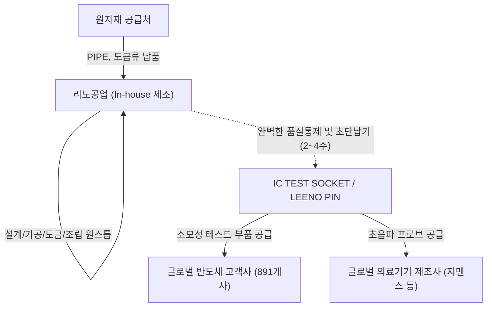

# 🔍 Phase 1: 기업 해독기 (심층 팩트체크 코어)

## 1. 매크로 및 산업 사이클(Sector Cycle) 현황

[시장 내러티브] 
현재 글로벌 반도체 및 IT 산업은 하이퍼스케일러들의 막대한 AI 인프라 투자 지속과 Agentic AI 확산에 따라 메모리 및 비메모리 반도체의 수요가 급증하는 **수퍼 사이클 초기~중반 국면**에 위치해 있습니다. 특히 메모리 반도체 공급 제약(외화내빈 현상)으로 인해 글로벌 반도체 장비(WFE) 투자가 2026년 1,500억 달러에서 2027년 1,900억 달러로 급등할 것으로 예상되며, 전공정 소부장 증설 사이클이 본격화되는 강력한 **턴어라운드(Turn-around)** 시점을 지나고 있습니다. 글로벌 빅테크들이 고부가가치 AI 칩 및 다변화된 애플리케이션으로 이동함에 따라, 반도체의 성능을 검증하는 테스트 부품에 대한 요구 사양(Pitch 축소, 고대역폭, 방열)도 한층 고도화되고 있어 프리미엄 테스트 소켓 수요 폭발이 기대됩니다.

## 2. 비즈니스 모델 및 경제적 해자(Moat)

[공시 팩트] 
리노공업은 전량 수입에 의존하던 검사용 프로브(LEENO PIN)와 반도체 검사용 소켓(IC TEST SOCKET)을 국산화하여 891개의 글로벌 IT 고객사에 납품하는 테스트 소모품 핵심 기업입니다 (2025년 기준 해외 수출 비중 79.8%, 2026.2Q 기준 83.7%). 이 기업의 강력한 **경제적 해자(Moat)**는 미세조립, 정밀가공, 도금 등 10개 이상의 전 공정을 100% 내재화한 **인하우스(In-house) 완전 수직계열화 시스템**에 있습니다. 이를 통해 주문 후 일반 제품은 10일 이내, 특별 주문품은 2~4주 이내 납품이라는 **초단납기(Quick Delivery)**를 실현하며 글로벌 고객을 Lock-in 하고 있습니다. 이러한 다품종 소량 주문제작 방식은 판가 전가력을 매우 높여주어, 반도체 부품업계에서 보기 드문 40% 후반의 압도적 영업이익률을 달성하게 하는 원천 경쟁력이 됩니다.

## 3. 주요 사업별 매출 비중 추이 (최근 5년 및 최신 분기)

| 구분 | 핵심 내용 | 비고 |
| :--- | :--- | :--- |
| **IC TEST SOCKET 류** | 2021년 57.27% → 2026년 상반기 **68.48%** (지속 상승) | 고부가가치, 모바일/서버/AI 반도체 검사용. 전사 매출 성장을 견인 |
| **LEENO PIN 류** | 2021년 33.59% → 2026년 상반기 **23.25%** (비중 하락) | 상품 및 이차전지 테스트핀 포함. 절대매출은 견조하나 소켓 성장세에 밀림 |
| **의료기기 부품류** | 2021년 8.17% → 2026년 상반기 **7.65%** (안정적 유지) | 글로벌 지멘스 등 장기 공급. 사업 다각화 및 캐시카우 역할 |

## 4. 전사 영업이익률 및 FCF 추이

[공시 팩트] 
리노공업은 장기간 차입금이 전혀 없는 100% **무차입 경영**을 유지하고 있습니다. 막대한 영업활동현금흐름 창출 능력에 더해 대규모 유형자산 투자가 필요 없는 사업 구조상 잉여현금흐름(FCF)이 매년 폭발적으로 누적되고 있습니다.

| 구분 | 핵심 내용 | 비고 |
| :--- | :--- | :--- |
| **전사 영업이익률** | 2021년 41.80% → 2023년 44.75% → 2025년 47.51% → 2026년 상반기 **49.73%** | 고부가가치 믹스(Mix) 개선으로 매출이 꺾였던 23년에도 이익률은 우상향 |
| **FCF (잉여현금흐름)** | 2021년 약 854억 → 2023년 약 418억(저점) → 2025년 **약 1,195억** | CapEx는 연평균 300~600억 내외로 관리되며 막대한 현금 창출력 입증 |
| **차입금 비율** | 지속적인 **0%** (무차입 경영) | 2026.2Q 기준 유동자산 약 5,638억원, 부채총계 약 801억원에 불과 |

## 5. 핵심 KPI 추이 및 분석 (과거 사이클 고점/저점 비교 필수)

[시장 내러티브] 
일반적인 반도체 소부장 기업은 전방 사이클에 따라 이익률과 생산량이 동반 급등락하지만, 리노공업은 최악의 불황기에도 강력한 가격 결정력을 통해 방어할 수 있다는 가설이 존재합니다.

[공시 팩트] 
다품종 주문생산 특성상 공장 가동률과 수주잔고는 공시되지 않으나, 실물 KPI인 **제품군 생산실적(EA)**을 통해 사이클을 검증할 수 있습니다. 
* **슈퍼 사이클 고점 (2022년)**: LEENO PIN 생산실적 1.34억 개, IC TEST SOCKET 31만 개 달성. (매출액 3,224억원, OPM 42.38%)
* **최악의 불황기 저점 (2024년)**: PIN 5,428만 개, SOCKET 13만 개로 물량이 반토막 남. (매출액 2,781억원, OPM 44.65%)
* **회복/턴어라운드 (2026년 상반기)**: PIN 3,557만 개, SOCKET 11만 개로 생산량 회복세 진입 중. (반기 매출 2,429억원, **OPM 49.73%**)
과거 대비 확연히 증명되는 팩트는, 물량(Q) 측면에서는 아직 2022년 슈퍼사이클 고점에 미치지 못했음에도, 단가가 비싼 하이엔드 소켓 비중 증가와 AI/미세화 프리미엄(P)이 반영되며 **영업이익률은 22년 42%대에서 26년 49%대로 오히려 사상 최고치를 경신**하고 있다는 점입니다.

## 6. 경영진 및 주주환원 이력

[공시 팩트] 
최대주주는 이채윤 대표이사로, 2026년 반기말 기준 **25.48%** (1,941만주)를 보유하고 있습니다. 삼성자산운용(6.42%), 미래에셋자산운용(5.91%) 등 대형 기관이 신뢰하는 주주 구성을 갖추고 있습니다.

| 구분 | 핵심 내용 | 비고 |
| :--- | :--- | :--- |
| **현금 배당 성향** | 최근 3년간 당기순이익의 약 **40~41%** 수준 (현금배당수익률 1.3~1.5%대) | 매년 최저 가이드라인(30%)을 상회하는 안정적 현금 환원 |
| **자사주 보유 및 소각** | 2026년 반기말 기준 보통주 **316,250주 (0.41%)** 보유 중 | 해당 자사주 전체를 **2027년 9월까지 소각**하겠다고 명시적으로 공시 |
| **액면 분할** | 2025년 4월 보통주 액면가 500원 → 100원 주식분할(1:5) 실시 | 유동성 확대 목적의 적극적 조치 |

## 7. 핵심 리스크 분석 (확률 및 파급력 계량화)

[공시 팩트] 
전량 주문제작이므로 재고 리스크는 없으나, 글로벌 시장 변동과 외환 리스크에 노출되어 있습니다.

| 리스크 요인 | 핵심 내용 (발생 조건) | 확률(Prob) | 파급력(Impact) |
| :--- | :--- | :--- | :--- |
| **전방 반도체/IT 경기 침체** | 스마트폰, AI, 서버 등 글로벌 설비투자 및 R&D 축소 시 신제품용 테스트 소켓 수주 하락 | Low (현재 AI 사이클 강력) | High (매출과 직결) |
| **환율 변동 (원화 강세)** | 전체 매출의 83.7%가 수출. 환율 10% 하락 시 당반기 기준 약 124억원의 손익 감소 발생 | Mid (금리인하로 원화강세 압력) | Mid (영업이익률이 높아 흡수 가능) |
| **원자재 가격 폭등** | PIPE 등 금속재, 도금류 원자재 가격 상승 및 수입망 교란 발생 시 제조원가율 악화 | Mid (지정학적 요인 상존) | Low (판가 전가력 매우 우수함) |

## 8. 딥리서치 팩트체크 요약

[시장 내러티브] 
"AI 반도체 인프라 투자 사이클 속에서, 테스트 장비와 소켓 부품 업체들은 고스펙 전환에 따른 강력한 판가 인상(P상승)의 수혜를 누릴 것이다."

[공시 팩트] 
이러한 내러티브는 리노공업의 재무 데이터로 완벽히 입증됩니다. 2024년 물량 저점 시기에도 OPM이 꺾이지 않았으며, 2025년과 2026년 AI 사이클이 도래하자 OPM은 49.73%라는 역대 최대 효율을 기록 중입니다. 또한, 글로벌 WFE(반도체 장비) 증설 사이클이 2026~2027년 본격화됨에 따라 전공정에 이어 테스트 장비/소모품에 대한 '외화내빈' 탈피 수요가 몰릴 예정이므로, 리노공업의 독자적인 100% 인하우스 생산 능력과 Coaxial/Large Device/High Power Cooling 등 하이엔드 소켓 라인업은 향후 극강의 마진 레버리지 확대로 직결될 것입니다.
