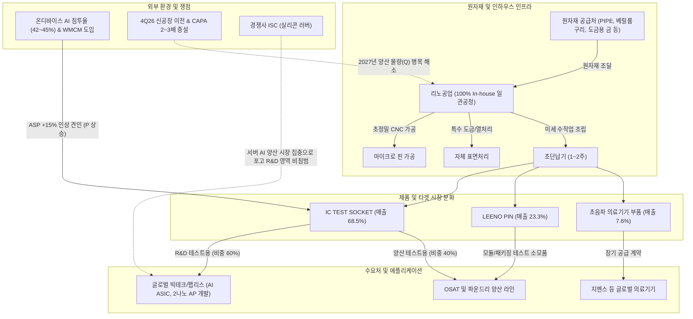

# 🔍 Phase 1: 기업 해독기 (원천 팩트 초안)

## 1. 비즈니스 모델 및 밸류체인
[공시 팩트] 
리노공업은 전량 수입에 의존하던 반도체 검사용 프로브(LEENO PIN)와 반도체 검사용 소켓(IC TEST SOCKET)을 국내 최초로 국산화하여 891개의 글로벌 IT 고객사에 공급하는 글로벌 소모성 테스트 부품 선도 기업입니다 (2025년 기준 수출 비중 79.8%, 2026년 상반기 기준 83.7%) `[팩트: 26년 반기보고서 p.16, p.21]`. 

동사의 독보적인 **경제적 해자(Moat)**는 미세조립, 초정밀가공, 특수도금 등 10단계 이상의 전 공정을 100% 내재화한 **인하우스(In-house) 완전 수직계열화**에서 나옵니다 `[팩트: 26년 반기보고서 p.8]`. 이를 바탕으로 주문 후 1~2주(특별 주문품 2~4주) 이내에 납품하는 **초단납기(Quick Delivery)** 경쟁력을 확보하여 글로벌 팹리스 및 빅테크의 신규 칩 R&D를 락인(Lock-in)하고 있습니다 `[팩트: 26년 반기보고서 p.23]`.

[2026.09.22 심층 팩트 업데이트]
1. **R&D 대 양산 비중 (6 대 4 구조)**:
   - 리노공업의 소켓 출하량 중 **R&D(개발용) 비중은 약 60%**, **양산용 비중은 약 40%**입니다 `[팩트: 대신증권 26.09.01, 53페이지]`.
   - 이로 인해 전방 세트의 단순 출하량 변동보다는 **'고객사의 신규 칩 R&D 프로젝트 수'**에 실적이 연동되는 특성을 가집니다.
2. **비(Non) 사이클론의 실상 (2022.4Q~2023년 역성장의 교훈)**:
   - 리노공업은 완전한 무사이클 기업이 아닙니다. 2022년 4분기~2023년 전방 스마트폰 재고조정 및 경기 침체 당시, 팹리스의 R&D 예산 동결과 양산용 핀(40%) 수주 급감으로 매출이 -20.7%, 핀 생산량이 -39.5% 급감하는 역성장을 경험했습니다.
   - 단, 타 소부장이 적자 전환할 때도 **OPM 44.75%**를 사수하여, '무사이클'이 아니라 **'다운사이클에서도 40% 이상 초고마진을 지켜내는 강철 체력의 경기민감 고마진 성장주'**임이 입증되었습니다.
3. **경쟁 구도: ISC(실리콘 러버)와의 영역 분화**:
   - ISC가 진출하는 비메모리 영역은 주로 **'대면적 서버 AI 가속기(GPU/NPU)의 대량 양산 테스트'**입니다.
   - 반면 리노공업은 **'금형 없이 1~2주 만에 다품종 소량을 즉각 깎아내는 모바일/엣지/커스텀 ASIC의 R&D 포고 핀'**에 특화되어 있어 두 회사의 주력 시장은 분화되어 있으며, 50%에 육박하는 OPM이 리노공업의 해자가 건재함을 증명합니다.
4. **하이퍼스케일러 데이터센터 CAPEX 수혜 구조**:
   - 하이퍼스케일러의 단순 서버 하드웨어 증설(대량 구매) 직결 수혜는 제한적이나, 구글(TPU), 메타(MTIA), 아마존(Trainium) 등 **'빅테크의 자체 맞춤형 AI ASIC 칩 설계/R&D 프로젝트 폭증'의 직접 수혜**를 입고 있습니다.
   - 나아가 데이터센터 인프라 구축 이후 열릴 **'온디바이스(On-Device) AI 디바이스 대전환'의 최대 핵심 수혜주**입니다.

```mermaid
flowchart TD
    subgraph 원자재 및 인하우스 인프라
        A["원자재 공급처 (PIPE, 베릴륨구리, 도금용 금 등)"] -->|"원자재 조달"| B["리노공업 (100% In-house 일관공정)"]
        B -->|"초정밀 CNC 가공"| B1["마이크로 핀 가공"]
        B -->|"특수 도금/열처리"| B2["자체 표면처리"]
        B -->|"미세 수작업 조립"| B3["초단납기 (1~2주)"]
    end

    subgraph 제품 및 타겟 시장 분화
        B3 --> C1["IC TEST SOCKET (매출 68.5%)"]
        B3 --> C2["LEENO PIN (매출 23.3%)"]
        B3 --> C3["초음파 의료기기 부품 (매출 7.6%)"]
    end

    subgraph 수요처 및 애플리케이션
        C1 -->|"R&D 테스트용 (비중 60%)"| D1["글로벌 빅테크/팹리스 (AI ASIC, 2나노 AP 개발)"]
        C1 -->|"양산 테스트용 (비중 40%)"| D2["OSAT 및 파운드리 양산 라인"]
        C2 -->|"모듈/패키징 테스트 소모품"| D2
        C3 -->|"장기 공급 계약"| D3["지멘스 등 글로벌 의료기기"]
    end

    subgraph 외부 환경 및 쟁점
        E1["온디바이스 AI 침투율 (42~45%) & WMCM 도입"] -->|"ASP +15% 인상 견인 (P 상승)"| C1
        E2["4Q26 신공장 이전 & CAPA 2~3배 증설"] -. "2027년 양산 물량(Q) 병목 해소" .-> B
        E3["경쟁사 ISC (실리콘 러버)"] -. "서버 AI 양산 시장 집중으로 포고 R&D 영역 비침범" .-> D1
    end
```

---

## 2. 주요 제품별 매출 비중 추이 (최근 5년 및 최신 분기)

[공시 팩트] 
DART 사업보고서 및 2026년 반기보고서 기준, 고마진의 핵심 제품인 **IC TEST SOCKET**의 비중이 지속적으로 확대되며 제품 믹스가 질적으로 고도화되고 있습니다 `[팩트: 각 연도 사업보고서 및 반기보고서 p.16]`.

| 구분 | 핵심 내용 | 비고 |
| :--- | :--- | :--- |
| **IC TEST SOCKET 류** | 2021년 57.27% → 2023년 59.98% → 2024년 62.15% → 2025년 65.48% → **2026.1H 68.48%** | 고부가가치 AI/HPC/모바일 AP 신규 칩 검사용. ASP 및 전사 마진 상승 견인 |
| **LEENO PIN 류** | 2021년 33.59% → 2023년 28.65% → 2024년 26.42% → 2025년 23.38% → **2026.1H 23.25%** | 반도체 검사용 프로브 및 이차전지 테스트핀. 캐시카우 역할 지속 |
| **의료기기 부품류** | 2021년 8.17% → 2023년 10.35% → 2024년 10.41% → 2025년 10.24% → **2026.1H 7.65%** | 초음파 프로브 부품 등 글로벌 의료기기사향 안정적 다각화 포트폴리오 |
| **기타 (임대 등)** | 2021년 0.97% → 2023년 1.02% → 2024년 1.02% → 2025년 0.90% → **2026.1H 0.62%** | 본사 부동산 임대 수익 등 비경상 매출 |

---

## 3. 전사 영업이익률 및 FCF 추이

[공시 팩트] 
리노공업은 창사 이래 차입금이 전혀 없는 **100% 무차입 경영**을 유지하고 있으며 `[팩트: 반기보고서 p.24]`, 매년 막대한 잉여현금흐름(FCF)을 창출하고 있습니다.

| 연도/분기 | 매출액 | 영업이익 | OPM(%) | FCF | 비고 |
| :--- | :---: | :---: | :---: | :---: | :--- |
| **2021년** | 2,802억 원 | 1,171억 원 | 41.80% | 약 854억 원 | 5G 스마트폰 전환 사이클 호황 `[팩트: 사업보고서]` |
| **2022년** | 3,224억 원 | 1,366억 원 | 42.38% | 약 1,020억 원 | **과거 수퍼 사이클 정점 (Peak)** `[팩트: 사업보고서]` |
| **2023년** | 2,556억 원 | 1,144억 원 | 44.75% | 약 418억 원 | **모바일 재고조정 침체 (매출 -20.7%)**, OPM 44.7% 수호 `[팩트: 사업보고서]` |
| **2024년** | 2,781억 원 | 1,242억 원 | 44.65% | 약 890억 원 | 실적 바닥 통과 및 점진적 회복 국면 `[팩트: 사업보고서]` |
| **2025년** | 3,724억 원 | 1,770억 원 | 47.51% | **약 1,195억 원** | **사상 최대 실적 경신 (역DCF 베이스 FCF)** `[팩트: 사업보고서]` |
| **2026.1H** | 1,515억 원 | 753억 원 | **49.73%** | 약 680억 원 | **2Q26 별도 OPM 51.3% 달성**, 고부가 믹스 효과 `[팩트: 반기보고서 p.49]` |
| **2026F (E)** | 4,633억 원 | 2,313억 원 | **49.92%** | 약 1,600억 원 | 2H26 북미 AP향 WMCM 채택(ASP +15%) 반영 `[추정: 대신증권 26.09.01]` |
| **2027F (E)** | 5,583억 원 | 2,814억 원 | **50.40%** | 약 2,000억 원 | 4Q26 신공장 CAPA 2~3배 증설 램프업 반영 `[추정: 대신증권 26.09.01]` |

---

## 4. 핵심 KPI 추이 (실물 생산량 및 과거 사이클 고점/저점 비교)

[공시 팩트] 
다품종 주문생산 특성상 가동률 수치 대신 DART 공시 실물 지표인 **제품군별 연간 생산실적(EA)**을 과거 사이클과 교차 분석하면 리노공업의 체질 변화가 명확히 드러납니다 `[팩트: 각 사업보고서 및 반기보고서 p.18]`:

- **과거 호황 정점 (2022년)**: PIN 생산 **1억 3,428만 개**, SOCKET 생산 **31.1만 개** $\rightarrow$ 매출 3,224억 원, OPM 42.38%
- **모바일 침체 저점 (2023년)**: PIN 생산 **8,127만 개** (**YoY -39.5%**), SOCKET 생산 **20.7만 개** (**YoY -33.4%**) $\rightarrow$ 모바일 재고조정 충격
- **물량 저점 (2024년)**: PIN 생산 **5,428만 개**, SOCKET 생산 **13.0만 개** $\rightarrow$ 매출 2,781억 원, OPM 44.65%
- **최신 회복기 (2026년 상반기)**: PIN 생산 **3,557만 개**, SOCKET 생산 **11.0만 개** $\rightarrow$ OPM **49.73%**

#### 💡 KPI 핵심 분석 및 시사점
1. **P(단가)의 극적인 레벨업**: 
   - 2026년 상반기 생산량(PIN 3,557만 개)은 2022년 피크(1.34억 개) 대비 아직 절반 수준에 불과하지만, 영업이익률은 42%에서 **49.7%**로 사상 최고치를 뚫었습니다.
   - 이는 저가 범용 핀 대신 **초미세 피치 Coaxial 소켓, WMCM용 대면적 소켓 등 단가(ASP)가 압도적으로 높은 프리미엄 소켓으로 제품 믹스가 완전히 전환**되었음을 입증합니다.
2. **Q(물량)의 확장 잠재력과 시차**:
   - 현재 온디바이스 AI 침투율은 42~45%에 달하지만 스마트폰 완제품 출하량(Q) 자체는 정체 상태입니다 `[시장 조사 팩트: Counterpoint, IDC]`.
   - 따라서 물량(Q)의 진정한 도약은 **2026년 4분기 본사 공장 이전 및 CAPA 2~3배 증설(에코델타시티)**이 가동되는 2027년부터 본격화될 것입니다 `[팩트: 대신증권 26.09.01]`.

---

## 5. 경영진 및 주주환원 이력

[공시 팩트] 
최대주주는 창업주 이채윤 대표이사로, 2026년 반기말 기준 **25.48%**(19,418,345주)를 보유하여 책임경영을 유지하고 있습니다 `[팩트: 반기보고서 p.135]`. 삼성자산운용(6.42%), 미래에셋자산운용(5.91%) 등 국내 정상급 기관이 주요 주주로 포진해 있습니다.

| 구분 | 주주환원 정책 및 이력 | 세부 내용 | 비고 |
| :--- | :--- | :--- | :--- |
| **현금 배당 성향** | 순이익의 약 40% 고배당 정책 | 최근 3개년 연결 배당성향 40~41% 지속 (주당 800원 배당) `[팩트: 사업보고서]` | 밸류업 가이드라인(30%) 상회 |
| **자사주 보유 및 소각** | 자사주 316,250주 (지분율 0.41%) | **2027년 9월까지 전량 이익소각 확정 공시** `[팩트: 반기보고서 p.10]` | 주주가치 제고 목적의 법적 의무 소각 |
| **액면 분할** | 1:5 액면분할 단행 (2025.04) | 주당 액면가 500원 → 100원 변경 (발행주식수 7,621만 주로 확대) | 유통 주식수 확대 및 거래 편의성 증대 |
| **오버행 우려 해소** | 최대주주 블록딜 매각 노이즈 | 2026년 4월 블록딜 매각분은 선행 P/E 24배 수준에서 시장 소화 완료 `[대신증권 26.09.01]` | 수급 부담 해소 국면 |

---

## 6. 공시 본문 기반 3대 핵심 리스크

[공시 팩트 및 2026.09.22 심층 점검] DART 공시 및 시장 매크로 팩트를 종합하여 리노공업이 직면한 3대 핵심 리스크를 계량화했습니다.

| 리스크 요인 | 핵심 내용 (발생 조건) | 확률(Prob) | 파급력(Impact) |
| :--- | :--- | :---: | :---: |
| **① 스마트폰 세트 침체 및 킬러 앱 부재** | 온디바이스 AI 침투율 상승에도 불구하고 킬러 앱 부재로 세트 교체 주기가 장기화될 경우, 양산용 핀(매출 40%) 수주 둔화 및 팹리스의 R&D 예산 집행 지연 발생 가능 (2022.4Q~2023년 다운사이클 재현 리스크). | Mid | Mid |
| **② 4Q26 증설 초기 고정비(감가상각) 부담** | 4Q26 본사 이전 및 2~3배 CAPA 증설 후, 글로벌 IT 수요 회복이 지연되어 신공장 가동률이 75% 미만에 머물 경우 감가상각비 증가로 OPM 일시 둔화 가능. 단, 무차입 경영으로 금융비용 리스크는 전무함 `[팩트: 반기보고서 p.24]`. | Mid | Low |
| **③ 고환율 완화 (원화 절상 리스크)** | 전체 매출의 **83.7%가 달러 결제 수출**이므로 원/달러 환율이 10% 급락(원화 절상)할 경우 반기 기준 약 124억 원의 외환 관련 영업외손실 또는 원화 환산 매출 감소 발생 가능 `[팩트: 반기보고서 p.21]`. 단, 50%의 압도적 OPM으로 충분히 흡수 가능. | Mid | Low |
