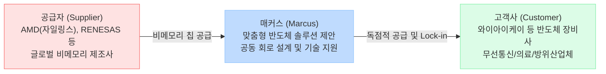

<!--
[컨텍스트 유지 지침]
작성 시 반드시 참고할 선행 파일:
- 1_Raw_Data/매커스(26.08.17).md
- 1_Raw_Data/반도체섹터(26.08.14).md.md

목표: 새로운 마스터 규칙(Hecto-style 템플릿)에 따라 팩트와 내러티브를 대조하고 다이어그램을 포함하여 Phase 1 보고서를 전면 재작성합니다.
-->
# 🔍 Phase 1: 기업 해독기 (심층 팩트체크 코어)
**분석 대상**: 매커스 (Marcus)
**기준 데이터**: 최근 공시 자료 및 반도체 섹터 딥리서치

---

## 1. 비즈니스 모델 및 돈 버는 구조

[공시 팩트] 매커스는 AMD(자일링스), RENESAS 등 글로벌 비메모리 반도체 전문 제조사로부터 비메모리 반도체(FPGA 등)를 수입하여, 국내 IT 기업(무선 통신, 의료, 방산 등)에 맞춤형으로 제안하고 기술 지원을 병행하는 '비메모리 반도체 솔루션' 유통사입니다. 단순 물류 유통이 아닌 제품 기획 단계부터 회로 설계까지 개입하는 고부가가치 비즈니스를 영위하고 있습니다.

### 🔗 밸류체인 다이어그램

## 2. 주요 사업별 매출 비중 추이 (연결 기준)

[공시 팩트] 전체 매출의 95% 이상이 지배회사(매커스 본체)의 반도체 상품 매출에서 발생하며, 스토리지 유통(자회사)이 일부 기여하고 있습니다. 지역별로는 매출의 97% 이상이 내수에 집중되어 있습니다.

| 구분 | 핵심 내용 (2025년 ~ 2026년 반기) | 비고 (과거 대비 트렌드) |
| :--- | :--- | :--- |
| **매커스 상품매출 (비메모리 반도체)** | 2025년 **2,187억 원** (96.25%) 2026년 반기 **1,163억 원** (95.31%) | AMD 등 반도체 상품 유통이 전사 외형을 견인하며 매년 우상향 지속 |
| **매커스시스템즈 (스토리지/서버 유통)** | 2025년 50억 원 (2.21%) 2026년 반기 42억 원 (3.45%) | Pure Storage 파트너사로서 부가적인 상품 매출 창출 |
| **내수 집중도** | 2025년 기준 **97.42%** | 수출(1~2%) 대비 철저한 내수 중심의 유통 비즈니스 모델 유지 |

## 3. 전사 영업이익률 및 FCF 추이

[공시 팩트] 매커스는 2021년 1,407억 원에서 2025년 2,272억 원으로 매출이 급성장했습니다. 생산설비(공장)가 없어 CAPEX 투자가 사실상 제로(0)에 가깝기 때문에, 창출된 영업이익의 대부분이 잉여현금흐름(FCF)으로 직결되는 완벽한 캐시카우 구조를 가졌습니다.

| 구분 | 핵심 내용 | 비고 (과거 대비 트렌드) |
| :--- | :--- | :--- |
| **매출 및 영업이익** | 2025년 매출 2,272억 / 영업이익 290억 2026년 반기 매출 1,164억 / 영업이익 221억 | 2026년 반기 기준 영업이익이 전년 동기 대비 +17.2% 고성장 중 |
| **영업이익률 (OPM)** | **2026년 반기 기준 19.00%** | 단순 유통업임에도 불구, '기술 지원' 해자 덕분에 2025년 12.8%에서 19%대로 수익성 퀀텀점프 |
| **잉여현금흐름 (FCF)** | 2024년 493억, 2025년 668억 수준 | 2025년 한시적 부동산(건설중인자산) 취득 제외 시, 이익 대부분이 FCF로 누적 |

## 4. 핵심 KPI 추이 및 분석

[시장 내러티브] 반도체 유통사는 삼성전자나 SK하이닉스 같은 칩 메이커에 비해 마진율이 3~5% 수준으로 극도로 낮고 재고 리스크에 시달리는 저부가가치 산업일 것이다.

[공시 팩트] 공시 분석 결과 이는 틀린 내러티브입니다. 매커스는 단순 물류 유통이 아닌 '기술 지원(Tech-Support)'을 결합하여 **OPM 19%**라는 놀라운 고마진을 달성하고 있습니다. 또한 재고자산 회전율은 2.1~2.5회 수준으로 안정적으로 관리되며(2024년 재고자산 비중 16.9%), 공장이 없어 가동률 리스크 자체가 존재하지 않는 무결점 무형자산 비즈니스에 가깝습니다.

## 5. 경영진 및 주주환원 이력

[공시 팩트] 2025년을 기점으로 국내 증시에서 보기 드문 **초강력 주주환원 정책**을 수립하고 한 치의 오차 없이 숫자로 증명(자사주 소각)하고 있습니다.

| 구분 | 핵심 내용 | 비고 |
| :--- | :--- | :--- |
| **자사주 영구 소각** | 2025년 7월 **200만 주**, 2026년 상반기 **226만 주** 이익소각 | 최근 1년간 총 426만 주 이상을 소각하며 유통주식수 대폭 감소 (주주가치 극대화) |
| **배당 성향 및 정책** | 2025~2027년 **당기순이익의 30% 이상 환원** 공시 | 2025년 연결 현금배당성향 **45.1%**(주당 1,200원) 달성하며 과거(6~9%) 대비 폭발적 상향 |
| **최대주주 지배력** | 각자 대표 및 특수관계인 지분율 **14.93%** | 대규모 자사주 소각으로 인해 총 발행주식수가 감소하며 최대주주의 지분율도 자동 상승 효과 |

## 6. 핵심 리스크 3가지

[공시 팩트] 안정적인 BM과 주주환원에도 불구하고, 전방 산업과 글로벌 벤더에 종속된 구조적 리스크가 존재합니다.

| 구분 | 핵심 내용 | 비고 |
| :--- | :--- | :--- |
| **공급처 의존도 리스크** | AMD(자일링스), RENESAS 등 특정 제조사 종속 | 글로벌 제조사와의 파트너십이 끊어지거나 제품 단가를 급격히 인상할 경우 생존(수익성)에 치명타 |
| **전방 IT 경기 변동성** | 국내 반도체 장비 및 IT 인프라 투자 사이클에 연동 | 고객사(장비사, 방산 등)의 CAPEX 투자가 둔화되면 매커스의 FPGA 주문량도 동반 하락 |
| **환율(USD) 변동 리스크** | 주요 칩셋 수입을 달러(USD) 등 기능통화로 결제 | 원/달러 환율 급등 시 매입 원가가 상승하고 외화평가손실이 발생하여 순이익률 훼손 우려 |

## 7. 딥리서치 팩트체크 요약

[시장 내러티브] 매커스는 단기적인 반도체 사이클에 편승하는 단순 팹리스 유통사이며, 코리아 디스카운트를 극복하기 어려울 것이다.

[공시 팩트] 매커스의 최근 재무제표와 자사주 소각 공시는 완전히 다른 진실을 말해줍니다. 글로벌 AI 가속기 시장을 양분하는 AMD의 FPGA를 국내에 독점적으로 기술-공급하는 완벽한 해자를 갖추고 OPM 19%를 달성 중입니다. 무엇보다 번 돈을 쌓아두지 않고 **"순이익의 30% 환원, 수백만 주 자사주 소각"**으로 즉각 실행에 옮기며 주주친화 가치주의 정석을 보여주고 있습니다. 이는 단순한 단기 테마가 아닌 구조적인 멀티플 리레이팅(밸류업)의 강력한 근거가 됩니다.
