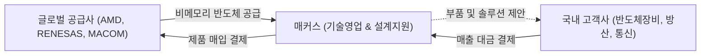

# 🔍 Phase 1: 기업 해독기 (심층 팩트체크 코어)

## 1. 비즈니스 모델 및 돈 버는 구조
[공시 팩트] 주식회사 매커스는 글로벌 비메모리 반도체 제조사(AMD/자일링스, 르네사스, 메이콤 등)로부터 FPGA 및 아날로그 반도체를 수입하여, 국내 IT 전자제품 및 반도체 장비 생산 기업에 맞춤형으로 기술영업을 수행하는 '비메모리 반도체 솔루션' 기업입니다. 특히, 단순 유통을 넘어 고객사의 제품 기획 단계부터 반도체 회로 설계 등 기술 지원을 제공하는 고객 밀착형 에셋라이트(Asset-light) 비즈니스를 영위합니다.

## 2. 주요 사업별 매출 비중 추이 (최근 5년 및 최신 분기)

| 구분 | 핵심 내용 | 비고 |
| :--- | :--- | :--- |
| **매커스 상품매출** | AMD, MACOM, RENESAS 등 반도체 상품 매출 비중이 절대적 (90~96% 수준). 2026년 반기 1,163억원(95.31%) 달성. | 주력 캐시카우 |
| **매커스시스템즈 상품매출** | 퓨어스토리지(Pure Storage) 등 서버/스토리지 유통 매출. 2024년 7.46%까지 상승 후 2026년 반기 3.45% 기록. | AI 데이터센터향 수요 연동 |
| **기타매출 및 영업수익** | 매커스인베스트먼트의 지분투자 등 기타 수익 0.5~1.3% 내외 발생. | 종속회사 수익 |

## 3. 전사 영업이익률 및 FCF 추이
[공시 팩트] 매커스는 자체 생산 설비가 없기 때문에 CAPEX가 매우 작으며(2025년 부동산 취득 제외), 유통 파트너사임에도 불구하고 고도의 기술 지원 역량을 바탕으로 평균 13~19%대의 매우 우수한 영업이익률(OPM)을 기록하고 있습니다. 영업활동현금흐름(OCF)이 곧장 잉여현금흐름(FCF)으로 직결되는 훌륭한 현금 창출력을 보여줍니다.

| 구분 | 핵심 내용 | 비고 |
| :--- | :--- | :--- |
| **영업이익률 (OPM)** | 2021년 18.49%에서 2025년 12.80%로 하락했으나, 2026년 반기 19.00%로 극적 반등. 기술 프리미엄 입증. | 고마진 유통 구조 |
| **자본적 지출 (CAPEX)** | 생산 공장이 없어 평시 CAPEX는 소액(수천만 원 수준)에 불과. (2025년 예외적 41억 지출) | 구조적 이점 |
| **잉여현금흐름 (FCF)** | 2023년 재고자산 확보 등으로 일시적 마이너스(-519억)를 기록했으나, 2024~2025년 대규모 흑자(493억, 668억)로 전환. | 강한 현금 회수력 |

## 4. 핵심 KPI 추이 및 분석
[시장 내러티브] AI 데이터센터 및 가속기(GPU/NPU) 시장의 폭발적 성장으로 인해 전공정 장비 투자와 광통신 인프라(1.6T 광모듈, CPO 등)가 대거 확장 중이며, 이는 FPGA 및 하이엔드 아날로그 칩 수요를 강력하게 견인하고 있습니다.
[공시 팩트] 당사는 공장이 없으므로 '재고자산 회전율'과 '내수 매출 비중'이 핵심 지표입니다. 최근 반도체 수급 불균형에도 불구하고 재고자산 회전율은 2.1~2.5회를 꾸준히 유지 중이며, 전체 매출의 약 98% 이상이 국내 반도체 장비 및 IT 고객사들(내수)로부터 발생하고 있어 국내 설비투자 사이클과 매우 밀접하게 연동됩니다.

## 5. 경영진 및 주주환원 이력
[공시 팩트] 신동철, 성종률 각자 대표이사 체제로, 대규모 자사주 소각에 따라 경영진 지분율이 11.00%에서 14.93%로 상승(2026년 반기말)했습니다. 특히 2025~2027년 별도 당기순이익의 30% 이상을 환원하겠다는 강력한 주주환원 정책을 발표하고, 2025~2026년에 걸쳐 426만 주 이상의 자사주 이익소각을 단행하는 등 주주가치 제고에 매우 적극적입니다.

| 구분 | 핵심 내용 | 비고 |
| :--- | :--- | :--- |
| **자사주 매입/소각** | 25~26년 총 4,261,255주 이익소각 단행. (약 114억원 이상 규모) | 유통주식수 대폭 감소 |
| **배당금 및 배당성향** | 2024년 주당 200원(9.4%)에서 2025년 주당 1,200원(45.1%)으로 배당액 6배 폭증. | 주주환원율 30% 목표 초과 달성 |

## 6. 핵심 리스크 3가지
[공시 팩트]

| 구분 | 핵심 내용 | 비고 |
| :--- | :--- | :--- |
| **특정 벤더 의존도** | AMD(자일링스) 등 주요 공급처의 정책 변화나 대리점 계약 해지 시 회사의 존립에 치명적인 타격이 발생할 수 있음. | 벤더 다변화 필요성 |
| **환율 변동성** | 제품 매입은 대부분 USD로 진행되므로, 급격한 환율 상승(원화 약세) 시 외화평가손익 악화 및 매입 원가 상승 부담이 발생. | 가격 전가력 점검 요망 |
| **IT 전방 산업 변동** | FPGA 및 비메모리 솔루션은 국내 반도체 전공정 장비사 및 IT 세트 업체의 설비 투자 사이클에 절대적인 영향을 받음. | 캡티브 고객사 CAPEX 연동 |

## 7. 딥리서치 팩트체크 요약
[시장 내러티브] AI 가속기 폼팩터 대면적화, 전공정 장비(WFE) 투자 반등, 데이터센터 광인프라 고도화(1.6T 플러거블), 고성능 전력반도체(SiC, GaN) 수요 폭발 등 전방위적인 AI 하드웨어 슈퍼사이클이 전개 중입니다.
[공시 팩트] 매커스는 자본적 지출(CAPEX)과 공정 개발 리스크를 전혀 부담하지 않으면서도, AI 데이터센터용 통신/연산 인프라 핵심인 AMD FPGA와 MACOM/Renesas 광학·전력 부품을 국내 밸류체인(반도체 장비, 통신 장비사)에 독점적으로 공급하는 **'에셋라이트(Asset-light) 톨게이트'** 비즈니스를 완성했습니다. AI 인프라 확장에 따른 트렌드는 매커스의 핵심 상품 수요와 직결되며, 이를 강력한 주주환원(소각/배당)으로 주주와 공유하는 완벽한 선순환 구조를 보여줍니다.
