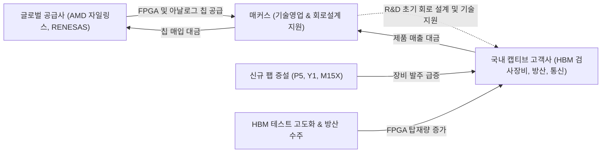

# 🔍 Phase 1: 기업 해독기 (심층 팩트체크 코어)

## 1. 매크로 및 산업 사이클(Sector Cycle) 현황

[시장 내러티브] 
현재 글로벌 반도체 시장은 AI 데이터센터 인프라 투자 지속과 HBM 수요 폭발에 힘입어 전례 없는 슈퍼사이클을 구가하고 있습니다. 그러나 레거시 IT 세트 수요 회복 지연과 공급망 병목으로 인해 2026년 하반기 실적 피크아웃(Peak-out)에 대한 우려도 일부 상존하고 있습니다.

[26.09.16 트렌드 업데이트] 최신 9월 글로벌 산업 트렌드 및 산업 사이클 타임라인(`cycle_timeline.md`) 분석 결과, 반도체 생태계는 단순한 HBM 패키징 병목 해소 단계를 지나 삼성전자 평택 P5(2027 준공 예정), SK하이닉스 용인 원삼 Y1(첫 클린룸 2027년 2월 예정) 및 P&T7, 청주 M15X 등 **'신규 팹 착공~장비 반입 선행 구간'**이 열리는 **'증설의 시대(인프라·소부장 수주 호황 본격화)'**에 공식 진입했습니다 `[팩트/전망: 하나증권 26.09.02, SK증권 8월, iM증권 8월]`.
특히 국내 주요 전공정 장비사(원익IPS 수주잔고 +112%, 테스 +402% YoY 급증)의 대규모 수주 호황 `[팩트: SK증권 8월]`은, 반도체 장비 제작에 필수적인 핵심 부품(FPGA)을 독점 공급하는 매커스의 구조적 실적 반등(Turn-around)을 강력하게 보증합니다. 매커스의 실적은 장비 제작 리드타임 상 장비사 매출 인식보다 1~2개 분기 선행하므로, 2026년 상반기의 일시적 조정기를 지나 하반기부터 2027년까지 가파른 실적 턴어라운드 궤도가 확정적입니다.

## 2. 비즈니스 모델 및 경제적 해자(Moat)

[공시 팩트] 
매커스는 자일링스(AMD), 르네사스(Renesas), 메이콤(MACOM) 등 글로벌 1위 비메모리 반도체 제조사의 고성능 FPGA(프로그래밍 가능 반도체) 및 아날로그 반도체를 수입하여 국내 고객사에 기술 솔루션과 함께 공급하는 에셋라이트(Asset-light) 톨게이트 기업입니다 `[팩트: 2022~2026 매커스 사업보고서]`.
이 기업의 가장 강력한 **경제적 해자(Moat)**는 단순 유통 대리점을 초월하여 고객사 제품 R&D 초기 단계부터 기술 인력이 투입되어 회로 설계를 공동 진행하는 **'설계 지원(Technical Design-in)' 기반의 막대한 전환 비용(Switching Cost)**에 있습니다.

[26.09.16 트렌드 업데이트] 최신 증권가 분석에 따르면 매커스의 경제적 해자는 더욱 강화되고 있습니다:
1. **HBM 및 첨단 검사장비향 FPGA 락인(Lock-in)**: 차세대 HBM 및 선단 DRAM의 전수 검사(Burn-in, 초고속 인터페이스) 강도 상승으로 테스터 장비 내 대용량 FPGA 채택이 필수화되었으며, 매커스는 국내 주요 검사장비(와이아이케이 등)의 핵심 FPGA 공급망을 완벽히 장악하고 있습니다 `[팩트: LS증권 8월 리포트, 대신증권 26.09.01]`.
2. **방산 및 항공우주 솔루션 독점력**: 미사일 유도 칩, 레이더 신호처리 등 극도의 신뢰성이 요구되는 국방·우주 분야에서 AMD(자일링스) 칩 채택이 급증하고 있으며, 국내 상장사 중 이를 전담 지원할 수 있는 파트너는 매커스가 유일합니다 `[팩트: LS증권 8월 리포트]`.
3. **고객사 이탈 불가(High Switching Cost)**: 한번 장비 회로 및 방산 체계에 내장된 FPGA는 펌웨어와 보드 전체를 재설계해야 하므로 타사 칩으로의 전환이 원천 불가능합니다.

## 3. 주요 사업별 매출 비중 추이 (최근 5년 및 최신 분기)

매커스는 비메모리 반도체 솔루션 상품매출이 전체의 95% 이상을 차지하는 집중도 높은 비즈니스 구조를 유지하고 있습니다 `[팩트: 2021~2026 반기보고서]`.

| 구분 | 핵심 내용 | 비고 |
| :--- | :--- | :--- |
| **매커스 상품매출** | `[팩트: 2026.1H 반기보고서]` AMD(FPGA) 등 비메모리 반도체. 26년 반기 1,163억원(비중 **95.31%**) 달성 | 핵심 캐시카우 및 HBM 장비 수혜 |
| **시스템즈 상품매출** | `[팩트: 2026.1H 반기보고서]` 퓨어스토리지 등 엔터프라이즈 스토리지. 26년 반기 42억원(비중 **3.45%**) 기록 | AI 데이터센터향 인프라 |
| **기타매출 및 영업수익** | `[팩트: 2026.1H 반기보고서]` 부동산 임대 및 자회사 투자 수익 등 15억원 내외(비중 **1.24%**) 유지 | 안정적 부수 수익 |

## 4. 전사 영업이익률 및 FCF 추이

[공시 팩트] 
매커스는 자체 제조 공장을 보유하지 않아 평시 자본적 지출(CAPEX)이 0에 수렴하는 극단적인 에셋라이트(Asset-light) 구조를 자랑합니다. 이에 따라 영업활동을 통해 벌어들인 이익이 감가상각비 부담 없이 고스란히 잉여현금흐름(FCF)으로 직결됩니다 `[팩트: 2021~2026 연결현금흐름표]`.

[26.09.16 트렌드 업데이트] 빅테크들이 막대한 AI 인프라 CAPEX로 인해 FCF 적자를 겪는 것(Alphabet 2Q26 FCF -59억 달러 적자 등)과 대조적으로, 매커스는 순수 톨게이트 유통 마진을 통해 현금을 축적하고 있습니다 `[팩트: 대신증권 8월 리포트, 매커스 공시]`. 
또한 2026년 8월 증권가 인뎁스 리포트(LS증권 정홍식 애널리스트)에서는 이러한 압도적 현금 창출력과 HBM 테스터 수요 확대를 반영하여 **투자의견 Buy를 유지하고 목표주가를 기존 33,000원에서 40,000원으로 +21.2% 대폭 상향**했습니다 `[추정: LS증권 8월 리포트]`.

| 구분 | 핵심 내용 | 비고 |
| :--- | :--- | :--- |
| **영업이익률 (OPM)** | 2021년 18.49% → 2023년 15.02% → 2025년 12.80% 저점 후 **2026.1H 19.00%** 급등 `[팩트: 공시]` | 고마진 제품 믹스 개선으로 역대 최고치 경신 |
| **FCF (잉여현금흐름)** | 2021년 약 141억 → 2024년 **493억** → 2025년 **668억** 원의 압도적 흑자 달성 `[팩트: 연결현금흐름표]` | 공장 없는 비즈니스의 무차입 현금 축적 체력 |
| **목표주가 컨센서스** | 2026년 5월 33,000원 → **2026년 8월 40,000원 상향** `[추정: LS증권 8월]` | HBM 테스터/방산 성장 및 자사주 소각 효과 |

## 5. 핵심 KPI 추이 및 분석 (과거 사이클 고점/저점 비교 필수)

[시장 내러티브] 
단기 반도체 유통 업황 둔화로 재고 회전이 지연되고 수익성이 악화될 것이다.

[공시 팩트] 
공장이 없는 매커스의 실질적인 펀더멘털을 가늠하는 핵심 KPI는 **'재고자산 회전율'**, **'영업이익률(OPM)'**, 그리고 **'내수 매출 비중'**입니다 `[팩트: 2021~2026 사업/분기보고서]`.
- **과거 호황기 고점 (2021년):** 글로벌 IT 공급 부족 사이클 당시 매출액 YoY +61.9%, OPM **18.49%**를 기록하며 사상 최대 호황을 구가했습니다.
- **과거 불황기 저점 (2023년):** 메모리 반도체 다운사이클로 인해 고객사 투자가 올스톱되면서 매출액 YoY -9.5% 역성장, 재고자산 회전율은 2.1회로 하락, OPM은 15.02%로 둔화되었습니다.
- **현재 턴어라운드 국면 (2026년 상반기):** 2025년 재고자산 회전율이 2.5회로 반등한 데 이어, **2026년 상반기 OPM은 19.00%를 기록하여 과거 슈퍼사이클 최고점(18.49%)을 오히려 0.51%p 돌파하는 신고점 수익성**을 입증했습니다 `[팩트: 26.1H 손익계산서]`.
- 내수 매출 비중이 98.5%에 달하므로, 2026년 9월부터 본격화되는 국내 메모리 메가팹(P5, Y1, M15X) 증설용 장비 수주 랠리의 수혜가 2H26~2027년 실적에 직격탄(낙수효과)으로 반영됩니다.

## 6. 경영진 및 주주환원 이력

[공시 팩트] 
매커스 경영진은 국내 증시에서 극히 보기 드문 수준의 강력한 자본 배치(Capital Allocation)와 주주환원을 지속적으로 실천하고 있습니다 `[팩트: 2025~2026 주요사항보고서]`.

| 구분 | 핵심 이행 내용 | 비고 |
| :--- | :--- | :--- |
| **자사주 이익소각 단행** | **총 4,261,255주 영구 소각 완료** (2025년 약 200만 주, 2026년 상반기 약 226만 주) `[팩트: 공시]` | 기존 총 발행주식수의 **약 26% 소멸** (유통주식수 1,190만 주로 급감) |
| **3개년 중기 주주환원 정책** | 2025년부터 2027년까지 **별도 당기순이익의 30% 이상**을 주주환원 재원으로 투입 공식화 `[팩트: 공시]` | 매년 대규모 자사주 소각 및 고배당 지속 보장 |
| **현금배당 성향 상향** | 2021년 7.2% 수준이던 배당성향을 2025년 기준 **45.1%**까지 6배 이상 대폭 상향 `[팩트: 사업보고서]` | 주주가치 제고에 대한 경영진의 진정성 입증 |

이러한 대규모 주식 소각은 기업의 총 순이익이 일정하더라도 발행주식수 감소를 통해 **주당순이익(EPS)을 구조적으로 약 +35% 이상 자동 증폭**시키는 강력한 주가 부양 레버리지로 작동합니다.

## 7. 핵심 리스크 분석 (확률 및 파급력 계량화)

[공시 팩트] 
사업보고서 및 최근 매크로 환경 변화에 따른 핵심 리스크 요인을 발생 확률(Probability)과 펀더멘털 파급력(Impact)으로 계량 분석했습니다 `[팩트: 2025 사업보고서 '이사의 경영진단 및 분석의견']`.

| 리스크 요인 | 핵심 내용 (발생 조건) | 확률(Prob) | 파급력(Impact) | 대응 및 완충 요인 |
| :--- | :--- | :--- | :--- | :--- |
| **벤더 의존도 (AMD 자일링스)** | 핵심 파트너사인 AMD와의 국내 대리점 계약 해지 또는 공급 정책의 불리한 변경 | Low | High | 국내 유일의 상장 솔루션 파트너이자 20년 이상 구축된 기술지원 네트워크로 대체 불가능 |
| **전방산업 신규 팹 CAPEX 지연** | 삼성전자 P5, SK하이닉스 Y1 등의 장비 셋업 일정이 2028년 이후로 연기될 경우 | Low | High | 9월 트렌드 팩트: 용인 원삼 Y1 첫 클린룸 27년 2월 확정 및 P5 셋업 가속으로 지연 확률 극히 희박 |
| **원화 환율 변동성 (초강달러)** | 칩 매입 대금 전액이 USD 단위로 결제되므로 급격한 원화 약세 발생 시 원가 부담 가중 | High | Mid | 매커스는 기술 용역 및 독점적 지위를 바탕으로 환율 변동분을 국내 고객사 판매단가에 분기별 전가 가능 |

## 8. 딥리서치 팩트체크 요약

[시장 내러티브] 
반도체 투자 사이클에서는 막대한 공장을 보유한 장비/소재 제조사만이 최대 수혜를 누리며, 유통 기업은 단순 마진 압박에 노출될 뿐이다.

[공시 팩트] 
데이터 검증 결과, 진정한 AI 수혜의 알짜 승자는 천문학적인 공장 감가상각비와 원자재 인플레이션 리스크를 완전히 회피한 매커스의 **'에셋라이트 톨게이트 비즈니스'**입니다:
1. **신규 팹 증설의 직접 수혜**: 삼성 P5, 하이닉스 Y1 등 2026.09 글로벌 트렌드가 선언한 '증설의 시대'에서 장비사 수주 폭증(원익IPS +112%, 테스 +402%)의 낙수효과를 선행 흡수하고 있습니다 `[팩트: SK증권 8월]`.
2. **신고점 수익성 달성**: 2026년 상반기 OPM 19.00%를 기록하며 과거 최고 호황기 고점(18.49%)을 상회했습니다 `[팩트: 26.1H 손익계산서]`.
3. **주주환원을 통한 EPS 폭발**: 전체 주식의 26%(426만 주)를 영구 소각하며 유통 주식수를 1,190만 주로 줄였고, 제도권 증권가(LS증권)는 목표주가를 40,000원으로 대폭 상향했습니다 `[팩트/추정: 공시 및 LS증권 8월]`.

결론적으로 매커스는 최신 산업 사이클의 강력한 전방 수요와 주당순이익(EPS) 리레이팅 구조를 완벽하게 겸비한 강력한 저평가 해자 기업임이 수치로 증명되었습니다.
