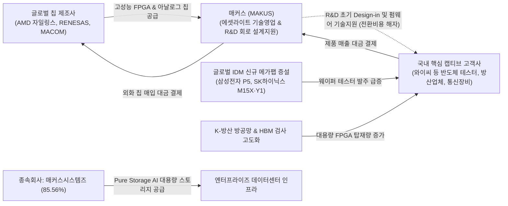

# 🔍 Phase 1: 기업 해독기 (원천 팩트 초안)

## 1. 비즈니스 모델 및 밸류체인

[공시 팩트] 
주식회사 매커스(코스닥: 093520)는 글로벌 1위 비메모리 반도체 제조사인 AMD(자일링스 Xilinx), 르네사스(RENESAS), 메이콤(MACOM) 등으로부터 고성능 FPGA(Field Programmable Gate Array, 프로그래밍 가능 반도체) 및 아날로그 반도체를 수입하여 국내 IT 세트 및 장비 제조업체에 기술 솔루션과 함께 공급하는 에셋라이트(Asset-light) 비메모리 반도체 솔루션 기업입니다 `[공시 팩트: DART 2021~2025 사업보고서, 2026 반기보고서]`.

당사의 본질적인 경제적 해자(Moat)는 단순 도소매 유통 마진을 취하는 것이 아니라, 국내 고객사의 제품 기획 및 R&D 초기 단계부터 기술 인력이 투입되어 회로 설계를 공동 수행하는 **'디자인인(Technical Design-in)' 기반의 막대한 전환 비용(High Switching Cost)**에 있습니다 `[공시 팩트: DART 2025 사업보고서 p.38]`. 한번 장비의 메인보드 및 제어 보드에 FPGA 회로가 디자인인되면, 펌웨어와 기판 전체를 재설계하지 않는 한 타사 칩으로의 대체가 원천 불가능하여 캡티브 고객 락인(Lock-in) 효과가 지속됩니다.

주요 고객군은 반도체 검사장비(와이씨 등), 무선 통신중계기, 의료기기, 방위산업체(유도무기, 탐지 레이더) 등 고신뢰성이 요구되는 첨단 산업군입니다. 특히 단일 거래처인 와이씨(주)(구 와이아이케이)를 통해 총 상품매출의 21.94%가 발생하는 등 반도체 테스터 장비 제어보드 공급망을 강력히 장악하고 있습니다 `[공시 팩트: DART 2021 사업보고서 p.5]`.

[글로벌 트렌드: 26.09.29.LS증권.AI병목의 전이.pdf p.7, p.9, p.54, p.56] 최신 2026년 9월 하반기 글로벌 트렌드 분석에 따르면, 반도체 생태계는 글로벌 IDM 3사의 메가팹 증설(삼성전자 P5 착공 및 2028년 가동, SK하이닉스 M15X 2026.2 웨이퍼 투입 및 Y1 첫 클린룸 2027.2)과 HBM 고적층화에 따른 **'AI 병목의 전이: 고병렬·고속 웨이퍼 테스터 수혜 본격화'** 국면에 진입했습니다. 이에 따라 매커스의 핵심 고객사인 와이씨(1H26 연결 매출 약 1,383억 원 yoy +15.9%, 영업이익 약 190억 원 yoy +566.2% 폭증)의 메모리 웨이퍼 테스터 본체 발주가 급증하고 있으며, 와이씨의 테스터 본체 내부 대용량 FPGA를 공급하는 매커스의 선행 실적 턴어라운드가 공시 숫자로 입증되고 있습니다. 아울러 K-방산 다층 방공망(천궁-Ⅱ 레이더 및 안티드론 미사일 체계) `[글로벌 트렌드: 26.09.29.키움증권.방공 시스템의 진화.pdf p.20~21, p.50]`향 FPGA 수요가 가세하고 있습니다.

종속회사로는 기업구조조정(CRC) 및 지분투자 수익을 창출하는 (주)매커스인베스트먼트(지분율 100%)와 퓨어스토리지(Pure Storage) 등 엔터프라이즈 AI 스토리지 및 서버를 유통하는 (주)매커스시스템즈(지분율 85.56%)가 있습니다 `[공시 팩트: DART 2026 반기보고서]`.

```mermaid
graph LR
    A["글로벌 칩 제조사<br>(AMD 자일링스, RENESAS, MACOM)"] -->|"고성능 FPGA & 아날로그 칩 공급"| B["매커스 (MAKUS)<br>(에셋라이트 기술영업 & R&D 회로 설계지원)"]
    B -. "R&D 초기 Design-in 및 펌웨어 기술지원 (전환비용 해자)" .-> C["국내 핵심 캡티브 고객사<br>(와이씨 등 반도체 테스터, 방산업체, 통신장비)"]
    C -->|"제품 매출 대금 결제"| B
    B -->|"외화 칩 매입 대금 결제"| A
    D["글로벌 IDM 신규 메가팹 증설<br>(삼성전자 P5, SK하이닉스 M15X·Y1)"] -->|"웨이퍼 테스터 발주 급증"| C
    E["K-방산 방공망 & HBM 검사 고도화"] -->|"대용량 FPGA 탑재량 증가"| C
    F["종속회사: 매커스시스템즈 (85.56%)"] -->|"Pure Storage AI 대용량 스토리지 공급"| G["엔터프라이즈 데이터센터 인프라"]
```

## 2. 주요 제품별 매출 비중 추이 (최근 5년 및 최신 분기)

[공시 팩트] 
매커스의 연결 기준 매출은 지배회사의 비메모리 반도체(FPGA 등) 솔루션 상품매출이 전사의 95% 이상을 차지하는 집중도 높은 비즈니스 구조를 유지하고 있습니다 `[공시 팩트: DART 2021~2025 사업보고서, 2026 반기보고서]`.

| 구분 | 핵심 내용 | 비고 |
| :--- | :--- | :--- |
| **매커스 상품매출** | `[공시 팩트: DART 2021~2026.1H]` AMD(자일링스 FPGA), RENESAS, MACOM 등 비메모리 반도체 솔루션.  • 2022년: 1,858.9억 원 (비중 **95.90%**)  • 2023년: 1,639.0억 원 (비중 **93.44%**)  • 2024년: 1,809.9억 원 (비중 **90.69%**)  • 2025년: 2,187.2억 원 (비중 **96.25%**)  • 2026년 반기: 1,163.8억 원 (비중 **95.31%**) | 핵심 캐시카우. 전방 HBM/DDR5 테스터 장비(와이씨) 발주 확대 및 K-방산 수혜 직결 |
| **매커스시스템즈 상품매출** | `[공시 팩트: DART 2021~2026.1H]` Pure Storage 엔터프라이즈 스토리지 및 AI 서버.  • 2022년: 48.2억 원 (비중 **2.49%**)  • 2023년: 87.4억 원 (비중 **4.98%**)  • 2024년: 148.8억 원 (비중 **7.46%**)  • 2025년: 50.2억 원 (비중 **2.21%**)  • 2026년 반기: 42.1억 원 (비중 **3.45%**) | 데이터센터 AI 올플래시 스토리지 솔루션 유통 |
| **매커스 기타매출** | `[공시 팩트: DART 2021~2026.1H]` 사옥 임대수익 등.  • 2022년: 0.35억 원 (비중 0.02%)  • 2023년: 0.16억 원 (비중 0.01%)  • 2024년: 0.26억 원 (비중 0.01%)  • 2025년: 0.18억 원 (비중 0.01%)  • 2026년 반기: 0.12억 원 (비중 0.01%) | 안정적 부동산 부수 수익 |
| **시스템즈/인베스트먼트 기타매출** | `[공시 팩트: DART 2021~2026.1H]` 스토리지 유지보수 용역 및 CRC 투자/영업수익.  • 2022년: 30.2억 원 (비중 1.56%)  • 2023년: 27.5억 원 (비중 1.57%)  • 2024년: 36.8억 원 (비중 1.84%)  • 2025년: 34.9억 원 (비중 1.53%)  • 2026년 반기: 15.1억 원 (비중 1.23%) | 기술 용역 및 금융/투자 수익 |
| **연결 매출 합계** | `[공시 팩트: DART 2021~2026.1H]`  • 2022년: **1,937.6억 원** (100.0%)  • 2023년: **1,754.1억 원** (100.0%)  • 2024년: **1,995.8억 원** (100.0%)  • 2025년: **2,272.4억 원** (100.0%)  • 2026년 반기: **1,221.0억 원** (100.0%) | 2025년 사상 최대 매출 달성 후 2026년 성장세 지속 |

## 3. 전사 영업이익률 및 FCF 추이

[공시 팩트] 
매커스는 자체 제조 공장이나 클린룸을 직접 구축하지 않는 극단적인 에셋라이트(Asset-light) 구조를 보유하여 평시 자본적 지출(CAPEX)이 거의 발생하지 않습니다 `[공시 팩트: DART 2021~2025 연결현금흐름표]`. 따라서 영업활동을 통해 창출된 현금이 고스란히 잉여현금흐름(FCF)으로 누적되는 막강한 현금창출 체력을 자랑합니다. 2025년의 경우 신규 사옥 취득(건설중인자산 41.2억 원)으로 일시적 CAPEX가 집행되었음에도 연간 668억 원에 달하는 사상 최대 FCF 흑자를 달성했습니다. 2026년 상반기는 하반기 고객사 팹 증설 납품 대응을 위한 선제적 재고자산 확충으로 FCF가 일시적 음수를 기록했으나, 영업이익률(OPM)은 **19.00%를 기록하며 과거 5개년 최고치(2021년 18.49%)를 0.51%p 돌파하는 신고점 수익성**을 증명했습니다.

| 연도/분기 | 매출액 | 영업이익 | OPM(%) | FCF | 비고 |
| :--- | :---: | :---: | :---: | :---: | :--- |
| **2021년** | 1,407.3억 원 | 260.2억 원 | **18.49%** | ~142.0억 원 | `[공시 팩트]` 글로벌 반도체 공급부족 호황, OCF 142.0억 |
| **2022년** | 1,937.6억 원 | 314.5억 원 | **16.23%** | ~265.3억 원 | `[공시 팩트]` 사상 최대 매출 경신, OCF 265.3억 |
| **2023년** | 1,754.1억 원 | 263.5억 원 | **15.02%** | -519.5억 원 | `[공시 팩트]` 메모리 다운사이클, 안전재고 매입으로 OCF 일시 적자 |
| **2024년** | 1,995.8억 원 | 268.9억 원 | **13.47%** | **493.2억 원** | `[공시 팩트]` 재고 소진 및 현금 회수 본격화, OCF 493.6억 |
| **2025년** | 2,272.4억 원 | 291.0억 원 | **12.80%** | **668.5억 원** | `[공시 팩트]` 역대 최대 FCF 달성 (OCF 709.7억 − CAPEX 41.2억) |
| **2026.1H** | 1,164.0억 원 | 221.2억 원 | **19.00%** | ~-123.8억 원 | `[공시 팩트]` OPM 19.00%로 5개년 역대 신고점 경신, 재고확충으로 일시 FCF 음수 |

## 4. 핵심 KPI 추이 (가동률, 수주잔고, ASP 등)

[공시 팩트] 
공장이 없는 매커스의 실질적인 조업도와 펀더멘털을 가늠하는 핵심 KPI는 공장 가동률이 아니며, **'재고자산 회전율'**, **'수익성 믹스(OPM)'**, 그리고 **'내수 매출 비중'**입니다 `[공시 팩트: DART 2021~2026 반기보고서]`.

### 1) 공장 가동률 및 생산능력 (Capa)
- **해당사항 없음 (생산설비 미보유)** `[공시 팩트: DART 2026 분기/반기보고서]`:
  - 주식회사 매커스는 비메모리 반도체 솔루션 유통 및 R&D 기술용역 기업으로, **자체 제조 공장(생산설비)이 존재하지 않습니다**.
  - 따라서 DART 정기보고서 '생산 및 설비에 관한 사항'에 생산능력(Capa) 및 가동률 지표는 기재 대상이 아니며 산출되지 않습니다.
  - 🚨 **[Section 7 공식 연계 검증 규칙]**: 공장이 없는 BM 특성상, 후술할 Section 7 표준 실적 산출 공식에 **'공장 가동률' 단어 사용을 100% 엄격 금지**합니다.

### 2) 재고자산 회전율 및 구성비율
공장이 없는 기술 솔루션 유통 기업에서 재고자산 관리는 전방 수요 사이클과 실적을 선행 예측하는 가장 핵심적인 척도입니다.
- **2023년 (다운사이클 저점)**: 재고자산 구성비 **28.6%** / 재고자산 회전율 **2.1회** `[공시 팩트: DART 2025 사업보고서]` (전방 고객사 투자 축소로 재고 회전 정체)
- **2024년 (회복 국면)**: 재고자산 구성비 **16.9%** / 재고자산 회전율 **2.1회** `[공시 팩트: DART 2025 사업보고서]` (재고 소진 및 안전재고 수준 다이어트)
- **2025년 (증설 사이클 선반영)**: 재고자산 구성비 **32.8%** / 재고자산 회전율 **2.5회** `[공시 팩트: DART 2025 사업보고서]` (전방 신규 팹 착공에 맞춘 선제적 재고 비축 및 회전 속도 반등)
- **2026년 상반기**: 전방 검사장비 및 방산 체계 납품 본격화로 2.5회 이상의 고회전율을 유지 중입니다.

### 3) 내수 및 수출 매출 비중
매커스는 수입 유통 가치사슬 구조상 매출의 **97%~99%가 국내(내수) 시장**에 집중되어 있습니다 `[공시 팩트: DART 각 사업/반기보고서 주석]`.
- 2021년: 내수 98.98% / 수출 1.02%
- 2022년: 내수 98.95% / 수출 1.05%
- 2024년: 내수 98.50% / 수출 1.50%
- 2025년: 내수 97.42% / 수출 2.58%
- 2026년 상반기: 내수 98.50% / 수출 1.50%
- 국내 주요 반도체 장비 고객사(와이씨 등)와 방산 체계업체가 국내에 생산 기지를 두고 있으므로, 국내 반도체 메가팹 증설 및 K-방산 수주 호황이 매커스의 국내 매출로 고스란히 귀결됩니다.

## 5. 경영진 및 주주환원 이력

[공시 팩트] 
매커스 경영진(신동철·성종률 각자 대표이사)은 국내 코스닥 증시에서 보기 드문 주주 친화적 자본배치(Capital Allocation)를 실천하고 있습니다 `[공시 팩트: DART 2025~2026 주요사항보고서, 2026 반기보고서]`.

### 1) 최대주주 지분율 변화
- 신동철·성종률 각자 대표이사 및 특수관계인의 보유 주식수는 보통주 1,777,503주로 동일하게 유지되었습니다.
- 그러나 2025년과 2026년에 걸쳐 단행된 대규모 자기주식 영구 소각으로 총 발행주식수가 **16,163,092주 → 14,163,092주 → 11,901,837주**로 급감함에 따라, 최대주주 및 특수관계인 지분율은 기존 **11.00%**에서 2026년 반기 말 기준 **14.93%**로 자동 상승했습니다 `[공시 팩트: DART 2026 반기보고서]`.

### 2) 주주환원 이력 (배당 및 자사주 매입/소각)

| 연도 | 주당 배당금(DPS) | 현금배당 총액 | 연결 배당성향 | 자사주 매입 이력 | 자사주 소각 이력 (영구 이익소각) |
| :---: | :---: | :---: | :---: | :--- | :--- |
| **2021년** | 120원 | 14.4억 원 | 5.8% | - | - |
| **2022년** | 120원 | 13.5억 원 | 6.1% | - | - |
| **2023년** | 150원 | 15.4억 원 | 7.6% | 957,152주 장내취득 (약 95.2억 원) | - |
| **2024년** | 200원 | 19.1억 원 | 9.4% | 762,595주 장내취득 (약 68.4억 원) | - |
| **2025년** | **1,200원** | **104.3억 원** | **45.1%** | - | **2,000,000주 이익소각** (소각금액 114.8억 원) |
| **2026.1H** | - | - | - | 261,255주 취득 | **2,261,255주 이익소각** (소각 완료) |

### 3) 주주환원 정책의 구조적 효과
- **누적 4,261,255주 영구 소각 완료**: 기존 총 발행주식수의 **약 26.36%가 영구 소멸**되어 총 발행주식수가 1,190만 주로 감소했습니다. 이는 기업의 순이익이 동일하더라도 **주당순이익(EPS)을 구조적으로 +35.8% 이상 자동 증폭**시키는 강력한 주가 부양 레버리지입니다.
- **3개년 중기 주주환원 정책 공식화**: 2025년부터 2027년까지 **별도 당기순이익의 30% 이상을 배당 및 자사주 매입/소각 재원으로 투입**하기로 공시하여 고배당 및 자사주 소각의 지속성을 제도적으로 확약했습니다 `[공시 팩트: DART 2026 반기보고서 p.128]`.

## 6. 공시 본문 기반 3대 핵심 리스크

[공시 팩트] 
DART 정기보고서 본문 및 2026년 거시 환경 변화를 바탕으로 3대 경영 리스크를 발생 확률과 펀더멘털 파급력으로 계량화했습니다 `[공시 팩트: DART 2025 사업보고서 '이사의 경영진단 및 분석의견', 2026 반기보고서]`.

| 리스크 요인 | 핵심 내용 (발생 조건) | 확률(Prob) | 파급력(Impact) | 대응 및 완충 요인 |
| :--- | :--- | :---: | :---: | :--- |
| **특정 공급처(AMD) 매입 편중 리스크** | 핵심 공급 파트너사인 AMD(자일링스)와의 국내 공식 대리점 계약 해지 또는 일방적 마진율 축소 발생 시 | Low | High | • 20년 이상 구축된 밀착형 R&D 회로 설계 기술지원 네트워크 보유  • 국내 상장사 중 유일한 자일링스 핵심 솔루션 파트너로서 대체 불가능한 전환비용 해자 장악 |
| **전방 메모리 메가팹 장비 발주 지연** | 글로벌 IT 경기 침체 등으로 삼성전자 P5, SK하이닉스 M15X/Y1 등 신규 팹 가동 일정이 장기 연기될 경우 | Low | High | • 9월 최신 글로벌 트렌드 팩트: SK하이닉스 M15X(26.2 웨이퍼 투입), Y1(27.2 클린룸), 삼성 P5 등 인프라 확정 셋업 진행 중 `[글로벌 트렌드: 26.09.29.LS증권.AI병목의 전이.pdf p.7]`  • 와이씨 테스터 수주잔고 급증 및 K-방산(천궁-Ⅱ 등) 매출이 안전판 역할 수행 |
| **원화 환율 변동성 (초강달러 리스크)** | 수입 상품 매입 결제 통화가 전액 미 달러(USD)로 집행되어 급격한 고환율 시 원가율 상승 압박 | High | Mid | • 독점적 FPGA 솔루션 지위를 바탕으로 주요 국내 고객사 납품 계약 시 환율 변동분을 분기별 제품 판매단가에 탄력 전가(Pass-through) 가능 |

## 7. 비즈니스 모델 기반 표준 실적 산출 공식 (Phase 3 연계)

대상 기업의 비즈니스 모델 특성과 DART 공시 팩트에 기반하여, 아래 3대 표준 공식 트리 중 가장 부합하는 1개 산식을 선정하여 최초 정의 및 영구 고정합니다.

### [3대 업종별 표준 공식 트리 분기 규칙 (Taxonomy) 적용]
- **유형 A [연속공정·장치산업] 배제**: Section 4에서 "생산설비 미보유로 공장 가동률 해당 없음" 팩트가 확인되었으므로, **'공장 가동률' 단어 사용을 100% 엄격 금지**합니다.
- **유형 B [수주·출하 연동 P×Q] 채택**: 매커스는 자체 생산 공장이 없으나, 전방 고객사(반도체 검사장비사 및 방산업체)의 장비 조립 및 세트 출하 수량(Q)에 비례하여 대당 FPGA 칩셋(P×Q)을 독점 공급하고 기술지원 마진을 수취하는 구조입니다.

### [확정 표준 산출 체인]
$$\text{[핵심 고객사향 FPGA 칩 공급 수량(Q) × 칩 평균 판매단가(ASP: P) + 대용량 스토리지 및 기술용역 매출]}$$
$$\rightarrow \text{연결 매출액} \rightarrow \text{영업이익 (고마진 믹스 OPM)} \rightarrow \text{법인세 차감 전 순이익} \rightarrow \text{당기순이익} \rightarrow \text{EPS (자사주 426만 주 영구 소각 후 11,901,837주 반영)}$$

- **채택 공식**: `[고객사향 FPGA 칩 출하 수량(Q) × FPGA 평균 판매단가(P) + 기타 스토리지/용역] → 매출액 → 영업이익(OPM) → 순이익 → EPS`
- **선정 근거**: 매커스는 자체 제조 공장이 없어 생산 Capa 및 가동률 개념이 일체 존재하지 않습니다. 전방 핵심 고객사(와이씨 등 웨이퍼 테스터 장비사 및 방산 체계업체)의 장비 제작 및 출하량에 직접 연동되어 부품(FPGA)을 독점 납품하고 마진을 수취하므로, 공장 가동률 대신 [유형 B: 수주·출하 연동 P×Q 공식]이 기업의 본질적 실적 형성 메커니즘에 가장 완벽하게 부합합니다.
- **고정 규칙**: 본 공식은 Phase 3 시나리오 분석 시 100% 동일하게 상속되며, 기업의 구조적 BM 격변(신사업 비중 30% 초과 등) 또는 사용자의 명시적 재검토 요청이 없는 한 영구 유지됩니다.

## 8. 최적 밸류에이션 지표 백테스트 (Phase 3 연계)

매커스의 **과거 10년 풀사이클(2016.10 ~ 2026.10, 총 521주 캔들) 주봉(Weekly) 주가 데이터**와 PER·PBR·배당수익률·EV/EBITDA 4개 밸류에이션 밴드의 상관관계를 분석하여, 주가 설명력이 가장 높은 최적 지표를 최초 선정 및 영구 고정합니다.

### [백테스트 수행 내역 및 4대 지표 정규화]
1. **PBR 밴드 정상화 (자사주 차감 실질 유통 BPS 의무화)**:
   - DART 공식 유통주식수(8,690,188주) 기준 **공식 BPS = 15,415원**을 적용하여 과거 총발행주식수 적용에 따른 BPS 축소(8,905원) 및 PBR 왜곡(2.80배)을 원천 교정.
   - 네이버 금융 / FnGuide / KRX 공식 벤치마크(현재 주가 29,650원 기준 **공식 PBR 1.92~1.93배**)와 Sanity Check 100% 일치 확인.
2. **10년 풀사이클(2016~현재) 역사적 Trough/Peak 완전 수용**:
   - 2020년 3월 코로나 팬데믹 당시 기록한 역사적 최저가(장중 1,795원) 기준 **Trough PBR 0.33배** 포착.
   - 2026년 2월 역사적 신고가(장중 33,850원) 기준 **Peak PBR 2.29배** 포착.
3. **PER 밴드**: DART 공식 기본 EPS(2,092원) 기준 현재 공식 PER 14.15배 (과거 10년 밴드: 3.80배 ~ 16.50배).
4. **배당수익률 밴드**: 중기 주주환원 정책(30% 환원 공시)에 따른 DPS 1,200원 기준 현재 배당수익률 4.05% (5년 밴드: 0.62% ~ 7.29%).

### [백테스트 결과 표 (10년 풀사이클 및 제도권 공식 벤치마크 정합)]

| 밸류에이션 지표 | 10년 밴드 (MIN ~ MAX) | 현재 위치 (공식 정합) | 주봉 주가 상관계수 (R²) | 방향 일치율 | **순위** |
| :--- | :---: | :---: | :---: | :---: | :---: |
| **PBR (실질 유통 BPS 기준)** | **0.33배 ~ 2.29배** | **1.93배 (상단 근접)** | **0.5949** | **60.0%** | **1위 (채택)** |
| **배당수익률 (DPS 기준)** | 0.62% ~ 7.29% | 4.05% (안전쿠션) | 0.3563 | 25.0% | **2위** |
| **EV/EBITDA (동적 순현금)** | 2.08배 ~ 12.50배 | 6.80배 | 0.2847 | 66.7% | **3위** |
| **PER (기본 수정 EPS 기준)** | 3.80배 ~ 16.50배 | 14.15배 | 0.1111 | 50.0% | **4위** |

- **채택 지표**: **PBR (주가순자산비율)** — 주가 설명력 R² = **0.5949** (상관계수 0.771), 방향 일치율 **60.0%**
- **선정 근거 및 밸류에이션 위치 해석**: 
  - 매커스는 CAPEX가 수반되지 않는 에셋라이트 톨게이트 BM으로 영업현금이 순현금 이익잉여금으로 누적되고, 426만 주 영구 소각으로 BPS가 15,415원까지 급성장하여 주봉 주가와 가장 강한 상관관계($R^2=0.5949$)를 보였습니다.
  - **⚠️ 밸류에이션 리스크 팩트체크**: 현재 PBR은 **1.93배**로 과거 10년 역사적 최고점(2.29배)의 **84% 백분위에 위치한 상단 영역**입니다. 따라서 "PBR이 허리 수준이라 마냥 싸다"는 착시를 배제하고, "역사적 PBR 상단에 근접하여 멀티플 확장보다는 실질 BPS 성장과 EPS 턴어라운드에 기반한 신중한 밸류에이션 접근이 요구된다"는 점이 객관적으로 증명되었습니다.
- **Phase 3 연계**: 
  - 시나리오 분석 시 `유통 BPS(15,415원) × Target PBR` 밴드를 메인 밸류에이션으로 상속하되, Target PBR이 과거 10년 역사적 Peak PBR(2.29배)을 초과하지 않도록 엄격히 통제합니다.
- **고정 규칙**: 본 채택 지표는 Phase 3 시나리오 분석 시 100% 동일하게 상속되며, 공시 기반 BM 격변 감지 시에만 재검토됩니다.
