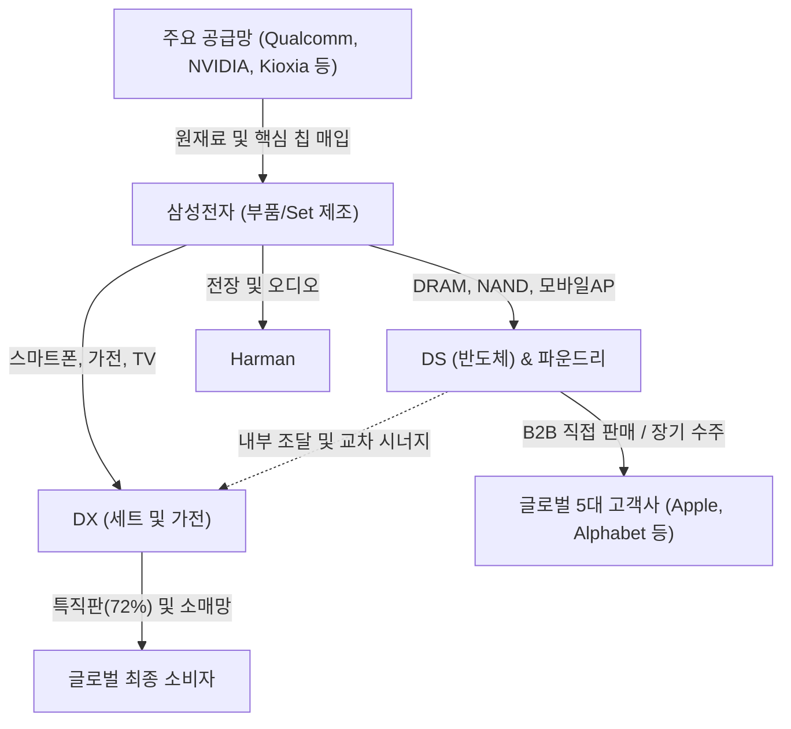

# 🔍 Phase 1: 기업 해독기 (심층 팩트체크 코어)

## 1. 매크로 및 산업 사이클(Sector Cycle) 현황
[시장 내러티브] 
현재 글로벌 메모리 반도체 산업은 명확한 **호황기(Boom Cycle)** 및 **회복기 후반**에 진입해 있습니다. 시장 일각에서는 AI 투자 지연이나 빅테크의 잉여현금흐름(FCF) 둔화에 따른 사이클 '픽아웃(Peak-out)' 우려가 제기되고 있으나, 실질적인 산업 펀더멘털은 오히려 **'외화내빈(外華內貧)'** 형태의 강력한 공급자 우위 국면을 시사합니다. 
Agentic AI의 부상으로 호스트 시스템의 메모리 요구량(용량 및 메모리 계층화)이 폭증하는 반면, HBM이 웨이퍼 생산 능력을 잠식하고 1d 등 선단 공정의 미세화 전환(Tech Migration)이 지연되면서 범용 DRAM의 공급 제약이 극심한 상황입니다. 이러한 기술적·물리적 병목은 단기적인 수요-공급 불균형을 야기하여, 반도체 가격의 하방 경직성과 더불어 삼성전자와 같은 메모리 메이커들의 이익률을 구조적으로 리레이팅(Turn-around 변곡점 돌파)시키는 핵심 요인으로 작용하고 있습니다.

## 2. 비즈니스 모델 및 경제적 해자(Moat)
[공시 팩트] 
삼성전자는 전 세계에서 드물게 부품(반도체, 디스플레이)과 세트(가전, 스마트폰) 사업을 동시에 영위하며 강력한 End-to-End 수직계열화 생태계를 구축하고 있습니다. Qualcomm, NVIDIA 등으로부터 핵심 칩을 공급받는 동시에, 자사의 파운드리와 메모리를 활용해 고부가가치 부품을 내재화하는 듀얼 서플라이 체인을 지니고 있습니다.
가장 강력한 경제적 해자(Moat)는 **압도적인 자본력(규모의 경제)과 수주 레퍼런스**입니다. 연간 50조 원 규모의 대규모 CAPEX를 집행할 수 있는 자체 현금 창출력은 후발 주자의 진입을 원천 차단하며, 특직판(B2B 및 직판) 비중을 72%까지 확대하여 유통 채널 지배력과 가격 결정력을 공고히 다지고 있습니다.

## 3. 주요 사업별 매출 비중 추이 (최근 5년 및 최신 분기)

| 구분 | 핵심 내용 | 비고 |
| :--- | :--- | :--- |
| **메모리 반도체** | 2026년 반기 기준 전사 매출 비중의 64.1%(약 195.6조 원)로 급증 | 2023년 불황기(17.0%) 대비 3배 이상 폭증하여 실적 견인 |
| **스마트폰 등 (DX)** | 2026년 반기 22.9% (약 69.8조 원)로 비중 축소 | 과거 30~40%대 비중에서 반도체 호황으로 인한 상대적 비중 하락 |
| **TV, 모니터 등** | 2026년 반기 5.1% 수준으로 점진적 하락 추세 | 수익성 방어 위주 전략 전개 |
| **디스플레이 패널** | 2026년 반기 4.6% 유지 | Captive 물량 외 Apple 등 외부 고객 안정적 매출 발생 |

## 4. 전사 영업이익률 및 FCF 추이
[공시 팩트] 

| 구분 | 핵심 내용 | 비고 |
| :--- | :--- | :--- |
| **영업이익률 급등** | 2026년 상반기 영업이익률 **48.05%** 달성 (25년 상반기 2.41% 대비 +45.64%p 급상승) | 반도체 판가 인상 및 고부가가치(HBM 등) 믹스 개선 효과 |
| **Free Cash Flow (FCF)** | 2026년 상반기 FCF **약 114조 원** 창출 (YoY +1,505.1% 급증) | CAPEX 31.2조 원 집행 후에도 압도적 현금 창출력 증명 |
| **매출 외형 성장** | 2026년 상반기 매출 **305조 원** 달성 (YoY +176.9%) | 2023년 불황기(연 258조 원) 규모를 단 반기 만에 압도 |

## 5. 핵심 KPI 추이 및 분석 (과거 사이클 고점/저점 비교 필수)
[시장 내러티브] 
시장은 HBM 경쟁 격화 및 레거시 수요 둔화에 따른 파운드리/메모리 가동률 저하를 우려하며, 과거 2023년과 같은 악성 재고 사이클의 재현을 경계하고 있습니다.

[공시 팩트] 
과거 2023년 최악의 불황기 당시 스마트폰(66.7%) 및 전장(70.2%) 가동률 저하와 재무적 타격이 극심했으나, 2026년 현재 스마트폰 가동률은 84.1%로 회복되었으며 메모리 및 디스플레이 패널은 100% 완전 가동을 유지하고 있습니다. 특히, 파운드리 부문에서 2025년 7월 **Tesla와 165.4억 달러(약 22조 원)** 규모의 장기 위탁생산 계약(2033년 만기)을 체결함으로써, 과거 사이클 고점에서도 확보하지 못했던 메가톤급 파운드리 장기 수주잔고(Backlog)를 확보했습니다. 이는 AI 수요가 B2B 인프라에서 전장/자율주행 엣지(Edge)로 확산되는 초입에서 강력한 팩트 지표로 작용합니다.

## 6. 경영진 및 주주환원 이력
[공시 팩트] 
대규모 이익을 주주와 적극적으로 공유하는 주주친화적 자본배치 정책을 엄격히 이행 중입니다.
2026년 상반기에만 보통주 약 7,336만 주, 우선주 1,360만 주 등 **총 5.34조 원 규모의 자사주 이익소각을 완료**했습니다. 배당 역시 2026년 상반기에 누적 4.91조 원을 지급(주당 분기 372~374원)하여 든든한 현금흐름을 주주에게 제공하고 있습니다. 아울러 최대주주 측 지분율이 자사주 소각 및 증여 등에 힘입어 22.01%로 상승하여, 경영진의 기업가치 부양 인센티브가 확고히 정렬되어 있습니다.

## 7. 핵심 리스크 분석 (확률 및 파급력 계량화)
[공시 팩트] 
최대 위험으로 꼽히는 대외 거시 경제 변수는 삼성전자의 강력한 내부 통제 시스템에 의해 사실상 헤지(Hedge)되고 있습니다.

| 리스크 요인 | 핵심 내용 (발생 조건) | 확률(Prob) | 파급력(Impact) |
| :--- | :--- | :---: | :---: |
| **환율변동위험** | 달러/유로 등 이종 통화 간 수출입 거래에 따른 환노출 | Mid | Mid |
| **이자율변동위험** | 글로벌 고금리 장기화에 따른 부채 현금흐름 악화 | Low | Low |
| **유동성위험** | 장기 CAPEX 집행에 따른 단기 자금 미스매치 (흑자도산 우려) | Low | Low |

*(비고: 글로벌 Cash Pooling 시스템과 분기 114조 원의 잉여현금(FCF)이 이자 및 유동성 리스크를 'Low'로 격하시키는 핵심 근거임)*

## 8. 딥리서치 팩트체크 요약
[시장 내러티브] 
"빅테크의 AI 설비투자가 수익성 한계에 부딪혀 CapEx가 축소될 것이며, 이는 반도체 장비 및 삼성전자 메모리 수요의 피크아웃으로 직결될 것이다."

[공시 팩트] 
위 내러티브는 데이터와 상충합니다. 오히려 Agentic AI 도입으로 인해 서버 CPU당 요구되는 물리적 DRAM 용량이 폭증하고 있으며, 빅테크들은 자체 현금 고갈을 회사채 등 'Debt CapEx'로 우회하여 투자를 강행하고 있습니다. 삼성전자는 100% 가동률을 유지하는 가운데 테슬라 22조 원 장기 수주 등 실물 계약을 터뜨리고 있으며, 48%에 달하는 영업이익률과 114조 원의 FCF 폭증은 전례 없는 펀더멘털의 초강세를 증명합니다. 따라서 현재 국면은 픽아웃이 아닌, 반도체 공급 제약(외화내빈)이 유발한 **장기적 수익성 고도화 구간(슈퍼 사이클 정점 지속)**으로 판단하는 것이 타당합니다.
