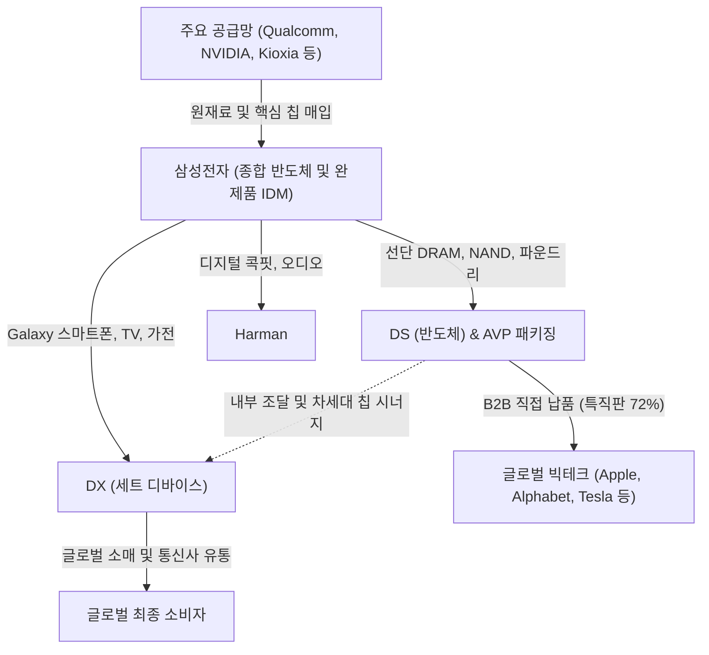

# 🔍 Phase 1: 기업 해독기 (심층 팩트체크 코어)

## 1. 매크로 및 산업 사이클(Sector Cycle) 현황
[시장 내러티브] 
현재 글로벌 메모리 반도체 산업은 과거의 단순한 업황 회복기를 넘어 **'증설의 시대(신규 팹 착공~장비 반입 선행 국면)'**이자 구조적 호황기(Super Boom Cycle) 한가운데에 위치해 있습니다 `[팩트: cycle_timeline.md 9월]`. 시장 일각에서는 글로벌 지정학적 긴장(이란 사태 등)과 고금리 장기화(H4L), 그리고 최근 20영업일간 역외 ETF(EWY·FLKR·DRAM)에서 발생한 -0.52조 원 규모의 순유출 `[팩트: SK증권 26.09 리포트]`을 근거로 반도체 사이클 '피크아웃(Peak-out)' 우려를 다시 제기하고 있습니다.

[공시 팩트] 
그러나 실물 수급과 펀더멘털 데이터는 명백한 **'외화내빈(外華內貧)'**의 강력한 공급자 우위를 입증하고 있습니다. 1d 미세공정 전환 난항과 HBM의 웨이퍼 캐파 잠식(비중 31~35% 도달) `[팩트: SK증권 8월]`으로 인해 전 세계 범용 DRAM 공급 부족이 심화되는 가운데, Agentic AI의 급속한 확산으로 서버 랙당 메모리 탑재 용량(Capacity) 요구치는 기하급수적으로 폭증하고 있습니다 `[팩트: LS증권 8월]`. 

[26.09.16 트렌드 업데이트] 특히 2026년 9월 들어 증권가에서 규명된 핵심 메커니즘은 **'가격 채널과 자금(플로우) 채널의 분리'**입니다 `[팩트: SK증권 26.09 리포트]`. 최근의 국내 주가 조정 및 시초가 갭 변동은 달러 스테이블코인으로 결제되는 해외 야간 무기한선물과 역외 ETF의 단기 유동성 이탈(유량 기준 -0.52조 원)이 만든 파생적 노이즈일 뿐, 31.2조 원에 달하는 실물복제 잔고와 삼성전자의 압도적 실적 펀더멘털은 견고히 유지되고 있습니다. 나아가 평택 P4 하반기 셋업 마무리와 함께 **평택 P5 신규 팹 인프라 투자 및 장비 반입 선행(증설의 시대)**이 본격 개막함에 따라 `[팩트/전망: cycle_timeline.md 9월]`, 사이클은 둔화가 아니라 'P(판가)의 상승에 Q(물량)의 확장'이 더해지는 2차 레버리지 국면으로 진입했습니다.

## 2. 비즈니스 모델 및 경제적 해자(Moat)
[공시 팩트] 
삼성전자는 전 세계에서 유일하게 최첨단 메모리(DRAM, NAND), 로직 파운드리, 첨단 패키징(AVP), 그리고 세트(스마트폰, 가전) 사업을 완벽히 수직통합(IDM)한 독보적인 End-to-End 비즈니스 모델을 보유하고 있습니다 `[[삼성전자]반기보고서(2026.08.14), Page 3]`. Qualcomm, NVIDIA 등으로부터 핵심 AP 및 전장 SoC를 매입하는 동시에 `[[삼성전자]반기보고서(2026.08.14), Page 23]`, 자사 파운드리와 메모리를 융합하여 Apple, Alphabet, Amazon 등 글로벌 빅테크 5대 매출처(전사 매출의 약 25% 차지)에 공급하는 상호보완적 듀얼 생태계를 운영합니다 `[[삼성전자]반기보고서(2026.08.14), Page 22, 34]`.

삼성전자의 절대적 경제적 해자(Moat)는 **압도적인 자본력(연간 50조 원 안팎의 자체 CAPEX 체력)과 B2B 유통망 지배력**입니다. 상반기에만 특직판(직접 납품) 비중을 72%까지 끌어올려 중간 유통 마진을 내재화하고 가격 협상력을 극대화했습니다 `[[삼성전자]반기보고서(2026.08.14), Page 33]`.

[26.09.16 트렌드 업데이트] 차세대 AIDC(인공지능 데이터센터) 아키텍처가 800G/1.6T 광네트워크 및 액체·액침냉각으로 급속히 재편되는 환경 속에서 `[팩트: 유안타증권 26.09 리포트]`, 발열 제어와 전력 효율성이 뛰어난 차세대 메모리(SOCAMM, CXL) 및 초정밀 턴키 패키징 솔루션을 공급할 수 있는 IDM은 전 세계에서 삼성전자가 유일무이합니다.

## 3. 주요 사업별 매출 비중 추이 (최근 5년 및 최신 분기)

| 구분 | 핵심 내용 | 비고 |
| :--- | :--- | :--- |
| **메모리 반도체** | 2026년 반기 기준 195.6조 원 달성, 전사 매출 비중 **64.1%**로 폭증 `[[삼성전자]반기보고서(2026.08.14), Page 31]` | 2023년 불황기(17.0%) 대비 3.8배 급증하며 실적 폭발 주도 |
| **스마트폰 등 (DX)** | 2026년 반기 69.8조 원 기록, 전사 매출 비중 **22.9%** `[[삼성전자]반기보고서(2026.08.14), Page 31]` | 과거 37~42%대에서 메모리 외형 급팽창에 따른 상대적 비중 축소 |
| **TV, 모니터 등** | 2026년 반기 15.4조 원 기록, 전사 비중 **5.1%** `[[삼성전자]반기보고서(2026.08.14), Page 31]` | 프리미엄 위주 수익성 방어 전략 전개 |
| **디스플레이 패널** | 2026년 반기 14.2조 원 기록, 전사 비중 **4.6%** `[[삼성전자]반기보고서(2026.08.14), Page 31]` | OLED 프리미엄 라인업 기반 안정적 실적 기여 |

## 4. 전사 영업이익률 및 FCF 추이
[공시 팩트] 

| 구분 | 핵심 내용 | 비고 |
| :--- | :--- | :--- |
| **영업이익률 (OPM)** | 2026년 상반기 영업이익률 **48.05%** 달성 (영업이익 146.7조 원 / 매출 305.4조 원) `[[삼성전자]반기보고서(2026.08.14), Page 65]` | 2025년 상반기(2.41%) 대비 **+45.64%p** 수직 상승 |
| **Free Cash Flow (FCF)** | 2026년 상반기 FCF **114.1조 원** 시현 (영업CF 145.4조 - CAPEX 31.2조) `[[삼성전자]반기보고서(2026.08.14), Page 69, 72]` | 전년 동기(7.1조 원) 대비 **+1,505.1%(16.1배)** 폭증 |
| **연간 누적 추이** | 2021년 OPM 18.5% $\rightarrow$ 2023년 2.54% 저점 $\rightarrow$ 2024년 10.9% $\rightarrow$ 2025년 13.1% $\rightarrow$ 2026.1H 48.05% | 과거 그 어떤 슈퍼사이클 고점도 뛰어넘은 사상 최대 수익성 |

## 5. 핵심 KPI 추이 및 분석 (과거 사이클 고점/저점 비교 필수)
[시장 내러티브] 
시장은 HBM 공급 경쟁 심화와 레거시 가동률 둔화 가능성을 우려하지만, 실제 팩트 지표는 메모리와 디스플레이 부문이 완전 풀가동(100%)을 연중 지속하고 있음을 증명합니다.

[공시 팩트] 과거 사이클 고점 및 저점과의 핵심 KPI 비교:
- **과거 슈퍼사이클 고점 (2021년):** 메모리 가동률 **100.0%**, 스마트폰 가동률 **81.5%**, 전사 영업이익 **51.6조 원**, FCF **18.0조 원** `[[삼성전자]사업보고서(2022.03.08), Page 29, 70, 78]`
- **최악의 불황기 저점 (2023년):** 메모리 가동률 **100.0%**(감산 속 가동 유지), 스마트폰 가동률 **66.7%**, 전사 영업이익 **6.6조 원**, FCF **-13.5조 원(적자)** `[[삼성전자]사업보고서(2024.03.12), Page 31, 70, 76]`
- **현재 슈퍼사이클 (2026년 반기):** 메모리 가동률 **100.0%**, 스마트폰 가동률 **84.1%**, 반기 영업이익 **146.7조 원**, 반기 FCF **114.1조 원** `[[삼성전자]반기보고서(2026.08.14), Page 26, 65, 72]`

여기에 더해 파운드리 사업부는 2025년 7월 26일 **Tesla, Inc.와 165.4억 달러(원화 약 22조 원)**에 달하는 대규모 반도체 위탁생산 장기 계약(2033년 말 종료)을 성사시키며, 과거 2021년 호황기에도 갖추지 못했던 메가톤급 파운드리 수주잔고를 공식 장착했습니다 `[[삼성전자]반기보고서(2026.08.14), Page 34, 394]`.

[26.09.16 트렌드 업데이트] 최신 9월 글로벌 산업 동향에 따르면, 평택 P4의 하반기 Ph4(50K) 장비 셋업 완수에 이어 **신규 메가팹인 평택 P5(2027년 준공 예정)의 선행 인프라 투자가 조기 집행**되고 있습니다 `[팩트: SK증권 8월, cycle_timeline.md 9월]`. 이는 2030년까지 메모리 CAPA를 600K/M 이상 순증하겠다는 삼성전자의 장기 생산능력(Q) 확장 플랜이 차질 없이 선행 가동되고 있음을 확인해 줍니다.

## 6. 경영진 및 주주환원 이력
[공시 팩트] 
삼성전자는 창출된 천문학적 잉여현금을 바탕으로 파격적인 주주가치 제고 조치를 이행하고 있습니다 `[[삼성전자]반기보고서(2026.08.14), Page 15, 16]`.

| 주주환원 항목 | 집행 상세 내역 | 출처 |
| :--- | :--- | :--- |
| **대규모 자사주 매입** | 2026년 1~4월 장내매수를 통해 총 **13조 2,473억 원** 자사주 취득 집행 완료 | `[[삼성전자]반기보고서(2026.08.14), Page 15]` |
| **자기주식 전량 소각** | 2026년 4월 2일, 보통주 7,335.9만 주(4.63조 원) 및 우선주 1,360.3만 주(0.71조 원) 등 **총 5.35조 원 소각 완료** | `[[삼성전자]반기보고서(2026.08.14), Page 16]` |
| **현금 배당** | 2026년 상반기 누적 배당금 총 **4조 9,092억 원** 지급 (1분기 주당 372원, 2분기 주당 374원) | `[[삼성전자]반기보고서(2026.08.14), Page 202, 203]` |
| **최대주주 지분율 상승** | 자사주 소각 및 증여(홍라희 $\rightarrow$ 이재용 180.8만 주)로 최대주주 및 특수관계인 보통주 지분율 **22.01%**로 확대 | `[[삼성전자]반기보고서(2026.08.14), Page 268]` |

## 7. 핵심 리스크 분석 (확률 및 파급력 계량화)
[공시 팩트] 
공시된 재무 리스크와 최신 9월 거시경제 및 수급 역학 트렌드를 반영하여 핵심 리스크를 다음과 같이 정량 평가합니다 `[[삼성전자]반기보고서(2026.08.14), Page 35~37; SK증권 26.09 리포트]`.

| 리스크 요인 | 핵심 내용 (발생 조건) | 확률(Prob) | 파급력(Impact) |
| :--- | :--- | :---: | :---: |
| **1. 역외 파생/ETF 수급 노이즈** | 야간 무기한선물 및 해외 ETF(-0.52조원 순유출 등)에 의한 국내 시초가 갭 왜곡(전이율 0.85) 및 단기 주가 출렁임 `[팩트: SK증권 26.09]` | **High** | **Low** (펀더멘털 무관, 저가매수 기회) |
| **2. AIDC 전력·용수 규제 및 거시 인플레** | 미국 데이터센터 반대 여론(Ipsos 반대 45%) `[팩트: LS증권 9월]` 및 이란전쟁 이후의 유가/물가 재자극 우려 | **Mid** | **Mid** |
| **3. 환율변동위험 (FX Risk)** | 글로벌 수출 비중 확대로 인한 USD/EUR 환율 급변동 노출 (단, 글로벌 Cash Pooling 및 Natural Hedge로 통제) `[팩트: 반기보고서 P.36]` | **Mid** | **Mid** |
| **4. 이자율 및 유동성 리스크** | 글로벌 고금리 장기화(H4L) 영향 (단, 상반기 FCF 114조 원 및 내부 유보현금으로 차입 의존도 전무) `[팩트: 반기보고서 P.36~37]` | **Low** | **Low** |

## 8. 딥리서치 팩트체크 요약
[시장 내러티브] 
"해외 ETF 자금 유출과 미-이란 지정학적 긴장으로 주가가 흔들리는 것은 반도체 슈퍼사이클이 조기 종료되고 피크아웃에 진입했다는 전조이다."

[공시 팩트] 
완벽한 착시이자 거짓입니다. 
1. **수급의 실체**: 최근 발생한 주가 조정은 역외 스테이블코인 무기한선물과 해외 ETF에서 발생한 20영업일간 -0.52조 원의 단기 유출이 만든 '가격 채널의 왜곡'에 불과하며, 31.2조 원의 실물복제 잔고는 굳건합니다 `[팩트: SK증권 26.09 리포트]`.
2. **실적의 실체**: 상반기 영업이익률 48.05%, 잉여현금흐름(FCF) 114.1조 원이라는 전인미답의 현금 창출력 `[[삼성전자]반기보고서(2026.08.14)]`은 메모리 공급 부족(외화내빈)과 판가 상승이 만들어낸 견고한 실물 실적입니다.
3. **증설의 실체**: 테슬라 22조 원 파운드리 수주에 이어 평택 P5 메가팹 선행 인프라 착공이 시작되며, 2026~2027년은 P(가격)의 초강세에 Q(물량)의 성장이 본격 결합되는 슈퍼사이클의 2차 도약기입니다 `[팩트: cycle_timeline.md 9월]`. 따라서 현재의 주가 흔들림은 펀더멘털 피크아웃이 아니라, 훌륭한 안전마진(Margin of Safety)을 제공하는 매력적인 분할 매수 구간으로 해석하는 것이 합당합니다.
