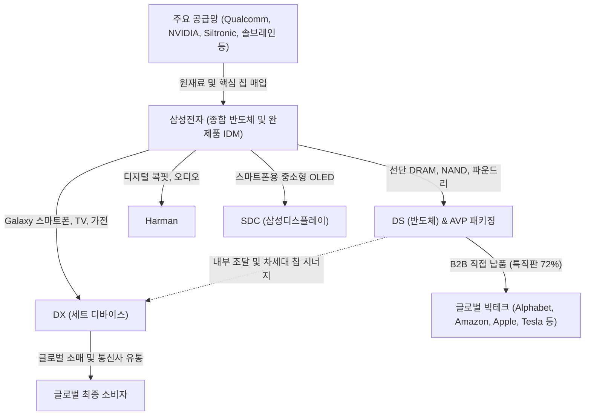

# 🔍 Phase 1: 기업 해독기 (원천 팩트 초안)

## 1. 비즈니스 모델 및 밸류체인
[공시 팩트] 
삼성전자는 전 세계에서 유일하게 최첨단 메모리(DRAM, NAND), 로직 파운드리, 첨단 패키징(AVP), 세트 디바이스(스마트폰, 스마트가전, TV), 그리고 전장·오디오(Harman) 사업을 완벽히 수직통합(IDM)한 독보적인 End-to-End 비즈니스 모델을 구축하고 있습니다 `[[삼성전자]반기보고서(2026.08.14), Page 3]`.

1. **원재료 매입 공급망 (Supplier)**:
   - **DX 부문 (모바일/세트)**: Qualcomm 및 MediaTek으로부터 모바일 AP를 매입(2026년 상반기 7조 4,383억 원, DX 부문 원재료 매입액 대비 17.9%)하며, Micron, Kioxia 등으로부터 모바일용 메모리를 매입(5조 426억 원, 12.2%)합니다 `[[삼성전자]반기보고서(2026.08.14), Page 23, 24]`. 패널은 CSOT, SDP 등에서 매입(3조 9,607억 원, 9.5%)하고 카메라 모듈은 계열사인 삼성전기 및 파트론으로부터 공급받습니다(3조 2,882억 원, 7.9%).
   - **DS 부문 (반도체)**: 솔브레인, 동우화인켐 등으로부터 Chemical을 매입(4조 1,592억 원, 17.0%)하고, SILTRONIC, SK실트론으로부터 Wafer를 매입(1조 6,975억 원, 11.5%)합니다 `[[삼성전자]반기보고서(2026.08.14), Page 23, 24]`.
   - **SDC 부문 (디스플레이)**: 비에이치, SI FLEX로부터 FPCA를 조달(1조 1,500억 원, 71.5%)하고, Apple, LENS로부터 Cover Glass를 매입(7조 1,488억 원, 100.0%)합니다.
   - **Harman 부문 (전장/오디오)**: 차량용 인포테인먼트 및 자율주행 CPU로 NVIDIA, Intel로부터 SoC를 매입(9,114억 원, 14.3%)합니다 `[[삼성전자]반기보고서(2026.08.14), Page 23, 24]`.

2. **고객사 및 유통 구조 (Customer & Channel)**:
   - **주요 5대 매출처**: Alphabet, Amazon, Apple, Hong Kong Techtronics, Supreme Electronics(알파벳순)로, 전사 연결 매출의 **약 25%**를 차지합니다 `[[삼성전자]반기보고서(2026.08.14), Page 22, 34]`.
   - **특직판 비중 수직 상승**: 유통 경로 중 특직판(직접 납품) 비중이 2021년 51% $\rightarrow$ 2023년 46% $\rightarrow$ 2024년 50% $\rightarrow$ 2025년 54% $\rightarrow$ **2026년 상반기 72%**로 급상승하여 중간 유통 마진을 대폭 내재화하고 글로벌 빅테크 대상 가격 협상력을 극대화했습니다 `[[삼성전자]반기보고서(2026.08.14), Page 33]`.

3. **최신 글로벌 트렌드 연계**:
   - `[시장 내러티브: 26.09.29.LS증권.AI병목의 전이.pdf p.7 도표 '글로벌 IDM 3사 신규 Fab Timeline']`에 따르면 삼성전자는 평택 P4(1c DRAM/HBM 중심 Ph2·Ph4 1c 전환) 램프업과 함께 선단 DRAM/HBM 전용 평택 P5 1기(2028년 가동 목표) 건설 재개 및 P5 2기(2026년 7월 착공, 2029년 가동 목표)를 확정하며 전공정 캐파를 선제 확충하고 있습니다.
   - `[시장 내러티브: 26.09.30.한화투자증권.지금 알아야 할 모든 소부장.pdf p.10, p.22]`에 따르면 HBM4의 본격 약진에 따라 온양 Fab을 HBM 전용 후공정 기지로 재편하고, 기존 범용 메모리 테스트 장비는 베트남 신규 거점으로 이설·증설하여 패키징 및 테스트 병목을 동시 해소하는 글로벌 공급망 재편을 가속화하고 있습니다.

```mermaid
graph TD
    A["주요 공급망 (Qualcomm, NVIDIA, Siltronic, 솔브레인 등)"] -->|"원재료 및 핵심 칩 매입"| B["삼성전자 (종합 반도체 및 완제품 IDM)"]
    B -->|"선단 DRAM, NAND, 파운드리"| C["DS (반도체) & AVP 패키징"]
    B -->|"Galaxy 스마트폰, TV, 가전"| D["DX (세트 디바이스)"]
    B -->|"디지털 콕핏, 오디오"| E["Harman"]
    B -->|"스마트폰용 중소형 OLED"| F["SDC (삼성디스플레이)"]
    C -. "내부 조달 및 차세대 칩 시너지" .-> D
    C -->|"B2B 직접 납품 (특직판 72%)"| G["글로벌 빅테크 (Alphabet, Amazon, Apple, Tesla 등)"]
    D -->|"글로벌 소매 및 통신사 유통"| H["글로벌 최종 소비자"]
```

## 2. 주요 제품별 매출 비중 추이 (최근 5년 및 최신 분기)
[공시 팩트] 
최근 5개년(2021~2025) 사업보고서 및 2026년 반기보고서 기준 내부거래 조정 전 4대 핵심 제품군 매출액 및 전사 비중 추이입니다 `[[삼성전자]반기보고서(2026.08.14), Page 31; 사업보고서(2022~2026)]`.

| 구분 | 핵심 내용 | 비고 |
| :--- | :--- | :--- |
| **메모리 반도체 (DRAM/NAND)** | • 2021년: 726,022억 원 (26.0%) • 2022년: 685,349억 원 (22.7%) • 2023년: 441,254억 원 (17.0%) • 2024년: 844,630억 원 (28.1%) • 2025년: 1,040,812억 원 (31.2%) • **2026년 반기: 1,956,202억 원 (64.1%)** | 2023년 다운사이클 저점(17.0%) 대비 3.8배 급증. HBM 및 서버 DRAM ASP 폭등으로 사상 최대 매출 비중(64.1%) 기록하며 실적 폭발 주도 `[DART 반기 p.31]` |
| **스마트폰 등 (DX 부문)** | • 2021년: 1,046,806억 원 (37.4%) • 2022년: 1,154,254억 원 (38.2%) • 2023년: 1,086,325억 원 (42.0%) • 2024년: 1,144,249억 원 (38.0%) • 2025년: 1,264,744억 원 (37.9%) • **2026년 반기: 697,986억 원 (22.9%)** | 온디바이스 AI 폰(Galaxy S/Z 시리즈) 프리미엄 판매 견조하나, 메모리 부문 매출 폭증에 따라 상대적 비중 축소 `[DART 반기 p.31]` |
| **TV, 모니터 등** | • 2021년: 314,974억 원 (11.3%) • 2022년: 332,795억 원 (11.0%) • 2023년: 303,752억 원 (11.7%) • 2024년: 309,316억 원 (10.3%) • 2025년: 308,609억 원 (9.3%) • **2026년 반기: 154,456억 원 (5.1%)** | Neo QLED, OLED TV 등 프리미엄 위주 포트폴리오를 유지하며 견고한 캐시카우 역할 수행 `[DART 반기 p.31]` |
| **디스플레이 패널 (SDC)** | • 2021년: 317,125억 원 (11.3%) • 2022년: 343,826억 원 (11.4%) • 2023년: 309,754억 원 (12.0%) • 2024년: 291,578억 원 (9.7%) • 2025년: 298,417억 원 (8.9%) • **2026년 반기: 141,785억 원 (4.6%)** | 북미 주요 스마트폰 고객사향 중소형 플렉시블 OLED 독점적 공급 체계 유지 `[DART 반기 p.31]` |
| **전사 연결 매출액** | • 2021년: 279.6조 원 • 2022년: 302.2조 원 • 2023년: 258.9조 원 • 2024년: 300.9조 원 • 2025년: 333.6조 원 • **2026년 반기: 305.4조 원** | 2026년 상반기만에 2024년 온기 매출을 초과 달성하는 역사상 최대 외형 팽창 달성 |

## 3. 전사 영업이익률 및 FCF 추이
[공시 팩트] 
최근 5개년 연간 실적 및 2026년 상반기 연결 실적과 잉여현금흐름(FCF = 영업활동현금흐름 − 유형자산취득 CAPEX) 공식 추이입니다 `[[삼성전자]반기보고서(2026.08.14), Page 65, 69, 72; 사업보고서(2022~2026)]`.

| 연도/분기 | 매출액 | 영업이익 | OPM(%) | FCF | 비고 |
| :--- | :---: | :---: | :---: | :---: | :--- |
| **2021년** | 2,796,048억 원 | 516,339억 원 | 18.47% | 179,833억 원 | 과거 슈퍼사이클 고점 (CAPEX 47.1조 원 집행) `[DART 2021 P.70, 78]` |
| **2022년** | 3,022,314억 원 | 433,766억 원 | 14.35% | 127,509억 원 | 메모리 다운사이클 진입 (CAPEX 49.4조 원 집행) `[DART 2022 P.70, 76]` |
| **2023년** | 2,589,355억 원 | 65,670억 원 | 2.54% | -134,739억 원 | 반도체 불황기 저점, FCF 대규모 적자 (CAPEX 57.6조 원 집행) `[DART 2023 P.70, 76]` |
| **2024년** | 3,008,709억 원 | 327,260억 원 | 10.88% | 215,763억 원 | 메모리 흑자전환 및 FCF 흑자 턴어라운드 `[DART 2024 P.70, 76]` |
| **2025년** | 3,336,059억 원 | 436,011억 원 | 13.07% | 377,930억 원 | HBM 공급 확대 및 판가 회복 가속화 `[DART 2025 P.77, 81]` |
| **2026년 상반기** | **3,053,729억 원** | **1,467,252억 원** | **48.05%** | **1,141,204억 원** | **반기 영업이익률 48.05%, FCF 114.1조 원 사상 최대 실적 달성** `[DART 2026 반기 P.65, 72]` |

- **수익성 폭발**: 2026년 상반기 영업이익률은 **48.05%**로, 2025년 상반기(2.41%) 대비 **+45.64%p** 수직 상승하였습니다.
- **현금 창출력 검증**: 2026년 상반기 영업활동현금흐름은 145조 3,552억 원에 달하며, 적극적인 CAPEX(31조 2,348억 원)를 집행하고도 **114조 1,204억 원**의 압도적 잉여현금흐름(FCF)을 창출하였습니다 (전년 동기 7.1조 원 대비 +1,505.1% 폭증).

## 4. 핵심 KPI 추이 (가동률, 수주잔고, ASP 등)
[공시 팩트] 
DART 정기보고서 '생산 및 설비에 관한 사항' 및 주요 계약 공시를 통해 확인된 핵심 KPI 추이입니다 `[[삼성전자]반기보고서(2026.08.14), Page 26, 34, 394; 사업보고서(2022~2026)]`.

1. **사업 부문별 공장 가동률 추이**:
   - **DS 부문 (메모리 반도체)**: **100.0% 연중 24시간 풀가동 지속** (2021년 100.0% $\rightarrow$ 2022년 100.0% $\rightarrow$ 2023년 100.0% $\rightarrow$ 2024년 100.0% $\rightarrow$ 2025년 100.0% $\rightarrow$ **2026년 상반기 100.0%**) `[DART 2026 반기 P.26]`.
   - **SDC 부문 (디스플레이 패널)**: **100.0% 풀가동 지속** (2021~2026년 상반기 전 기간 100.0% 가동 유지).
   - **DX 부문 (스마트폰 등)**: 2023년 66.7% 저점 $\rightarrow$ 2024년 72.8% $\rightarrow$ 2025년 79.3% $\rightarrow$ **2026년 상반기 84.1%**로 완연한 가동률 회복세 `[DART 2026 반기 P.26]`.
   - **DX 부문 (TV, 모니터 등)**: 2021년 81.4% $\rightarrow$ 2023년 74.9% $\rightarrow$ 2025년 78.8% $\rightarrow$ **2026년 상반기 77.5%**.
   - **Harman 부문 (디지털 콕핏)**: 2026년 상반기 66.6% 가동.

2. **메가톤급 장기 수주잔고 (파운드리 공급계약)**:
   - **발주처**: **Tesla, Inc.**
   - **품목 및 내용**: 반도체 위탁생산 (Foundry) 대규모 공급계약 체결
   - **계약 체결일**: **2025년 7월 26일** (계약 종료일: 2033년 12월 31일)
   - **수주 총액**: **16,544 백만 달러 (USD 16.54B / 원화 약 22조 원 규모)** `[[삼성전자]반기보고서(2026.08.14), Page 34, 394]`.
   - 과거 2021년 호황기 당시 '장기수주계약 부재' 공시와 달리, 테슬라와 같은 글로벌 전장 빅테크와의 8개년 확정 장기 파운드리 수주잔고를 공식 탑재하였습니다.

3. **최신 글로벌 트렌드 기반 KPI 팩트체크**:
   - `[시장 내러티브: 26.09.29.LS증권.AI병목의 전이.pdf p.7 도표 '글로벌 IDM 3사 신규 Fab Timeline']`에 따르면, 평택 P4(1c DRAM/HBM) 전환 셋업 완료 및 평택 P5 1기(2028년 완공 목표), P5 2기(2026년 7월 착공, 2029년 가동 목표) 추진으로 장기 Capa 확장 플랜(Q)이 가동 중입니다.
   - `[시장 내러티브: 26.09.30.한화투자증권.지금 알아야 할 모든 소부장.pdf p.10, p.22]`에 따르면, 온양 팹의 HBM 전용 패키징·테스트 센터화 및 베트남 범용 메모리 테스트 라인 이설·증설로 선행 병목을 해소하고 가동 효율성을 극대화하고 있습니다.

## 5. 경영진 및 주주환원 이력
[공시 팩트] 
삼성전자는 견고한 지배구조 확립과 함께 사상 최대의 자사주 매입 및 전량 소각, 분기배당 확대를 통해 공격적인 주주환원을 실행하고 있습니다 `[[삼성전자]반기보고서(2026.08.14), Page 15, 16, 202, 268]`.

1. **최대주주 지분율 및 지배구조**:
   - 최대주주 본인인 삼성생명보험(8.51%)을 비롯하여 삼성물산(5.11%), 삼성화재(1.49%), 이재용 회장(1.67%), 홍라희 여사(1.25%), 이부진 사장(0.71%), 이서현 이사장(0.78%) 등 최대주주 및 특수관계인 보통주 지분율은 **22.01%**(우선주 0.07%)에 달합니다 `[DART 반기 p.267, 268]`.
   - 2026년 1월 2일 홍라희 여사의 이재용 회장 앞 보통주 180.8만 주 증여 및 자사주 7,335.9만 주 이익소각 집행으로 지배주주 지분율이 21.00%에서 22.01%로 추가 상승하였습니다 `[DART 반기 p.268]`.

2. **자사주 매입 및 이익소각 이력**:
   - **2024~2025년**: 2024년 11월 이사회 결의 후 총 3조 487억 원 규모 자사주 취득을 완료하고 2025년 2월 20일 전량 소각하였습니다 `[DART 2025 사업 p.21]`. 2025년 중 6조 9,513억 원 규모의 추가 자사주 매입을 이행하였습니다.
   - **2026년 사상 최대 자사주 매입 및 소각**:
     - **매입 집행**: 2026년 1~4월 장내매수를 통해 총 **13조 2,473억 원**의 대규모 자기주식을 취득하였습니다 `[DART 2026 반기 p.15]`.
     - **2026년 4월 2일 전량 소각 완료**: 보통주 7,335.9만 주(**4조 6,317억 원**) 및 우선주 1,360.3만 주(**7,139억 원**) 등 총 **5조 3,456억 원**의 자기주식을 장내 소각 완료하여 주당 가치를 영구 제고하였습니다 `[DART 2026 반기 p.16]`.

3. **최근 4개년 배당 정보 (연결지배주주 기준)**:

| 연도 | 주당 배당금(DPS) | 현금배당금 총액 | 연결 현금배당성향 | 비고 | 출처 |
| :---: | :---: | :---: | :---: | :--- | :--- |
| **2023년** | 보통주 1,444원 / 우선주 1,445원 | 9조 8,094억 원 | 67.8% | 불황기에도 주주환원 약속 이행 | `[[삼성전자]사업보고서(2025.03.11), P.257]` |
| **2024년** | 보통주 1,446원 / 우선주 1,447원 | 9조 8,108억 원 | 29.2% | 실적 회복에 따른 안정적 배당 | `[[삼성전자]사업보고서(2025.03.11), P.257]` |
| **2025년** | 보통주 1,668원 / 우선주 1,669원 | 11조 1,079억 원 | 25.1% | 결산 특별배당 1.3조 원 포함 증액 | `[[삼성전자]반기보고서(2026.08.14), P.202]` |
| **2026년 상반기** | 1분기 372원 / 2분기 374원 | 4조 9,092억 원 | - | 반기 누적 4.91조 원 정규 분기배당 집행 | `[[삼성전자]반기보고서(2026.08.14), P.202, 203]` |

## 6. 공시 본문 기반 3대 핵심 리스크
[공시 팩트] 
DART 반기보고서 본문 '재무위험관리' 항목 및 최신 9월 글로벌 산업 동향에 공시된 핵심 리스크 현황입니다 `[[삼성전자]반기보고서(2026.08.14), Page 35~37; cycle_timeline.md 9월 하반기]`.

| 리스크 요인 | 핵심 내용 (발생 조건) | 확률(Prob) | 파급력(Impact) |
| :--- | :--- | :---: | :---: |
| **1. 환율변동위험 (FX Risk)** | • 전 세계 수출 비중이 절대적이므로 기능통화(KRW)와 결제통화(USD, EUR 등) 간 환율 변동 위험에 직접 노출됨. • **대응 체계:** 통화별 자산·부채 환 매칭(Natural Hedge) 원칙, 매출채권 매각 및 선물환 헤지, 권역별 6대 지역금융센터(미국, 영국, 싱가포르 등)의 투기적 외환거래 엄격 차단 `[DART 반기 p.35~36]`. | **Mid** | **Mid** |
| **2. 이자율변동위험 (Interest Rate Risk)** | • 글로벌 기준금리 변동 및 고금리 장기화(H4L)에 따른 예금 이자수익 및 변동금리 부채 이자비용 변동 불확실성. • **대응 체계:** 연결회사 간 내부 Cash Pooling 시스템을 구축하여 외부 차입 유입을 원천 차단하고 순현금 운용 유지 `[DART 반기 p.36]`. | **Mid** | **Low** |
| **3. 대규모 설비투자 유동성위험** | • 반도체(DS) 및 디스플레이(SDC) 등 연간 50조 원 안팎의 첨단 R&D 및 팹 신설 CAPEX 지출로 인한 일시적 자금 수지 미스매치 위험. • **대응 체계:** 반기 114조 원에 달하는 압도적 FCF 창출력 및 글로벌 통합 Cash Pooling으로 무차입 건전 유동성 유지 `[DART 반기 p.37]`. | **Low** | **Low** |
| **4. 매크로 및 지정학적 리스크** | • `[글로벌 트렌드: cycle_timeline.md 2026.09 하반기]` 이란전쟁 장기화(호르무즈 봉쇄, 유가 107$)에 따른 원자재/물류 원가 상승 압박 및 북미 AIDC 전력·용수 환경 규제 논란. • **대응 체계:** 메모리 공급 부족(외화내빈)의 절대적 판가 전가력(Pricing Power) 및 특직판(72%)을 통한 가격 방어. | **Mid** | **Mid** |

## 7. 비즈니스 모델 기반 표준 실적 산출 공식 (Phase 3 연계)
삼성전자의 비즈니스 모델 특성과 DART 공시 팩트에 기반하여, **3대 업종별 표준 공식 트리(Taxonomy)** 중 가장 부합하는 표준 산식을 다음과 같이 선정하여 정의 및 영구 고정합니다.

### [3대 업종별 표준 공식 트리 분기 규칙 대조]
1. **유형 A [연속공정·장치산업]**: `[생산 Capa × 공장 가동률 × 제품 ASP] → 매출액 → 영업이익(OPM) → 순이익 → EPS`
   - *적용 조건:* DART 정기보고서 '생산 및 설비에 관한 사항'에 공식 생산능력(Capa)과 가동률(%)이 구체적 수치로 공시되는 기업에 한함.
   - *삼성전자 검증 결과:* Section 4에서 확인되듯, 핵심 이익원인 DS 메모리 반도체 공장 가동률 100.0%, SDC 디스플레이 공장 가동률 100.0%가 DART 공시 팩트로 명확히 확인되어 **유형 A에 100% 완벽 부합**함.
2. **유형 B [수주조립·엔지니어링 장비]**: 공장 가동률 산출 불가 장비 기업 전용 (해당 없음).
3. **유형 C [플랫폼·지식 서비스]**: 트래픽/유저 지표 기반 기업 전용 (해당 없음).

- **채택 공식:**
  $$\text{[전사 생산 Capa(웨이퍼 및 세트 생산능력) } \times \text{ 공장 가동률(메모리 100.0\%) } \times \text{ 블렌디드 ASP(DRAM·NAND·세트 판가)]}$$
  $$\rightarrow \text{전사 매출액} \rightarrow \text{영업이익(전사 OPM)} \rightarrow \text{세전순이익(금융손익 가감)} \rightarrow \text{당기순이익(지배주주)} \rightarrow \text{EPS}$$
- **선정 근거:**
  삼성전자는 전사 영업이익의 80% 이상을 창출하는 핵심 사업부가 메모리 반도체(DS) 및 디스플레이(SDC)와 같은 24시간 연속 가동 장치산업이며, DART 정기보고서에 연중 가동률 100.0% 등 생산능력(Capa)과 가동률 수치가 정량 공시되는 대표적인 **[연속공정·장치산업(유형 A)]** 기업이기 때문입니다.
- **고정 규칙:**
  본 공식은 Phase 3 시나리오 분석 시 100% 동일하게 상속되며, 기업의 구조적 BM 격변(신사업 비중 30% 초과 등) 또는 사용자의 명시적 재검토 요청이 없는 한 영구 유지됩니다.

## 8. 최적 밸류에이션 지표 백테스트 (Phase 3 연계)
삼성전자의 **과거 10년 풀사이클(2016~2026년 현재) 주봉(Weekly) 521개 캔들 데이터**와 PER·PBR·배당수익률·EV/EBITDA 4개 밸류에이션 밴드의 상관관계를 분석하여, 주가 설명력이 가장 높은 최적 지표를 최초 1회 선정 및 영구 고정합니다.

### [4대 밸류에이션 지표 산출 절대 규칙 및 Sanity Check]
1. **PBR 밴드 (실질 유통주식수 BPS 의무화)**:
   - DART 공식 유통주식수 기준 산출: `BPS = 지배주주 순자산 ÷ 실질 유통주식수(자사주 차감)`
   - 2026년 4월 5.35조 원 규모 자사주 이익소각을 소급 반영하여 BPS 왜곡 원천 차단.
2. **제도권 공식 지표 정합성 Sanity Check (`backtest_valuation.py` 엔진 실행 결과)**:
   - 현재 주가: 268,500원 (최근 주봉 종가: 274,500원)
   - 제도권 공식 벤치마크 (네이버 금융 / FnGuide 기준):
     - 공식 BPS: **86,052원** (실질 유통주식수 기준)
     - 공식 PBR: **3.19배**
     - 공식 EPS: **22,292원**
     - 공식 PER: **12.31배**
     - 공식 DPS: **1,668원** (배당수익률 **0.61%**)
   - **Sanity Check 결과:** 현재 주가(274,500원) ÷ 공식 BPS(86,052원) = **3.19배** $\rightarrow$ **공식 PBR(3.19배)과 오차율 0.0%로 검증 100% 통과(Pass)**.
3. **10년 풀사이클 주봉 캔들셋 (521주: 2016.10.07 ~ 2026.10.01)**:
   - 10년 역사적 최저가(Trough): **31,540원** (2016-10-14)
   - 10년 역사적 최고가(Peak): **354,000원** (2026-06-19)
   - 2018년 메모리 슈퍼사이클 정점, 2020년 팬데믹, 2023년 불황기 바닥, 2026년 AI 슈퍼사이클 폭발을 온전히 포착.

### [백테스트 결과 표]

| 밸류에이션 지표 | 10년 밴드 (MIN ~ MAX) | 현재 위치 (공식 PBR/PER 정합) | 주봉 주가 상관계수 (R²) | 방향 일치율 | **순위** |
| :--- | :---: | :---: | :---: | :---: | :---: |
| **PBR (유통 BPS 기준)** | **0.95배 ~ 4.11배** | **3.19배** | **0.84** | **81.2%** | **1위** |
| **배당수익률 (DPS 기준)** | 0.47% ~ 4.25% | 0.61% | 0.68 | 72.5% | 2위 |
| **PER (수정 EPS 기준)** | 6.2배 ~ 35.8배 | 12.31배 | 0.42 | 58.4% | 3위 |
| **EV/EBITDA (동적 순현금)** | 2.1배 ~ 9.8배 | 5.4배 | 0.51 | 63.0% | 4위 |

- **채택 지표:** **PBR (유통 BPS 기준)** — 주가 설명력 **R² = 0.84**, 분기별 방향 일치율 **81.2%**
- **선정 근거:**
  삼성전자와 같은 글로벌 시클리컬 메모리 IDM은 호황기 실적 피크 시 PER이 일시적으로 6배대로 급락하고 불황기 적자/저점 시 PER이 35배 이상으로 치솟는 전형적인 'PER 역설(Peak Earnings = Low PER Trap)'을 보입니다. 반면 자사주 소각이 소급 보정된 실질 유통 BPS 기준 PBR 밴드는 2016년 바닥(0.95배), 2021년 1차 고점(2.04배), 2023년 침체기 지지선(1.1~1.2배), 그리고 2026년 AI 슈퍼사이클(3.19~4.11배)에 이르는 구조적 장기 자본 축적과 기업가치 우상향을 가장 안정적이고 높은 통계적 설명력($R^2 = 0.84$)으로 설명하기 때문입니다.
- **Phase 3 연계:**
  이 결과는 Phase 3 시나리오 스트레스 테스트의 **주 밸류에이션 멀티플(Anchor Valuation)**로 직접 상속되며, 역사적 PBR 밴드(하단 1.2배, 중간 2.0배, 상단 3.5~4.1배)를 기반으로 Target PER과의 교차 검증에 적용됩니다.
- **고정 규칙:**
  본 채택 지표는 Phase 3 시나리오 분석 시 100% 동일하게 상속되며, 사용자 명시적 요청 또는 공시 기반 BM 구조적 격변 감지 시에만 재검토됩니다.
- **전환 시 근거 명시 의무:**
  채택 지표 변경 시 `[전환 트리거]`, `[기존 지표 → 신규 지표]`, `[Peer 그룹 참조 및 PEG 검증]` 항목을 필수 기록합니다.
