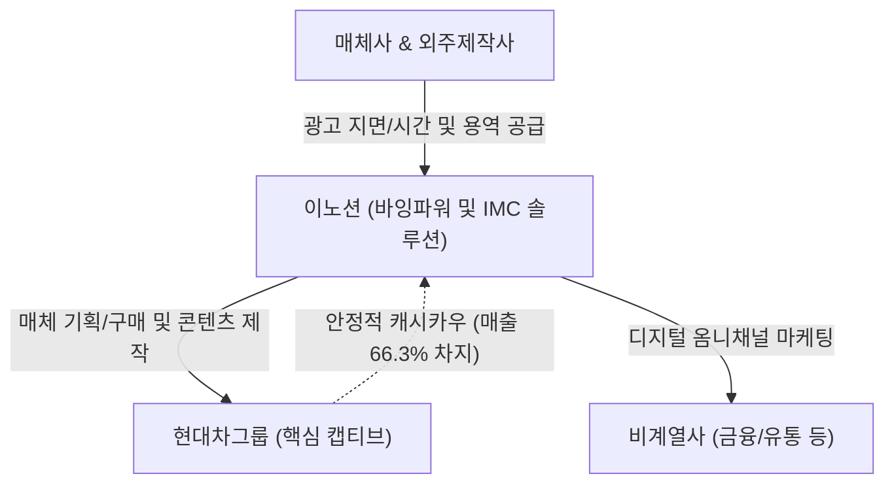

# 🔍 Phase 1: 기업 해독기 (심층 팩트체크 코어)

## 1. 매크로 및 산업 사이클(Sector Cycle) 현황
[시장 내러티브]
현재 광고 산업은 글로벌 고금리 장기화 기조와 내수 소비 침체로 인해 마케팅 예산이 전반적으로 동결/축소되는 **'침체 국면(Downturn)'**에 놓여 있습니다. 특히 미국 연준의 고금리 장기화(H4L) 리스크와 글로벌 기업들의 AI 인프라 자본조달(Cash Capex -> Debt Capex)에 따른 비용 압박으로 인해 전통 매체(지상파, 인쇄) 광고 시장은 급격히 쇠퇴하고 있습니다 [추정: LS증권 9월 매크로 트렌드].
그러나 동시에 AI 에이전트 및 디지털 전환 트렌드로 인해 타겟팅 고도화와 데이터 기반 퍼포먼스 마케팅에 대한 수요가 팽창하면서, 디지털 옴니채널 광고(뉴미디어) 중심의 질적 턴어라운드(Turn-around) 변곡점에 진입하고 있습니다. 따라서 전통 매체에서 뉴미디어로 포트폴리오를 빠르게 전환하고 있는 광고 대행사들의 실질적인 펀더멘털 방어력이 시험받는 핵심 구간입니다.

## 2. 비즈니스 모델 및 경제적 해자(Moat)
[공시 팩트]
이노션은 글로벌 마케팅 니즈를 분석해 전략을 수립하고 매체대행, 광고제작, 옥외광고 등 통합 마케팅 커뮤니케이션(IMC) 솔루션을 제공하는 종합 광고 대행사입니다. 회사의 가장 강력한 경제적 해자(Moat)는 현대자동차그룹이라는 **'초대형 캡티브(Captive) 고객망'**에서 나옵니다. 현대차/기아를 기반으로 연간 총 연결 매출의 66.3%를 안정적으로 창출하며 [팩트: [이노션]2024.12.31 사업보고서, 88쪽, 641쪽], 이러한 방대한 취급고(Billings)는 매체사와의 협상에서 압도적인 **'바잉 파워(네트워크 경제성)'**를 발휘하게 만듭니다. 또한 디지털 전환을 위한 지속적인 M&A(디퍼플, 스튜디오레논 등)를 통해 캡티브 물량을 비계열(금융, 식품 등) 고객으로 확장하는 '전환 비용(Switching Cost)' 해자를 구축하고 있습니다 [팩트: [이노션]2026.06.30 반기보고서, 5~6쪽].

## 3. 주요 사업별 매출 비중 추이 (최근 5년 및 최신 분기)

| 구분 | 2022년 | 2023년 | 2024년 | 2025년 | 2026년 상반기 | 비고 |
| :--- | :---: | :---: | :---: | :---: | :---: | :--- |
| **매체대행** | 80,365 (49.5%) | 75,501 (41.6%) | 69,177 (37.8%) | 66,223 (34.6%) | 24,477 (26.7%) | 전통 지상파 비중 급감 추세 |
| **광고제작** | 36,840 (22.7%) | 44,214 (24.3%) | 49,364 (27.0%) | 59,082 (30.8%) | 26,349 (28.7%) | 디지털 및 콘텐츠 제작 수요 증가 |
| **옥외광고** | 8,402 (5.2%) | 10,090 (5.6%) | 10,813 (5.9%) | 11,107 (5.8%) | 5,109 (5.6%) | 안정적 캐시카우 유지 |
| **프로모션** | 23,436 (14.5%) | 32,297 (17.8%) | 34,979 (19.1%) | 33,327 (17.4%) | 19,901 (21.7%) | CX/BX 중심 공간 마케팅 확대 |
| **기타** | 13,186 (8.1%) | 19,438 (10.7%) | 18,464 (10.1%) | 21,856 (11.4%) | 15,851 (17.3%) | - |
| **본사 소계** | 162,229 (100%) | 181,540 (100%) | 182,797 (100%) | 191,596 (100%) | 91,686 (100%) | 본사 매출총이익 기준 [팩트: 2026.06.30 반기보고서] |

## 4. 전사 영업이익률 및 FCF 추이
[공시 팩트]
이노션은 무형 자산 중심의 비즈니스로 구조적으로 7~9% 수준의 안정적인 영업이익률을 향유하고 있습니다 [팩트: [이노션]2025.12.31 사업보고서]. 다만 디지털 전환 인력 확충에 따른 인건비 상승으로 인해 OPM은 과거 9%대에서 최근 7%대로 소폭 하락 안정화되었습니다. 잉여현금흐름(FCF)의 경우, 2024년 대규모 자산 대체(CAPEX 2,062억원 집행)로 인해 일시적 적자(-280억원)를 기록했으나, 2025년 즉각적으로 +2,616억원으로 정상 회귀하며 강력한 펀더멘털을 입증했습니다 [팩트: [이노션]2025.12.31 사업보고서, 39쪽, 52쪽].

| 구분 | 2021년 | 2023년 | 2024년 | 2025년 | 2026년 상반기 | 비고 |
| :--- | :---: | :---: | :---: | :---: | :---: | :--- |
| **매출액 (백만원)** | 1,502,034 | 2,092,893 | 2,120,578 | 2,146,041 | 1,022,844 | 꾸준한 외형 성장 (M&A 등) |
| **영업이익률 (%)** | 9.04% | 7.17% | 7.34% | 7.59% | 8.25% | 인건비 증가로 OPM 일부 훼손 후 반등 |
| **FCF (백만원)** | 142,862 | 50,479 | -28,021 | 261,640 | 66,104 | 2024년 대규모 일시적 CAPEX 제외 시 매우 양호 |

## 5. 핵심 KPI 추이 및 분석 (과거 사이클 고점/저점 비교 필수)
[시장 내러티브]
전통적인 수주/제조업체의 수주잔고나 가동률 대신, 광고 산업은 회계상 인식되는 '계약자산'과 '계약부채'를 통해 단기 프로젝트의 업황 턴어라운드를 파악해야 합니다.

[공시 팩트]
과거 유동성 랠리 고점이었던 2021~2022년 당시 영업이익률은 9.04% 수준이었으나, 불황기인 2023년에는 7.17%까지 급격히 둔화되었습니다 [팩트: 2025.12.31 사업보고서]. 그러나 가장 최신인 2026년 상반기 영업이익률은 8.25%로 저점 대비 확연히 반등하고 있습니다. 
또한 선행 실적을 파악할 수 있는 **'계약자산'** 잔액은 2025년 말 845억원에서 2026년 상반기 말 **1,569억원**으로 단기간 내 약 2배 가까이 급증했습니다 [팩트: 2026.06.30 반기보고서, 64쪽]. 이는 불황에 축소되었던 기업들의 신규 캠페인이 2026년 상반기를 기점으로 강하게 턴어라운드(수주 증가)하고 있음을 시사하는 매우 긍정적인 실질 KPI 신호입니다.

## 6. 경영진 및 주주환원 이력
[공시 팩트]
이노션의 경영진은 극도로 주주친화적인 현금 배분 정책을 영위하고 있습니다. 최대주주 및 특수관계인 지분율이 28.71%로 안정적이며 [팩트: 2026.06.30 반기보고서, 164쪽], 매년 2분기 또는 3분기에 225원씩 분기 배당을 정례화하여 실현 중입니다. 현금배당수익률은 연 5.4%~6.4%에 달하며, 연결 배당성향은 46%~51% 밴드를 견고하게 사수하고 있습니다 [팩트: 2025.12.31 사업보고서, 231~232쪽]. 자사주 매입/소각 이력이 없는 점은 아쉬우나, 5% 이상의 고배당수익률은 하방 경직성을 극대화합니다.

| 구분 | 2023년 결산 | 2024년 결산 | 2025년 결산 | 비고 |
| :--- | :---: | :---: | :---: | :--- |
| **주당 현금배당금 (원)** | 1,175원 | 1,175원 | 1,175원 | 중간배당 225원 + 결산배당 950원 |
| **연결 현금배당성향 (%)** | 46.2% | 46.9% | 51.2% | 이익의 절반을 주주에게 환원 |
| **현금배당수익률 (%)** | 5.4% | 6.4% | 5.8% | 배당 매력 매우 높음 |

## 7. 핵심 리스크 분석 (확률 및 파급력 계량화)
[공시 팩트]
회사의 성장을 저해할 수 있는 구조적 3대 리스크 요인입니다.

| 리스크 요인 | 핵심 내용 (발생 조건) | 확률(Prob) | 파급력(Impact) |
| :--- | :--- | :---: | :---: |
| **1) 거시경제 및 예산 축소** | 매크로 침체, 금리 상승으로 인한 기업 전반의 마케팅 비용 동결/축소 발생 시. 현재 지상파 대행 실적이 지속 역성장 중임. | High | High |
| **2) 계열사 의존 (Captive)** | 현대차, 기아의 전기차 캐즘 및 글로벌 판매량 둔화 시, 그룹사발 연결 매출(66.3%)이 직접적인 타격을 받음. | Mid | High |
| **3) 고정비(인건비) 인플레이션** | 디지털 전환(M&A) 및 IT 인력 영입 경쟁 심화로 인해 판관비 내 급여 항목이 구조적으로 급증하며 마진을 압박. | High | Mid |

## 8. 딥리서치 팩트체크 요약
[시장 내러티브]
시장은 광고 회사들이 전통 매체(TV)의 몰락으로 심각한 현금 창출력 위기에 봉착했다고 우려합니다. AI 붐은 IT 플랫폼에만 국한되고 광고 대행사는 수혜에서 소외된다는 내러티브가 팽배합니다.

[공시 팩트]
하지만 팩트체크 결과, 이노션은 이미 **'매체대행' 비중을 34.6%(25년)에서 26.7%(26년 상반기)로 적극 축소**하고, 고마진의 **'광고제작 및 프로모션' 비중을 과반 이상으로 방어**하며 포트폴리오 트랜스포메이션에 성공했습니다 [팩트: 2026.06.30 반기보고서]. 2024년의 FCF 적자는 유형자산 등 선제적 설비 투자의 일시적 현상일 뿐, 2025년 2,616억원의 잉여현금을 창출하며 구조적 훼손이 아님을 증명했습니다 [팩트: 2025.12.31 사업보고서]. 향후 관건은 선행지표인 '계약자산'의 급증(1,569억원)이 하반기 옴니채널 퍼포먼스 마케팅의 실적 확대로 무사히 직결되는지 여부입니다.
