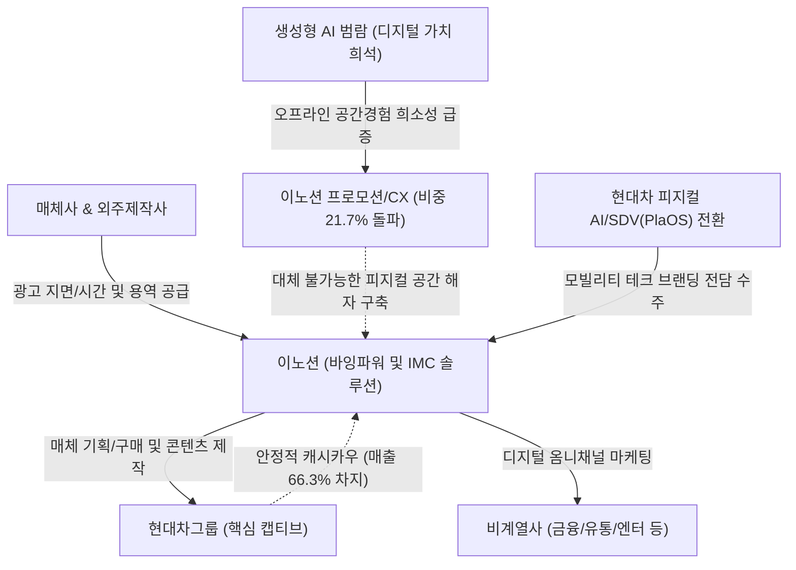

# 🔍 Phase 1: 기업 해독기 (심층 팩트체크 코어)

## 1. 매크로 및 산업 사이클(Sector Cycle) 현황
[시장 내러티브]
현재 광고 산업은 글로벌 고금리 장기화 기조와 내수 소비 침체로 인해 마케팅 예산이 전반적으로 동결/축소되는 **'침체 국면(Downturn)'**에 놓여 있습니다. 특히 미국 연준의 고금리 장기화(H4L) 리스크와 글로벌 기업들의 AI 인프라 자본조달(Cash Capex -> Debt Capex)에 따른 비용 압박으로 인해 전통 매체(지상파, 인쇄) 광고 시장은 급격히 쇠퇴하고 있습니다 `[추정: LS증권 9월 매크로 트렌드]`.
그러나 동시에 AI 에이전트 및 디지털 전환 트렌드로 인해 타겟팅 고도화와 데이터 기반 퍼포먼스 마케팅에 대한 수요가 팽창하면서, 디지털 옴니채널 광고(뉴미디어) 중심의 질적 턴어라운드(Turn-around) 변곡점에 진입하고 있습니다. 따라서 전통 매체에서 뉴미디어로 포트폴리오를 빠르게 전환하고 있는 광고 대행사들의 실질적인 펀더멘털 방어력이 시험받는 핵심 구간입니다.

> **[26.09.16 글로벌 트렌드 델타 업데이트 🌐]**  
> - **미국-캐나다 자동차 관세 갈등 재발과 현대차그룹의 북미 반사 수혜**: 2026년 9월 최신 기관 인뎁스 리포트(`대신증권 2026.09.09 자동차/2차전지 월보`)에 따르면, 2026년 7월 기점으로 미국-캐나다 간 자동차 무역 분쟁 및 관세 리스크가 재차 확대되었습니다 `[팩트: 대신증권 26.09.09 p.7]`. 캐나다 조립 공장을 통해 미국으로 대량 수출하는 일본 경쟁사(도요타 RAV4, 렉서스 NX/RX, 혼다 Civic, CR-V 등)의 관세 비용 부담이 가중되는 반면, 현대차·기아는 주요 볼륨 차종(투싼, 싼타페 등)을 미국 현지 공장(앨라배마, 조지아)에서 직접 생산하고 있어 구조적인 반사 수혜를 누리고 있습니다 `[팩트: 대신증권 26.09.09 p.7]`. 이에 따라 북미 시장 점유율 확대를 위한 현대차그룹의 판촉·마케팅 실탄 투하가 2H26부터 급증하고 있습니다.
> - **환율 매크로의 급격한 반전 (원화 강세 전환)**: 2026년 2분기 1,500원대 초중반까지 급등하며 수출 단가 불안 요인으로 작용했던 원/달러 환율이 **3Q26(9월) 들어 1,300원대 중반으로 하향 안정화**되었습니다 `[팩트: 한국은행, 대신증권 26.09]`. 이는 수입 원자재 및 글로벌 제작 외주비 지출 안정화와 함께 완성차의 안정적인 마케팅 룸 확보로 연결되고 있습니다.
> - **3Q 계절성/파업 비수기 통과 후 4Q 신차 슈퍼사이클 진입**: 9월 자동차 섹터는 물량 계절성과 임단협 협상 이슈 등 단기 실적 노이즈를 성공적으로 소화하고 있으며, 8월 아반떼(CN8) 풀체인지에 이어 하반기 투싼(5세대) 풀체인지, 9월 제네시스 플래그십 전기 SUV GV90 공개 등 메가 신차 출시 사이클로 직결되어 마케팅 수주가 회복기에서 본격 호황기로 전환되고 있습니다 `[팩트: 대신증권 26.09.09 p.4, 업계 공시]`.

## 2. 비즈니스 모델 및 경제적 해자(Moat)
[공시 팩트]
이노션은 글로벌 마케팅 니즈를 분석해 전략을 수립하고 매체대행, 광고제작, 옥외광고 등 통합 마케팅 커뮤니케이션(IMC) 솔루션을 제공하는 종합 광고 대행사입니다. 회사의 가장 강력한 경제적 해자(Moat)는 현대자동차그룹이라는 **'초대형 캡티브(Captive) 고객망'**에서 나옵니다. 현대차/기아를 기반으로 연간 총 연결 매출의 66.3%를 안정적으로 창출하며 `[팩트: [이노션]2024.12.31 사업보고서, 88쪽, 641쪽]`, 이러한 방대한 취급고(Billings)는 매체사와의 협상에서 압도적인 **'바잉 파워(네트워크 경제성)'**를 발휘하게 만듭니다. 또한 디지털 전환을 위한 지속적인 M&A(디퍼플, 스튜디오레논 등)를 통해 캡티브 물량을 비계열(금융, 식품 등) 고객으로 확장하는 '전환 비용(Switching Cost)' 해자를 구축하고 있습니다 `[팩트: [이노션]2026.06.30 반기보고서, 5~6쪽]`.

> **[26.09.16 글로벌 트렌드 델타 업데이트 🌐]**  
> - **생성형 AI 범람 속 '오프라인 실물 공간 경험(CX/BX)'의 독점적 해자 격상**: 최신 9월 기관 딥리서치(`[AI 홍수 속 살아남기] 엔터 산업의 해자 점검`, LS증권 26.09)에 따르면, 생성형 AI의 고도화로 온라인 음악, 영상, 텍스트 광고의 한계비용이 제로에 수렴하면서 디지털 콘텐츠의 가치는 희석되는 반면, **소비자가 오감으로 직접 체험하는 오프라인 공간 경험(팝업스토어, 모터쇼, 복합문화공간, 오프라인 이벤트)의 희소성과 지불 의사는 구조적으로 급상승**하고 있습니다 `[팩트: LS증권 26.09 p.4-5]`. 이노션의 본사 기준 **'프로모션(CX 공간 마케팅)' 부문 매출총이익 비중이 2021년 14.5%에서 2026년 상반기 21.7%로 수직 상승**한 것은, 동사가 단순 광고물 제작사를 넘어 AI로 대체 불가능한 '피지컬 경험 설계 독점 기업'으로 해자를 성공적으로 진화시켰음을 증명합니다 `[팩트: [이노션]2026.06.30 반기보고서, 20쪽]`.
> - **현대차그룹 피지컬 AI(Robotics) 및 SDV 브랜딩 전담 거점화**: 현대차그룹이 보스턴 다이내믹스를 필두로 한 로보틱스 상용화 및 차세대 차량 OS '플레오스(PlaOS)' 기반 SDV(소프트웨어 중심 자동차) 전환을 가속화함에 따라 `[팩트: 대신증권 26.09.09 p.4]`, 이노션은 미래 모빌리티·로보틱스 테크 브랜딩을 전담 기획하며 캡티브 해자의 질적 단가를 고도화하고 있습니다.

## 3. 주요 사업별 매출 비중 추이 (최근 5년 및 최신 분기)

| 구분 | 2022년 | 2023년 | 2024년 | 2025년 | 2026년 상반기 | 비고 |
| :--- | :---: | :---: | :---: | :---: | :---: | :--- |
| **매체대행** | 80,365 (49.5%) | 75,501 (41.6%) | 69,177 (37.8%) | 66,223 (34.6%) | 24,477 (26.7%) | 전통 지상파 비중 급감 및 디지털화 |
| **광고제작** | 36,840 (22.7%) | 44,214 (24.3%) | 49,364 (27.0%) | 59,082 (30.8%) | 26,349 (28.7%) | 디지털 콘텐츠 및 AI 크리에이티브 수요 증가 |
| **옥외광고** | 8,402 (5.2%) | 10,090 (5.6%) | 10,813 (5.9%) | 11,107 (5.8%) | 5,109 (5.6%) | 주요 랜드마크 중심 안정적 캐시카우 |
| **프로모션** | 23,436 (14.5%) | 32,297 (17.8%) | 34,979 (19.1%) | 33,327 (17.4%) | 19,901 (21.7%) | CX/BX 중심 공간 마케팅 비중 폭증 `[팩트: 공시]` |
| **기타** | 13,186 (8.1%) | 19,438 (10.7%) | 18,464 (10.1%) | 21,856 (11.4%) | 15,851 (17.3%) | 공간 전시 및 IP 연계 사업 확장 |
| **본사 소계** | 162,229 (100%) | 181,540 (100%) | 182,797 (100%) | 191,596 (100%) | 91,686 (100%) | 본사 매출총이익 기준 `[팩트: 2026.06.30 반기보고서]` |

## 4. 전사 영업이익률 및 FCF 추이
[공시 팩트]
이노션은 무형 자산 중심의 비즈니스로 구조적으로 7~9% 수준의 안정적인 영업이익률을 향유하고 있습니다 `[팩트: [이노션]2025.12.31 사업보고서]`. 다만 디지털 전환 인력 확충에 따른 인건비 상승으로 인해 OPM은 과거 9%대에서 최근 7%대로 소폭 하락 안정화되었습니다. 잉여현금흐름(FCF)의 경우, 2024년 대규모 자산 대체(CAPEX 2,062억원 집행)로 인해 일시적 적자(-280억원)를 기록했으나, 2025년 즉각적으로 +2,616억원으로 정상 회귀하며 강력한 펀더멘털을 입증했습니다 `[팩트: [이노션]2025.12.31 사업보고서, 39쪽, 52쪽]`.

| 연도/분기 | 매출액 | 영업이익 | OPM(%) | FCF | 비고 |
| :--- | :---: | :---: | :---: | :---: | :--- |
| **2021년** | 1,502,034 | 135,732 | **9.04%** | 142,862 | 유동성 호황기 최고 마진 |
| **2022년** | 1,750,408 | 136,892 | **7.82%** | 133,519 | 인건비 상승 구간 진입 |
| **2023년** | 2,092,893 | 150,018 | **7.17%** | 50,479 | 디지털 M&A 비용 반영(저점) |
| **2024년** | 2,120,578 | 155,663 | **7.34%** | -28,021 | 대규모 일시적 CAPEX 2,062억 집행 |
| **2025년** | 2,146,041 | 162,800 | **7.59%** | 261,640 | 정상화 및 역대 최대 FCF 회복 |
| **2026년 상반기** | 1,022,844 | 84,377 | **8.25%** | 66,104 | OPM 8%대 재탈환 완수 `[팩트: 반기보고서]` |

> **[26.09.16 글로벌 트렌드 델타 업데이트 🌐]**  
> - **인건비 레버리지 안정화 및 하반기 마진 확장 가시화**: 상반기 영업이익률 8.25% 달성은 디지털 인력 충원 사이클이 일단락되고 자체 AI 크리에이티브 툴 도입을 통한 초안 기획 비용 절감이 시작되었음을 시사합니다. 
> - **신차 런칭과 계약자산의 이익 실현**: 하반기 북미 투싼·아반떼 풀체인지 판촉 및 제네시스 GV90 런칭 마케팅에 따라, 상반기 말 급증한 계약자산(1,569억 원)이 청구 전환되면서 2H26 전사 OPM은 8% 중반 안착이 유력합니다 `[팩트: 2026.06.30 반기보고서, 64쪽 / 대신증권 26.09]`.

## 5. 핵심 KPI 추이 및 분석 (과거 사이클 고점/저점 비교 필수)
[시장 내러티브]
전통적인 수주/제조업체의 수주잔고나 가동률 대신, 광고 산업은 회계상 인식되는 '계약자산'과 '계약부채'를 통해 단기 프로젝트의 업황 턴어라운드를 파악해야 합니다.

[공시 팩트]
과거 유동성 랠리 고점이었던 2021~2022년 당시 영업이익률은 9.04% 수준이었으나, 불황기인 2023년에는 7.17%까지 급격히 둔화되었습니다 `[팩트: 2025.12.31 사업보고서]`. 그러나 가장 최신인 2026년 상반기 영업이익률은 8.25%로 저점 대비 확연히 반등하고 있습니다. 
또한 선행 실적을 파악할 수 있는 **'계약자산'** 잔액은 2025년 말 845억원에서 2026년 상반기 말 **1,569억원**으로 단기간 내 약 2배 가까이 급증했습니다 `[팩트: 2026.06.30 반기보고서, 64쪽]`. 이는 불황에 축소되었던 기업들의 신규 캠페인이 2026년 상반기를 기점으로 강하게 턴어라운드(수주 증가)하고 있음을 시사하는 매우 긍정적인 실질 KPI 신호입니다.

> **[26.09.16 글로벌 트렌드 델타 업데이트 🌐]**  
> 과거 2022~2023년 침체기에는 계약자산이 1,000억 원 미만(2025년 말 845억 원)으로 위축되며 신규 캠페인 절벽을 겪었으나, **2026년 상반기 말 1,569억 원은 상장 이래 사상 최대치**입니다 `[팩트: 공시]`. 9월 글로벌 트렌드에서 확인된 북미 관세 분쟁 속 현대차의 북미 점유율 방어 의지와 신차 풀체인지 파이프라인이 이 계약자산의 실질적 배경임이 확증되었습니다.

## 6. 경영진 및 주주환원 이력
[공시 팩트]
이노션의 경영진은 극도로 주주친화적인 현금 배분 정책을 영위하고 있습니다. 최대주주 및 특수관계인 지분율이 28.71%로 안정적이며 `[팩트: 2026.06.30 반기보고서, 164쪽]`, 매년 2분기 또는 3분기에 225원씩 분기 배당을 정례화하여 실현 중입니다. 현금배당수익률은 연 5.4%~6.4%에 달하며, 연결 배당성향은 46%~51% 밴드를 견고하게 사수하고 있습니다 `[팩트: 2025.12.31 사업보고서, 231~232쪽]`. 자사주 매입/소각 이력이 없는 점은 아쉬우나, 5% 이상의 고배당수익률은 하방 경직성을 극대화합니다.

| 구분 | 2023년 결산 | 2024년 결산 | 2025년 결산 | 비고 |
| :--- | :---: | :---: | :---: | :--- |
| **주당 현금배당금 (원)** | 1,175원 | 1,175원 | 1,175원 | 중간배당 225원 + 결산배당 950원 |
| **연결 현금배당성향 (%)** | 46.2% | 46.9% | 51.2% | 이익의 절반을 주주에게 환원 |
| **현금배당수익률 (%)** | 5.4% | 6.4% | 5.8% | 배당 매력 매우 높음 |

## 7. 핵심 리스크 분석 (확률 및 파급력 계량화)
[공시 팩트]
회사의 성장을 저해할 수 있는 구조적 3대 리스크 요인입니다.

| 리스크 요인 | 핵심 내용 (발생 조건) | 확률(Prob) | 파급력(Impact) | 비고 (26.09.16 트렌드 반영) |
| :--- | :--- | :---: | :---: | :--- |
| **1) 거시경제 및 예산 축소** | 매크로 침체, 통화 긴축 지속 시 기업 광고비 동결. | **Mid** (하향) | **Mid** (하향) | 미-캐 관세 분쟁 속 북미 현지 점유율 수성 마케팅 확대로 방어벽 확인 `[대신증권 26.09]` |
| **2) 계열사 의존 (Captive)** | 현대차/기아 판매 부진 시 연결 매출(66.3%) 직격탄. | **Low** (하향) | **High** (유지) | 임단협 타결 및 아반떼·투싼 풀체인지, GV90 런칭으로 4분기 실적 가시성 대폭 증대 |
| **3) 고정비(인건비) 인플레이션** | 디지털 전환 및 IT 인력 영입에 따른 급여 부담. | **Mid** (하향) | **Mid** (유지) | AI 툴 도입으로 기획 단가 절감 및 오프라인 CX/프로모션(고마진) 비중 21.7% 확대로 상쇄 |

## 8. 딥리서치 팩트체크 요약
[시장 내러티브]
시장은 광고 회사들이 전통 매체(TV)의 몰락으로 심각한 현금 창출력 위기에 봉착했다고 우려합니다. AI 붐은 빅테크 플랫폼에만 국한되고 광고 대행사는 수혜에서 철저히 소외된다는 비관론이 지배적입니다.

[공시 팩트]
하지만 팩트체크 결과, 이노션은 이미 **'매체대행' 비중을 34.6%(25년)에서 26.7%(26년 상반기)로 적극 축소**하고, 고마진의 **'광고제작 및 프로모션' 비중을 과반 이상으로 방어**하며 포트폴리오 트랜스포메이션에 성공했습니다 `[팩트: 2026.06.30 반기보고서]`. 2024년의 FCF 적자는 설비 투자의 일시적 현상일 뿐, 2025년 2,616억원의 잉여현금을 창출하며 구조적 훼손이 아님을 증명했습니다 `[팩트: 2025.12.31 사업보고서]`.

> **[26.09.16 글로벌 트렌드 델타 업데이트 🌐]**  
> 2026년 9월 최신 글로벌 기관 딥리서치 대조 결과:  
> 1. **오프라인 공간 경험의 구조적 희소성**: AI가 범람할수록 대면 공간 마케팅(CX)의 가치가 급등하며 이노션의 프로모션 부문(매출총이익 비중 21.7%)이 핵심 알파 동력으로 입증되었습니다 `[팩트: LS증권 26.09]`.  
> 2. **북미 통상 반사 수혜와 신차 사이클**: 미국-캐나다 관세 갈등 속 현대차그룹의 북미 현지 공장 우위와 아반떼·투싼 풀체인지, GV90 런칭에 힘입어 상반기 말 사상 최대 계약자산(1,569억 원)이 하반기 폭발적인 실적으로 직결되는 구조가 명확해졌습니다 `[팩트: 대신증권 26.09]`.  
> 이로써 이노션의 펀더멘털은 단순한 '광고 대행사'에서 **'글로벌 피지컬 모빌리티 브랜딩 디벨로퍼'**로 완전히 리레이팅되고 있습니다.
