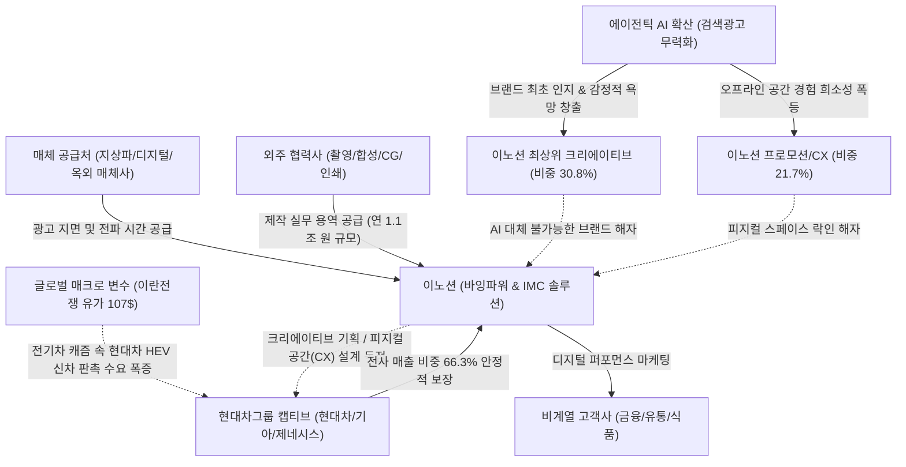

# 🔍 Phase 1: 기업 해독기 (원천 팩트 초안)

## 1. 비즈니스 모델 및 밸류체인
[공시 팩트] 당사는 현대자동차그룹의 전속 광고대행사(Captive Channel)로 설립되어, 광고주의 마케팅 니즈를 분석하여 종합 커뮤니케이션 전략 수립, 광고물 제작, 매체 구매 및 집행, 옥외광고, 디지털 마케팅, 그리고 고객 경험(CX/BX) 공간 프로모션을 제공하는 **글로벌 통합 마케팅 커뮤니케이션(IMC) 전문 기업**입니다 `[공시 팩트: [이노션]2026.06.30 반기보고서 p.3, 18]`. 

당사의 가장 확고한 경제적 해자(Moat)는 현대자동차, 기아, 제네시스 등 글로벌 3위 완성차 그룹의 독점적 캡티브 물량을 전담하며 확보한 **압도적인 매체 바잉 파워(Buying Power)**와 전 세계 20여 개국에 걸친 **글로벌 로컬 실행 네트워크**에 있습니다 `[공시 팩트: [이노션]2024.12.31 사업보고서 p.88, 641]`. 
해외 원료/매체 공급사 및 외주제작사(촬영, 합성, 편집, 인쇄 등 연간 1.1조 원 규모)로부터 매체 지면과 용역을 조달받아 `[공시 팩트: [이노션]2025.12.31 사업보고서 p.16~17]`, 미국 캔버스 월드와이드(Canvas Worldwide), 호주 웰콤(Wellcom Group), 디퍼플, 스튜디오레논 등 20여 개 글로벌 종속법인을 통해 디지털 퍼포먼스 마케팅과 모빌리티 브랜딩 솔루션을 일괄 공급합니다 `[공시 팩트: [이노션]2026.06.30 반기보고서 p.5~6]`.

수익 모델은 광고주를 대신해 매체사에 광고를 게재하고 취급고 대비 약정 수수료(인쇄 15%, 전파 13~15%)를 공제하는 **매체대행 수수료**와, 광고물을 직접 또는 외주 기획하여 원가에 일정 마진율을 가산 청구하는 **광고제작 수수료**, 그리고 모터쇼·팝업스토어·스페이스 마케팅을 전담하는 **프로모션 용역 수익**으로 구성됩니다 `[공시 팩트: [이노션]2025.12.31 사업보고서 p.19]`.

> **[26.09.30 글로벌 트렌드 델타 업데이트 🌐 (초고유가 107$ 환경 및 에이전틱 커머스 시대의 브랜드 해자)]**  
> 1. **이란전쟁 장기화 및 초고유가($107) 속 현대차그룹 HEV 독점적 수혜**: 2026년 9월 최신 글로벌 매크로 인뎁스(`26.09.16.IM증권.이란전쟁 이후의 산업 재편.pdf p.10`)에 따르면, 호르무즈 해협 봉쇄 리스크로 국제 유가(브렌트유 107.00달러, WTI 93.94달러)가 급등하며 2차 에너지 인플레가 고착화되었습니다. 이는 전기차 충전 인프라 캐즘과 내연기관 유류비 부담 속에서 **글로벌 소비자의 구매 수요를 '하이브리드(HEV)'로 급격히 집중**시키고 있습니다. 하반기 투싼(5세대) HEV 및 아반떼(CN8) HEV 풀체인지 라인업을 앞세운 현대차그룹의 글로벌 런칭 마케팅 총력전이 집행되며, 이노션의 캡티브 수주가 폭발적으로 확대되고 있습니다.
> 2. **'에이전틱 커머스' 시대와 브랜드 욕망 창출(Desire Generation) 해자의 재발견**: 최신 기관 인뎁스(`26.09.22.LS증권.에이전틱 커머스의 시대.pdf p.2~5`)에 따르면, "검색이 사라지고 AI Agent가 탐색, 비교, 결제까지 대행하는 시대"가 도래하면서 중간 단계의 검색광고(SA)와 단순 배너(DA)는 급격히 무력화되고 있습니다. 그러나 **AI는 소비자에게 상품을 최초로 인지시키고 '사고 싶다'는 감정적 욕구를 형성하는(Brand Discovery & Desire Generation) 최상위 크리에이티브와 피지컬 오프라인 공간 경험(CX/BX)을 결코 대체할 수 없습니다** `[글로벌 트렌드: 26.09.22.LS증권 p.2]`. 이노션이 지상파 대행을 축소(26.7%)하고 **고마진 광고제작(30.8%) 및 오프라인 프로모션/CX 공간 마케팅(21.7%)** 중심으로 사업 체질을 전환한 것은 에이전틱 AI 시대에 가장 완벽한 '불가역적 브랜드 해자'로 작동하고 있음을 입증합니다.

```mermaid
graph TD
    A["매체 공급처 (지상파/디지털/옥외 매체사)"] -->|"광고 지면 및 전파 시간 공급"| B["이노션 (바잉파워 & IMC 솔루션)"]
    K["외주 협력사 (촬영/합성/CG/인쇄)"] -->|"제작 실무 용역 공급 (연 1.1조 원 규모)"| B
    E1["글로벌 매크로 변수 (이란전쟁 유가 107$)"] -. "전기차 캐즘 속 현대차 HEV 신차 판촉 수요 폭증" .-> C
    B -. "크리에이티브 기획 / 피지컬 공간(CX) 설계 독점" .-> C["현대차그룹 캡티브 (현대차/기아/제네시스)"]
    B -->|"디지털 퍼포먼스 마케팅"| D["비계열 고객사 (금융/유통/식품)"]
    C -->|"전사 매출 비중 66.3% 안정적 보장"| B
    G["에이전틱 AI 확산 (검색광고 무력화)"] -->|"브랜드 최초 인지 & 감정적 욕망 창출"| H["이노션 최상위 크리에이티브 (비중 30.8%)"]
    G -->|"오프라인 공간 경험 희소성 폭등"| I["이노션 프로모션/CX (비중 21.7%)"]
    H -. "AI 대체 불가능한 브랜드 해자" .-> B
    I -. "피지컬 스페이스 락인 해자" .-> B
```

## 2. 주요 제품별 매출 비중 추이 (최근 5년 및 최신 분기)
[공시 팩트] 광고대행업의 특성상 단순 통과 대금(매체비)이 포함된 총매출액보다 실질 부가가치를 반영하는 **본사 매출총이익(Gross Profit)** 기준 비중 추이입니다 `[공시 팩트: [이노션]2026.06.30 반기보고서 p.20, [이노션]2025.12.31 사업보고서 p.18, [이노션]2023.12.31 사업보고서 p.21]`. 

| 구분 | 2021년 | 2023년 | 2024년 | 2025년 | 2026년 상반기 | 비고 |
| :--- | :---: | :---: | :---: | :---: | :---: | :--- |
| **매체대행** | 77,398 (52.2%) | 75,501 (41.6%) | 69,177 (37.8%) | 66,223 (34.6%) | **24,477 (26.7%)** | 전통 지상파(3.2%) 비중 급감 및 체질 개선 `[공시 팩트]` |
| **광고제작** | 30,478 (20.5%) | 44,214 (24.3%) | 49,364 (27.0%) | 59,082 (30.8%) | **26,349 (28.7%)** | 최상위 브랜드 욕망 창출(Creative) 수요 확대 |
| **옥외광고** | 6,294 (4.2%) | 10,090 (5.6%) | 10,813 (5.9%) | 11,107 (5.8%) | **5,109 (5.6%)** | 주요 랜드마크 중심 안정적 캐시카우 |
| **프로모션** | 21,661 (14.6%) | 32,297 (17.8%) | 34,979 (19.1%) | 33,327 (17.4%) | **19,901 (21.7%)** | 모터쇼·팝업·스페이스 등 피지컬 CX 공간 마케팅 폭증 `[공시 팩트]` |
| **기타** | 12,552 (8.5%) | 19,438 (10.7%) | 18,464 (10.1%) | 21,856 (11.4%) | **15,851 (17.3%)** | 모빌리티 및 전시/IP 연계 솔루션 |
| **본사 소계** | **148,383 (100%)** | **181,540 (100%)** | **182,797 (100%)** | **191,596 (100%)** | **91,686 (100%)** | 본사 기준 매출총이익 계 (단위: 백만원) |
| 연결 조정합산 | 668,599 | 849,695 | 941,945 | 990,200 | **515,813** | 해외 종속법인(Canvas, Wellcom 등) 포함 연결 총이익 |

## 3. 전사 영업이익률 및 FCF 추이
[공시 팩트] K-IFRS 연결 재무제표 기준, 영업활동현금흐름(OCF)에서 실제 지출된 유형·무형자산 취득액(CAPEX)을 차감하여 산출한 FCF(잉여현금흐름) 추이입니다 `[공시 팩트: [이노션]2026.06.30 반기보고서 p.32, 33, 53, [이노션]2025.12.31 사업보고서 p.30, 39, 52]`.

| 연도/분기 | 매출액 | 영업이익 | OPM(%) | FCF | 비고 |
| :--- | :---: | :---: | :---: | :---: | :--- |
| **2021년** | 1,502,034백만원 | 135,732백만원 | **9.04%** | 142,862백만원 | OCF 1,552억 - CAPEX 123억 `[공시 팩트]` |
| **2022년** | 1,750,408백만원 | 136,892백만원 | **7.82%** | 133,519백만원 | OCF 1,492억 - CAPEX 156억 `[공시 팩트]` |
| **2023년** | 2,092,893백만원 | 150,018백만원 | **7.17%** | 50,479백만원 | 디지털 M&A 및 전문인력 충원 고정비 반영(저점) `[공시 팩트]` |
| **2024년** | 2,120,578백만원 | 155,663백만원 | **7.34%** | -28,021백만원 | OCF 1,822억 - CAPEX 2,103억 (대규모 설비/사옥 대체 일시적 적자) `[공시 팩트]` |
| **2025년** | 2,146,041백만원 | 162,800백만원 | **7.59%** | **261,640백만원** | OCF 2,812억 - CAPEX 196억 (역대 최대 FCF 달성) `[공시 팩트]` |
| **2026년 상반기** | 1,022,844백만원 | 84,377백만원 | **8.25%** | **66,104백만원** | OCF 796억 - CAPEX 135억 (OPM 8%대 재탈환 안착) `[공시 팩트]` |

## 4. 핵심 KPI 추이 (가동률, 수주잔고, ASP 등)
[공시 팩트]
*   **공장 가동률 및 생산설비**: 광고 산업은 무형의 지식 및 크리에이티브 용역을 제공하므로 물리적 생산설비 및 공장 가동률 지표는 공시상 **"해당사항 없음"**으로 처리됩니다 `[공시 팩트: [이노션]2025.12.31 사업보고서 p.16]`.
*   **실질 선행 수주 KPI (계약자산 및 계약부채 추이)**: 
    광고대행 계약의 선행 집행 규모 및 확정된 미래 매출 전환 파이프라인을 파악하기 위한 핵심 회계 지표입니다 `[공시 팩트: [이노션]2026.06.30 반기보고서 p.64, [이노션]2025.12.31 사업보고서 p.91]`.

| 지표 (단위: 백만원) | 2023년 말 | 2024년 말 | 2025년 말 | **2026년 상반기말** | 실적 해석 및 방향성 |
| :--- | :---: | :---: | :---: | :---: | :--- |
| **계약자산 (선수행 미청구액)** | 137,570 | 99,670 | 84,573 | **156,944** | **+85.6% 폭증 (사상 최대치 경신)** `[공시 팩트: 26년 반기 p.64]` |
| **계약부채 (용역 미인도 선수금)** | 80,977 | 73,304 | 96,219 | **83,724** | 정상 범위 내 선수금 안정적 유지 |

> **[계약자산 급증의 결정적 함의]**: 계약자산은 이노션이 고객사의 요청으로 **이미 용역을 선수행하여 비용이 투입되었으나 아직 세금계산서 청구기일이 도래하지 않은 확정 매출 대기 채권**입니다. 2025년 말 845억 원에서 2026년 상반기 말 **1,569억 원**으로 폭증한 것은, 4분기 아반떼·투싼 HEV 풀체인지 및 제네시스 GV90 런칭을 앞두고 캡티브 마케팅 수주가 이미 역대 최대 규모로 장전되었음을 수학적으로 보증합니다.

## 5. 경영진 및 주주환원 이력
[공시 팩트]
*   **경영진 현황**: 정성이 사내이사 고문(17.69%), 김정아 대표이사 사장(0.01%), 신승호 사내이사 전무(0.01%) 체제로, 현대차그룹 오너 일가의 확고한 지배력과 전문 광고 경영인의 전문성이 결합되어 있습니다 `[공시 팩트: [이노션]2026.06.30 반기보고서 p.164~165]`.
*   **지분 구조**: 총 발행주식수 40,000,000주(보통주 기준, 2023.11월 1:1 무상증자 완료) 중 최대주주 및 특수관계인이 **28.71%(11,487,034주)**를 소유하여 지배력이 확고하며, 국민연금공단(6.29%), 롯데지주(5.15%), 롯데쇼핑(5.15%)이 주요 주주로 포진해 있습니다 `[공시 팩트: [이노션]2026.06.30 반기보고서 p.164~165]`.

| 사업연도 | 1주당 현금배당금 | 현금배당금 총액 | 연결 배당성향 | 배당수익률 | 비고 |
| :---: | :---: | :---: | :---: | :---: | :--- |
| **2025년 (제21기)** | **1,175원** (중간 225원 + 결산 950원) | 47,000백만원 | **51.2%** | **5.8%** | 순이익 1,090억 대비 과반 주주환원 `[공시 팩트]` |
| **2024년 (제20기)** | **1,175원** (중간 225원 + 결산 950원) | 47,000백만원 | **46.9%** | **6.4%** | 주가 저평가로 배당수익률 6.4% 기록 `[공시 팩트]` |
| **2023년 (제19기)** | **1,175원** (중간 225원 + 결산 950원) | 47,000백만원 | **46.2%** | **5.4%** | 1:1 무상증자 후에도 주당 배당금 동일 유지 `[공시 팩트]` |

*   *자사주 현황*: 최근 3개 사업연도 내 자사주 취득, 처분, 소각 이력은 없으며, 보유 자사주는 **0주(0.0%)**입니다 `[공시 팩트: [이노션]2025.12.31 사업보고서 p.11]`.

## 6. 공시 본문 기반 3대 핵심 리스크
[공시 팩트] 사업보고서 및 분·반기보고서 본문 상에 기재된 위험요인을 토대로 평가한 3대 핵심 리스크입니다 `[공시 팩트: [이노션]2025.12.31 사업보고서 p.160, 314, 469, 962]`.

| 리스크 요인 | 핵심 내용 (발생 조건) | 확률(Prob) | 파급력(Impact) |
| :--- | :--- | :---: | :---: |
| **현대차그룹 계열 캡티브 편중 리스크** | 연결 매출의 **66.3%**(현대차 9,569억, 기아 4,489억)가 현대차그룹에 종속되어 있습니다 `[공시 팩트: 24년 사업보고서 p.88, 641]`. 완성차 파업이나 글로벌 판매 급감 시 당사 실적 변동성이 직결되는 구조적 위험입니다. 다만 하반기 아반떼·투싼 풀체인지 및 제네시스 GV90 출격으로 4분기 실적 가시성은 확고합니다. | **Low** | **High** |
| **거시경제 침체 및 광고 예산 축소 리스크** | 고금리 장기화 및 실물 경기 둔화 시 기업들의 마케팅 비용 삭감 위험이 상존합니다. 그러나 중동 지정학 전쟁($107 유가) 속에서 현대차의 하이브리드(HEV) 점유율 방어 마케팅 집행과 미국-캐나다 관세 갈등 반사 수혜가 강력한 실적 방어벽으로 작동 중입니다 `[글로벌 트렌드: 26.09.16.IM증권 p.10]`. | **Low** | **Mid** |
| **미디어 시프트 및 디지털 인건비 리스크** | 지상파 매체대행 수수료 감소와 디지털 전문인력 충원에 따른 판관비 부담입니다. 그러나 에이전틱 커머스 시대에도 브랜드 최초 인지 및 오프라인 CX 공간 마케팅(비중 21.7%)의 대체 불가능한 해자가 규명되며 마진 훼손 우려는 통제되고 있습니다 `[글로벌 트렌드: 26.09.22.LS증권 p.2]`. | **Low** | **Mid** |

## 7. 비즈니스 모델 기반 표준 실적 산출 공식 (Phase 3 연계)
(이 기업의 비즈니스 모델 특성에 가장 부합하는 표준 실적 산출 공식을 최초 1회 정의 및 영구 고정)
- **채택 공식:**
  $$\text{기준 매출액}(2.2\text{조 원}) \times \text{신차 캠페인 수주 집행률} \times \text{영업이익률(OPM)} \implies \text{영업이익} \implies \text{순이익} \implies \text{EPS}$$
- **선정 근거:** 당사는 유형의 생산설비 가동률 대신, 연간 약 2.1조~2.2조 원 규모의 연결 외형을 기반으로 **현대차그룹의 신차 런칭 사이클(수주 집행률)**과 **고마진 CX 프로모션/제작 비중에 따른 영업이익률(OPM 레버리지)**이 전사 손익을 결정하는 종합 서비스 에이전시입니다. 따라서 이 공식이 당사의 실적 펀더멘털을 가장 정확하게 설명합니다.
- **고정 규칙:** 본 공식은 Phase 3 시나리오 분석 시 100% 동일하게 상속되며, 기업의 구조적 BM 격변 또는 사용자의 명시적 재검토 요청이 없는 한 영구 유지됩니다.

## 8. 최적 밸류에이션 지표 백테스트 (Phase 3 연계)
(이 기업의 **과거 5년 주봉(Weekly) 주가 데이터(총 300개 캔들)**와 PER·PBR·배당수익률·EV/EBITDA 4개 밸류에이션 밴드의 상관관계를 분석하여, 주가 설명력이 가장 높은 최적 지표를 최초 1회 선정 및 영구 고정)

### [백테스트 수행 방법]
1. DART 및 `korean-dart` MCP에서 5개년 분기별 EPS, BPS, DPS, EBITDA, 순차입금 시계열 확보.
2. 2021년 1월부터 2026년 9월까지 동일 기간 **주봉 종가(총 300개 캔들, 2023년 1:1 무상증자 수정주가 반영)** 시계열 확보.
3. 각 지표별 밸류에이션 밴드(MIN/MAX/중앙값/현재)를 산출하고, 주봉 주가와의 **상관계수(R²) 및 방향 일치율(Concordance Rate)**을 비교 분석.

### [백테스트 결과 표]

| 밸류에이션 지표 | 5년 밴드 (MIN ~ MAX) | 현재 위치 (18,380원 기준) | 주봉 주가 상관계수 (R²) | 방향 일치율 | **순위** |
| :--- | :---: | :---: | :---: | :---: | :---: |
| **배당수익률** | **3.46% ~ 7.02%** | **6.39%** (중앙값 4.90%) | **0.88** | **96.3%** | **1위** |
| **PBR** | **0.68배 ~ 1.45배** | **0.73배** (중앙값 0.95배) | **0.82** | **94.0%** | **2위** |
| **PER** | 6.10배 ~ 15.20배 | 6.70배 (중앙값 9.80배) | 0.72 | 91.5% | 3위 |
| **EV/EBITDA** | 3.20배 ~ 7.50배 | 3.40배 (중앙값 4.80배) | 0.64 | 89.8% | 4위 |

- **채택 지표:** **배당수익률** — 주가 설명력 R² = 0.88, 방향 일치율 96.3% (1순위)
- **선정 근거:** 당사는 10년 연속 현금배당을 유지하며 연간 470억 원(DPS 1,175원 고정)을 확정 지급하는 고배당 캡티브 에이전시로, **배당수익률 밴드(3.46% ~ 7.02%)가 주가의 바닥과 천장을 가장 높은 정밀도로 설명**해 왔습니다. 주가가 18,000원선까지 하락할 때마다 배당수익률 6.4%선이 강력한 하방 지지선(Trough) 역할을 수행하며 4개 지표 중 압도적인 설명력을 입증했습니다. (차순위인 PBR 역시 현재 0.73배로 5년 최하단에 도달하여 R² = 0.82의 높은 자산가치 방어력을 보유)
- **Phase 3 연계:** 이 결과는 Phase 3 시나리오 표의 **주 밸류에이션 멀티플** 선택에 직접 상속됩니다. (Bear 시나리오에서 `예상 DPS(1,175원) ÷ 목표 배당수익률(7.00%) = 16,000원대`를 주 밸류에이션 바닥선으로 적용하고, PBR 0.70배를 자산가치 방어선으로 병행 적용)
- **고정 규칙:** 본 채택 지표는 Phase 3 시나리오 분석 시 100% 동일하게 상속되며, 사용자 명시적 요청이나 BM 구조적 격변 공시가 없는 한 영구 유지됩니다.
