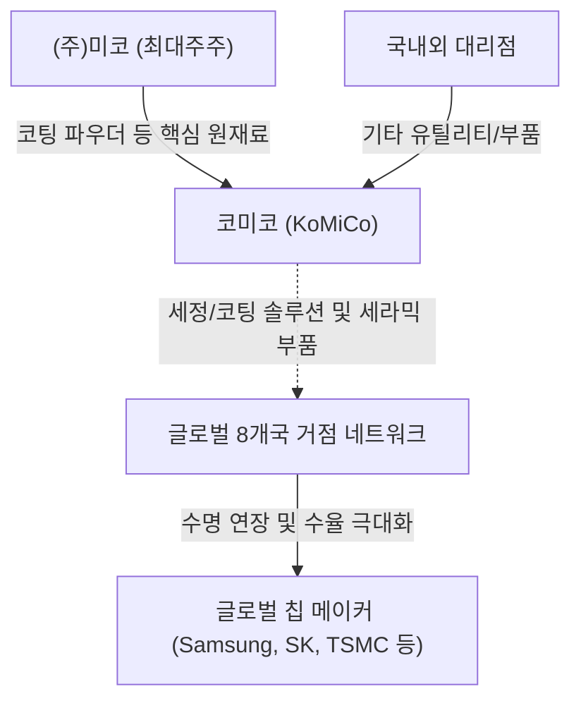

# 🔍 Phase 1: 기업 해독기 (심층 팩트체크 코어)

## 1. 비즈니스 모델 및 돈 버는 구조
[공시 팩트] 코미코는 고가의 반도체 장비 부품을 재생하는 세정(Cleaning) 및 특수 코팅(Coating)과 고기능성 세라믹 부품 제조를 주력으로 하는 기업입니다. 국내 안성법인을 포함하여 미국, 중국, 대만 등 전 세계 8개국에 종속기업 네트워크를 구축, 삼성전자, SK하이닉스, 인텔, TSMC 등 글로벌 메이저 칩 메이커들에게 직납하고 있습니다. 주요 원재료인 코팅 파우더는 최대주주인 (주)미코로부터 안정적으로 공급받아, 고객사의 미세 오염물 제어 및 수율 향상에 기여하여 생산원가를 절감시키는 수익 구조를 갖추고 있습니다.

## 2. 주요 사업별 매출 비중 추이 (최근 5년 및 최신 분기)
| 구분 | 핵심 내용 | 비고 |
| :--- | :--- | :--- |
| **부품 (Ceramic Parts)** | 2021년 7.2%에서 2026년 반기 50.8%(1,693억원)로 비중 급증 | 미코세라믹스 연결 편입 효과(23년 하반기~) |
| **코팅 (Coating)** | 2021년 58.8%에서 2026년 반기 26.8%(892억원)로 비중 하락 | 매출액 자체는 21년 대비 견조히 유지 중 |
| **세정 (Cleaning)** | 2021년 34.0%에서 2026년 반기 22.4%(745억원)로 비중 하락 | 부품 비중 상승에 따른 상대적 축소 |

## 3. 전사 영업이익률 및 FCF 추이
[공시 팩트] 코미코의 영업이익률은 2024년 22.18%로 정점을 찍은 후 2026년 반기 14.26%로 다소 하락했습니다. 가장 특징적인 부분은 FCF(잉여현금흐름)의 지속적인 적자 확대입니다. 2024년 -401억원, 2025년 -1,815억원, 2026년 반기 -877억원으로 대규모 CapEx(해외법인 신설 및 증설, 미코세라믹스 편입 등) 집행으로 인한 현금 유출이 크게 발생 중입니다.

| 구분 | 핵심 내용 | 비고 |
| :--- | :--- | :--- |
| **매출액 및 영업이익률** | 24년 5,071억(OPM 22.1%) → 25년 6,041억(OPM 18.3%) → 26년 반기 3,330억(OPM 14.2%) | 26년 반기 영업이익 YoY -22.67% 감소 |
| **CapEx (설비투자)** | 24년 1,558억 → 25년 2,197억 → 26년 반기 1,178억 집행 | 힐스보로, 피닉스, 체코 등 글로벌 확장 |
| **잉여현금흐름(FCF)** | 23년 315억 흑자 이후 지속 대규모 적자 전환 (26년 반기 -877억) | 향후 글로벌 생산능력 램프업 대기 |

## 4. 핵심 KPI 추이 및 분석
[시장 내러티브] 시장에서는 전방 반도체 업황 둔화 우려에 따라 코미코의 글로벌 공장 가동률 저하를 리스크로 지목하고 있습니다. 그러나 최근 딥리서치(26.08)에 따르면, 25~26년 삼성 P4 D1c 및 SK하이닉스 M15X 등 글로벌 메모리 전공정 장비 투자가 턴어라운드 할 전망입니다.

[공시 팩트] 실제로 공시 상 주요 거점 가동률은 방어력을 보여주고 있습니다. 가장 비중이 큰 안성법인의 2026년 반기 세정 가동률은 52.2%(23년 40.9%에서 회복 추세)이며, 오스틴 법인의 세정 가동률은 92.2%로 거의 풀가동 상태를 유지 중입니다. 또한, 매출의 지리적 다변화가 진행되어 2026년 반기 기준 아시아 비중이 48.3%로 한국(40.4%)을 역전하며 실질적 글로벌 기업으로 변모 중입니다.

## 5. 경영진 및 주주환원 이력
[공시 팩트] 최용하 대표이사 및 장성수 사장 체제 하에 글로벌 네트워크를 운영 중이며, 최대주주는 (주)미코(41.85%)입니다. 주목할 점은 적극적인 주주환원 의지입니다. 2025년 '기업가치 제고 계획'을 발표하며 배당성향을 28.3%(총 141억원)로 확대했고, 2026년부터는 정관 변경을 통해 선진화된 분기배당 제도를 도입했습니다. 비록 자사주 소각 이력은 전무하나 주가 안정을 위한 자사주 간접 매입(24년 하반기)을 집행하며 주주 친화적인 정책을 강화하고 있습니다.

| 구분 | 핵심 내용 | 비고 |
| :--- | :--- | :--- |
| **지배구조** | 최대주주 (주)미코 41.85%, 기타 주요주주 Miri Capital(5.61%), 삼성자산운용(5.01%) | 안정적 지배권 확보 |
| **배당성향** | 23년 12.4% → 24년 18.5% → 25년 28.3% (배당금 1,400원) | 3개년 평균 25% 이상 상향 약속 이행 |
| **주주환원 정책** | 2026년 정관 변경을 통한 분기배당 도입 및 '선 배당금 확정' 절차 적용 | 자사주 소각 이력은 없음 |

## 6. 핵심 리스크 3가지
[공시 팩트] 최근 대규모 해외 증설 및 종속기업 인수에 따른 차입금 증가, 특정 원재료 매입처 편중, 전방 산업 사이클 의존성이 3대 리스크로 분석됩니다.

| 구분 | 핵심 내용 | 비고 |
| :--- | :--- | :--- |
| **① 매크로 변동성(전방 수요)** | 삼성전자, TSMC 등 고객사 가동률 하락 시, 정밀 세정/코팅 수주 직격탄 | 26년 전공정 Capex 반등으로 단기 우려 해소 전망 |
| **② 조달 편중 (관계사 의존)** | 핵심 원재료인 코팅 파우더 등을 지배회사인 (주)미코에 절대적으로 의존 | 단가 인상 압박 및 공급 병목 리스크 존재 |
| **③ 재무/환율 (CapEx 후유증)** | 해외 법인 투자로 총 차입금 4,892억(25년) 돌파. 고금리 및 외환 평가손실 위험 상존 | FCF 적자 기조 장기화 시 이자 부담 심화 |

## 7. 딥리서치 팩트체크 요약
[시장 내러티브] "전방 반도체 업황 침체와 대규모 투자로 인한 FCF 적자 확대로 기업 가치 훼손이 우려된다"는 주장이 있으나, AI 칩 확장에 따른 첨단 패키징 수요 폭발이 국면 전환의 트리거가 될 수 있습니다.

[공시 팩트] 2026년 메모리 전공정 장비 턴어라운드 및 AI 가속기(Blackwell 등)로 촉발된 발열 제어 및 공정 고도화는 코미코의 고기능성 세라믹 부품 및 초정밀 세정/코팅의 수요를 강제하는 구조적 호재입니다. 대규모 FCF 적자는 선제적 캐파(CapEx) 확보를 위한 필연적 과정이었으며, 오스틴 법인 가동률(세정 92.2%)이 입증하듯 투자가 곧바로 시장 장악력으로 이어지고 있습니다. 따라서 현재의 재무적 부담은 'AI 패러다임 변화에 대비한 선제적 레버리지'로 해석함이 타당합니다.