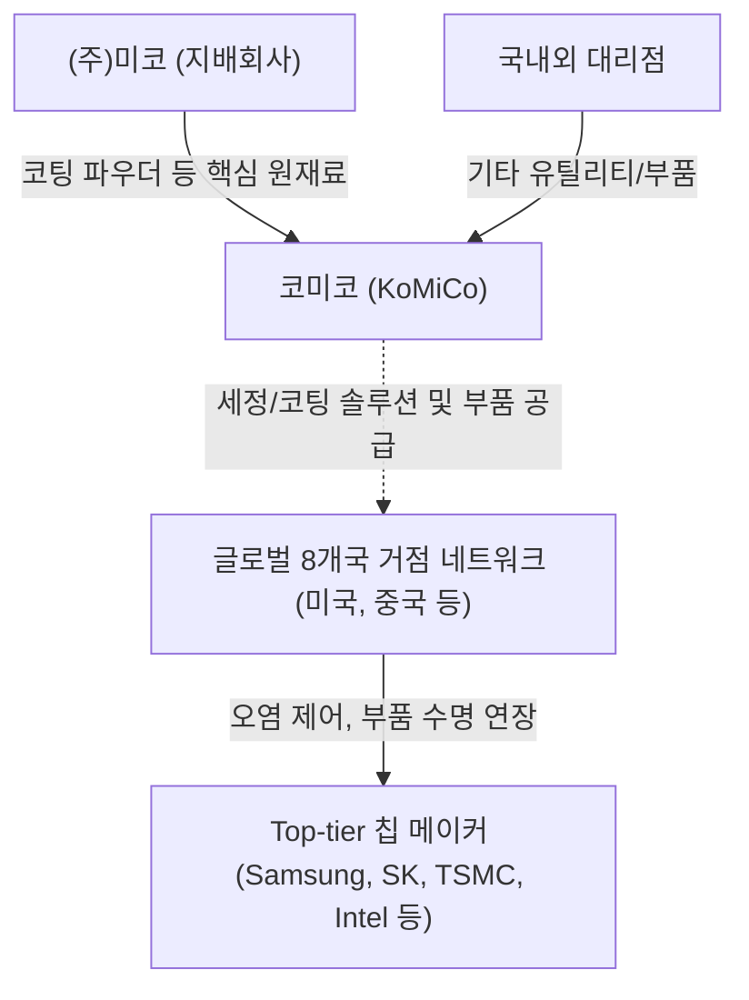

# 🔍 Phase 1: 기업 해독기 (심층 팩트체크 코어)

## 1. 매크로 및 산업 사이클(Sector Cycle) 현황
[시장 내러티브] 최근 반도체 산업은 과거 2023년의 다운사이클을 지나 강력한 **호황기 초입(턴어라운드)**에 진입하고 있습니다. `[팩트: cycle_timeline.md]` 특히 글로벌 메모리 시장은 범용 DRAM 공급 여력이 제한적인 '외화내빈' 구조에 직면해 있으며, 이를 타개하기 위해 2026년 하반기부터 대규모 전공정(WFE) 증설 사이클이 본격화되고 있습니다 `[전망: SK증권 8월]`. 2025년 1,230억 달러에서 2026년 1,360억 달러 이상으로 WFE 투자가 급반등할 전망이며, 삼성 평택 P4 및 SK하이닉스 M15X 등 선단 공정 투자가 집중되는 명확한 변곡점에 서 있습니다 `[전망: SK증권 8월, 반도체섹터 주간 트렌드(26.08)]`.

## 2. 비즈니스 모델 및 경제적 해자(Moat)
[공시 팩트] 코미코는 고가의 반도체 공정 장비 부품을 재생하는 세정(Cleaning) 및 특수 코팅(Coating) 부문과 고기능성 세라믹 부품(미코세라믹스)을 생산하는 비즈니스 모델을 가집니다. 국내 세정/코팅 시장 점유율 약 30~42% 수준의 독보적 1위 기업으로 `[추정: 웹 검색 결과]`, 경쟁사(원익QnC 등) 대비 세정/코팅 사업에 집중하며 전 세계 8개국 거점(미국, 중국, 대만 등)을 통한 밀착 현지화 역량이 강력한 경제적 해자(Moat)로 작용합니다. 핵심 원재료인 특수 코팅 파우더는 지배회사인 (주)미코로부터 독점 수급하여 원재료 조달의 안정성을 확보하고 있습니다 `[팩트: 26년 반기보고서 p.35]`.

## 3. 주요 사업별 매출 비중 추이 (최근 5년 및 최신 분기)

| 구분 | 핵심 내용 | 비고 |
| :--- | :--- | :--- |
| **부품 (Ceramic Parts)** | 2021년 7.2% → 2026년 반기 **50.8% (1,693억원)** | 미코세라믹스 사업결합 효과 (23년 하반기~) `[팩트: 26년 반기보고서 p.74]` |
| **코팅 (Coating)** | 2021년 58.8% → 2026년 반기 26.8% (892억원) | 안정적 매출 유지 중이나 부품 성장으로 비중 하락 `[팩트: 26년 반기보고서 p.74]` |
| **세정 (Cleaning)** | 2021년 34.0% → 2026년 반기 22.4% (745억원) | 선단 공정 유지보수 수요로 견고한 매출 유지 `[팩트: 26년 반기보고서 p.74]` |

## 4. 전사 영업이익률 및 FCF 추이
[공시 팩트] 글로벌 팹 증설과 미코세라믹스 인수에 따른 CapEx 폭증으로 FCF 적자가 깊어지고 있습니다. 외형(매출)은 성장세이나 감가상각비 등 고정비 증가로 OPM은 하락세입니다.

| 구분 | 핵심 내용 | 비고 |
| :--- | :--- | :--- |
| **매출액 및 OPM** | 24년 5,071억(22.2%) → 25년 6,041억(18.4%) → 26년 반기 3,330억(14.3%) | 이익률 지속 하락 국면 `[팩트: 25년 IR Book, 26년 반기보고서]` |
| **FCF (잉여현금흐름)** | 24년 -401억 → 25년 -1,815억 → 26년 반기 -877억 | 미국/유럽 법인 선제적 CapEx 집행 `[팩트: 26년 반기보고서 p.139, 140]` |

## 5. 핵심 KPI 추이 및 분석 (과거 사이클 고점/저점 비교 필수)
[시장 내러티브] 다운사이클 및 무리한 대규모 증설로 인한 공장 가동률 저하와 마진 압박 우려가 지배적입니다.

[공시 팩트] 과거 슈퍼 사이클 고점과 불황기 저점을 비교해 볼 때 턴어라운드 추세가 뚜렷합니다.
- **안성법인(세정)**: 2021년 호황기 고점 54.1% → 2023년 불황기 저점 40.9% → 2026년 반기 52.2%로 전고점에 근접하며 강력한 턴어라운드를 시현했습니다 `[팩트: 26.3월 사업보고서, 26년 반기보고서 p.35]`.
- **오스틴법인(세정/코팅)**: 2026년 반기 세정 가동률은 92.2%로 역대 최고 수준 풀가동 중입니다. 반면 오스틴 코팅 가동률은 22년 고점 92.5% 대비 26년 반기 39.7%로 저점 상태이나, 2026~2027년 글로벌 WFE 턴어라운드 기조에 따라 향후 폭발적인 반등 잠재력을 내포하고 있습니다 `[팩트: 26년 반기보고서]`.

## 6. 경영진 및 주주환원 이력
[공시 팩트] 최용하 대표이사 중심의 경영 체제로, 최대주주 (주)미코가 지분 41.85%를 안정적으로 보유하고 있습니다 `[팩트: 26년 반기보고서 p.121]`. 2025년 '기업가치 제고 계획' 발표를 기점으로 배당성향을 대폭 끌어올렸으며 분기배당 제도를 전격 도입했습니다.

| 구분 | 핵심 내용 | 비고 |
| :--- | :--- | :--- |
| **지배구조 및 주주환원** | 23년 배당성향 12.4% → 25년 28.3%(총 배당 141억). 현재 자사주 1.83% 보유 | 2026년 정관 변경으로 분기배당 실시 `[팩트: 25년 IR Book, 26년 반기보고서]` |

## 7. 핵심 리스크 분석 (확률 및 파급력 계량화)
[공시 팩트]

| 리스크 요인 | 핵심 내용 (발생 조건) | 확률(Prob) | 파급력(Impact) |
| :--- | :--- | :--- | :--- |
| **① 전방 가동률 및 WFE 축소** | 반도체 메이커 감산 및 신규 팹 셋업 지연 시 세정/코팅/부품 수요 직격탄 | **Low** (현재 WFE 반등 사이클 `[전망: SK증권 8월]`) | **High** |
| **② 차입금 급증 및 환율 리스크** | 총차입금 4,892억 돌파(25년 기준). 고금리 지속 시 이자비용 가중 및 외환 평가손실 확대 `[팩트: 26년 반기보고서]` | **High** (이미 현실화) | **Mid** |
| **③ 원재료 매입처 미코 편중** | 코팅 파우더의 지배회사(미코) 독점 공급에 따른 단가 인상 압박 및 원가 통제력 약화 우려 `[팩트: 26년 반기보고서]` | **Mid** | **Mid** |

## 8. 딥리서치 팩트체크 요약
[시장 내러티브] 대규모 FCF 적자와 OPM 하락으로 외형 팽창 대비 수익성 내실이 부족하다는 평가가 존재합니다.

[공시 팩트] OPM 하락 및 차입금 급증 수치는 사실이나 `[팩트: 26년 반기보고서]`, 부품(미코세라믹스) 매출 비중이 50.8%로 상승하며 고부가 체질 개선이 완료되었습니다. 글로벌 WFE 증설 사이클 본격화 `[전망: SK증권 8월]` 기조와 미국 오스틴 세정 풀가동(92.2%) `[팩트: 26년 반기보고서]` 지표는 과거 선행 투자(CapEx)의 타당성을 입증합니다. 현재의 펀더멘털 압박은 2026~2027년 고객사의 선단 라인(미국 팹 등) 램프업과 함께 대규모 실적 레버리지로 회수될 것입니다.