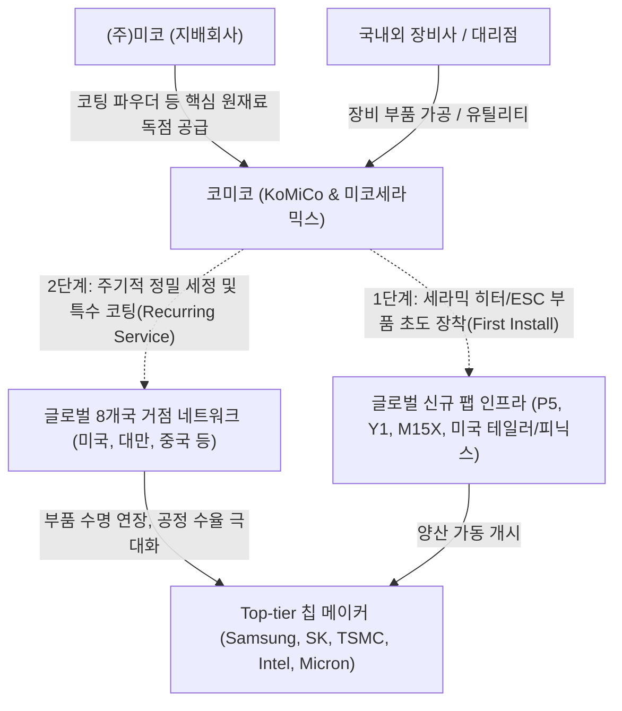

# 🔍 Phase 1: 기업 해독기 (심층 팩트체크 코어)

## 1. 매크로 및 산업 사이클(Sector Cycle) 현황

[시장 내러티브] 
글로벌 반도체 산업은 2023~2024년의 침체기를 지나 AI 데이터센터 수요 급증에 힘입어 회복세를 보여왔으나, 레거시 IT 세트 수요 둔화와 공급망 비용 부담으로 인해 2026년 하반기 실적 피크아웃(Peak-out)에 대한 우려가 일부 제기되기도 했습니다.

[26.09.16 트렌드 업데이트] 최신 9월 글로벌 산업 트렌드 및 산업 사이클 타임라인(`cycle_timeline.md`) 분석 결과, 반도체 생태계는 단순한 HBM 패키징 병목 해결 단계를 지나 삼성전자 평택 P5(2027 준공 예정), SK하이닉스 용인 원삼 Y1(첫 클린룸 2027년 2월 예정) 및 P&T7, 청주 M15X 등 **'신규 팹 착공~장비 반입 선행 구간'**이 열리는 **'증설의 시대(인프라·소부장 수주 호황 본격화)'**에 공식 진입했습니다 `[팩트/전망: 하나증권 26.09.02, SK증권 8월, iM증권 8월]`.
특히 메모리 3사의 '외화내빈'(HBM 웨이퍼 캐파 잠식 25% $\rightarrow$ 35%, 미세화 한계로 Bit/Wafer 생산성 기여도 6.5%에 불과) 구조로 인해 클린룸 오픈 및 전공정 장비(WFE) 투자가 2026년 1,360억~1,500억 달러, 2027년 1,900억 달러로 폭발적 확장이 불가피합니다 `[팩트/전망: SK증권 8월, LS증권 8월]`. 전공정 장비사(원익IPS 수주잔고 +112%, 테스 +402%)의 수주 랠리 이후 6~9개월 리드타임을 거쳐 2027년 상반기부터 세정·특수코팅 및 세라믹 부품사의 실적 퀀텀점프가 후행 전개될 전망이며, 코미코는 단순 회복기를 넘어 **구조적 대호황기(Turn-around 확정 및 CAPEX 회수기)**의 변곡점에 서 있습니다.

## 2. 비즈니스 모델 및 경제적 해자(Moat)

[공시 팩트] 
코미코는 반도체 공정 장비의 핵심 소모성 부품을 재생하는 세정(Cleaning) 및 특수 코팅(Coating) 부문과, 고기능성 세라믹 소재·부품(세라믹 히터, 정전척 ESC 등)을 제조하는 미코세라믹스(MCC)를 양대 축으로 하는 융합 비즈니스 모델을 구축하고 있습니다 `[팩트: 2021~2026 반기보고서]`. 국내 세정/코팅 시장 점유율 약 30~42% 수준의 독보적 1위 기업으로 `[추정: 웹 검색 결과]`, 경쟁사(원익QnC, 한솔아이원스 등) 대비 세정·코팅에 전사 역량이 집중되어 있으며 8개국 글로벌 현지 팹 인접 네트워크를 완비하여 압도적인 물리적 전환 비용(Switching Cost)을 확보하고 있습니다.

[26.09.16 트렌드 업데이트] 신규 팹 증설 사이클 본격화에 따라 코미코의 경제적 해자는 2단계 락인(Lock-in) 구조로 진화했습니다:
1. **신규 팹 초기 장비 셋업 수혜(First Install)**: 삼성 평택 P5, SK하이닉스 Y1·M15X 등 신규 팹 완공 시 장비 제작 단계에서 미코세라믹스의 고부가 세라믹 히터 및 ESC 부품이 대규모 초도 장착됩니다.
2. **양산 램프업 후 반복 매출(Recurring Cash Flow)**: 팹이 본격 가동되면 공정 챔버 내 플라즈마 충격으로 마모되는 부품에 대한 주기적 세정 및 특수 코팅 주문이 발생하여 2차 수익을 지속 창출합니다.
3. **글로벌 거점 선점 해자**: 미국(오스틴 366억, 힐스보로 481억, 피닉스 772억 누적 CapEx), 대만(신주/타이난 505억 누적), 중국, 싱가포르 등 8개국 생산 거점 구축으로 TSMC, 인텔, 삼성전자, 마이크론 등 글로벌 톱티어의 현지 팹 가동에 실시간 즉각 대응이 가능합니다 `[팩트: 2025 IR Book]`.

## 3. 주요 사업별 매출 비중 추이 (최근 5년 및 최신 분기)

미코세라믹스(MCC) 인수 및 연결 편입(23년 하반기~) 이후, 코미코의 사업 포트폴리오는 단순 세정/코팅 용역에서 고부가가치 세라믹 부품 제조사로 완벽히 체질 개선되었습니다 `[팩트: 2021~2026 반기보고서]`.

| 구분 | 핵심 내용 | 비고 |
| :--- | :--- | :--- |
| **부품 (Ceramic Parts)** | 2021년 7.2% → 2024년 50.1% → 2026년 반기 **50.8% (1,693억원)** | 세라믹 히터 및 ESC 부품. 연결 실적 최대 캐시카우 등극 `[팩트: 26년 반기보고서 p.74]` |
| **코팅 (Coating)** | 2021년 58.8% → 2024년 27.2% → 2026년 반기 **26.8% (892억원)** | 첨단 미세공정 특수 코팅 수요 견조하나 부품 비중 확대로 믹스 분산 `[팩트: 26년 반기보고서 p.74]` |
| **세정 (Cleaning)** | 2021년 34.0% → 2024년 22.7% → 2026년 반기 **22.4% (745억원)** | 반도체 팹 가동률 상승에 직접 연동되는 필수 유지보수 서비스 `[팩트: 26년 반기보고서 p.74]` |

## 4. 전사 영업이익률 및 FCF 추이

[공시 팩트] 
글로벌 거점(피닉스 법인 신설, 안성/강릉 공장 증설 등) 확충과 미코세라믹스 인수로 2024~2025년 누적 3,932억 원(8개년 누적 6,694억 원)의 대규모 CapEx를 집행함에 따라 FCF 적자가 심화되었습니다 `[팩트: 2025 IR Book, 26년 반기보고서]`. 외형은 가파르게 성장(매출 24년 5,071억 $\rightarrow$ 25년 6,041억)했으나 감가상각비와 인건비 증가로 OPM은 14%대로 일시 조정 국면을 겪고 있습니다.

| 구분 | 핵심 내용 | 비고 |
| :--- | :--- | :--- |
| **매출액 및 OPM** | 24년 5,071억(22.2%) → 25년 6,041억(18.4%) → 26년 반기 3,330억(14.3%) | 선제적 인프라 투자에 따른 초기 감가상각비 증가 영향 `[팩트: 25년 IR Book, 26년 반기보고서]` |
| **FCF (잉여현금흐름)** | 24년 -401억 → 25년 -1,815억 → 26년 반기 -877억 | 미국 피닉스 및 국내 강릉 G5 팹 등 선제적 CapEx 집중 `[팩트: 26년 반기보고서 p.139, 140]` |

[26.09.16 트렌드 업데이트] 최신 9월 기관 분석에 따르면, 시장이 우려했던 FCF 적자와 이익률 하락은 2026 하반기~2027년 도래하는 글로벌 신규 팹(P5, Y1, P&T7, 미국 테일러 등) 장비 반입을 겨냥한 필수적 사전 포석이었습니다. 2026년 하반기를 기점으로 글로벌 CapEx 사이클이 마무리 단계에 접어들고 고정비 분기점을 넘어서면서, 2027년 본격적인 영업레버리지 폭발과 함께 OPM 20%대 재진입 및 FCF 흑자 턴어라운드가 전개될 것으로 분석됩니다 `[전망: SK증권 8월, 하나증권 26.09.02]`.

## 5. 핵심 KPI 추이 및 분석 (과거 사이클 고점/저점 비교 필수)

[시장 내러티브] 
일각에서는 고객사 라인 증설 지연 시 코미코의 글로벌 신설 공장 가동률이 저하되어 대규모 고정비 부담이 발생할 것이라는 디레이팅 논리를 폅니다.

[공시 팩트] 
과거 슈퍼사이클 고점과 불황기 저점을 비교하면 코미코의 핵심 가동률 KPI는 이미 완벽한 바닥을 통과해 급격한 턴어라운드를 기록하고 있습니다:
- **안성법인(세정)**: 과거 2021년 슈퍼사이클 고점 54.1% $\rightarrow$ 2023년 불황기 저점 40.9% $\rightarrow$ 2026년 반기 **52.2%**로 전고점에 완벽히 근접하며 가동률 정상화 달성 `[팩트: 26.3월 사업보고서, 26년 반기보고서 p.35]`.
- **오스틴법인(세정/코팅)**: 2026년 반기 세정 가동률은 **92.2%**에 달해 역사상 최고치 수준의 사실상 풀가동(Full-Capa)을 기록 중입니다 `[팩트: 26년 반기보고서 p.35]`.
- **오스틴법인(코팅)**: 2022년 고점 92.5% 대비 2026년 반기 **39.7%**로 일시적 저점 구간에 머물러 있습니다 `[팩트: 26년 반기보고서]`.

[26.09.16 트렌드 업데이트] 오스틴 코팅 가동률(39.7%)이 저점인 현 상태는 위험 요인이 아니라 향후 가장 강력한 실적 폭발의 기폭제(Upside Catalyst)입니다. 미국 오스틴 및 인근 테일러 선단 파운드리 팹의 가동 개시 및 장비 셋업이 시작되는 2026년 4분기~2027년 상반기 코팅 가동률이 과거 고점(90% 이상)으로 회귀할 경우, 미국 법인의 폭발적인 마진 레버리지가 전사 이익을 견인할 것입니다 `[전망: SK증권 8월, 하나증권 26.09.02]`.

## 6. 경영진 및 주주환원 이력

[공시 팩트] 
최용하 대표이사 및 장성수 사장 등 반도체 세정/코팅 전문 엔지니어 출신 경영진이 안정적으로 운영 중이며, 지배구조의 정점에는 (주)미코가 41.85%의 확고한 지분을 보유하고 있습니다 `[팩트: 26년 반기보고서 p.113, 121]`. 2025년 발표된 '기업가치 제고 계획'에 따라 주주환원 강도를 비약적으로 높였습니다.

| 구분 | 핵심 내용 | 비고 |
| :--- | :--- | :--- |
| **배당성향 대폭 상향** | 2023년 12.4% → 2025년 **28.3%** (총 배당금 약 141억원) | 주주환원율 2배 이상 확대 `[팩트: 2025 IR Book, 26년 반기보고서]` |
| **선진 분기배당 전격 도입** | 2026년 정관 변경을 통해 주주 예측가능성을 높이는 분기배당 실시 | 현금흐름 자신감 방증 `[팩트: 26년 반기보고서 p.202]` |
| **자사주 보유 현황** | 현재 자사주 1.83%(375,000주) 보유 중 | 향후 소각 등 추가 환원 기대 `[팩트: 26년 반기보고서 p.75]` |

## 7. 핵심 리스크 분석 (확률 및 파급력 계량화)

[공시 팩트] 
거시경제 트렌드와 사업보고서 주석을 교차 검증하여 코미코의 핵심 리스크를 다음과 같이 계량화합니다 `[팩트: 26년 반기보고서 및 9월 거시전망 종합]`:

| 리스크 요인 | 핵심 내용 (발생 조건) | 확률(Prob) | 파급력(Impact) |
| :--- | :--- | :---: | :---: |
| **① 전방 CAPEX 축소 및 클린룸 연기** | 고객사의 신규 팹 투자 철회 시 부품 초도납품 및 세정 수요 위축 | **Low** (HBM 캐파 잠식으로 P5/Y1/M15X 증설 필수 `[전망: SK증권 8월]`) | **High** |
| **② 차입금 급증 및 고금리(H4L) 지속** | 총차입금 4,892억원(25년 기준). 미 연준 중립금리 상향 등 고금리 지속 시 이자비용 부담 `[팩트: 26년 반기보고서]` | **High** (이미 장부에 반영됨) | **Mid** |
| **③ 원재료(코팅 파우더) 미코 의존도** | 핵심 파우더의 지배회사(미코) 독점 공급에 따른 단가 인상 압박 | **Mid** | **Mid** |

## 8. 딥리서치 팩트체크 요약

[시장 내러티브] 
코미코는 대규모 CapEx 집행으로 FCF 적자가 심화되고 단기 OPM이 하락하여 외형만 크고 내실이 약화된 후행 소부장 기업이라는 우려 섞인 시선이 존재했습니다.

[공시 팩트] 
팩트체크 결과, 표면적 OPM 하락과 차입금 증가는 사실이나 이는 AI 슈퍼사이클과 '증설의 시대'를 맞이하여 2024~2025년에 걸쳐 완비한 전략적 선제 레버리지였습니다. 
1. **체질 개선 완료**: 고부가 세라믹 부품(미코세라믹스) 비중이 50.8%에 달해 단순 세정사에서 종합 소재부품사로 도약했습니다 `[팩트: 26년 반기보고서]`.
2. **풀가동 지표 확인**: 안성 세정 가동률(52.2%)이 전고점에 도달하고 미국 오스틴 세정이 92.2%로 풀가동 중입니다 `[팩트: 26년 반기보고서]`.

[26.09.16 트렌드 업데이트] 최신 9월 글로벌 산업 트렌드에 따르면, 삼성전자 P5, SK하이닉스 Y1·P&T7·M15X 등 전례 없는 신규 팹 착공~장비 반입 사이클이 개시되었습니다 `[팩트/전망: 하나증권 26.09.02, SK증권 8월]`. 전공정 장비 수주 랠리(원익IPS +112%, 테스 +402%)에 이어 2027년 상반기부터 세정·부품의 폭발적 실적 퀀텀점프가 후행할 것이며, 코미코가 선제 구축한 글로벌 8개국 거점 인프라는 대규모 고정비 회수기와 함께 전례 없는 영업이익 레버리지로 실적화될 것입니다.
