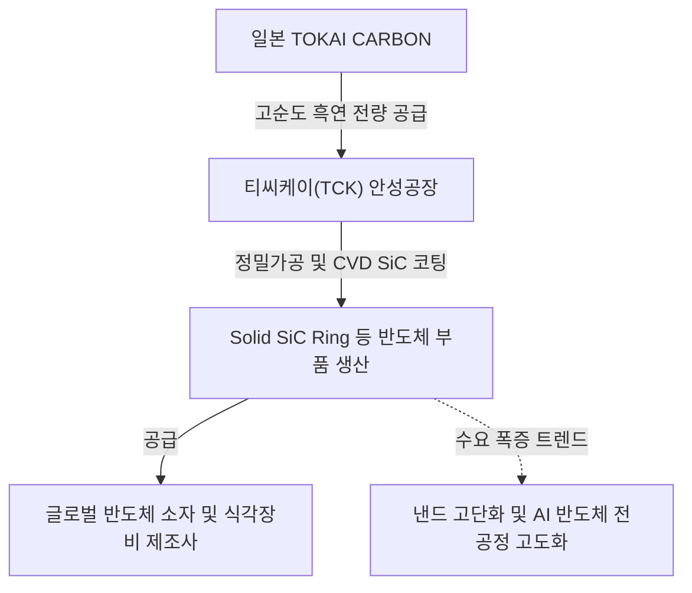

# 🔍 Phase 1: 기업 해독기 (심층 팩트체크 코어)

## 1. 비즈니스 모델 및 돈 버는 구조
[공시 팩트] 티씨케이(TCK)의 비즈니스 모델은 최대주주인 일본 TOKAI CARBON CO., LTD.로부터 고순도 흑연(Graphite) 원재료를 전량 수입하여, 국내 안성공장에서 정밀 가공 및 특수 코팅을 거쳐 반도체 드라이 에칭(식각) 공정용 소모성 부품(Solid SiC Ring 등)을 글로벌 반도체 소자 및 장비 업체에 독과점적으로 공급하는 구조입니다. AI 서버 확대로 인한 낸드 고단화 공정 전환 트렌드는 가혹한 식각 환경을 요구하며, 이는 내구성이 높은 동사 SiC Ring의 교체 수요를 가속화하는 핵심 동력으로 작용합니다.

## 2. 주요 사업별 매출 비중 추이 (최근 5년 및 최신 분기)
| 구분 | 핵심 내용 | 비고 |
| :--- | :--- | :--- |
| **Solid SiC 부문** | 2021년 83.9%에서 2026년 1분기 89.6%로 비중 지속 확대. 전사 실적을 견인하는 핵심 캐시카우 제품 | 단일 품목 지배력 압도적 |
| **Graphite (반도체)** | 매출 비중 7.4%~12.3% 수준 유지. 반도체 공정용 고순도 흑연 부품 | 안정적인 포트폴리오 |
| **Susceptor 부문** | 매출 비중 하락 추세 (2021년 5.7% → 2026년 1분기 2.6%) | LED 및 ALD 부품 비중 축소 |
| **Graphite (태양광)** | 태양광용 흑연 부품. 전체 매출 비중 0.5% 미만 | 사업부 미미한 수준 유지 |

## 3. 전사 영업이익률 및 FCF 추이
[공시 팩트] 2021~2022년 영업이익률(OPM) 38~39%에 달하는 폭발적 이익 창출력을 보였으나, 2023년 반도체 감산 사이클로 인해 OPM 29%대로 하락했습니다. 하지만 2024~2026년 1분기에 걸쳐 안정적인 OPM 30% 내외를 방어 중이며, 꾸준히 수백억 규모의 FCF를 창출해 무차입 경영의 펀더멘털을 유지하고 있습니다.

| 구분 | 핵심 내용 | 비고 |
| :--- | :--- | :--- |
| **영업이익률 (OPM)** | 호황기 38% 이상 돌파 후 최근 27.8%~29.9% 사이클 저점 방어 중 | 2026년 1분기 29.9% 시현 |
| **잉여현금흐름 (FCF)** | 2023년 CapEx 급증으로 일시적 적자 전환(-264억) 이후 2024~2025년 각각 약 668억, 496억 원 창출 턴어라운드 | 현금 창출력 견고 |
| **Capex (설비투자)** | 2022~2023년 연 380~470억 원 규모 대규모 선제 투자 후 2024년 이후 최적화 | 신규 증설 부담 완화 |

## 4. 핵심 KPI 추이 및 분석
[시장 내러티브] 최근 삼성전자 P4 D1c 및 청주 M15X 대규모 전공정 투자가 재개되면서 식각 장비 관련 기업의 대규모 낙수효과가 전망되고 있으며, AI 반도체로 인한 낸드 고단화 수혜가 부품 가동률 반등의 가장 큰 드라이버로 인식되고 있습니다.
[공시 팩트] 티씨케이의 핵심 KPI인 안성공장 가동률은 2023년 61%까지 폭락했으나, 2025년 96%, 2026년 1분기 95.8%를 기록하며 이미 사실상 풀가동(Full-capacity) 수준으로 회복했습니다. 또한 수출 비중이 2021년 54.2%에서 2026년 1분기 63.3%로 꾸준히 우상향 중이며, 이는 글로벌 식각 장비사(고객사)에 대한 직접 공급 물량이 팽창하고 있음을 증명합니다.

## 5. 경영진 및 주주환원 이력
[공시 팩트] 일본 도카이카본이 지분 52.6%를 보유한 최대주주이며, 오창민 대표이사 사장과 카나이 켄이치 공동 대표 체제로 운영되고 있습니다. 회사는 당기순이익의 20% 이상을 배당금으로 주주에게 지속 환원(고정 배당성향 22.9%) 중입니다. 특히 주목할 점은 2025년 12월 총 약 500억 원 상당의 자기주식 495,584주를 전량 소각하여, 유통주식수 4.24%를 영구적으로 없앰으로써 막강한 주주 가치 제고 의지를 팩트로 증명했다는 사실입니다.

| 구분 | 최근 주요 현황 (2025~2026년 1분기 기준) |
| :--- | :--- |
| **배당 지표** | 현금배당성향 22.9% 유지, 주당배당금 상승(1,200원 -> 1,430원) |
| **자사주 소각** | 2025년 12월 약 500억 원 규모 (49.5만주, 지분율의 4.24%) 영구 이익소각 완료 |
| **지배구조** | TOKAI CARBON 52.6% 지배 아래 전문경영인 체제 구축 |

## 6. 핵심 리스크 3가지
[공시 팩트] 회사가 당면한 가장 큰 약점은 원재료 매입부터 매출처 구성까지 지극히 과점화된 구조에 의존하고 있다는 점과 차세대 핵심 경쟁자인 국내 부품사들과의 장기 소송전입니다. 

| 구분 | 핵심 내용 | 비고 |
| :--- | :--- | :--- |
| **원재료 100% 독점 의존성** | 핵심 원재료인 고순도 흑연을 최대주주인 도카이카본으로부터 100% 독점 수입하여 공급망 협상력과 가격 결정권이 대주주에게 종속됨 | 단가 압박 리스크 |
| **소수 매출처 과점 편중** | 상위 4대 주요 고객사(글로벌 소자 및 장비사) 향 매출 비중이 전사 매출의 70.9%에 달해 전방 고객사의 CapEx 변동에 실적이 극심하게 요동침 | 가동률 연동 리스크 |
| **특허 소송 및 독점력 우려** | 와이엠씨 등과는 합의 취하했으나, 디에스테크노 등과의 CVD SiC 핵심 특허 소송 1심이 진행 중이며 패소 시 독과점 프리미엄과 30%대 OPM 장벽 훼손 위험 | 법률 및 진입장벽 리스크 |

## 7. 딥리서치 팩트체크 요약
[시장 내러티브] 시장은 HBM과 AI 반도체 후공정 모멘텀에 쏠려 있으나, 최근 WFE(전공정 장비) 투자 재개와 AI 서버 향 eSSD 컨트롤러 및 고단화 낸드 수요 증가가 전공정 부품 쇼티지를 유발할 것이라는 기대감이 커지고 있습니다.
[공시 팩트] 딥리서치 및 티씨케이 공시 분석 결과, 해당 내러티브는 '사실(True)'에 기반합니다. 삼성전자 110K 규모 투자를 위시한 전공정 투자 반등 트렌드 하에서, 티씨케이의 가동률은 이미 2025-2026년 96%대에 진입하며 수요 폭발 사이클에 본격 올라탔습니다. 4.24%의 공격적인 자사주 소각과 독점적 SiC Ring 시장 점유율은 훌륭한 해자(Moat)이나, 특허 소송 향방과 모회사 도카이카본과의 원가 구조 분배율이라는 아킬레스건을 지속 모니터링해야 하는 강력한 Cash Cow 팩토리 기업입니다.
