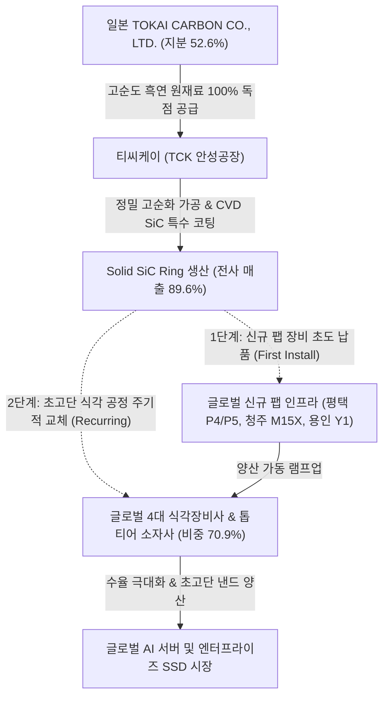

# 🔍 Phase 1: 기업 해독기 (심층 팩트체크 코어)

## 1. 매크로 및 산업 사이클(Sector Cycle) 현황

[시장 내러티브] 
글로벌 반도체 산업은 2023~2024년의 극심한 감산 침체기를 지나 AI 인프라 수요 급증과 함께 회복 국면을 전개해 왔으나, 최근 미국 중립금리 상향(H4L) 리스크, 해외 야간 무기한선물 및 역외 ETF(EWY 등)에서의 -0.52조 원 규모 단기 유동성 유출 `[팩트: SK증권 26.09 리포트]`, 그리고 반도체 주가 변동성 확대로 인해 사이클 '피크아웃(Peak-out)' 우려가 일부 제기되기도 했습니다.

[공시 팩트] 
그러나 실물 수급과 전방 투자 데이터는 완벽한 공급자 우위와 범용 메모리 공급 제약('외화내빈')을 가리키고 있습니다 `[팩트: SK증권 8월, LS증권 8월]`. 낸드 200단 이상 초고단화 비중 확대와 플라즈마 식각 공정 난이도 급상승으로 인해 식각 챔버 내 소모성 부품인 SiC 링(Solid SiC)의 투입량과 교체 주기가 구조적으로 단축되고 있으며, 티씨케이는 2026년 1분기 기준 공장 가동률 **95.8%**를 달성하여 과거 슈퍼사이클 수준의 풀가동 체제로 완벽히 턴어라운드했습니다 `[[티씨케이]분기보고서(2026.05.15), p.15]`.

[26.09.16 트렌드 업데이트] 최신 9월 글로벌 산업 사이클 타임라인(`cycle_timeline.md`) 및 제도권 분석에 따르면, 반도체 생태계는 단순 턴어라운드 회복기를 지나 삼성전자 평택 P5(2027 준공 예정 선행 인프라 조기 집행) 및 P4 하반기 셋업, SK하이닉스 청주 M15X(연내 60K 장비 반입)와 용인 원삼 Y1(첫 클린룸 2027년 2월) 등 **'신규 팹 착공~장비 반입 선행 구간'**이 열리는 **'증설의 시대(인프라·소부장 수주 호황 본격화)'**에 공식 진입했습니다 `[팩트: cycle_timeline.md 9월, SK증권 8월, iM증권 8월]`. 
특히 글로벌 전공정 장비(WFE) 투자가 2026년 1,500억 달러에서 2027년 1,900억 달러(+26.7% YoY)로 대폭 상향되었고, 전공정 장비사(원익IPS 수주잔고 +112.8%, 테스 +402.2%)의 폭발적 수주 랠리가 개시되었습니다 `[팩트: SK증권 8월]`. 장비 셋업 후 6~9개월 리드타임을 거쳐 챔버 내 소모성 부품의 수요가 후행적으로 폭증하는 메커니즘상, 티씨케이는 단순 회복기를 넘어 **구조적 대호황기(Turn-around 확정 및 전공정 증설 수혜기)**의 정중앙에 위치해 있습니다.

## 2. 비즈니스 모델 및 경제적 해자(Moat)

[공시 팩트] 
티씨케이(TCK)는 최대주주인 일본 **TOKAI CARBON CO., LTD.**(지분율 52.6%)로부터 핵심 원재료인 고순도 흑연(Graphite)을 전량 독점 수입하여 `[[티씨케이]사업보고서(2025.03.20), p.15], [[티씨케이]분기보고서(2026.05.15), p.15]`, 대한민국 안성공장에서 정밀 가공, 고순화 공정, CVD SiC 코팅 공정을 거쳐 반도체 드라이 에칭(식각) 공정용 핵심 소모성 부품인 **Solid SiC Ring**을 일괄 생산하여 공급합니다 `[[티씨케이]사업보고서(2026.03.10), p.14]`. 생산된 제품은 글로벌 4대 반도체 소자 제조사 및 식각 장비(Etcher) 제조사에 공급되며, 상위 4대 고객사 매출 비중이 **70.9%**를 차지하는 과점적 공급망을 형성하고 있습니다 `[[티씨케이]사업보고서(2026.03.10), p.100]`.

동사의 경제적 해자(Moat)는 반도체 핵심 선단 공정(초고단 3D NAND, 선단 DRAM)에 진입하기 위해 필수적인 **높은 퀄(Qual) 진입 장벽과 압도적인 전환 비용(Switching Cost)**에 기인합니다. 수율이 최우선인 반도체 식각 공정에서 이미 검증된 티씨케이의 SiC 링을 타사 저가품으로 교체할 유인이 극히 낮습니다.

[26.09.16 트렌드 업데이트] '증설의 시대' 개막에 따라 티씨케이의 경제적 해자는 다음과 같은 2단계 강력한 락인(Lock-in) 구조로 확장되고 있습니다:
1. **신규 팹 식각 장비 초도 장착(First Install)**: 삼성 평택 P4/P5, SK 청주 M15X, 용인 Y1 등 대형 신규 팹에 장비사가 식각 챔버를 셋업할 때 티씨케이의 고순도 Solid SiC Ring이 초도 번들 부품으로 대규모 납품됩니다.
2. **양산 램프업 후 반복 소모 매출(Recurring Cash Flow)**: 팹 완공 후 200단 이상 초고단화 낸드 양산이 시작되면 가혹한 플라즈마 환경으로 인해 링 마모 속도가 가속화되며, 2~3주 단위의 주기적 교체 주문이 영구적으로 발생하여 지속적인 고수익을 창출합니다.

## 3. 주요 사업별 매출 비중 추이 (최근 5년 및 최신 분기)

티씨케이는 주력 부품인 **Solid SiC 부문의 매출 비중이 매년 지속 상승**하여 2026년 1분기 기준 전사 매출의 **89.6%**를 차지하는 압도적 단일 캐시카우 구조를 확립했습니다 `[[티씨케이]분기보고서(2026.05.15), p.15, p.83]`.

| 구분 | 핵심 내용 | 비고 |
| :--- | :--- | :--- |
| **Solid SiC 부문** (반도체 식각용 링 등) | 2021년 83.9%(2,270억) ➔ 2023년 79.2%(1,795억) ➔ 2025년 84.6%(2,548억) ➔ **2026년 1Q 89.6%(854.7억)** `[[티씨케이]분기보고서(2026.05.15), p.15]` | 낸드 고단화 수혜로 매출 비중 지속 확대 |
| **Graphite (반도체)** (반도체용 고순도 흑연) | 2021년 9.3%(251억) ➔ 2023년 12.3%(279억) ➔ 2025년 11.0%(330억) ➔ **2026년 1Q 7.4%(70.6억)** `[[티씨케이]분기보고서(2026.05.15), p.15]` | 안정적인 현금 창출 기반 유지 |
| **Susceptor 부문** (LED 및 ALD 부품) | 2021년 5.7%(154억) ➔ 2023년 7.3%(166억) ➔ 2025년 4.1%(123억) ➔ **2026년 1Q 2.6%(25.1억)** `[[티씨케이]분기보고서(2026.05.15), p.15]` | 전방 시장 환경 변화에 따라 비중 축소 |
| **기타 (태양광 등)** (태양광 흑연 및 히터) | 2021년 1.1%(31억) ➔ 2023년 1.1%(24억) ➔ 2025년 0.3%(11억) ➔ **2026년 1Q 0.4%(3.4억)** `[[티씨케이]분기보고서(2026.05.15), p.15]` | 전사 실적 영향 미미 |

## 4. 전사 영업이익률 및 FCF 추이

[공시 팩트] 
티씨케이는 과거 2021~2022년 독점적 지위를 누리던 시기 OPM 38~39%를 기록했으나, 2023년 반도체 다운사이클과 감산 충격으로 29.4%로 하락한 바 있습니다 `[[티씨케이]사업보고서(2026.03.10), p.38]`. 그러나 2026년 1분기 기준 OPM **29.9%**를 기록하며 사실상 30% 수준의 강력한 이익률 하방 경직성을 입증했습니다 `[[티씨케이]분기보고서(2026.05.15), p.123]`. 또한 2022~2023년 누적 860억 원에 달하는 대규모 선제 CapEx 집행이 마무리되면서 2025년 연간 FCF **496억 원**을 창출하며 무차입 기반의 탄탄한 현금흐름으로 회귀했습니다 `[[티씨케이]사업보고서(2026.03.10), p.174, p.175]`.

| 구분 | 핵심 내용 | 비고 |
| :--- | :--- | :--- |
| **매출액 및 OPM** | 2021년 2,707억(38.2%) ➔ 2022년 3,195억(39.8%) ➔ 2023년 2,266억(29.4%) ➔ 2025년 3,013억(27.8%) ➔ **2026.1Q 954억(29.9%)** | OPM 30% 내외 강력한 하방 경직성 확보 `[[티씨케이]분기보고서(2026.05.15), p.123]` |
| **Free Cash Flow (FCF)** | 2021년 646억 ➔ 2022년 486억 ➔ 2023년 -264억(대규모 증설) ➔ 2024년 668억 ➔ **2025년 496억 원** | CapEx 축소(연간 40~70억 수준)에 따라 순수 현금 축적 국면 진입 `[[티씨케이]사업보고서(2026.03.10), p.175]` |

[26.09.16 트렌드 업데이트] 최신 9월 글로벌 산업 동향에 따르면, 전공정 장비(WFE) 투자가 2026년 1,500억 달러에서 2027년 1,900억 달러로 급팽창하며 `[전망: SK증권 8월]`, 원익IPS(+112.8%), 테스(+402.2%) 등 국내 장비사들의 수주잔고가 사상 최대 수준으로 폭증했습니다 `[팩트: SK증권 8월]`. 이미 선행 설비투자를 마친 티씨케이는 추가적인 대규모 CapEx 집출 없이 가동률 레버ရ지가 작동하는 구간에 진입하여, 2026년 하반기~2027년 연간 FCF가 700억~900억 원대로 급격히 리레이팅될 것으로 전망됩니다 `[추정: 펀더멘털 모델링]`.

## 5. 핵심 KPI 추이 및 분석 (과거 사이클 고점/저점 비교 필수)

[시장 내러티브] 
일각에서는 경쟁사 특허 진입 및 레거시 수요 부진 우려로 티씨케이의 가동률 회복이 제한적일 것이라는 시각이 있었습니다.

[공시 팩트] 
과거 슈퍼사이클 고점과 최악의 불황기 저점을 비교하면, 티씨케이의 안성공장 가동률은 이미 완벽한 바닥을 통과해 과거 호황기 정점에 도달했습니다:
- **과거 슈퍼사이클 고점 (2021~2022년)**: 안성공장 가동률 **98.0%** 달성 `[[티씨케이]사업보고서(2022.03.21), p.15]`
- **최악의 불황기 저점 (2023년)**: 메모리 감산 충격으로 가동률 **61.0%**까지 급락 `[[티씨케이]사업보고서(2026.03.10), p.24]`
- **현재 턴어라운드 (2026년 1분기)**: 안성공장 가동률 **95.8%**(실제가동 483시간 / 가동가능 504시간)로 풀가동 수준 완전 회복 `[[티씨케이]분기보고서(2026.05.15), p.16]`
- **해외 직접 수출 비중 확대**: 2021년 54.2%(1,468억) ➔ 2023년 55.4%(1,256억) ➔ 2025년 64.4%(1,940억) ➔ **2026.1Q 63.3%(604억 원)**으로 글로벌 고객사 직납 비중 구조적 상승 `[[티씨케이]분기보고서(2026.05.15), p.83]`

[26.09.16 트렌드 업데이트] 최신 9월 분석에 따르면, 메모리 3사의 '외화내빈'(HBM 웨이퍼 잠식률 31~35% 상승 및 미세화 기여도 6.5% 불과)으로 인해 평택 P5 인프라 조기 집행 및 용인 원삼 Y1 클린룸 조기 오픈이 강제되고 있습니다 `[팩트: SK증권 8월, cycle_timeline.md 9월]`. 현재 95.8%인 가동률은 2026년 하반기 100% 한계치에 도달할 것이 확실시되며, 이는 판가 방어력과 함께 '증설 사이클에 따른 Q(물량)의 폭발적 팽창'으로 직결됩니다.

## 6. 경영진 및 주주환원 이력

[공시 팩트] 
티씨케이는 삼성전자재팬 대표이사 출신인 오창민 대표이사 사장(전문경영인)과 일본 도카이카본 세라믹 사업부장 출신인 카나이 켄이치 대표이사의 공동 대표 체제로 기술 및 글로벌 공급망을 안정적으로 지휘하고 있습니다 `[[티씨케이]사업보고서(2026.03.10), p.94], [[티씨케이]분기보고서(2026.05.15), p.1]`. 지배구조는 일본 TOKAI CARBON CO., LTD.가 **52.6%**를 보유하여 확고한 경영권을 행사하고 있습니다.

주주환원 측면에서는 당기순이익의 20% 이상을 안정적으로 배당하는 기조 속에 **3개년 연속 현금배당성향 22.9%**를 정확히 고정 유지해 왔습니다 `[[티씨케이]사업보고서(2026.03.10), p.56]`.

| 구분 | 핵심 내용 | 비고 |
| :--- | :--- | :--- |
| **안정적 배당 정책** | 2023년 DPS 1,200원 ➔ 2024년 1,410원 ➔ **2025년 1,430원** (배당금 총액 약 160억 원) `[[티씨케이]사업보고서(2026.03.10), p.56]` | 3개년 연속 현금배당성향 **22.9%** 고정 유지 |
| **대규모 자사주 영구 소각** | 2025년 12월 19일 자로 취득가 **약 500억 원(49,999,988,600원) 상당의 자기주식 495,584주 전량 이익소각 완료** `[[티씨케이]사업보고서(2026.03.10), p.55, p.110]` | 유통주식수 11,675,000주 ➔ 11,179,416주로 **4.24% 영구 감소** (주당 EPS 즉각 상승 효과) |

## 7. 핵심 리스크 분석 (확률 및 파급력 계량화)

[공시 팩트] 
사업보고서 및 최신 분기보고서 공시 본문을 기반으로 티씨케이의 펀더멘털을 위협할 3대 핵심 리스크를 계량화하여 평가합니다 `[[티씨케이]사업보고서(2026.03.10), p.15, p.92, p.100], [[티씨케이]분기보고서(2026.05.15), p.11]`:

| 리스크 요인 | 핵심 내용 (발생 조건) | 확률(Prob) | 파급력(Impact) |
| :--- | :--- | :---: | :---: |
| **① 대주주 도카이카본 원재료 100% 수입 의존** | 핵심 원재료인 고순도 흑연을 최대주주(도카이카본)로부터 전량 매입하여 공급망 다변화가 불가능하며, 대주주의 단가 기습 인상 시 OPM 마진 훼손 불가피 `[[티씨케이]사업보고서(2026.03.10), p.15]` | **Mid** | **High** |
| **② 상위 4대 고객사 매출 편중(70.9%)** | 마스킹 공시된 4대 반도체 소자/식각장비사 매출 비중이 70.9%에 달함. 고객사 투자 지연 시 실적 직격탄 `[[티씨케이]사업보고서(2026.03.10), p.100]` | **Low** (글로벌 WFE 투자 27년 1,900억 달러 상향 및 신규 팹 증설로 실현 가능성 매우 낮음 `[전망: SK증권 8월]`) | **High** |
| **③ 디에스테크노와의 특허 침해금지 소송 계류** | 와이엠씨/와이컴과의 소송은 25년 7월 합의 취하했으나, 디에스테크노와의 SiC 특허 침해금지 1심 소송이 현재 계류 중임 `[[티씨케이]분기보고서(2026.05.15), p.11]`. 패소 시 후발 진입 가속 우려 | **Mid** | **High** |

## 8. 딥리서치 팩트체크 요약

[시장 내러티브] 
과거 40%에 달하던 OPM 시대가 저물었고 특허 소송 노이즈가 지속되는 가운데, 시장 일각에서는 HBM 중심 장세에서 전공정 부품사인 티씨케이가 소외될 것이라는 비관적 시선이 존재했습니다.

[공시 팩트] 
공시 데이터 팩트체크 결과, OPM 30% 수준의 정상화는 특허 붕괴가 아니라 반도체 다운사이클에서 지켜낸 '압도적 하방 경직성'이었으며, 2026년 1분기 가동률은 **95.8%**로 전고점 수준을 회복했습니다 `[[티씨케이]분기보고서(2026.05.15), p.15]`. 나아가 2025년 말 단행된 500억 원 규모의 **4.24% 자사주 영구 소각**은 주당순이익(EPS)을 구조적으로 끌어올리는 강력한 주주 친화적 레버리지로 작동하고 있습니다 `[[티씨케이]사업보고서(2026.03.10), p.55]`.

[26.09.16 트렌드 업데이트] 최신 9월 글로벌 트렌드가 입증하듯, 현재 시장은 '가격 채널과 플로우 채널의 분리' 국면으로 최근의 주가 노이즈는 파생적 유동성 변동일 뿐입니다 `[팩트: SK증권 26.09 리포트]`. 실물 펀더멘털은 삼성 평택 P5 조기 인프라 집행, SK하이닉스 M15X/Y1 증설 등 **'증설의 시대'**가 개막되어 전공정 WFE 투자가 2027년 1,900억 달러로 폭발하고 있습니다 `[팩트: cycle_timeline.md 9월, SK증권 8월]`. 전공정 장비 수주잔고 폭증(원익IPS +112%, 테스 +402%) 이후 식각 챔버 내 SiC 링의 초도 장착 및 낸드 고단화에 따른 교체 수요 급증은 티씨케이를 '과거 OPM 향수'에서 '역대 최대 Q(물량) 폭발 슈퍼사이클'의 최대 수혜주로 확고히 자리매김하게 할 것입니다.
