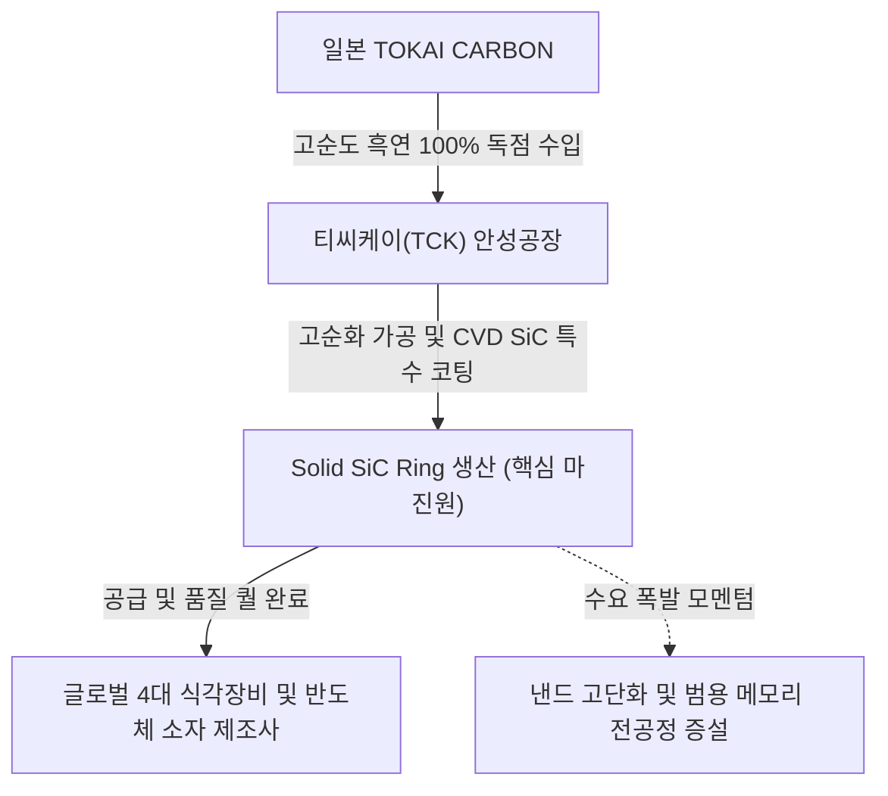

# 🔍 Phase 1: 기업 해독기 (심층 팩트체크 코어)

## 1. 매크로 및 산업 사이클(Sector Cycle) 현황
[시장 내러티브] 글로벌 반도체 시장은 현재 '외화내빈(外華內貧)' 구조, 즉 HBM 등 첨단 패키징에 웨이퍼가 쏠려 실질적인 범용(Conventional) 메모리 공급 여력이 극도로 부족한 병목 상태에 처해 있습니다. 이를 타개하기 위해 삼성전자(P4), SK하이닉스(M15X) 등 글로벌 IDM들이 2026~2027년에 걸쳐 대규모 클린룸 완공 및 장비 반입을 가속화하며, 전 세계 WFE(전공정 장비) 투자가 2027년 1,900억 달러까지 폭증할 전망입니다. `[전망: SK증권 8월]` 이에 따라 티씨케이가 속한 전공정 식각 부품 섹터는 **회복기 후반을 지나 강력한 호황기(Boom) 초입의 턴어라운드(Turn-around) 변곡점**에 진입했습니다.

## 2. 비즈니스 모델 및 경제적 해자(Moat)
[공시 팩트] 티씨케이(TCK)의 핵심 비즈니스 모델은 최대주주인 일본 TOKAI CARBON CO., LTD.로부터 고순도 흑연(Graphite)을 전량 독점 수입하여, 국내 안성공장에서 정밀 고순화 및 CVD SiC 코팅 공정을 거친 후 글로벌 4대 반도체 소자 및 식각 장비(Etcher) 제조사에 공급하는 구조입니다. 동사의 경제적 해자는 반도체 핵심 공정에 투입되는 소모품으로서 장비사에 선행 탑재·승인되어야만 하는 '높은 퀄(Qual) 진입 장벽'과, 미세공정 난이도 상승에 따른 '구조적인 교체 수요 증대'에 기인합니다. `[팩트: 26.03.10 사업보고서]`

## 3. 주요 사업별 매출 비중 추이 (최근 5년 및 최신 분기)

| 구분 | 핵심 내용 | 비고 |
| :--- | :--- | :--- |
| **Solid SiC 부문** | 전사 매출의 **89.6%**를 차지하는 절대적 단일 주력 캐시카우. 반도체 드라이 에칭 공정용 소모성 부품. `[팩트: 26.1Q 분기보고서]` | 비중 지속 우상향 |
| **Graphite (반도체)** | 반도체용 흑연 부품으로 매출 비중 **7.4%** 수준 유지. `[팩트: 26.1Q 분기보고서]` | 안정적 현금 창출 |
| **Susceptor 부문** | LED 및 ALD용 부품. 21년 5.7%에서 현재 **2.6%**로 매출 비중 대폭 축소. `[팩트: 26.1Q 분기보고서]` | 시장 환경 악화 반영 |
| **기타 (태양광 등)** | 태양광 Graphite 및 기타 히터 상품. 합산 매출 비중 **0.4%** 미만. `[팩트: 26.1Q 분기보고서]` | 이익 기여도 미미 |

## 4. 전사 영업이익률 및 FCF 추이
[공시 팩트] 과거 특허 지배력이 온전하던 호황기의 OPM 38~39%보다는 다소 낮아진 29%대 후반에서 바닥을 다지고 있습니다. 대규모 설비 투자가 일단락되어 향후 영업활동현금흐름이 잉여현금흐름(FCF)으로 고스란히 직결되는 무차입 경영의 펀더멘털을 갖췄습니다.

| 구분 | 핵심 내용 | 비고 |
| :--- | :--- | :--- |
| **영업이익률 (OPM)** | 2021년 38.2% ➔ 2023년 29.4% ➔ 2026년 1Q **29.9%** 시현 중. `[팩트: 26.1Q 분기보고서 및 23.08.31 정정 사업보고서]` | 이익률 바닥 확인 |
| **잉여현금흐름 (FCF)** | 2023년 CapEx 대거 집행으로 일시적 -264억 ➔ 2025년 **496억 원** 창출로 강력한 턴어라운드. `[팩트: 26.03.10 사업보고서]` | 안정적 현금 축적 |
| **Capex (유형자산 취득)** | 22~23년 약 380~470억 선행 투자 완료 후, 24~25년 연간 40~70억 수준으로 급감. `[팩트: 26.03.10 사업보고서]` | 향후 FCF 마진폭 확대 |

## 5. 핵심 KPI 추이 및 분석 (과거 사이클 고점/저점 비교 필수)
[시장 내러티브] 최근 테스, 원익IPS 등 국내 핵심 전공정 장비사들의 2Q26 수주잔고가 100~400% 폭증 `[팩트: SK증권 8월]`하면서, 후행적으로 소모성 부품(SiC 링)의 투입량이 구조적으로 확대될 것이라는 확신이 커지고 있습니다.
[공시 팩트] 안성공장 가동률은 과거 반도체 슈퍼 사이클 고점인 **2021~2022년 당시 98.0%**에 달했으나, 감산 충격이 극심했던 **2023년 불황기 저점에는 61.0%**까지 폭락했습니다. 그러나 **2026년 1분기 기준 가동률은 95.8%**를 기록하며 과거 슈퍼 사이클의 풀캐파(Full-capacity) 수준을 거의 완벽히 회복했습니다. `[팩트: 23.08.31 정정 사업보고서 및 26.1Q 분기보고서]`

## 6. 경영진 및 주주환원 이력
[공시 팩트] 경영진은 일본 TOKAI CARBON 출신의 카나이 켄이치와 삼성전자 출신의 오창민 공동 대표 체제입니다. `[팩트: 26.1Q 분기보고서]` 가장 괄목할 만한 자본 배치 이력은 2025년 12월 총 약 500억 원 상당의 자기주식 495,584주를 전량 영구 이익소각하여 실질 유통주식수를 4.24% 감소시켰다는 사실입니다. `[팩트: 26.03.10 사업보고서]`

| 구분 | 핵심 내용 |
| :--- | :--- |
| **배당 지표** | 현금배당성향 **22.9%** 3년 이상 견고하게 지속, 주당배당금 꾸준한 상승세. `[팩트: 26.03.10 사업보고서]` |
| **자사주 소각** | 2025년 12월 19일 자 유통주식수 4.24%에 해당하는 500억 원 규모 물량 영구 소각 완료. `[팩트: 26.03.10 사업보고서]` |

## 7. 핵심 리스크 분석 (확률 및 파급력 계량화)
[공시 팩트] 전방 고객사 및 핵심 원재료 공급처 양쪽 모두 소수 기업에 편중되어 있어 가격 결정력 측면의 리스크가 존재합니다.

| 리스크 요인 | 핵심 내용 (발생 조건) | 확률(Prob) | 파급력(Impact) |
| :--- | :--- | :--- | :--- |
| **원재료 100% 독점 수입** | 고순도 흑연을 대주주인 도카이카본에 전량 수입 의존. 대주주의 원재료 판가 기습 인상 시 마진 훼손. `[팩트: 26.03.10 사업보고서]` | **Mid** | **High** |
| **소수 고객사 매출 편중** | 상위 4대 반도체/장비 고객사의 매출 비중이 전사 매출의 **70.9%** 차지. 전방 고객사 증설 연기 시 실적 직격탄. `[팩트: 26.03.10 사업보고서]` | **Low** | **High** |
| **SiC 특허 무효/침해 소송** | 디에스테크노와의 1심 소송 진행 중. 패소 시 후발 주자 진입으로 판가 방어선 붕괴 우려. `[팩트: 26.1Q 분기보고서]` | **Mid** | **High** |

## 8. 딥리서치 팩트체크 요약
[시장 내러티브] 상반기까지 시장은 AI 서버용 HBM 및 후공정 관련 밸류체인에만 열광하며 레거시 전공정 부품주인 티씨케이를 소외시켜 왔습니다. 
[공시 팩트] 그러나 딥리서치 데이터에 따르면 범용 메모리 공급 제약(외화내빈) 현상이 극심해지면서 IDM들의 P4, M15X 대형 팹 전공정 장비 발주가 폭발적으로 개시되었습니다. `[팩트: SK증권 8월]` 선단 공정 난이도 상승은 웨이퍼당 식각 소모품 투입량을 구조적으로 확대시키며 `[의견: LS증권 8월]`, 티씨케이의 가동률 95.8% `[팩트: 26.1Q 분기보고서]` 달성은 일시적 반등이 아닌 대세 상승장 진입을 입증하는 객관적 증거입니다.
