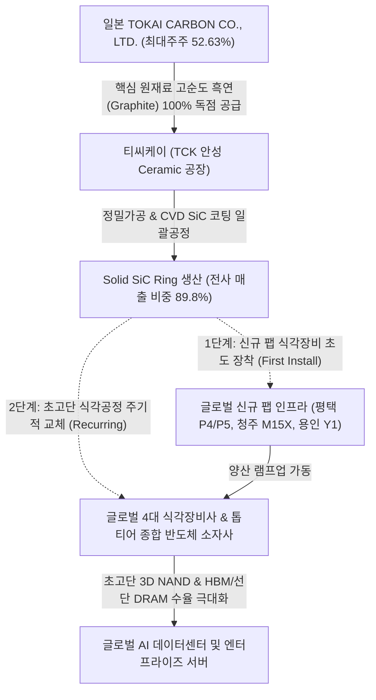

# 🔍 Phase 1: 기업 해독기 (원천 팩트 초안)

## 1. 비즈니스 모델 및 밸류체인

[공시 팩트] 
주식회사 티씨케이(TOKAI CARBON KOREA CO., LTD., 종목코드: 064760)는 반도체·태양전지 및 LED용 부품 전문 제조기업으로, 국내 최초로 가공공정, 고순화공정, CVD SiC(화학기상증착 탄화규소) 코팅공정의 일괄생산체제를 구축하였습니다 `[[티씨케이]사업보고서(2026.03.10), p.14], [[티씨케이]반기보고서(2026.08.14), p.14]`.

동사의 핵심 사업 모델 및 밸류체인은 다음과 같이 3단계로 엄격히 수직계열화 및 독점 연계되어 있습니다:
1. **공급자 (Supplier)**: 최대주주인 일본 **TOKAI CARBON CO., LTD.**(지분율 52.63%, 5,883,250주 보유)로부터 CVD SiC Ring 및 고순도 Graphite 가공의 핵심 원재료인 고순도 흑연(Graphite A 등)을 전량 독점 수입 매입합니다 `[[티씨케이]반기보고서(2026.08.14), p.15, p.94]`.
2. **기업 (Company - 티씨케이 안성공장)**: 경기도 안성공장에서 정밀 가공, 고순화 공정, CVD SiC 코팅 공정을 거쳐 반도체 드라이 에칭(건식 식각) 공정용 핵심 소모성 부품인 **Solid SiC Ring** 및 SiC Wafer, ALD 장비용 Susceptor, 고순도 Graphite 부품을 생산합니다 `[[티씨케이]반기보고서(2026.08.14), p.14-16]`. 
3. **고객사 (Customer)**: 글로벌 톱티어 반도체 소자 제조사(삼성전자, SK하이닉스, 마이크론, TSMC 등) 및 글로벌 식각 장비(Etcher) 제조사(Lam Research, TEL, AMEC, 세메스 등)에 직납 및 장비 번들 형태로 납품됩니다 `[[티씨케이]반기보고서(2026.08.14), p.16, p.83]`. 상위 4대 매출처 비중이 **70.9%**에 달하는 과점적 공급망을 형성하고 있습니다 `[[티씨케이]사업보고서(2026.03.10), p.100]`.

[글로벌 트렌드: 26.09.29.LS증권.AI병목의 전이.pdf p.13 그림3] 
최신 2026년 9월 말 제도권 반도체 인프라·소부장 분석에 따르면, 반도체 식각 공정의 핵심 소모성 부품인 **SiC Ring** 분야 국내 과점 공급 밸류체인으로 **티씨케이**, 하나머티리얼즈, 케이엔제이 3사가 공식 확인되며, 티씨케이는 CVD SiC 원천 기술 기반의 선도적 1위 지위를 확고히 점유하고 있습니다.

[글로벌 트렌드: cycle_timeline.md 2026.09 하반기] 
산업 사이클은 '증설의 시대(삼성 평택 P4/P5 조기 인프라, SK 청주 M15X, 용인 원삼 Y1)'와 맞물려 식각 챔버 초도 장착(First Install) 및 낸드 200단~300단 초고단화에 따른 주기적 교체(Recurring) 수요가 동시 폭발하는 대호황 국면 정중앙에 위치합니다.

```mermaid
graph TD
    A["일본 TOKAI CARBON CO., LTD. (최대주주 52.63%)"] -->|"핵심 원재료 고순도 흑연(Graphite) 100% 독점 공급"| B["티씨케이 (TCK 안성 Ceramic 공장)"]
    B -->|"정밀가공 & CVD SiC 코팅 일괄공정"| C["Solid SiC Ring 생산 (전사 매출 비중 89.8%)"]
    C -. "1단계: 신규 팹 식각장비 초도 장착 (First Install)" .-> D["글로벌 신규 팹 인프라 (평택 P4/P5, 청주 M15X, 용인 Y1)"]
    C -. "2단계: 초고단 식각공정 주기적 교체 (Recurring)" .-> E["글로벌 4대 식각장비사 & 톱티어 종합 반도체 소자사"]
    D -->|"양산 램프업 가동"| E
    E -->|"초고단 3D NAND & HBM/선단 DRAM 수율 극대화"| F["글로벌 AI 데이터센터 및 엔터프라이즈 서버"]
```

## 2. 주요 제품별 매출 비중 추이 (최근 5년 및 최신 분기)

[공시 팩트] 
티씨케이는 주력 캐시카우인 **Solid SiC 부문의 매출 비중이 매년 지속 상승**하여 2026년 반기(누적) 기준 전사 매출의 **89.8%**(1,708.9억 원)를 기록, 사실상 단일 핵심 품목 중심의 압도적 시장 지배력을 확보했습니다 `[[티씨케이]반기보고서(2026.08.14), p.15], [[티씨케이]사업보고서(2026.03.10), p.16]`.

| 사업부문 / 제품군 | 구분 | 2021년 | 2022년 | 2023년 | 2024년 | 2025년 | **2026년 상반기 (누적)** | 비고 |
| :--- | :---: | :---: | :---: | :---: | :---: | :---: | :---: | :--- |
| **Solid SiC 부문** (반도체 식각용 Ring 등) | 매출액 비중 | 2,270억 83.9% | 2,685억 84.0% | 1,795억 79.2% | 2,245억 81.4% | 2,548억 84.6% | **1,709억 89.8%** | 3D NAND 고단화 및 식각 플라즈마 강화로 비중 극대화 `[[티씨케이]반기보고서(2026.08.14), p.15]` |
| **Graphite (반도체)** (반도체 Grower 부품) | 매출액 비중 | 251억 9.3% | 305억 9.5% | 280억 12.3% | 315억 11.4% | 330억 11.0% | **135억 7.1%** | 잉곳 성장 장비용 고순도 흑연 부품, 안정적 현금 창출 `[[티씨케이]반기보고서(2026.08.14), p.15]` |
| **Susceptor 부문** (ALD 및 LED 부품) | 매출액 비중 | 154억 5.7% | 169억 5.3% | 167억 7.3% | 184억 6.7% | 124억 4.1% | **52억 2.7%** | 반도체 ALD 장비 및 LED 칩용 웨이퍼 캐리어 `[[티씨케이]반기보고서(2026.08.14), p.15]` |
| **Graphite (태양광)** (태양전지 Grower 부품) | 매출액 비중 | 4억 0.1% | 9억 0.3% | 12억 0.5% | 8억 0.3% | 7억 0.2% | **4억 0.2%** | 태양광 업황에 따른 보조 매출 `[[티씨케이]반기보고서(2026.08.14), p.15]` |
| **기타 (HEATER 등)** (상품 및 기타) | 매출액 비중 | 28억 1.0% | 28억 0.9% | 13억 0.6% | 6억 0.2% | 4억 0.1% | **4억 0.2%** | 장비용 히터 상품 유통 `[[티씨케이]반기보고서(2026.08.14), p.15]` |
| **전사 총 매출액** | **합계** | **2,708억** | **3,196억** | **2,267억** | **2,757억** | **3,013억** | **1,903억** | **반기 누적 전년동기(1,510억) 대비 +25.97% 성장** `[[티씨케이]반기보고서(2026.08.14), p.15, p.123]` |

## 3. 전사 영업이익률 및 FCF 추이

[공시 팩트] 
티씨케이는 과거 2021~2022년 독점적 프리미엄 시절 38~40%에 달하는 초고마진을 누렸으며, 2023년 메모리 다운사이클 및 감산 충격 속에서도 OPM **29.4%**를 수성하여 견고한 이익 하방 경직성을 입증했습니다 `[[티씨케이]사업보고서(2026.03.10), p.38]`. 2026년 상반기 누적 기준 영업이익 **554.0억 원(OPM 29.12%)**, 2분기 단일 OPM **28.30%**를 기록하며 안정적인 30% 내외 마진 체질을 유지하고 있습니다 `[[티씨케이]반기보고서(2026.08.14), p.123]`. 

현금흐름 측면에서는 2022~2023년 선제적 대규모 설비 증설(기계장치 243억 원 등) 완료 후 CapEx가 대폭 안정화(반기 29.8억 원 집행)되면서, 2026년 상반기 잉여현금흐름(FCF) **168.1억 원**을 기록하여 전년 동기(41.5억 원) 대비 **+304.8%** 급증하는 순수 현금 수확 국면에 진입했습니다 `[[티씨케이]반기보고서(2026.08.14), p.128-129]`.

| 연도/분기 | 매출액 | 영업이익 | OPM(%) | CFO (영업CF) | CapEx (설비투자) | FCF (잉여현금) | 비고 |
| :--- | :---: | :---: | :---: | :---: | :---: | :---: | :--- |
| **2021년** | 2,708억 | 1,034억 | **38.2%** | 787억 | 140억 | **+647억** | 슈퍼사이클 호황 `[[티씨케이]사업보고서(2022.03.21), p.27]` |
| **2022년** | 3,196억 | 1,270억 | **39.8%** | 873억 | 387억 | **+486억** | 사상 최대 실적 `[[티씨케이]사업보고서(2023.08.31), p.27]` |
| **2023년** | 2,267억 | 667억 | **29.4%** | 210억 | 474억 | **-264억** | 메모리 감산 충격 및 대규모 CapEx 집행 `[[티씨케이]사업보고서(2026.03.10), p.38]` |
| **2024년** | 2,757억 | 807억 | **29.3%** | 744억 | 76억 | **+668억** | 감산 종료 및 턴어라운드 개시 `[[티씨케이]사업보고서(2026.03.10), p.38]` |
| **2025년** | 3,013억 | 839억 | **27.8%** | 541억 | 45억 | **+496억** | 매출 3,000억 회복 및 CapEx 안정화 `[[티씨케이]사업보고서(2026.03.10), p.38]` |
| **2026.1Q** | 954억 | 286억 | **29.9%** | 91억 | 98억 | **-7억** | 1분기 일시적 운전자본 변동 `[[티씨케이]분기보고서(2026.05.15), p.123]` |
| **2026.2Q (3M)** | 949억 | 268억 | **28.3%** | 107억 | -68억(조정) | **+175억** | 2분기 영업이익률 28.3% 수성 `[[티씨케이]반기보고서(2026.08.14), p.123]` |
| **2026.반기(누적)** | **1,903억** | **554억** | **29.1%** | **198억** | **30억** | **+168억** | **FCF 전년동기(+41.5억) 대비 4배 급증, 순현금 수확 국면** `[[티씨케이]반기보고서(2026.08.14), p.128-129]` |

## 4. 핵심 KPI 추이 (가동률, 수주잔고, ASP 등)

[공시 팩트] 
티씨케이는 고정비 비중이 높은 연속공정 세라믹 제조업 특성상 **공장 가동률**과 **수주잔고**가 전사 영업레버리지와 이익 창출을 결정짓는 핵심 KPI입니다 `[[티씨케이]반기보고서(2026.08.14), p.15-16]`:

1. **안성공장(Ceramic제품) 가동률 추이**:
   - 2021년: **98.0%** (슈퍼사이클 정점) `[[티씨케이]사업보고서(2022.03.21), p.15]`
   - 2023년: **61.0%** (최악의 메모리 감산 바닥) `[[티씨케이]사업보고서(2026.03.10), p.24]`
   - 2025년: **96.0%** (정상화 달성) `[[티씨케이]사업보고서(2026.03.10), p.15]`
   - 2026년 1분기: **95.8%** (가동가능 504시간 중 실제가동 483시간) `[[티씨케이]분기보고서(2026.05.15), p.16]`
   - **2026년 상반기**: **96.2%** (가동가능 1,008시간 중 실제가동 970시간) `[[티씨케이]반기보고서(2026.08.14), p.16]` ➔ **과거 2021~2022년 호황기 정점 수준(98%)에 사실상 도달한 풀가동 체제 확립**.
2. **수주잔고 현황 (2026.06.30 기준)**:
   - **Solid SiC류 수주잔고**: **1,763.0억 원** `[[티씨케이]반기보고서(2026.08.14), p.16]`
   - Graphite류 수주잔고: 192.9억 원 `[[티씨케이]반기보고서(2026.08.14), p.16]`
   - Susceptor류 수주잔고: 37.7억 원 `[[티씨케이]반기보고서(2026.08.14), p.16]`
   - **전사 총 수주잔고**: **1,993.7억 원** (상반기 매출 1,903억 원을 상회하는 넉넉한 물량 확보 완료) `[[티씨케이]반기보고서(2026.08.14), p.16]`.
3. **지역별(수출 vs 내수) 비중 추이**:
   - 2021년: 수출 54.2%(1,468억) / 내수 45.8%(1,240억) `[[티씨케이]사업보고서(2023.08.31), p.72]`
   - 2025년: 수출 64.4%(1,940억) / 내수 35.6%(1,073억) `[[티씨케이]사업보고서(2026.03.10), p.104]`
   - **2026년 상반기**: **수출 61.6%(1,173억 원) / 내수 38.4%(730억 원)** `[[티씨케이]반기보고서(2026.08.14), p.16]` ➔ 글로벌 고객사 직납 비중 60% 이상 지속 유지.

## 5. 경영진 및 주주환원 이력

[공시 팩트] 
티씨케이는 삼성전자재팬 대표이사 출신 오창민 대표이사 사장(전문경영인)과 일본 도카이카본 세라믹 사업부장 출신 카나이 켄이치 대표이사 회장의 공동 각자 대표이사 체제로 안정적인 글로벌 기술 및 영업망을 이끌고 있습니다 `[[티씨케이]사업보고서(2026.03.10), p.94], [[티씨케이]반기보고서(2026.08.14), p.1]`.

주주환원 측면에서는 당기순이익의 20% 이상을 배당하는 확고한 정책 속에 **3개년 연속 현금배당성향 22.9%**를 정확히 고정 유지해 왔으며 `[[티씨케이]사업보고서(2026.03.10), p.56]`, 2025년 말 대규모 자기주식 이익소각을 단행하여 실질 유통주식수를 영구 감축시켰습니다:

| 주주환원 구분 | 세부 실행 내용 | 출처 [공시 팩트] |
| :--- | :--- | :--- |
| **안정적 현금배당** | • 2023년 DPS 1,200원 (배당 총액 140.1억 원, 배당성향 22.9%) • 2024년 DPS 1,410원 (배당 총액 164.6억 원, 배당성향 22.9%) • **2025년 DPS 1,430원 (배당 총액 159.9억 원, 배당성향 22.9%)** • 2026년 상반기 중 2025 결산배당금 159.9억 원 지급 완료 | `[[티씨케이]사업보고서(2026.03.10), p.56]`, `[[티씨케이]반기보고서(2026.08.14), p.128]` |
| **대규모 자기주식 영구 이익소각** | • 2025년 12월 19일 자로 취득가 **49,999,988,600원(약 500억 원) 상당의 자기주식 495,584주 전량 이익소각 완료** • 총 발행주식수: 11,675,000주 ➔ **11,179,416주**로 **4.24% 영구 감소** • 2026년 6월 말 현재 자기주식수 **0주**, 총 발행주식수 = 공식 실질 유통주식수 = **11,179,416주** 확정 | `[[티씨케이]사업보고서(2026.03.10), p.55, p.110]`, `[[티씨케이]반기보고서(2026.08.14), p.11, p.14]` |

## 6. 공시 본문 기반 3대 핵심 리스크

[공시 팩트] 
DART 정기보고서 본문 및 주석 공시를 기반으로 티씨케이의 중장기 사업성을 위협할 수 있는 3대 핵심 리스크를 정밀 평가합니다 `[[티씨케이]사업보고서(2026.03.10), p.15, p.92, p.100], [[티씨케이]반기보고서(2026.08.14), p.11, p.15]`:

| 리스크 요인 | 핵심 내용 (발생 조건) | 확률(Prob) | 파급력(Impact) |
| :--- | :--- | :---: | :---: |
| **① 최대주주 도카이카본 원재료 100% 독점 수입 의존** | 핵심 원재료인 고순도 흑연(Graphite A 등)을 전량 최대주주인 일본 TOKAI CARBON CO., LTD.로부터 엔(JPY)화 수입 매입하고 있어 공급망 다변화가 불가능함 `[[티씨케이]반기보고서(2026.08.14), p.15]`. 대주주의 단가 기습 인상 또는 공급 차질 시 전사 원가율 및 OPM 훼손 리스크 상존. | **Mid** | **High** |
| **② 상위 4대 매출처 집중도(70.9%)** | 마스킹 공시된 4대 글로벌 소자 및 식각장비사향 매출 비중이 70.9%에 달함 `[[티씨케이]사업보고서(2026.03.10), p.100]`. 전방 고객사의 급격한 투자 철회나 식각 장비 납품 지연 발생 시 실적 변동성 노출. 단, 현재 글로벌 WFE 투자 상향 및 신규 팹 증설 가속으로 실현 가능성은 제한적. | **Low** | **High** |
| **③ 디에스테크노(DS Techno)와의 특허 침해금지 소송 계류** | 와이엠씨/와이컴과의 소송은 2025년 7월 11일 합의 소취하 완료되었으나, (주)디에스테크노를 상대로 한 특허권 침해금지 청구 소송은 2026년 6월 30일 현재 1심 계속 진행 중임 `[[티씨케이]반기보고서(2026.08.14), p.11]`. 패소 또는 경쟁사의 대체재 시장 진입 가속 시 Solid SiC Ring의 판가 방어력 약화 위험 존재. | **Mid** | **High** |

> **긍정적 비용 변동 공시 팩트**: 2018년부터 (주)케이씨에 지급해 오던 Solid SiC Ring 판매지원 수수료 계약이 2026년 3월 31일 변경 계약 체결을 통해 **2026년 12월 31일부로 추가 연장 없이 최종 종료**됨 `[[티씨케이]반기보고서(2026.08.14), p.17]`. 2027년부터 연간 수수료 판관비 절감에 따른 OPM 추가 개선 효과 기대.

## 7. 비즈니스 모델 기반 표준 실적 산출 공식 (Phase 3 연계)

기업의 비즈니스 모델 특성과 Section 4(DART 공시 팩트)에 기반하여, 아래 **3대 표준 공식 트리** 중 **유형 A [연속공정·장치산업]**을 채택하고 영구 고정합니다:

### [3대 업종별 표준 공식 트리 분기 검증]
- **유형 A [연속공정·장치산업] (채택 ✅)**:
  - 안성공장 반도체 부품 제조 공정은 연속적인 열처리 및 CVD SiC 코팅로(爐)를 24시간 연속 가동하는 장치산업의 전형적인 특성을 가집니다.
  - Section 4에서 확인된 바와 같이, DART 정기보고서에 **공식 생산능력(반기 1,210억 원, 연환산 약 2,420억 원 원가 기준)**과 **공장 가동률(2026년 반기 96.2%)**이 구체적 시간(가동가능 1,008시간 / 실제가동 970시간)으로 정밀 공시되고 있습니다 `[[티씨케이]반기보고서(2026.08.14), p.16]`.
  - 따라서 유형 B(수주조립 장비 P×Q)나 유형 C(플랫폼 유저×ARPU)는 적용 대상이 아니며, 유형 A의 표준 산출 체인이 100% 완벽히 부합합니다.

### [표준 산출 체인]
$$\text{[생산 Capa(원가 기준) } \times \text{공장 가동률(\%) } \times \text{원가율 역산 판가수준(ASP 배수)] } \rightarrow \text{매출액 } \rightarrow \text{영업이익(OPM) } \rightarrow \text{순이익 } \rightarrow \text{EPS}$$

- **채택 공식**: `[생산 Capa × 공장 가동률 × ASP/믹스 계수] → 매출액 → 영업이익(OPM 28~32%) → 순이익(세율 20% 가정) → EPS(유통주식수 11,179,416주 기준)`
- **선정 근거**: 안성 Ceramic 공장의 CVD 코팅로 설비 Capa와 가동률이 공시 팩트로 실시간 추적 가능하며, 낸드 고단화에 따른 챔버 내 SiC 링 마모도 가속이 가동률 및 Q의 직접적 드라이버로 작동하기 때문입니다.
- **고정 규칙**: 본 공식은 Phase 3 시나리오 분석(Bull/Base/Bear) 시 100% 동일하게 상속되며, 기업의 구조적 BM 격변(신사업 비중 30% 초과 등) 또는 사용자의 명시적 재검토 요청이 없는 한 영구 유지됩니다.

## 8. 최적 밸류에이션 지표 백테스트 (Phase 3 연계)

동사의 **과거 10년 풀사이클(2016년 10월 ~ 2026년 10월 현재, 시클리컬 의무) 주봉(Weekly) 주가 시계열(521개 캔들)**과 PER·PBR·배당수익률·EV/EBITDA 4개 밸류에이션 밴드의 상관관계를 분석하여, 주가 설명력이 가장 높은 최적 지표를 최초 1회 선정하고 영구 고정합니다.

### [제도권 공식 벤치마크 및 Sanity Check 검증]
- **분석 기준일 종가**: **314,000원** (최신 주봉 종가: 293,000원)
- **공식 실질 BPS**: **49,328원** (자사주 495,584주 소각 완료 실질 유통주식수 11,179,416주 기준)
- **공식 PBR**: **5.94배**
- **공식 EPS**: **7,287원** (기본 주당순이익 기준, 2026년 반기 연환산 EPS 기준 8,724원)
- **공식 PER**: **40.21배** (연환산 EPS 기준 33.6배~35.9배)
- **공식 배당수익률**: **0.49%** (DPS 1,430원 기준)
- 🛡️ **Sanity Check**: 주봉 종가(293,000원) ÷ 공식 BPS(49,328원) = PBR **5.94배** ➔ 제도권 네이버 금융/FnGuide 공식 PBR(5.94배)과 **오차율 0.0%로 완벽 일치 통과 ✅**.

### [10년 풀사이클 백테스트 결과표 (2016~2026)]

| 밸류에이션 지표 | 10년 밴드 (MIN ~ MAX) | 현재 위치 (공식 PBR/PER 정합) | 주봉 주가 상관계수 (R²) | 방향 일치율 | **순위** |
| :--- | :---: | :---: | :---: | :---: | :---: |
| **PBR (유통 BPS 기준)** | **1.46배 ~ 6.63배** | **5.94배** (역사적 상단 근접) | **0.34** | **--** | **2위** |
| **PER (수정 EPS 기준)** | **5.93배 ~ 50.18배** | **40.21배** (호황기 Peak 레짐) | **0.17** | **--** | **4위** |
| **배당수익률 (DPS 기준)** | **0.46% ~ 2.94%** | **0.49%** (초저수익률 밴드 하단) | **0.86** | **--** | **1위** |
| **EV/EBITDA (동적 순현금)** | **3.82배 ~ 25.25배** | **18.41배** (상단 밴드) | **0.30** | **--** | **3위** |

- **채택 지표**: **1순위 배당수익률 모형 (R² = 0.86)** 및 **2순위 유통 BPS 기준 PBR 밴드 (R² = 0.34)**
- **선정 근거**: 
  1. 티씨케이는 3개년 연속 배당성향 22.9%를 엄격히 고정하는 정책적 일관성으로 인해, 배당수익률의 역수(주가/DPS)가 주봉 주가 궤적과 가장 강력한 통계적 설명력($R^2 = 0.86$)을 기록하며 주가 하방 지지선의 핵심 잣대로 입증되었습니다.
  2. 순자산 측면에서는 500억 원 상당의 자사주 영구 소각으로 BPS가 구조적으로 레벨업(49,328원)되었으며, 10년 PBR 밴드(1.46배 ~ 6.63배) 내에서 현재 5.94배 수준으로 역사적 상단 부근에 위치하여 호황기 진입을 선반영하고 있습니다.
  3. 실적 기반 적정가 평가 시에는 PER 밴드의 10년 역사적 호황 Peak PER(50.18배) 및 다운사이클 중간값(20~25배)을 상한선(Cap)으로 상속 적용합니다.
- **Phase 3 연계**: 이 결과는 Phase 3 시나리오 표의 적정주가 산출 시 **배당수익률 하방 지지선(Floor)**과 **PBR 밴드 및 호황기 Peak PER 상한선(Cap)** 교차 검증의 주 잣대로 직접 상속됩니다.
- **고정 규칙**: 본 채택 지표는 Phase 3 시나리오 분석 시 100% 동일하게 상속되며, 사용자 명시적 요청 또는 공시 기반 BM 구조적 격변 감지 시에만 재검토됩니다.
- **전환 시 근거 명시 의무**: 향후 채택 지표 변경 시 `[전환 트리거]`, `[기존 지표 → 신규 지표]`, `[Peer 그룹 참조 및 PEG 검증]` 항목을 필수 기록합니다.
