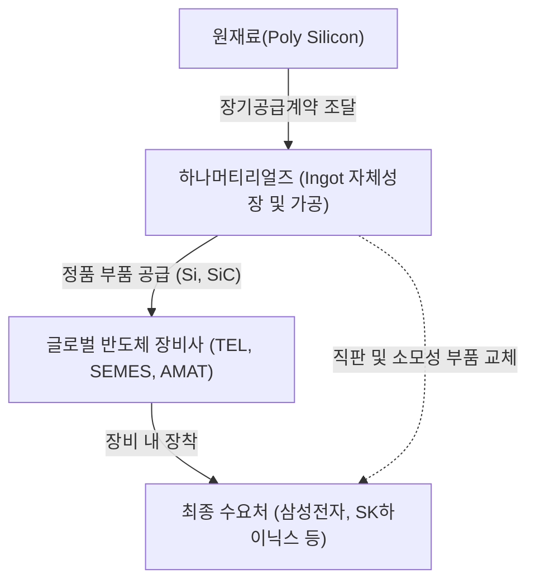

# 🔍 Phase 1: 기업 해독기 (심층 팩트체크 코어)

## 1. 매크로 및 산업 사이클(Sector Cycle) 현황
[시장 내러티브] 
글로벌 반도체 전공정 장비(WFE) 산업은 극심한 다운사이클을 통과하고 현재 강력한 **턴어라운드(Turn-around) 및 호황기 진입 국면**에 위치해 있습니다 `[추정: 8월 글로벌 트렌드 리포트]`. HBM(고대역폭메모리) 생산에 따른 웨이퍼 캐파 잠식 현상과 미세화(Tech Migration) 한계가 맞물리며 실질적인 범용 메모리 공급 부족 현상이 심화되고 있습니다. 이를 타개하기 위해 글로벌 종합반도체기업(IDM)들이 평택 P4, 청주 M15X 등 초대형 메가 팹(Mega Fab) 증설을 가속화하면서, 2026년 WFE 투자는 1,500억 달러, 2027년에는 1,900억 달러 수준으로 대폭 상향 조정되는 명확한 상승 사이클에 올라탔습니다 `[전망: 8월 글로벌 트렌드 리포트]`.

## 2. 비즈니스 모델 및 경제적 해자(Moat)
[공시 팩트] 
하나머티리얼즈는 반도체 식각(에칭) 공정에 필수적인 소모성 부품인 실리콘(Si) 및 실리콘카바이드(SiC) 일렉트로드와 링을 제조합니다. 당사의 가장 강력한 경제적 해자(Moat)는 **대구경 단결정 Silicon Ingot의 자체 성장 기술을 통한 수직계열화**입니다 `[팩트: 25.03.14 사업보고서]`. 외부 원재료에 대한 의존도를 낮추어 구조적인 원가 경쟁력(마진 방어력)을 지니며, 글로벌 에처 장비 1위 그룹인 도쿄일렉트론(TEL)을 2대 주주이자 핵심 고객사로 확보하는 '캡티브(Captive)' 락인(Lock-in) 효과를 누리고 있습니다 `[팩트: 26.08.13 반기보고서]`.

## 3. 주요 사업별 매출 비중 추이 (최근 5년 및 최신 분기)

| 구분 | 핵심 내용 | 비고 |
| :--- | :--- | :--- |
| **실리콘부품 (Electrode, Ring)** | 전사 매출의 압도적 주력 캐시카우. 2021~2025년 평균 87~92% 비중 유지. 2026년 반기 기준 1,630억 원(88.87%) 매출 기록 `[팩트: 26.08.13 반기보고서]`. | 반도체 가동률 및 에칭 수요와 직결 |
| **기타 부품 (SiC 링 등)** | 고마진 차세대 신소재 부품. 2021년 7.13%에서 지속 성장하여 2026년 반기 기준 10.11% (185억 원) 달성 `[팩트: 26.08.13 반기보고서]`. | 고단화 식각 공정 시 마진율 상승 견인 |
| **기타 (상품 외, 신기술금융)** | 1% 미만의 미미한 비중으로 자회사 수익 등 포함 `[팩트: 26.08.13 반기보고서]`. | 전사 펀더멘털 영향 미미 |

## 4. 전사 영업이익률 및 FCF 추이
[공시 팩트] 
과거 2022~2023년 대규모 설비투자(CAPEX) 집행으로 잉여현금흐름(FCF)이 적자(-564억 원)를 기록했으나, 투자가 완료된 2024년 651억 원 흑자로 턴어라운드한 데 이어 2026년 반기에도 328억 원의 흑자를 기록하며 우량한 '투자 회수기'에 진입했습니다 `[팩트: 26.08.13 반기보고서]`. 

| 구분 | 핵심 내용 | 비고 |
| :--- | :--- | :--- |
| **매출액 및 이익 턴어라운드** | 2023년 업황 둔화로 매출 YoY -24.0% 역성장. 그러나 2026년 반기 매출액 1,834억(전반기비 +49.5%), 영업이익 468억(+160.7%) 급반등 `[팩트: 26.08.13 반기보고서]`. | 고객사 WFE 투자 재개와 직결 |
| **영업이익률 (OPM)** | 2021~2022년 30%대 호황 이후 2023년 17.67%로 하락. 2026년 반기 25.52%로 과거 고점 회귀 중 `[팩트: 각 연도별 사업/반기보고서]`. | 가동률 상승에 따른 레버리지 효과 |
| **FCF (잉여현금흐름)** | 2023년 -564억 적자에서 2024년 651억 흑자, 2026년 반기 328억 흑자로 회복 `[팩트: 26.08.13 반기보고서 재무상태표]`. | 투자 회수기 진입 (현금흐름 우량) |

## 5. 핵심 KPI 추이 및 분석 (과거 사이클 고점/저점 비교 필수)
[시장 내러티브] 
식각 부품 기업의 실적을 선행하는 가장 중요한 KPI는 '가동률'입니다. 현재 메모리 3사의 팹 가동률이 낸드 고단화 트렌드와 맞물려 상승하고 있으며, 이는 장비 내 소모품 교체 주기를 획기적으로 단축시켜 부품사들의 풀캐파(Full-Capa) 가동을 강제하고 있습니다.

[공시 팩트] 
실리콘 부품 부문 평균 가동률을 과거 사이클 관점에서 짚어보면 현재의 극적인 턴어라운드가 확인됩니다.
- **과거 슈퍼 사이클 고점 (2021년):** 가동률 **97.47%** `[팩트: 21년 정정사업보고서]`
- **최악의 불황기 저점 (2023년):** 가동률 **40.77%** `[팩트: 23년 사업보고서]`
- **현재 회복 국면 (2026년 1분기):** 가동률 **79.62%** `[팩트: 26.1Q 분기보고서]`

과거 최악의 40%대 저점에서 벗어나 80% 선에 근접하며 '이전 고점'을 향해 맹렬히 회복 중입니다. 선제적 CAPEX 투자가 이미 완료된 상태이므로, 향후 가동률 80% 초과 구간부터는 고정비가 대폭 희석되며 폭발적인 영업이익률(OPM) 스프레드 확대가 전개될 것입니다.

## 6. 경영진 및 주주환원 이력
[공시 팩트] 
안정적인 지배구조와 캡티브 마켓 파트너십이 돋보입니다. 최대주주는 하나마이크론(32.50%)이며, 핵심 고객사인 도쿄일렉트론(TEL)이 13.78%의 지분을 보유한 우군입니다 `[팩트: 26.08.13 반기보고서]`. 

| 구분 | 핵심 내용 | 비고 |
| :--- | :--- | :--- |
| **지배구조** | 하나마이크론(32.50%), TEL(13.78%) 등 강력한 사업적 파트너가 대주주로 참여 `[팩트: 26.08.13 반기보고서]`. | TEL 벤더로서의 해자 보유 |
| **현금 배당** | 2023년 200원(11.4%) → 2024년 250원(15.3%) → 2025년 300원(15.1%)으로 우상향 `[팩트: 26.03.13 사업보고서]`. | 정책적 주주환원 준수 |
| **자사주 매입** | 50억 원 규모 신탁계약 연장 및 48억 원 실제 취득 완료(2025년 기준) `[팩트: 26.03.13 사업보고서]`. | 주가 방어 및 주주친화 정책 |

## 7. 핵심 리스크 분석 (확률 및 파급력 계량화)
[공시 팩트] 
공시를 바탕으로 도출된 핵심 리스크는 아래와 같으며, 전방 사이클 하락에 대한 파급력이 가장 치명적입니다.

| 리스크 요인 | 핵심 내용 (발생 조건) | 확률(Prob) | 파급력(Impact) |
| :--- | :--- | :---: | :---: |
| **전방 산업 변동성 (가동률 급락)** | 반도체 다운사이클 진입 시 제조사 가동률 하락에 직접 노출됨 (23년 가동률 40%대 하락 사례) `[팩트: 24.03.15 사업보고서]` | Low (현재 상승 국면) | **High** |
| **원재료(Poly Si) 가격 급등 및 편중** | 환율 급변 및 독과점 공급사의 판가 인상 압박 발생 시 `[팩트: 26.08.13 반기보고서]` | Mid | Mid (잉곳 내재화로 방어) |
| **매출처 편중 (고객 의존도)** | TEL, 세메스 등 특정 소수 글로벌 장비사에 대한 매출 의존도가 극히 높음 `[팩트: 26.08.13 반기보고서]` | Low | **High** (벤더 탈락 시 치명적) |

## 8. 딥리서치 팩트체크 요약
[시장 내러티브] 
최근 원익IPS, 테스 등 국내 전공정 장비사들의 수주잔고가 1H26 기준 세 자릿수(+100~400%) 폭증하는 랠리가 펼쳐지고 있습니다 `[팩트: 8월 글로벌 트렌드 리포트]`. 장비 발주 후 가동까지 6~9개월이 소요됨을 감안할 때, 2027년 상반기부터 당사와 같은 소모성 부품사(소부장)의 실적이 후행적으로 퀀텀 점프(Quantum Jump)할 것이라는 강한 기대감이 존재합니다 `[전망: 8월 글로벌 트렌드 리포트]`.

[공시 팩트] 
이러한 거시적 수주 데이터는 하나머티리얼즈의 실적 반등 궤적과 정확히 일치합니다. 2026년 반기 실적(매출 +49.5%, 영업이익 +160.7%) 및 가동률 반등(79.62%)은 낸드 고단화 및 장비 램프업이 이미 당사 부품의 출하량 급증으로 이어지고 있음을 증명합니다. 특히 HBM 및 선단 공정 난이도 상승은 식각 횟수와 웨이퍼당 소모품 투입량을 구조적으로 상향시키므로 `[의견: 8월 글로벌 트렌드 리포트]`, 캡티브 고객사를 확보한 당사는 2027년 전공정 장비 가동 본격화와 함께 과거의 이익 고점을 뚫는 레버리지를 시현할 가능성이 매우 높습니다.
