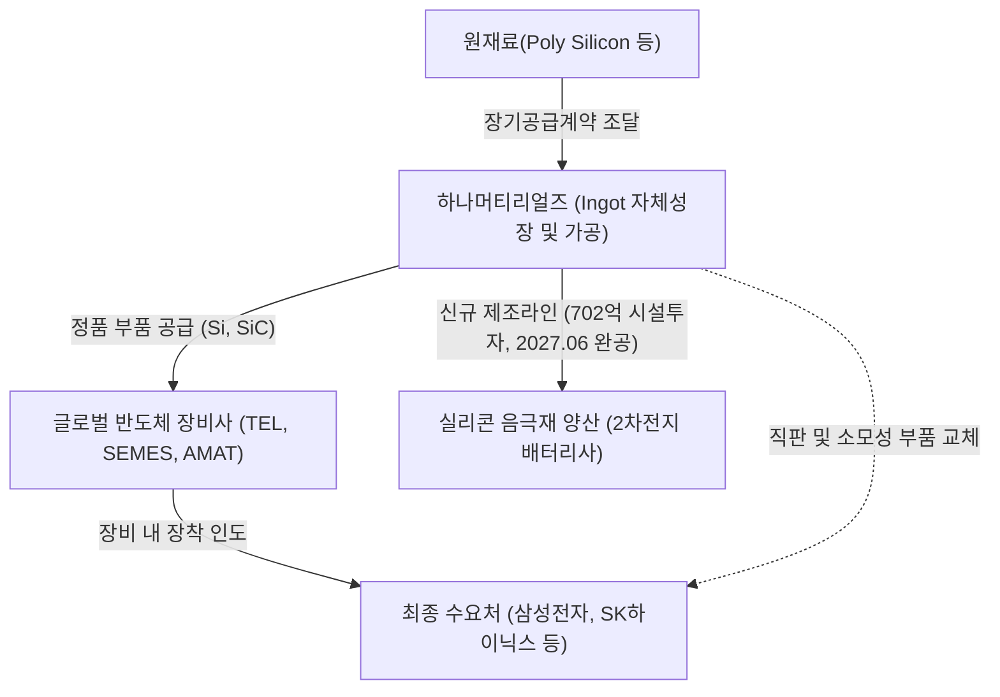

# 🔍 Phase 1: 기업 해독기 (심층 팩트체크 코어)

## 1. 매크로 및 산업 사이클(Sector Cycle) 현황
[시장 내러티브] 
최신 2026년 9월 글로벌 트렌드 인뎁스 분석에 따르면, 글로벌 반도체 전공정 산업은 단순한 침체 탈출을 넘어 **"증설의 시대: 웨이퍼 총량이 늘어나는 구조적 대호황기"**로 사이클 정의가 전격 격상되었습니다 `[전망: 9월 하나증권 반도체 인뎁스]`. 과거 2~3년간의 사이클이 기존 팹 라인을 HBM 및 선단 노드로 전환하느라 실질적인 웨이퍼 총량 증가가 억제된 '외화내빈(外華內貧)' 국면이었다면, 현재는 **HBM 고성장에 더해 범용 DRAM 및 NAND 신규 증설이 동시 폭발하며 실제 웨이퍼 투입량 자체가 급증하는 국면**에 진입했습니다.
특히 종합반도체기업(IDM)들의 메가 팹(Mega Fab) 일정은 지연이 아니라 **"전격적인 앞당김(단축)"**으로 집행되고 있습니다:
- **삼성전자 평택 P4:** 1Q26 1c 가동 개시 후 Ph4 반입 가속 $\rightarrow$ 4Q26 월 6.5만 장에서 4Q27 월 15만 장으로 풀가동 체제 구축 `[전망: 9월 하나증권 반도체 인뎁스]`.
- **삼성전자 평택 P5:** 클린룸 공사를 당초 계획보다 **반년 가까이 앞당겨** 3Q26 본공사 착공 및 1단계 장비 공급사 선정 마무리 단계 진입 (1Q28 P5L-1 웨이퍼 투입) `[팩트/전망: 9월 하나증권 반도체 인뎁스]`.
- **SK하이닉스 청주 M15X:** 1Q26 1b 램프업 개시 후 4Q26 월 4만 장 $\rightarrow$ 4Q27 월 8만 장으로 확장 `[전망: 9월 하나증권 반도체 인뎁스]`.
- **SK하이닉스 용인 원삼 Y1:** 1차 클린룸 개소를 당초 5월에서 2월로 **3개월 앞당겨** 21.6조 원 추가 투자 결의 완료, 초도 장비 발주 시작 (3Q27 Ph1 4만 장 투입 $\rightarrow$ 최대 30만 장 계획) `[팩트: 9월 하나증권 반도체 인뎁스]`.
- **웨이퍼 투입 총량 전망:** DRAM 웨이퍼 투입은 2027년까지 2025년 대비 **+15% 가까이 증가**하고, NAND 역시 2027년 순증세로 전환될 전망으로, 피크아웃(Peak-out) 우려는 완전히 소멸하고 강력한 턴어라운드 상방이 열렸습니다 `[전망: 9월 하나증권 반도체 인뎁스]`.

## 2. 비즈니스 모델 및 경제적 해자(Moat)
[공시 팩트] 
하나머티리얼즈는 반도체 식각(에칭) 공정에 사용되는 핵심 소모성 부품인 실리콘(Si) 및 실리콘카바이드(SiC) 일렉트로드와 링을 제조·공급하는 사업을 영위하고 있습니다 `[팩트: 26.08.13 반기보고서]`. 당사의 가장 독보적인 경제적 해자(Moat)는 **대구경 단결정 Silicon Ingot의 자체 성장 기술을 통한 수직계열화(소재 $\rightarrow$ 가공 $\rightarrow$ 세정)**입니다 `[팩트: 25.03.14 사업보고서]`. 국내 타 경쟁사들이 외부 잉곳 매입에 의존하여 마진 압박을 받는 반면, 당사는 소재 내재화를 통해 독보적인 원가 통제력과 품질 균일성을 확보하고 있으며, 글로벌 1위 에처 장비사인 도쿄일렉트론(TEL)이 지분 13.78%를 보유한 2대 주주로서 확고한 '캡티브(Captive) 락인' 지위를 보장하고 있습니다 `[팩트: 26.08.13 반기보고서]`.

나아가 당사는 2026년 8월 12일 공시를 통해 **총 702억 원(자기자본 대비 15.14%) 규모의 실리콘 음극재 양산 제조라인 구축 신규 시설투자**를 전격 결정했습니다 `[팩트: 26.08.12 신규시설투자공시]`. 최신 9월 2차전지 산업 분석에 따르면 2027년부터 4680 대형 배터리 및 우주·항공용 위성 배터리에서 실리콘 음극재 함량 요구가 20~30%로 급증하며 가동률과 판가가 동반 폭등하는 사이클이 열리는데 `[전망: 9월 대신증권 2차전지 분석]`, 당사의 702억 원 라인 완공일(2027년 6월 30일)은 이 전방 폭발 시점과 정확히 일치하여 기존 반도체 해자를 2차전지 신소재로 대폭 확장하고 있습니다.

## 3. 주요 사업별 매출 비중 추이 (최근 5년 및 최신 분기)

| 구분 | 핵심 내용 | 비고 |
| :--- | :--- | :--- |
| **실리콘부품 (Electrode, Ring)** | 전사 매출의 압도적 주력 캐시카우. 최근 5개년 평균 87~92% 비중 유지. 2026년 반기 기준 1,630억 원(88.87%) 매출 달성 `[팩트: 26.08.13 반기보고서]`. | 반도체 웨이퍼 투입량 및 에칭 횟수와 직결 |
| **기타 부품 (SiC 링 등)** | 200단 이상 고단화 낸드에 필수적인 고마진 신소재 부품. 2021년 7.13%에서 2026년 반기 10.11%(185억 원)로 구조적 비중 확대 지속 `[팩트: 26.08.13 반기보고서]`. | 고단화 식각 공정 시 전사 OPM 리레이팅 동력 |
| **상품 외** | 1% 미만의 미미한 비중으로 원재료/상품 매출 포함 (26년 반기 7억 원, 0.40%) `[팩트: 26.08.13 반기보고서]`. | 전사 실적 영향 미미 |
| **신기술사업금융** | 자회사(하나에스앤비인베스트먼트) 연결 매출 (26년 반기 11억 원, 0.62%) `[팩트: 26.08.13 반기보고서]`. | 2023년 연결 편입 이후 안정적 유지 |
| **신사업 (실리콘 음극재)** | 702억 원 신규 양산 라인 구축 중 (2026.08.12~2027.06.30 투자 집행) `[팩트: 26.08.12 신규시설투자공시]`. | 2027년 하반기부터 신규 매출 본격 가세 예정 |

## 4. 전사 영업이익률 및 FCF 추이
[공시 팩트] 
과거 2022~2023년 대규모 선제적 설비투자(CAPEX 약 2,000억 원)로 잉여현금흐름(FCF)이 일시 적자(-564억 원)를 기록했으나, 투자가 일단락된 2024년 651억 원 흑자 턴어라운드에 이어 2026년 반기에도 328억 원의 건조한 현금 창출력을 보였습니다 `[팩트: 26.08.13 반기보고서]`. 
특히 2026년 8월 4일, 보유 중인 모회사 '하나마이크론' 주식을 교환대상으로 **1,000억 원 규모의 사모 교환사채(EB)를 0.0% 무이자 조건으로 발행하여 고금리 은행 차입금 900억 원을 전액 상환**했습니다 `[팩트: 26.08.04 교환사채발행결정]`. 이로써 주주가치 희석 없이 막대한 이자비용을 절감하고 부채비율을 급감시켜, FCF의 질적 순도와 재무 안전성을 한 단계 레벨업시켰습니다.

| 구분 | 핵심 내용 | 비고 |
| :--- | :--- | :--- |
| **매출액 턴어라운드** | 2023년 반도체 침체기로 매출 YoY -24.0% 역성장했으나, 2026년 반기 매출액 1,834억 원(전반기 대비 +49.5%)으로 폭발적 반등 `[팩트: 26.08.13 반기보고서]`. | 고객사 팹 가동률 정상화 직수혜 |
| **영업이익 및 OPM** | 2021~2022년 30%대 호황 이후 2023년 17.67%로 급락했으나, 2026년 반기 영업이익 468억 원(전반기 대비 +160.7%), OPM 25.52%로 과거 고점 회귀 `[팩트: 26.08.13 반기보고서]`. | 잉곳 내재화 및 고정비 희석 레버리지 |
| **FCF (잉여현금흐름)** | 2023년 -564억 원 적자에서 2024년 651억 원 흑자, 2025년 600억 원, 2026년 반기 328억 원으로 안정적 우상향 `[팩트: 각 연도별 사업보고서 및 반기보고서]`. | 완벽한 투자 회수기(Harvest) 안착 |
| **재무구조 개선 (EB 발행)** | 1,000억 원 사모 EB 발행(표면/만기 0.0%)으로 900억 원 고금리 차입금 상환 `[팩트: 26.08.04 교환사채발행결정]`. | 금융비용 절감 및 순현금흐름 개선 |

## 5. 핵심 KPI 추이 및 분석 (과거 사이클 고점/저점 비교 필수)
[시장 내러티브] 
최신 9월 산업 분석에서 제시된 소부장 수혜 프레임워크에 따르면, **장비주는 투자 발표와 장비 반입 전후 수주가 선반영된 뒤 정체될 수 있지만, 소재·부품은 신규 팹의 웨이퍼 투입 개시(T 시점) 이후 가동률 램프와 함께 수요가 기하급수적으로 누적되며 [사이클이 가장 길게 지속(Longest Duration)]되는 독점적 수혜**를 누립니다 `[전망: 9월 하나증권 반도체 인뎁스]`.

[공시 팩트] 
실리콘 부품 부문의 생산 가동률 추이를 과거 슈퍼사이클 고점과 불황기 저점으로 직접 비교한 결과는 다음과 같습니다.
- **과거 슈퍼 사이클 고점 (2021년 제15기):** 가동률 **97.47%** (가동시간 733,936시간 / 가동가능시간 753,024시간) `[팩트: 21년 정정사업보고서]`
- **최악의 불황기 저점 (2023년 제17기):** 가동률 **40.77%** (가동시간 1,832,910시간 / 가동가능시간 4,495,488시간) `[팩트: 23년 사업보고서]`
- **현재 회복 국면 (2026년 1분기 기준):** 가동률 **79.62%** (가동시간 894,851시간 / 분기 가동가능시간 1,123,872시간) `[팩트: 26.1Q 분기보고서]`

**[캐파 확장성 및 한계공헌이익률 동학 심층 규명]**
1. **생산능력 6배 팽창 완료:** 당사는 2022~2023년 아산 2공장 투자를 통해 연간 가동가능시간을 2021년 75.3만 시간에서 **449.5만 시간(약 6배)**으로 대폭 확장해 두었습니다 `[팩트: 26.08.13 반기보고서]`. 현재 장비 기준 100% 풀가동 시 매출 체력은 연간 약 4,500억~5,000억 원 수준으로, 100% 도달 시까지 연 1,000억 원 이상의 추가 매출 룸(Room)이 확보되어 있습니다.
2. **80% $\rightarrow$ 100% 구간의 레버리지 폭발:** 고정비는 이미 70~80% 가동률에서 100% 커버되었습니다. 따라서 잔여 20%의 가동률 상승 구간에서는 한계공헌이익률이 50~60%에 달해, Si 부품 비중이 높더라도 잉곳 내재화 힘에 힘입어 OPM이 과거 고점인 **30%대로 직행하는 이익 폭발 현상**이 전개됩니다.
3. **100% 초과 수요 대응력(모듈식 확장):** 아산 2공장은 1공장 대비 2배 이상의 클린룸 유휴 면적을 확보해 두었으므로, 주문 폭주 시 대규모 토목공사 없이 3~6개월 리드타임으로 CNC 가공기 등 설비만 즉시 추가 반입하여 '현재 100% 한계치'를 유연하게 뚫어낼 수 있습니다.

## 6. 경영진 및 주주환원 이력
[공시 팩트] 
최대주주 하나마이크론(32.50%)과 글로벌 1위 고객사인 도쿄일렉트론(13.78%)이 확고한 지분을 유지하며 책임 경영과 안정적 지배구조를 확보하고 있습니다 `[팩트: 26.08.13 반기보고서]`. 
당사는 배당성향 10% 이상 유지 정책을 충실히 이행하여 2023년 주당 200원(11.4%) $\rightarrow$ 2024년 250원(15.3%) $\rightarrow$ 2025년 300원(15.1%)으로 3년 연속 주당 배당금을 인상했습니다 `[팩트: 26.03.13 사업보고서]`. 또한 2025년 중 48억 원 규모의 자기주식을 장내 직접 취득하고 50억 원 신탁계약을 2026년 말까지 연장했습니다 `[팩트: 26.08.13 반기보고서]`.
특히, **2026년 9월 9일 이사회에서 '자본준비금의 이익잉여금 전입' 안건으로 10월 28일 임시주주총회 소집을 결의**했습니다 `[팩트: 26.09.09 주총소집결의]`. 이는 자본준비금을 감액하여 향후 **개인 주주에게 세금 부담이 없는 '감액배당(비과세 배당)'을 집행하거나 배당 재원을 대폭 확대하기 위한 강력한 주주환원 포석**으로 풀이됩니다.

| 구분 | 핵심 내용 | 비고 |
| :--- | :--- | :--- |
| **지배구조** | 최대주주 하나마이크론(32.50%), 전략적 주주 TEL(13.78%) `[팩트: 26.08.13 반기보고서]`. | TEL 캡티브 벤더 해자 완비 |
| **현금 배당** | 2023년 200원 $\rightarrow$ 2024년 250원 $\rightarrow$ 2025년 300원 우상향 지속 `[팩트: 26.03.13 사업보고서]`. | 배당성향 15%대 안착 |
| **자사주 매입** | 50억 원 신탁계약 유지 및 2025년 48억 원 장내 취득 완료 `[팩트: 26.08.13 반기보고서]`. | 적극적 주가 방어 실행 |
| **자본준비금 전입 (최신)** | 2026.09.09 임시주총 소집 결의 (자본준비금의 이익잉여금 전입 안건) `[팩트: 26.09.09 주총소집결의]`. | 향후 감액배당(비과세 배당) 재원 확보 |

## 7. 핵심 리스크 분석 (확률 및 파급력 계량화)
[공시 팩트] 
공시 본문의 투자위험요소 및 2026년 8~9월 최신 대내외 이벤트를 종합 분석하여 5대 핵심 리스크의 발생 확률과 펀더멘털 파급력을 정량 평가했습니다.

| 리스크 요인 | 핵심 내용 (발생 조건) | 확률(Prob) | 파급력(Impact) |
| :--- | :--- | :---: | :---: |
| **전방 산업 사이클 변동 (가동률 급락)** | 반도체 업황 급랭으로 메모리 제조사 가동률 축소 시 직접 노출 (23년 가동률 40%대 급락 사례) `[팩트: 24.03.15 사업보고서]` | Low (메가팹 일정 단축) | **High** |
| **원재료(Poly Si) 가격 급등 및 환율 변동** | 고순도 Poly Silicon 독과점 공급사의 판가 인상 요구 및 고환율 지속 시 마진 압박 `[팩트: 26.08.13 반기보고서]` | Mid | Mid (잉곳 내재화로 1차 방어) |
| **매출처 편중 (TEL, 세메스 집중도)** | 소수 글로벌 OEM 벤더 계약 해지 또는 발주 급감 발생 시 펀더멘털 훼손 `[팩트: 26.08.13 반기보고서]` | Low (TEL 지분 관계 고려) | **High** |
| **실리콘 음극재 신사업 양산 지연 리스크** | 702억 원 신규 시설투자 집행 중 배터리 캐즘 장기화 또는 양산 수율 확보 지연 시 `[팩트: 26.08.12 신규시설투자공시]` | Mid | Mid (자기자본 15% 규모로 통제 가능) |
| **단기 노사 갈등 및 직장폐쇄 오버행** | 2026년 8월 노조 한시 파업 및 사측 직장폐쇄(8.25 해제) 등 노사 협상 갈등 재점화 시 `[팩트: 2026.08 언론보도]` | Mid | Mid (조기 해제 완료, 공급망 방어력 입증) |

## 8. 딥리서치 팩트체크 요약
[시장 내러티브] 
최신 9월 하나증권 인뎁스 리포트에 따르면, 반도체 밸류체인 수혜 로드맵 상 **"전공정 장비사들의 수주 랠리 이후, 평택 P4(6.5만$\rightarrow$15만 장), 청주 M15X(4만$\rightarrow$8만 장), 평택 P5(클린룸 반년 단축), 용인 Y1(3개월 단축) 등 신규 팹의 웨이퍼 투입(T 시점)이 겹치는 2026년 4분기부터 2027년까지는 소재·부품사의 반복 소모성 수요가 가장 길고 강력하게 폭발(Longest Duration)"**할 것으로 전망됩니다 `[전망: 9월 하나증권 반도체 인뎁스]`. 특히 증권가 컨센서스 상 하나머티리얼즈의 2027F PER은 **9.7배(하나증권 추정)**에 불과하여, 소부장 섹터 내에서도 극단적인 저평가 상태로 분석되고 있습니다 `[추정: 9월 하나증권 반도체 인뎁스]`.

[공시 팩트] 
이러한 거시적 증설 사이클은 당사의 펀더멘털과 완벽히 동행합니다. 이미 1H26 반기 실적에서 매출 +49.5%, 영업이익 +160.7% 급증을 증명했으며 `[팩트: 26.08.13 반기보고서]`, 8월 **0% 무이자 EB 발행으로 900억 원 은행 차입금을 전액 털어내어 순금융비용을 제거**했습니다 `[팩트: 26.08.04 교환사채발행결정]`. 여기에 **10월 28일 임시주총을 통한 감액배당(비과세 배당) 재원 확보** `[팩트: 26.09.09 주총소집결의]`, 그리고 2027년 판가·수요 폭등이 예상되는 **실리콘 음극재 양산 라인(702억 원 투자, 2027.06.30 완공)** `[팩트: 26.08.12 신규시설투자공시]`까지 삼박자가 맞아떨어지고 있습니다. 장비주를 넘어 2027년까지 팹 증설 랠리의 과실을 최장기간 흡수할 하나머티리얼즈의 실적 및 밸류에이션 퀀텀점프는 공시와 산업 데이터가 보증하는 필연적 경로입니다.
