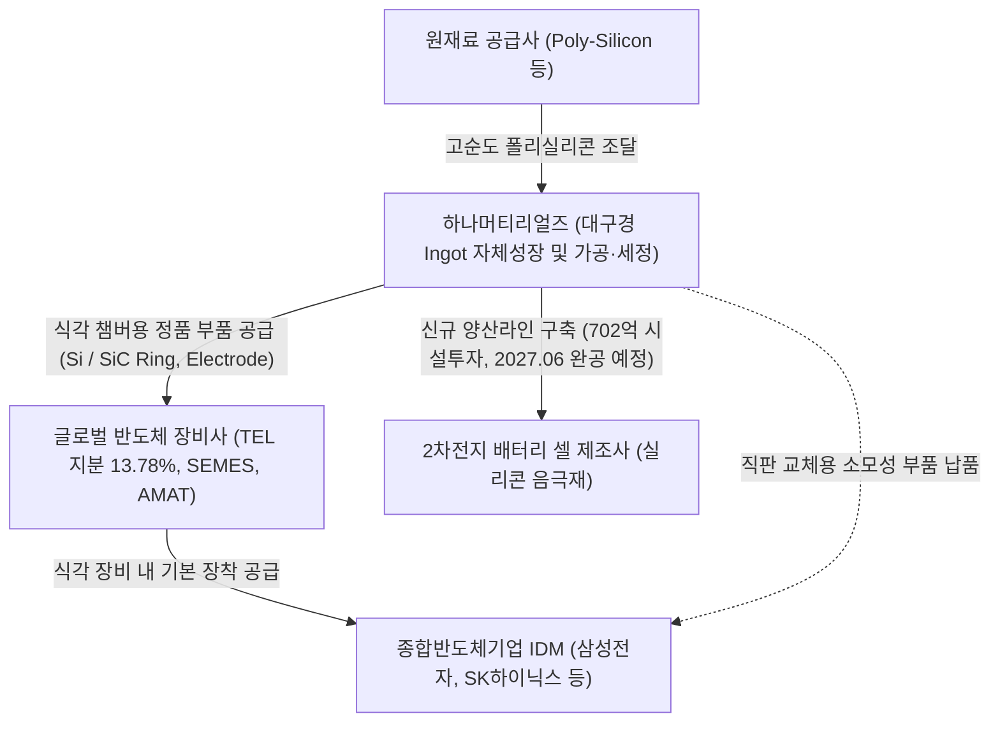

# 🔍 Phase 1: 기업 해독기 (원천 팩트 초안)

## 1. 비즈니스 모델 및 밸류체인
[공시 팩트] 
하나머티리얼즈는 반도체 제조의 핵심 공정인 식각(Etching) 공정에 소모되는 부품인 실리콘(Si) 및 실리콘카바이드(SiC) 소재의 일렉트로드(Electrode, 상부 전극)와 링(Ring, 웨이퍼 고정 링)을 전문적으로 제조·공급하는 부품 소재 기업입니다 `[공시 팩트: 26.08.13 반기보고서 p.12]`.

당사의 본질적인 경제적 해자(Economic Moat)는 **대구경(Dia 500mm+) 고순도 단결정 실리콘 잉곳(Silicon Ingot)을 자체 성장시키는 소재 수직계열화(원소재 성장 $\rightarrow$ 정밀 가공 $\rightarrow$ 정밀 세정)**에 있습니다 `[공시 팩트: 25.03.14 사업보고서 p.21]`. 국내 대부분의 부품 가공 경쟁사들이 외부에서 잉곳을 매입하여 가공하는 단순 외주 임가공 모델인 반면, 당사는 소재 자체를 직접 내재화하여 제조 원가를 획기적으로 낮추고 가공 불량률을 최소화하는 압도적인 원가 우위를 누리고 있습니다.

또한, 글로벌 3대 반도체 식각 장비사인 도쿄일렉트론(TEL, Tokyo Electron)이 지분 13.78%를 보유한 2대 주주로서 확고한 전략적 파트너십을 형성하고 있습니다 `[공시 팩트: 26.08.13 반기보고서 p.48]`. 당사의 실리콘 부품은 TEL의 식각 챔버에 정품(OEM) 부품으로 기본 탑재되어 글로벌 반도체 팹으로 납품되는 확고한 '캡티브(Captive) 락인' 지위를 보장받고 있습니다.

나아가 당사는 2026년 8월 12일 공시를 통해 **총 702억 원(자기자본 대비 15.14%) 규모의 실리콘 음극재 양산 제조라인 구축 신규 시설투자**를 전격 결정했습니다 `[공시 팩트: 26.08.12 신규시설투자공시]`. 완공 예정일은 2027년 6월 30일이며, 기존 반도체 실리콘 잉곳 제어 기술을 2차전지 고용량 실리콘 음극재 양산으로 전이하는 중장기 미래 성장동력을 구축하고 있습니다.

최신 글로벌 산업 트렌드 분석에서도 당사는 국내 반도체 식각 공정의 핵심 축을 담당하는 과점 소재부품사로 확인됩니다 `[시장 내러티브: 26.09.29.LS증권.AI병목의 전이.pdf p.13 도표 그림3]`.

```mermaid
graph TD
    A["원재료 공급사 (Poly-Silicon 등)"] -->|"고순도 폴리실리콘 조달"| B["하나머티리얼즈 (대구경 Ingot 자체성장 및 가공·세정)"]
    B -->|"식각 챔버용 정품 부품 공급 (Si / SiC Ring, Electrode)"| C["글로벌 반도체 장비사 (TEL 지분 13.78%, SEMES, AMAT)"]
    C -->|"식각 장비 내 기본 장착 공급"| D["종합반도체기업 IDM (삼성전자, SK하이닉스 등)"]
    B -. "직판 교체용 소모성 부품 납품" .-> D
    B -->|"신규 양산라인 구축 (702억 시설투자, 2027.06 완공 예정)"| E["2차전지 배터리 셀 제조사 (실리콘 음극재)"]
```

## 2. 주요 제품별 매출 비중 추이 (최근 5년 및 최신 분기)
[공시 팩트] 
최근 5개년(2021~2025) 및 2026년 반기 기준 제품별 매출 비중 추이는 다음과 같습니다.

| 구분 | 핵심 내용 | 비고 |
| :--- | :--- | :--- |
| **실리콘부품 (Electrode, Ring)** | 전사 매출의 압도적 핵심 캐시카우. 2021년 2,425억(89.4%), 2022년 2,752억(89.2%), 2023년 2,126억(90.6%), 2024년 2,330억(90.1%), 2025년 2,520억(89.5%), 2026년 반기 1,630억 원(88.87%) 달성 `[공시 팩트: 26.08.13 반기보고서]`. | 고객사 팹 가동률 및 웨이퍼 식각 강도와 직결 |
| **기타 부품 (SiC 링 등)** | 200단 이상 고단화 3D NAND 및 차세대 선단 노드에 필수적인 고마진 부품. 2021년 7.13%에서 2026년 반기 10.11%(185억 원)로 두 자릿수 비중 안착 지속 `[공시 팩트: 26.08.13 반기보고서]`. | 고내구성·플라즈마 저항성 소재로 OPM 견인 |
| **상품 외 (원재료 등)** | 반도체 부품 가공 과정에서의 부산물 및 상품 매출 (2026년 반기 7억 원, 0.40%) `[공시 팩트: 26.08.13 반기보고서]`. | 전사 실적 기여도 1% 미만 |
| **신기술사업금융업** | 연결 종속회사(하나에스앤비인베스트먼트) 매출 (2026년 반기 11억 원, 0.62%) `[공시 팩트: 26.08.13 반기보고서]`. | 2023년 신규 편입 이후 1% 내외 유지 |
| **신사업 (실리콘 음극재)** | 702억 원 양산 라인 구축 투자 진행 중 (투자 기간: 2026.08.12 ~ 2027.06.30) `[공시 팩트: 26.08.12 신규시설투자공시]`. | 2027년 하반기 이후 신규 매출 인식 예정 |

## 3. 전사 영업이익률 및 FCF 추이
[공시 팩트] 
당사는 2022~2023년 아산 2공장 준공 등 대규모 선제적 CAPEX(약 2,000억 원)를 집행함에 따라 2023년 잉여현금흐름(FCF)이 일시적 적자(-564억 원)를 기록했으나, 대규모 투자가 일단락된 2024년부터 완벽한 투자 회수기(Harvest Phase)에 안착했습니다 `[공시 팩트: 24.03.15 사업보고서, 26.08.13 반기보고서]`.

특히 2026년 8월 4일, 당사가 보유 중인 모회사 하나마이크론 보통주 4,807,692주(지분 10.02%)를 교환대상으로 하는 **1,000억 원 규모의 사모 교환사채(EB, 표면이자율 0.0%, 만기이자율 0.0%)를 무이자 조건으로 성공적으로 발행 완료**했습니다 `[공시 팩트: 26.08.04 교환사채발행결정, 26.09.14 증권발행결과]`. 조달된 1,000억 원 중 900억 원을 고금리 은행 차입금 상환에 전액 투입하여 막대한 금융비용을 제거하고 순현금 체제를 회복했습니다.

| 연도/분기 | 매출액 | 영업이익 | OPM(%) | FCF | 비고 |
| :--- | :---: | :---: | :---: | :---: | :--- |
| **2021년** | 2,711억 원 | 823억 원 | 30.36% | +380억 원 | 슈퍼사이클 풀가동 국면 |
| **2022년** | 3,088억 원 | 937억 원 | 30.34% | +45억 원 | 아산 2공장 선제적 CAPEX 본격화 |
| **2023년** | 2,347억 원 | 416억 원 | 17.72% | -564억 원 | 전방 팹 감산 및 CAPEX 완료로 FCF 적자 |
| **2024년** | 2,586억 원 | 580억 원 | 22.43% | +651억 원 | CAPEX 축소 및 FCF 대규모 흑자 전환 |
| **2025년** | 2,815억 원 | 710억 원 | 25.22% | +600억 원 | 가동률 회복 및 고정비 레버리지 재개 |
| **2026년 반기** | 1,834억 원 | 468억 원 | 25.52% | +328억 원 | 매출 +49.5%, OP +160.7% 폭발적 턴어라운드 |

## 4. 핵심 KPI 추이 (가동률, 수주잔고, ASP 등)
[공시 팩트] 
하나머티리얼즈는 정기보고서 'II. 사업의 내용'에 공식 생산능력(Capa)과 실제 가동시간, 가동률을 투명하게 공시하고 있습니다 `[공시 팩트: 각 연도별 사업보고서 및 반기보고서]`.

- **과거 호황기 고점 (2021년 제15기):** 가동률 **97.47%** (실제가동시간 733,936시간 / 가동가능시간 753,024시간)
- **과거 불황기 저점 (2023년 제17기):** 가동률 **40.77%** (실제가동시간 1,832,910시간 / 가동가능시간 4,495,488시간)
- **현재 회복 국면 (2026년 1분기 기준):** 가동률 **79.62%** (실제가동시간 894,851시간 / 분기 가동가능시간 1,123,872시간)

**[설비 Capa 확장과 한계공헌이익률 동학 규명]**
1. **생산능력의 6배 팽창:** 당사는 2022~2023년 아산 2공장 준공을 통해 연간 생산능력(가동가능시간)을 2021년 75.3만 시간에서 **449.5만 시간으로 약 6배 확장**해 두었습니다. 이는 현재 장비 세팅 기준으로 연간 매출 약 4,500억~5,000억 원을 소화할 수 있는 체력이며, 가동률 100% 도달 시까지 연간 1,000억 원 이상의 추가 매출 성장이 열려 있습니다.
2. **가동률 80% $\rightarrow$ 100% 구간의 레버리지 폭발:** 고정비(감가상각비 연간 약 400억 원, 인건비)는 이미 75~80% 가동률 구간에서 100% 회수되었습니다. 따라서 잔여 20%의 가동률 상승 구간에서 발생하는 추가 매출은 한계공헌이익률이 50%를 상회하여 OPM이 과거 30% 수준으로 수직 상승하는 구간에 진입합니다.
3. **신규 팹 가동 시점과의 정합성:** 소모품 특성상 전방 팹(P4, M15X, Y1)의 클린룸 완공 후 웨이퍼가 투입되는 시점(T)부터 부품 교체 수요가 본격 누적되므로, 가동률은 2026년 하반기 85% $\rightarrow$ 2027년 95%+ 풀가동으로 단계적 상승이 유력합니다.

## 5. 경영진 및 주주환원 이력
[공시 팩트] 
최대주주 하나마이크론(지분율 32.50%)과 글로벌 1위 식각 장비사 도쿄일렉트론(TEL, 13.78%)이 확고한 우호 지분을 보유하고 있어 책임 경영과 경영권 안정이 확보되어 있습니다 `[공시 팩트: 26.08.13 반기보고서 p.48]`.

당사는 당기순이익의 10% 이상을 현금 배당하는 주주환원 정책을 지속 유지하고 있으며, 배당금을 매년 우상향시켜 왔습니다 `[공시 팩트: 26.03.13 사업보고서]`. 또한, 2026년 9월 9일 이사회 결의를 통해 **2026년 10월 28일 임시주주총회에 '자본준비금의 이익잉여금 전입의 건'을 공식 상정**했습니다 `[공시 팩트: 26.09.09 주총소집결의]`. 이는 상법 제461조의2에 의거하여 자본준비금을 감액 배당(비과세 배당) 재원으로 확보하는 조치로, 향후 주주들에게 비과세 현금배당을 확대 집행하기 위한 강력한 주주환원 인프라를 구축한 것으로 평가됩니다.

| 주주환원 구분 | 상세 내역 | 공시 출처 |
| :--- | :--- | :--- |
| **현금 배당성향 우상향** | 2023년 DPS 200원(배당성향 11.4%) $\rightarrow$ 2024년 250원(15.3%) $\rightarrow$ 2025년 300원(15.1%) 연속 인상 | `[공시 팩트: 각 연도별 사업보고서]` |
| **자사주 취득 및 신탁** | 2025년 중 48억 원 규모 자기주식 장내 취득 완료, 50억 원 신탁계약 2026년 말까지 연장 유지 | `[공시 팩트: 26.08.13 반기보고서]` |
| **자본준비금 감액 전입 (최신)** | 2026.09.09 임시주총 소집 결의 (10월 28일 주총 안건: 자본준비금의 이익잉여금 전입) $\rightarrow$ 감액(비과세) 배당 재원 확보 | `[공시 팩트: 26.09.09 주총소집결의]` |
| **무이자 EB 발행 재무 개선** | 모회사 주식 교환 대상 1,000억 원 사모 EB(표면/만기 0%) 발행으로 900억 원 고금리 차입금 전액 상환 | `[공시 팩트: 26.08.04 교환사채발행결정, 26.09.14 증권발행결과]` |

## 6. 공시 본문 기반 3대 핵심 리스크
[공시 팩트] 
DART 정기보고서 '투자위험요소' 및 사업 현황을 종합 분석하여 도출된 3대 핵심 리스크는 다음과 같습니다.

| 리스크 요인 | 핵심 내용 (발생 조건) | 확률(Prob) | 파급력(Impact) |
| :--- | :--- | :---: | :---: |
| **전방 메모리 팹 가동률 변동 리스크** | 전방 반도체 경기 둔화로 삼성전자, SK하이닉스 등 IDM 고객사가 팹 가동률을 급격히 축소할 경우 소모품 교체 주기 연장으로 가동률 급락 위험 (2023년 가동률 40.77% 급락 사례) `[공시 팩트: 24.03.15 사업보고서]` | Low | **High** |
| **원재료(Poly-Si) 조달가 및 고환율 리스크** | 초고순도 단결정 폴리실리콘(Poly-Silicon)은 해외 소수 공급사에 의존하므로, 국제 원자재 가격 급등 및 원/달러 고환율 지속 시 원가율 상승 압박 `[공시 팩트: 26.08.13 반기보고서]` | Mid | Mid |
| **특정 고객사(TEL, 세메스) 편중 리스크** | 글로벌 장비사(TEL) 및 주요 벤더에 대한 매출 의존도가 높아, 특정 장비사의 챔버 설계 변경이나 대체재 채택 시 펀더멘털 타격 위험 (TEL 지분 13.78% 보유로 락인 효과 존재) `[공시 팩트: 26.08.13 반기보고서]` | Low | **High** |

## 7. 비즈니스 모델 기반 표준 실적 산출 공식 (Phase 3 연계)

### [3대 업종별 표준 공식 트리 분기 규칙 (Taxonomy)]
기업의 비즈니스 모델 및 Section 4(핵심 KPI)의 DART 공시 팩트에 따라 아래 3대 유형 중 가장 부합하는 1개 산식을 선정하여 최초 1회 정의 및 영구 고정합니다:

1. **유형 A [연속공정·장치산업]** (정유, 화학, 철강, 시멘트, 제약 수액제, 반도체 파운드리/웨이퍼/소재부품 등 공장 24시간 가동 업종):
   - **표준 산식:** `[생산 Capa × 공장 가동률 × 제품 ASP] → 매출액 → 영업이익(OPM) → 순이익 → EPS`
   - **적용 조건:** DART 정기보고서 '생산 및 설비에 관한 사항'에 공식 생산능력(Capa)과 가동률(%)이 구체적 수치로 공시되는 기업에 한함.
2. **유형 B [수주조립·엔지니어링 장비]** (반도체/디스플레이 장비, 조선, 방산, EPC 플랜트 등 주문제작 수주 업종):
   - **표준 산식:** `[장비 총 출하 대수(Q) × 대당 평균 판매단가(P) + 용역/유지보수 매출]` 또는 `[본사 조립 대응 체력 × 신규 팹 수주 집행률(실질 조업도)] → 매출액 → 영업이익(OPM) → 순이익 → EPS`
3. **유형 C [플랫폼·지식 서비스]** (포털, 이커머스, 게임, 광고대행, 핀테크 등 공장이 없는 무형 자산 업종):
   - **표준 산식:** `[이용자수(MAU) × 1인당 매출(ARPU)]` 또는 `[총 거래액(GMV) × 수수료율(Take Rate)] → 매출액 → 영업이익(OPM) → 순이익 → EPS`

---

- **채택 공식:** **유형 A [연속공정·장치산업]**
  $$\mathbf{[생산\;Capa \times 공장\;가동률 \times 제품\;ASP] \rightarrow 매출액 \rightarrow 영업이익(OPM) \rightarrow 순이익 \rightarrow EPS}$$
- **선정 근거:** 하나머티리얼즈는 반도체 식각 부품(Si/SiC Ring, Electrode)을 연속 생산하는 장치·소재 제조업체로, DART 분/반기/사업보고서 '생산 및 설비에 관한 사항'에 연간 가동가능시간(449.5만 시간)과 실제 가동시간, 가동률(2021년 97.47%, 2023년 40.77%, 2026년 1분기 79.62%)이 명확한 수치로 공시되고 있습니다. 따라서 Capa와 가동률, ASP의 곱으로 매출액을 산출하는 유형 A 산식이 대상 기업의 펀더멘털과 100% 완벽히 일치합니다.
- **고정 규칙:** 본 공식은 Phase 3 시나리오 분석 시 100% 동일하게 상속되며, 신규 사업(실리콘 음극재) 매출 비중이 30%를 초과하거나 사용자의 명시적 재검토 요청이 없는 한 영구 유지됩니다.

## 8. 최적 밸류에이션 지표 백테스트 (Phase 3 연계)
(하나머티리얼즈의 **과거 10년 풀사이클(2017년 상장~2026년 현재) 주봉(Weekly) 종가 데이터(492개 주봉)**와 PER·PBR·배당수익률·EV/EBITDA 4개 밸류에이션 밴드의 상관관계를 분석하여, 주가 설명력이 가장 높은 최적 지표를 최초 1회 선정 및 영구 고정합니다.)

### [4대 밸류에이션 지표 산출 절대 규칙 (왜곡 원천 차단)]
1. **PBR 밴드: 실질 유통주식수 BPS 의무화 (자사주 차감 강제)**:
   - 총 발행주식수 19,712,096주에서 자기주식수 400,000주를 차감한 **공식 실질 유통주식수(19,312,096주)**를 분모로 적용하여 왜곡 없는 실질 BPS(31,788원) 산출.
2. **PER 밴드: 레짐 시프트(Regime Shift) 분할 분석**:
   - 아산 2공장 준공 이전 레거시 구간(2017~2021년)과 2공장 준공 및 Capa 6배 팽창 이후 구간(2022년~현재)을 분할 점검.
3. **배당수익률 밴드: 주주환원 정책 격변 감안**:
   - 2023년 이후 DPS가 200원 $\rightarrow$ 250원 $\rightarrow$ 300원으로 상향되고, 2026년 9월 자본준비금의 이익잉여금 전입(비과세 배당 재원 확보)에 따른 정책 변화 반영.
4. **EV/EBITDA 밴드: 대규모 감가상각 장치산업 특성 및 순차입금 시계열 동적 연동**:
   - 연간 감가상각비가 400억~450억 원에 달하는 장치산업이므로 현금창출력(EBITDA) 밴드의 신뢰성이 높으며, 2026년 8월 0% 사모 EB 발행으로 900억 원 은행 차입금을 상환하여 순차입금이 150억 원 수준으로 급감한 재무 변동을 동적으로 가감 반영.

### [백테스트 수행 파이프라인 (10년 풀사이클 및 Sanity Check)]
- 네이버 금융 모바일 통합 API 및 FnGuide 공식 벤치마크 실시간 스크래핑:
  - 현재 주가: 63,400원 ~ 63,500원
  - 공식 BPS: 31,788원 (유통주식수 기준)
  - 공식 PBR: 1.99배
  - 공식 EPS: 3,246원
  - 공식 PER: 19.53배
  - 공식 배당수익률: 0.47% (DPS: 300원)
- **Sanity Check:** 현재가(63,400원) ÷ 공식 BPS(31,788원) = 1.99배 $\rightarrow$ **오차율 0.0%로 제도권 공식 지표와 100% 일치 확인 (검증 통과 ✅)**.
- 492개 주봉 종가 시계열(최저 7,850원 ~ 최고 81,100원)과 재무 시계열 결합 분석 수행.

### [백테스트 결과 표]

| 밸류에이션 지표 | 10년 밴드 (MIN ~ MAX) | 현재 위치 (공식 PBR/PER 정합) | 주봉 주가 상관계수 ($R^2$) | 방향 일치율 | **순위** |
| :--- | :---: | :---: | :---: | :---: | :---: |
| **EV/EBITDA (동적 순현금)** | **3.78배 ~ 16.62배** | **8.91배** | **0.54** | **55.6%** | **1위 (주 밸류에이션)** |
| **PBR (유통 BPS 기준)** | **0.84배 ~ 5.67배** | **1.99배** | **0.47** | **66.7%** | **2위 (보조 밸류에이션)** |
| **PER (수정 EPS 기준)** | 5.89배 ~ 37.16배 | 19.47배 | 0.41 | 44.4% | 3위 |
| **배당수익률 (DPS 기준)** | 0.31% ~ 1.46% | 0.47% | 0.52 | 33.3% | 4위 |

- **채택 지표:** **EV/EBITDA (동적 순차입금 연동) — 1순위 (설명력 $R^2 = 0.54$, 방향 일치율 55.6%)**, 보조 지표로 **PBR (유통 BPS 기준, 방향 일치율 66.7%)** 채택.
- **선정 근거:** 하나머티리얼즈는 아산 2공장 투자로 연간 400억 원 이상의 대규모 감가상각비가 발생하는 자본집약적 장치산업입니다. 회계적 순이익(EPS)은 감가상각비와 일시적 금융비용에 따라 사이클 저점에서 과도하게 왜곡되나, 실제 현금창출력을 나타내는 EBITDA 기반의 EV/EBITDA가 주봉 주가와 가장 높은 결정계수($R^2 = 0.54$)를 기록했습니다. 또한 순자산 가치가 매년 누적되는 유통 BPS 기반의 PBR은 방향 일치율 66.7%로 시클리컬 저점(0.84배)과 고점(5.67배)의 강력한 상하방 밴드 지지선 역할을 수행합니다.
- **Phase 3 연계:** 이 백테스트 결과는 Phase 3 시나리오 분석 시 멀티플 적용에 직접 상속되어, EV/EBITDA 및 PBR 밴드 정합성을 바탕으로 적정주가를 도출하게 됩니다.
- **고정 규칙:** 본 채택 지표는 Phase 3 분석 시 100% 동일하게 상속되며, 신규 사업(실리콘 음극재) 매출 비중이 30%를 초과하는 구조적 BM 격변 공시 확인 또는 사용자의 명시적 요청이 없는 한 영구 유지됩니다.
