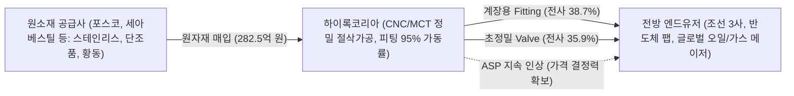

# 🔍 Phase 1: 기업 해독기 (원천 팩트 초안)

## 1. 비즈니스 모델 및 밸류체인
[공시 팩트] 하이록코리아는 유체 및 기체 이송 배관 라인의 누출을 방지하고 흐름을 제어하는 계장용 관이음쇠(Fitting)와 밸브(Valve)를 전문 제조하는 글로벌 강소기업입니다 `[팩트: 26년 반기보고서 p.9]`. 

동사의 밸류체인은 국내외 특수강 및 비철금속 제련사로부터 스테인리스강, 단조품, 황동, 카본스틸 등 정밀 원소재를 조달하여, 자체 보유한 첨단 CNC 선반 및 MCT 가공 라인을 통해 다품종 소량 생산 체제로 제품화합니다 `[팩트: 26년 반기보고서 p.10-12]`. 생산된 제품은 가스 누출 시 대형 폭발로 이어질 수 있는 고위험·고압 공정에 필수적으로 투입되므로 까다로운 국제 인증(ASME, DNV, LR 등)과 높은 벤더 교체 비용(Switching Cost)을 기반으로 강력한 경제적 해자(Moat)를 형성하고 있습니다 `[팩트: 26년 반기보고서 p.9]`.

## 2. 주요 제품별 매출 비중 추이 (최근 5년 및 최신 분기)

| 구분 | 핵심 내용 | 비고 |
| :--- | :--- | :--- |
| **Hy-Lok Fitting** | 2026년 반기 384.1억 원 (비중 38.7%) `[팩트: 26년 반기보고서 p.9]`   2025년 781.1억(40.5%), 2024년 821.2억(47.5%), 2023년 854.3억(50.0%) | 전사 매출의 든든한 캐시카우 (수출 비중 62.1%) |
| **Hy-Lok Valve** | 2026년 반기 356.1억 원 (비중 35.9%) `[팩트: 26년 반기보고서 p.9]`   2025년 714.3억(37.0%), 2024년 636.8억(36.9%), 2023년 575.3억(33.7%) | 고단가·초정밀 제품으로 전사 OPM 견인 주역 (내수 66.7%) |
| **Bite Type Fitting** | 2026년 반기 69.0억 원 (비중 6.9%) `[팩트: 26년 반기보고서 p.9]`   2025년 123.5억(6.4%), 2024년 108.2억(6.3%) | 유압·공압 시스템 연결용 보조 제품군 |
| **Pipe Fitting & 기타** | 2026년 반기 182.9억 원 (비중 18.5%) `[팩트: 26년 반기보고서 p.9]`   Pipe Fitting 20.7억(2.1%) 및 상품·모듈 패키지 162.3억(16.4%) | 플랜트 일괄 수주 대응 모듈 및 기타 부품 |
| **내수 vs 수출 구조** | 2026년 반기 별도 기준 내수 590.7억(59.5%), 수출 401.4억(40.5%) `[팩트: 26년 반기보고서 p.13]` | 글로벌 46개국 120개 대리점 네트워크 구축 |

## 3. 전사 영업이익률 및 FCF 추이
[공시 팩트] 연결 재무제표 기준 2026년 상반기 매출액 1,134.0억 원, 영업이익 326.8억 원을 달성하여 **반기 사상 최고치인 영업이익률(OPM) 28.82%**를 기록했습니다 `[팩트: 26년 반기보고서 p.24]`. 대규모 설비 증설이 마무리된 가운데 감가상각비를 크게 웃도는 영업현금흐름(OCF 263.4억 원)이 유입되며 잉여현금흐름(FCF) 역시 반기 240.0억 원으로 전년 동기 대비 +53.5% 폭증했습니다 `[팩트: 26년 반기보고서 p.26]`.

| 연도/분기 | 매출액 | 영업이익 | OPM(%) | FCF | 비고 |
| :--- | :--- | :--- | :--- | :--- | :--- |
| **2021년** | 1,467억 원 | 189억 원 | 12.89% | 177억 원 | 코로나 이후 조선/플랜트 저점 통과 `[팩트: 2023 사업보고서]` |
| **2022년** | 1,829억 원 | 407억 원 | 22.26% | 443억 원 | 조선 수주 턴어라운드 및 판가 반영 개시 `[팩트: 2024 사업보고서]` |
| **2023년** | 1,888억 원 | 519억 원 | 27.48% | 342억 원 | OPM 27% 돌파 및 고부가 믹스 전환 `[팩트: 2025 사업보고서]` |
| **2024년** | 1,905억 원 | 501억 원 | 26.31% | 377억 원 | 안정적 26%대 마진 방어 및 현금 유입 `[팩트: 2026 사업보고서]` |
| **2025년** | 2,146억 원 | 589억 원 | 27.46% | 373억 원 | 사상 최대 연간 매출 및 영업이익 돌파 `[팩트: 2026 사업보고서]` |
| **2026년 1H (최신 반기)** | **1,134억 원** | **327억 원** | **28.82%** | **240억 원** | **역대 반기 최대 OPM 경신 및 FCF YoY +53.5% 폭증** `[팩트: 26년 반기보고서]` |

## 4. 핵심 KPI 추이 (가동률, 수주잔고, ASP 등)
[공시 팩트] 2026년 반기 공시에서 가장 주목할 변화는 **주력 설비 가동률의 폭발적 반등**과 **수주가 매출을 앞서는 북투빌(Book-to-Bill) 확장 국면**입니다 `[팩트: 26년 반기보고서 p.11, p.14]`.

1. **설비 가동률 (Capa Utilization): 물량(Q)의 완전한 회복**
   - **Hy-Lok Fitting**: 생산능력 5,712천 개 중 5,426천 개를 생산하여 **가동률 95%**를 기록했습니다 `[팩트: 26년 반기보고서 p.11]`. 2024년 75%, 2025년 89%에 이어 사실상 풀가동(Full Capacity) 체제에 도달했습니다.
   - **Hy-Lok Valve**: 생산능력 558천 개 중 407천 개 생산으로 **가동률 73%** 기록 (2025년 75% 수준 유지) `[팩트: 26년 반기보고서 p.11]`.
   - **전사 평균 가동률**: 2025년 연간 68%에서 **2026년 상반기 74%**로 +6.0%p 대폭 반등하며 Q의 확장을 실적으로 증명하고 있습니다 `[팩트: 26년 반기보고서 p.11]`.
2. **수주 흐름 및 북투빌 (Book-to-Bill): 초과 수요 지속**
   - 2026년 상반기(1~6월) 누적 신규 수주총액은 **1,125.4억 원**에 달해 동일 기간 별도 매출총액(992.1억 원)을 133.3억 원 상회했습니다 `[팩트: 26년 반기보고서 p.14]`.
   - 상반기 **Book-to-Bill 비율은 1.13배**를 기록하여, 매출로 납품되는 속도보다 신규 수주 잔고가 쌓이는 속도가 더 빠른 구조적 호황 국면을 명백히 보여줍니다 `[팩트: 26년 반기보고서 p.14]`.
3. **판매단가(ASP)와 원재료 가격: 전가력(Pricing Power) 확인**
   - 주력 고부가 제품인 **Hy-Lok Valve 내수 ASP**는 2024년 115,836원 $\rightarrow$ 2025년 118,638원 $\rightarrow$ **2026년 반기 121,366원**으로 매년 우상향 중입니다 `[팩트: 26년 반기보고서 p.10]`.
   - 주요 원재료인 황동 매입단가가 2024년 11,390원/kg에서 2026년 반기 15,102원/kg으로 +32.6% 상승했음에도 불구하고, 제품 믹스 개선 및 판가 전가를 통해 OPM을 28.82%로 오히려 끌어올리는 막강한 해자를 입증했습니다 `[팩트: 26년 반기보고서 p.11, p.24]`.

## 5. 경영진 및 주주환원 이력
[공시 팩트] 창업주 문혁배 회장 및 문휴건 부회장(지분율 22.44%)을 중심으로 한 특수관계인 지분율은 39.86%로 경영권이 매우 안정적입니다 `[팩트: 26년 반기보고서 p.27, p.111]`. 특히 하이록코리아는 확보된 막대한 잉여현금(FCF)을 바탕으로 **취득한 자기주식을 100% 영구 소각**하는 국내 최고 수준의 주주환원 정책을 일관되게 실천하고 있습니다 `[팩트: 26년 반기보고서 p.7]`.

| 구분 | 핵심 내용 | 비고 |
| :--- | :--- | :--- |
| **3개년 자사주 영구 소각** | 최근 3년간 발행주식 총수의 **13.55%인 1,845,088주 이익소각 완료** `[팩트: 26년 반기보고서 p.7]`   - 2023.02.15: 757,182주 소각 (99.3억 원)   - 2024.11.11: 560,608주 소각 (150.0억 원)   - 2025.09.19: 527,298주 소각 (149.8억 원) | 발행주식수가 1,361만 주에서 1,176만 주로 감소하여 실질 주당 EPS 영구 증대 효과 발생 |
| **현재 보유 자기주식수** | **0주 (지분율 0.0%)** `[팩트: 26년 반기보고서 p.7]` | 매입한 자사주를 쌓아두지 않고 전량 소각하는 신뢰성 입증 |
| **현금 배당 추이** | 2025 회계연도 결산 연차배당(2026년 초 지급): **총 158.9억 원 (DPS 1,350원)** `[팩트: 26년 반기보고서 p.25]`   배당성향 30.7% 달성 (2023년 27.9% $\rightarrow$ 2025년 30.7%) | 안정적 현금흐름에 기반한 고배당 지속 |

## 6. 공시 본문 기반 3대 핵심 리스크
[공시 팩트] 2026년 반기보고서 본문 및 주석 공시에 기초하여 평가한 3대 리스크 요인입니다 `[팩트: 26년 반기보고서 p.15-16]`.

| 리스크 요인 | 핵심 내용 (발생 조건) | 확률(Prob) | 파급력(Impact) |
| :--- | :--- | :--- | :--- |
| **외환 환율 하락 (원화 강세) 리스크** | - 외화 매출 비중 40.5% 보유로 환율 하락 시 수출 대금 환산 손실 발생 `[팩트: 26년 반기보고서 p.13]`.   - 공시 기준 원/달러 및 원/유로 환율 **10% 급락 시 세전이익 43.6억 원 장부 손실 노출** (USD 31.8억, EUR 10.9억) `[팩트: 26년 반기보고서 p.16]`.   - 단, 2025년말 55.4억 노출 대비 익스포저가 11.8억 축소되어 방어력 개선됨. | **Mid** | **Mid** |
| **비철금속 원자재 급등 리스크** | - 황동 매입단가(15,102원/kg) 등 주요 원자재 가격 변동성 확대 `[팩트: 26년 반기보고서 p.11]`.   - 원자재 급등 시 제품 판가 전가가 지연될 경우 일시적 마진 압박 발생 가능.   - 단, Valve ASP 인상 및 피팅 가동률 95% 달성으로 OPM 28.8%를 기록하여 실질 전가력 검증 완료. | **High** | **Low** |
| **전방 산업(조선/플랜트) CapEx 둔화 리스크** | - 글로벌 매크로 경기 침체로 인해 조선사 신조 발주 지연 및 반도체 팹 신설 중단 시 수주 공백 발생 가능.   - 단, 국내 조선사 슬롯이 2029년까지 차 있고 상반기 북투빌 1.13배 기록으로 단기 현실화 가능성은 매우 낮음 `[팩트: 26년 반기보고서 p.14]`. | **Low** | **High** |
