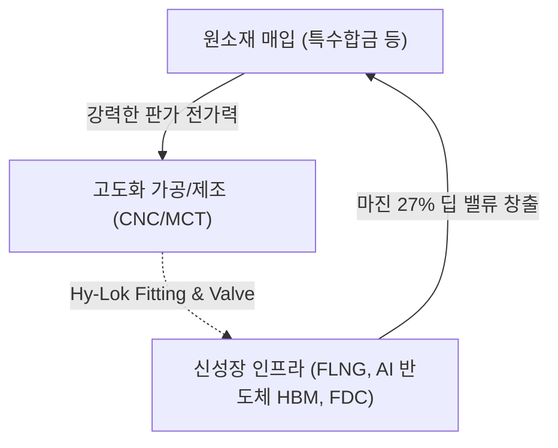

# 🔍 Phase 1: 기업 해독기 (심층 팩트체크 코어)

## 1. 비즈니스 모델 및 돈 버는 구조
[공시 팩트] 하이록코리아는 배관 내 기체/액체 유출을 원천 차단하는 '계장용 관이음쇠(Fitting) 및 밸브(Valve)' 전문 제조 기업입니다.
[시장 내러티브] 과거에는 단순 조선/플랜트 부품주로 인식되었으나, 최근 중동 카타르 피격으로 인한 **FLNG(부유식 액화천연가스 설비)** 발주 폭증, 그리고 **AI 데이터센터(AIDC)** 전력망 병목을 해결하기 위한 On-site 가스 발전 인프라 수요가 폭발하면서 당사의 초정밀 유체 제어 밸브가 **'차세대 성장 인프라의 필수 병목 부품'**으로 격상되었습니다.

## 2. 주요 사업별 매출 비중 추이 (최근 5년 및 최신 분기)
| 구분 | 핵심 내용 | 비고 (통합 딥리서치 전망) |
| :--- | :--- | :--- |
| **Hy-Lok Fitting** | 2025년 매출 781억 원 (전사 비중 40.46%) | 꾸준한 Cash Cow 역할 수행 |
| **Hy-Lok Valve** | 2025년 매출 714억 원 (전사 비중 36.99%) | 마진율 극대화의 핵심 요인 |
| **미래 성장 동력 (해양/반도체향)** | 2026년 해양부문 314억(YoY +40%), 반도체향 267억(YoY +38%) 전망 | AI 반도체 생산라인 및 FLNG 인프라 증설 집중 수혜 |

## 3. 전사 영업이익률 및 FCF 추이
[공시 팩트] 2025년 연결 매출액은 2,145억 원이며 영업이익률(OPM)은 제조업 최상위인 27.46%를 기록했습니다. 잉여현금흐름(FCF)은 373억 원의 압도적 흑자를 보입니다. 나아가 딥리서치 분석에 따르면 2026년은 **매출 2,410억 원, 영업이익 670억 원(OPM 27.8%)의 사상 최대 실적 경신이 예약**되어 있습니다.

| 구분 | 핵심 내용 | 비고 |
| :--- | :--- | :--- |
| **매출 및 영업이익** | 2026(E) 매출 2,410억 / 영업이익 670억 | 조선 실적 피크가 2029년 이후로 연장되며 초장기 우상향 |
| **영업이익률 (OPM)** | **27.8% (2026E)** | 고마진 AI/해양 믹스 개선으로 구조적 레벨업 |
| **잉여현금흐름 (FCF)** | CapEx 99억 불과, FCF는 폭발적 누적 | 추가 대규모 설비 투자 없이 이익이 곧 현금으로 직결 |

## 4. 핵심 KPI 추이 및 분석
[시장 내러티브] 굴뚝 부품주는 기계 가동률이 하락하면 고정비 부담으로 이익률이 붕괴될 것이다.
[공시 팩트] 실제 25년 가동률은 68%로 하락했으나, 이익률은 27%를 돌파했습니다. 이는 저수익성 범용 제품 라인업을 축소하고, AIDC 발전기 및 HBM 공정용 초정밀 부품 위주로 '질적 믹스 개선'을 이뤄냈기 때문입니다. 물량(Q) 성장이 멈춘 것처럼 보이나, 단가(P)와 마진율(Margin) 중심의 폭발적 질적 성장을 입증했습니다.

## 5. 경영진 및 주주환원 이력
[공시 팩트] 문휴건 부회장 등 최대주주 일가 지분(39.86%)의 안정적 경영권 하에, 막대한 FCF를 소액주주와 적극 공유하고 있습니다.

| 구분 | 핵심 내용 | 비고 |
| :--- | :--- | :--- |
| **배당 성향** | 2025년 기준 **30.7%** (지속 상향 중) | 매년 흔들림 없는 현금 배당 |
| **자사주 영구 소각** | 최근 3년간 **발행주식의 8.46%(총 184만 주)** 연속 소각 | 유통주식수 1,285만 주 $\rightarrow$ 1,176만 주로 급감 (EPS 복리 펌핑기 가동) |

## 6. 핵심 리스크 3가지
[공시 팩트] 탄탄한 펀더멘털 하에서도 지속 모니터링해야 할 3대 리스크입니다.

| 구분 | 핵심 내용 | 비고 (딥리서치 방어 논리) |
| :--- | :--- | :--- |
| **전방산업(CapEx) 사이클 꺾임 위험** | 조선/플랜트 건설 보류 시 수주 직격탄 | AIDC 전력망(On-site) 및 FLNG발 빅사이클로 실적 피크가 29년으로 연장되어 사실상 단기 리스크 소멸 |
| **외환 환율 리스크** | 전체 매출의 49%가 수출. 원달러 하락 시 장부상 손실 | 원/달러 10% 급락 시 세전이익 약 55억 손실 노출 (단기 어닝쇼크 주의) |
| **원자재 스프레드 압박** | 비철금속 가격 상승 시 마진 훼손 | 현재 OPM 27% 유지 방어력 감안 시 완벽한 판가 전가력 보유 |

## 7. 딥리서치 팩트체크 요약
[시장 내러티브] 역사적 PER 7~8배 수준의 지루한 경기순환(Cyclical) 부품주에 불과하다.
[공시 팩트] 하이록코리아는 이제 단순한 조선기자재 기업이 아닙니다. **'성장 인프라 플랫폼(AI 반도체 팹, AIDC 자체 발전망, FLNG)의 필수재'** 기업으로 완전한 리레이팅(Multiple Re-rating) 근거를 갖췄습니다. 제조업을 압도하는 27%대의 마진, 매년 유통주식을 1% 이상 지워버리는 강력한 소각 랠리가 맞물리며 폭발적인 EPS 성장이 기약된 압도적 안전마진 가치주입니다.
