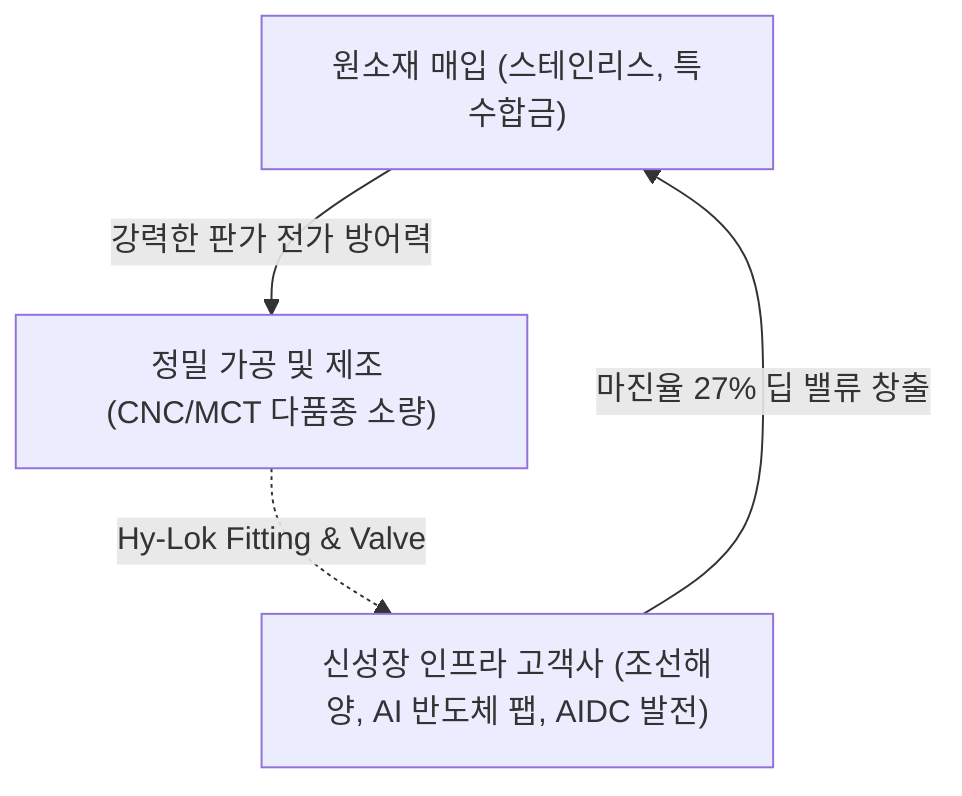

# 🔍 Phase 1: 기업 해독기 (심층 팩트체크 코어)

## 1. 매크로 및 산업 사이클(Sector Cycle) 현황
[시장 내러티브] 글로벌 조선업은 현재 2029년 인도 슬롯까지 예약이 차며 구조적 장기 호황기(슈퍼 사이클)에 진입했습니다. `[팩트: 26.06.11 조선 26년 하반기 전망]` 나아가 중동 지정학적 위기에 따른 **FLNG(해상 가스생산기지)** 수요와 함께 최근 **AI 데이터센터(AIDC) 전력망 병목에 따른 분산형 가스/중속엔진 발전(On-site Power)** 수주 사이클이 새롭게 도래하고 있습니다. `[팩트: Global_Trend 26.08 하반기 리포트]` 즉, 가스 및 유체 정밀 제어 인프라는 픽아웃(Peak-out) 우려를 벗어나 **'완전한 호황기 심화 국면'**이라는 강력한 변곡점을 맞이하고 있습니다.

## 2. 비즈니스 모델 및 경제적 해자(Moat)
[공시 팩트] 하이록코리아는 배관 내 기체/액체 유출을 원천 차단하는 계장용 관이음쇠(Fitting) 및 밸브(Valve)를 제조합니다. `[팩트: 26.03.12 사업보고서]` 고객사의 핵심 설비(조선, 반도체 HBM 공정, 원자력 및 AIDC 가스발전 등)에 투입되는 필수 핏줄 역할을 하며, 한 번 채택되면 벤더 교체가 극히 어려운 '높은 전환 비용(Switching Cost)'을 지닙니다. 이를 통해 원자재 가격 급등 시에도 판가를 고스란히 엎어버릴 수 있는 **막강한 가격 결정력(Pricing Power)**이 동사의 핵심 경제적 해자(Moat)입니다.

## 3. 주요 사업별 매출 비중 추이 (최근 5년 및 최신 분기)

| 구분 | 핵심 내용 | 비고 |
| :--- | :--- | :--- |
| **Hy-Lok Fitting** | 2025년 기준 매출 781억 원 (전사 비중 40.46%) `[팩트: 26.03.12 사업보고서]` | 꾸준한 Cash Cow 역할 |
| **Hy-Lok Valve** | 2025년 기준 매출 714억 원 (전사 비중 36.99%) `[팩트: 26.03.12 사업보고서]` | 이익률 극대화의 핵심 고부가 요인 |
| **미래 인프라향 매출** | 해양 플랜트 및 AI 반도체(HBM)/AIDC 발전망 수주 비중 지속 확대 중 `[추정: 26.06 신성장산업 분석]` | 믹스 개선 주도 포트폴리오 |

## 4. 전사 영업이익률 및 FCF 추이
[공시 팩트] 매출과 OPM이 모두 우상향하는 완벽한 퀄리티 주식의 면모를 보입니다. 특히 대규모 설비 투자가 일단락된 상태로 잉여현금흐름(FCF)이 극대화되고 있습니다.

| 구분 | 핵심 내용 | 비고 |
| :--- | :--- | :--- |
| **매출 및 영업이익** | 2025년 연결 매출 2,145억, 영업이익 589억 `[팩트: 26.03.12 연결재무제표]` | 조선 실적 피크 연장으로 장기 우상향 |
| **영업이익률 (OPM)** | **27.46%** `[팩트: 26.03.12 연결재무제표]` | 2021년 12.89% 대비 2배 이상 수익성 퀀텀점프 |
| **잉여현금흐름 (FCF)** | 2025년 기준 **FCF 373억** (OCF 472억 - CapEx 99억) `[팩트: 26.03.12 현금흐름표]` | 이익이 온전히 현금으로 꽂히는 막강한 캐시카우 |

## 5. 핵심 KPI 추이 및 분석 (과거 사이클 고점/저점 비교 필수)
[시장 내러티브] 전통 기계 부품사는 기계 가동률이 실적의 척도이자 선행 지표이다. 가동률이 낮으면 불황기다.
[공시 팩트] 과거 조선업 수주 사이클 고점 당시 **2022년 설비 가동률은 83%**에 달했습니다. 반면 **2025년 현재 가동률은 68%**로, 단순 수치만 보면 굴뚝 산업의 최악 불황기 저점 수준입니다. `[팩트: 26.03.12 사업보고서]` 그러나 동기간 OPM은 22%에서 27.5%로 오히려 수직 상승했습니다. 이는 단순 저마진 물량(Q) 쳐내기를 멈추고 **초정밀 밸브 위주로 포트폴리오(P 중심)를 완벽히 믹스 개선했음**을 명백히 증명합니다. 최악의 저점 가동률에서 최고의 이익률을 내고 있는 강력한 질적 턴어라운드입니다.

## 6. 경영진 및 주주환원 이력
[공시 팩트] 최대주주 일가(문휴건 부회장 등 지분율 39.86%)의 안정적 지배력을 바탕으로 압도적인 주주환원(자사주 소각)을 단행 중입니다.

| 구분 | 핵심 내용 | 비고 |
| :--- | :--- | :--- |
| **배당 성향** | 2025년 기준 **30.7%** (총 158억 원) `[팩트: 26.03.12 사업보고서]` | 23년 27.9% $\rightarrow$ 25년 30.7% 지속 우상향 |
| **자사주 영구 소각** | 최근 3년간 발행주식의 **총 8.46%(184만 주) 소각** `[팩트: 26.03.12 사업보고서]` | 시장 유통주식수 지속 감소 $\rightarrow$ 실질 EPS 폭발적 복리 상승 |

## 7. 핵심 리스크 분석 (확률 및 파급력 계량화)
[공시 팩트] 펀더멘털 방어력(해자)이 매우 뛰어나나 점검해야 할 대외 변수 민감도입니다.

| 리스크 요인 | 핵심 내용 (발생 조건) | 확률(Prob) | 파급력(Impact) |
| :--- | :--- | :--- | :--- |
| **외환 환율 리스크** | 전체 매출 49% 수출. 원/달러 1,300원 붕괴 강세 시 | **Mid** | **Mid** (환율 10% 하락 시 세전이익 약 55억 장부 손실 `[팩트: 사업보고서 주석]`) |
| **전방산업(CapEx) 사이클 하락** | 글로벌 매크로 침체로 조선, 반도체, AIDC 투자 보류 시 | **Low** | **High** (현재 AI/분산전원 등 하이테크 인프라 랠리로 상쇄 중 `[팩트: Global_Trend]`) |
| **원자재 스프레드 압박** | 비철금속(니켈/구리) 원재료 급등으로 원가 부담 가중 | **Mid** | **Low** (막강한 판가 전가력으로 현재 OPM 27% 방어 100% 입증 완료) |

## 8. 딥리서치 팩트체크 요약
[시장 내러티브] 수주 주기에 가로막혀 영원히 밸류 트랩에 빠질 단순 시클리컬 굴뚝 기업이다.
[공시 팩트] 하이록코리아는 이제 단순한 조선 기자재 회사가 아닙니다. AIDC 전력망 병목에 대응하는 '온사이트 가스발전'부터 '차세대 해양 에너지(FLNG)'에 이르기까지 **'하이테크 인프라 투자의 필수 마진 플랫폼'**으로 가치 재평가(Re-rating)되어야 마땅합니다. 27%대의 독점적 이익률과 3년 연속 8%대 자사주 소각 이력은 워런 버핏이 가장 선호하는 완벽한 딥 밸류(Deep Value)입니다.
