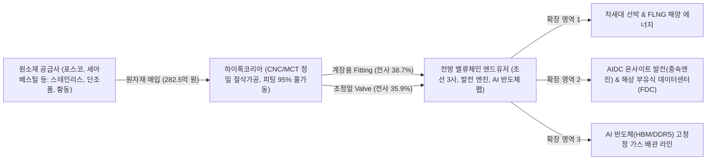

# 🔍 Phase 1: 기업 해독기 (원천 팩트 초안)

## 1. 비즈니스 모델 및 밸류체인
[공시 팩트] 하이록코리아는 유체 및 기체 이송 배관 라인의 누출을 원천 차단하고 흐름을 제어하는 계장용 관이음쇠(Fitting)와 밸브(Valve)를 전문 제조하는 글로벌 강소기업입니다 `[팩트: 26년 반기보고서 p.9]`.

동사의 밸류체인은 국내외 특수강 및 비철금속 제련사(포스코, 세아베스틸 등)로부터 스테인리스강, 단조품, 황동, 카본스틸 등 정밀 원소재를 조달하여, 자체 보유한 첨단 CNC 선반 및 MCT 가공 라인을 통해 다품종 소량 생산 체제로 제품화합니다 `[팩트: 26년 반기보고서 p.10-12]`. 생산된 제품은 가스 누출 시 폭발로 직결되는 고압·초저온 위험 공정에 필수 투입되므로 까다로운 국제 선급 및 품질 인증(ASME, DNV, LR 등)과 높은 벤더 교체 비용(Switching Cost)을 바탕으로 강력한 경제적 해자(Moat)를 구축하고 있습니다 `[팩트: 26년 반기보고서 p.9]`.

특히 최신 2026년 9월 글로벌 산업 사이클 분석에 따르면, 하이록코리아의 전방 밸류체인은 기존의 상선 중심 조선업을 넘어 **'AI 데이터센터 전력망 우회용 육상 온사이트(On-site) 발전 설비(4행정 중속엔진, 가스터빈)'**와 **'해상 부유식 데이터센터(FDC: Floating Data Center)'** 및 **'AI 반도체 첨단 팹 라인'**으로 영역이 구조적으로 확장되고 있습니다 `[팩트: Global_Trend 26.09 LS증권 AI시대 조선산업 p.2-5]`.

## 2. 주요 제품별 매출 비중 추이 (최근 5년 및 최신 분기)

| 구분 | 핵심 내용 | 비고 |
| :--- | :--- | :--- |
| **Hy-Lok Fitting** | 2026년 반기 384.1억 원 (비중 38.7%) `[팩트: 26년 반기보고서 p.9]`   2025년 781.1억(40.5%), 2024년 821.2억(47.5%), 2023년 854.3억(50.0%) | 전사 외형을 지탱하는 핵심 캐시카우 (직수출 비중 62.1%) |
| **Hy-Lok Valve** | 2026년 반기 356.1억 원 (비중 35.9%) `[팩트: 26년 반기보고서 p.9]`   2025년 714.3억(37.0%), 2024년 636.8억(36.9%), 2023년 575.3억(33.7%) | 초정밀·고단가 제품군으로 전사 OPM 28.8% 견인 (내수 비중 66.7%) |
| **Bite Type Fitting** | 2026년 반기 69.0억 원 (비중 6.9%) `[팩트: 26년 반기보고서 p.9]`   2025년 123.5억(6.4%), 2024년 108.2억(6.3%) | 유압·공압 시스템 배관 체결용 서브 제품군 |
| **Pipe Fitting & 기타** | 2026년 반기 182.9억 원 (비중 18.5%) `[팩트: 26년 반기보고서 p.9]`   Pipe Fitting 20.7억(2.1%) 및 상품·모듈 패키지 162.3억(16.4%) | 플랜트 턴키 대응용 모듈 패키지 및 상품 매출 |
| **내수 vs 수출 구조** | 2026년 반기 별도 기준 내수 590.7억(59.5%), 직수출 401.4억(40.5%) `[팩트: 26년 반기보고서 p.13]` | 글로벌 46개국 120개 해외 대리점 네트워크망 보유 |

## 3. 전사 영업이익률 및 FCF 추이
[공시 팩트] 연결 재무제표 기준 2026년 상반기 매출액 1,134.0억 원, 영업이익 326.8억 원을 달성하여 **반기 사상 최고치인 영업이익률(OPM) 28.82%**를 기록했습니다 `[팩트: 26년 반기보고서 p.24]`. 대규모 설비 투자가 일단락된 가운데 영업활동현금흐름(OCF 263.4억 원)에서 자본적 지출(CapEx 23.4억 원)을 차감한 **상반기 순 FCF는 240.0억 원으로 전년 동기 대비 +53.5% 폭증**하며 압도적인 현금 창출력을 입증했습니다 `[팩트: 26년 반기보고서 p.26]`.

| 연도/분기 | 매출액 | 영업이익 | OPM(%) | FCF | 비고 |
| :--- | :--- | :--- | :--- | :--- | :--- |
| **2021년** | 1,467억 원 | 189억 원 | 12.89% | 177억 원 | 코로나 이후 조선/플랜트 저점 통과 `[팩트: 2023 사업보고서]` |
| **2022년** | 1,829억 원 | 407억 원 | 22.26% | 443억 원 | 조선 수주 턴어라운드 및 단가 인상 반영 `[팩트: 2024 사업보고서]` |
| **2023년** | 1,888억 원 | 519억 원 | 27.48% | 342억 원 | OPM 27% 돌파 및 고부가 믹스 체질 전환 `[팩트: 2025 사업보고서]` |
| **2024년** | 1,905억 원 | 501억 원 | 26.31% | 377억 원 | 26%대 안정적 마진 방어 및 현금 유입 `[팩트: 2026 사업보고서]` |
| **2025년** | 2,146억 원 | 589억 원 | 27.46% | 373억 원 | 사상 최대 연간 매출 및 영업이익 돌파 `[팩트: 2026 사업보고서]` |
| **2026년 1H (최신 반기)** | **1,134억 원** | **327억 원** | **28.82%** | **240억 원** | **반기 사상 최대 OPM 경신 및 FCF YoY +53.5% 폭증** `[팩트: 26년 반기보고서]` |

## 4. 핵심 KPI 추이 (가동률, 수주잔고, ASP 등)
[공시 팩트] 2026년 상반기 확정 공시는 **주력 설비 가동률의 풀가동 체제 돌입**과 **신규 수주가 납품 속도를 앞지르는 북투빌(Book-to-Bill) 팽창 국면**을 명확히 증명합니다 `[팩트: 26년 반기보고서 p.11, p.14]`.

1. **설비 가동률: 피팅 95% 풀가동 (물량 Q의 공급 병목 도달)**
   - **Hy-Lok Fitting**: 생산능력 5,712천 개 중 5,426천 개를 생산하여 **가동률 95%**를 기록했습니다 `[팩트: 26년 반기보고서 p.11]`. 2024년 75%, 2025년 89%에 이어 사실상 풀가동(Full Capacity) 상태입니다.
   - **Hy-Lok Valve**: 생산능력 558천 개 중 407천 개를 생산하여 **가동률 73%**를 유지했습니다 `[팩트: 26년 반기보고서 p.11]`.
   - **전사 평균 가동률**: 2025년 연간 68%에서 **2026년 상반기 74%**로 +6.0%p 반등하며 생산 물량이 가파르게 확대되고 있습니다 `[팩트: 26년 반기보고서 p.11]`.
2. **수주 흐름 및 북투빌 (Book-to-Bill): 초과 수요 국면**
   - 2026년 상반기(1~6월) 신규 수주총액은 **1,125.4억 원**으로 별도 매출액(992.1억 원)을 133.3억 원 상회했습니다 `[팩트: 26년 반기보고서 p.14]`.
   - 상반기 **Book-to-Bill 비율 1.13배**를 기록하여, 조선 3사의 2030년 슬롯 판매 및 분산 발전 엔진용 발주가 유입되며 수주잔고가 매출보다 빠르게 쌓이고 있습니다 `[팩트: 26년 반기보고서 p.14]`, `[팩트: Global_Trend 26.09 LS증권 p.3]`.
3. **판매단가(ASP)와 원재료 가격: 독점적 가격 전가력**
   - 주력 제품인 **Hy-Lok Valve 내수 ASP**는 2024년 115,836원 $\rightarrow$ 2025년 118,638원 $\rightarrow$ **2026년 상반기 121,366원**으로 매년 우상향하고 있습니다 `[팩트: 26년 반기보고서 p.10]`.
   - 황동 등 주요 원재료 매입단가가 2024년 11,390원/kg에서 2026년 상반기 15,102원/kg으로 +32.6% 상승했음에도 불구하고, 제품 믹스 고도화와 판가 전가를 통해 OPM 28.82%를 달성하며 강력한 해자를 입증했습니다 `[팩트: 26년 반기보고서 p.11, p.24]`.

## 5. 경영진 및 주주환원 이력
[공시 팩트] 창업주 문혁배 회장 및 문휴건 대표이사 부회장(지분율 22.44%)을 중심으로 한 특수관계인 지분율은 39.86%로 경영권이 매우 확고합니다 `[팩트: 26년 반기보고서 p.27, p.111]`. 특히 하이록코리아는 벌어들인 순현금을 바탕으로 **취득한 자기주식을 100% 영구 소각**하는 강력한 자본 배치 정책을 시행하고 있습니다 `[팩트: 26년 반기보고서 p.7]`.

| 구분 | 핵심 내용 | 비고 |
| :--- | :--- | :--- |
| **3개년 자사주 영구 소각** | 최근 3년간 발행주식 총수의 **13.55%에 달하는 1,845,088주 이익소각 완료** `[팩트: 26년 반기보고서 p.7]`   - 2023.02.15: 757,182주 소각 (99.3억 원)   - 2024.11.11: 560,608주 소각 (150.0억 원)   - 2025.09.19: 527,298주 소각 (149.8억 원) | 발행주식수가 1,361만 주에서 1,176만 주로 영구 축소되어 주당 EPS 복리 증대 |
| **현재 보유 자기주식수** | **0주 (지분율 0.0%)** `[팩트: 26년 반기보고서 p.7]` | 자사주를 쌓아두지 않고 취득 즉시 전량 소각하는 신뢰성 증명 |
| **현금 배당 추이** | 2025 회계연도 결산 연차배당(2026년 초 지급): **총 158.9억 원 (DPS 1,350원)** `[팩트: 26년 반기보고서 p.25]`   배당성향 30.7% 달성 (2023년 27.9% $\rightarrow$ 2025년 30.7%) | FCF에 기반한 주주환원율 지속 확대 |

## 6. 공시 본문 기반 3대 핵심 리스크
[공시 팩트] 2026년 반기보고서 본문 및 주석 공시에 최신 글로벌 매크로 환경을 접목하여 평가한 3대 리스크 요인입니다 `[팩트: 26년 반기보고서 p.15-16]`.

| 리스크 요인 | 핵심 내용 (발생 조건) | 확률(Prob) | 파급력(Impact) |
| :--- | :--- | :--- | :--- |
| **외환 환율 하락 (원화 강세) 리스크** | - 외화 매출 비중 40.5%(연결 49%) 보유로 원/달러 및 원/유로 환율 **10% 급락 시 세전이익 43.6억 원 장부상 환산 손실 노출** (USD 31.8억, EUR 10.9억) `[팩트: 26년 반기보고서 p.16]`.   - 2026년 9월 증권가에서도 3Q26 실적에 대해 원화 강세에 따른 단기 손익 둔화 가능성을 지적하고 있어 단기 주가 변동성 요인으로 상존 `[팩트: Global_Trend 26.09 LS증권 p.2]`.   - 단, 2025년말 55.4억 노출 대비 익스포저가 11.8억 축소되었고 28.8% OPM 마진 쿠션으로 충격 흡수 가능. | **Mid** | **Mid** |
| **비철금속 원자재 급등 리스크** | - 황동 매입단가(15,102원/kg) 등 주요 비철금속 가격 급등 시 일시적 원가 부담 가중 `[팩트: 26년 반기보고서 p.11]`.   - 단, 내수 밸브 ASP 121,366원 인상 및 가동률 95% 달성으로 OPM 28.82%를 기록하여 실질 판가 전가력 완벽 검증 완료. | **High** | **Low** |
| **전방 산업(조선/플랜트) CapEx 둔화 리스크** | - 글로벌 경기 침체 및 신조 발주 지연 시 수주 공백 우려.   - 그러나 9월 최신 글로벌 트렌드 확인 결과, 조선 3사의 인도 슬롯 판매가 **2030년까지 공식 확장** 중이며, AIDC 전력망 병목(연결 대기 5~7년)에 따른 **온사이트 중속엔진 및 FDC(해상 부유식 데이터센터) 신규 발주**가 구조적으로 폭발하고 있어 수주 둔화 위험은 극히 제한적임 `[팩트: Global_Trend 26.09 LS증권 p.3, p.32]`. | **Low** | **High** |
