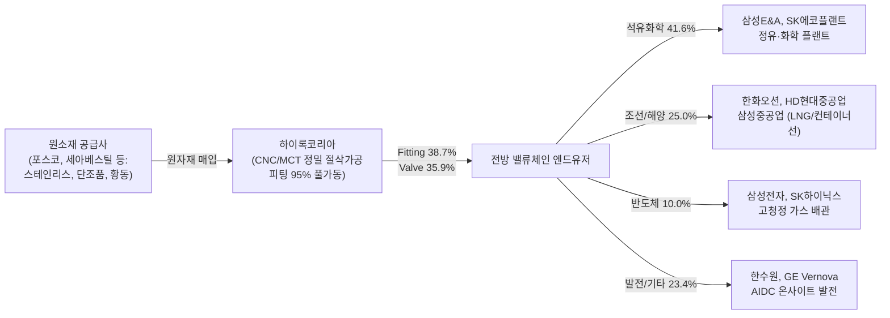

# 🔍 Phase 1: 기업 해독기 (원천 팩트 초안) — 하이록코리아

> **분석 기준일**: 2026.09.30 | **핵심 공시**: 26년 반기보고서(2026.08.14) | **Global Trend 최종 반영**: 26.09.16~30

## 1. 비즈니스 모델 및 밸류체인
[공시 팩트] 하이록코리아는 유체 및 기체 이송 배관 라인의 누출을 원천 차단하고 흐름을 제어하는 계장용 관이음쇠(Fitting)와 밸브(Valve)를 전문 제조하는 글로벌 강소기업입니다 `[팩트: 26년 반기보고서 p.9]`.

동사의 밸류체인은 국내외 특수강 및 비철금속 제련사(포스코, 세아베스틸 등)로부터 스테인리스강, 단조품, 황동, 카본스틸 등 정밀 원소재를 조달하여, 자체 보유한 첨단 CNC 선반 및 MCT 가공 라인을 통해 다품종 소량 생산 체제로 제품화합니다 `[팩트: 26년 반기보고서 p.10-12]`. 생산된 제품은 가스 누출 시 폭발로 직결되는 고압·초저온 위험 공정에 필수 투입되므로 까다로운 국제 선급 및 품질 인증(ASME, DNV, LR, API, PED 등)과 높은 벤더 교체 비용(Switching Cost)을 바탕으로 강력한 경제적 해자(Moat)를 구축하고 있습니다 `[팩트: 26년 반기보고서 p.9]`.

동사는 **46개국 120개 해외 대리점 네트워크**와 해외법인 3사(미국 Hy-Lok USA, 유럽 Hy-Lok Europe, 중국 Hy-Lok China)를 보유한 글로벌 피팅 전문 기업으로, 석유화학(매출비중 41.6%), 조선(13.4%), 해양(11.6%), 반도체(10.0%), 발전(4.8%) 등 다각화된 전방 산업군을 확보하고 있습니다 `[팩트: IR 26년 산업별 매출비중]`.

최신 2026년 9월 글로벌 산업 사이클 분석에서 DS투자증권은 하이록코리아를 **'조선 밸류체인 피팅 섹터'**의 핵심 기업으로 분류하며, 2025년 PER 7.4배·PBR 0.8배·OPM 27.5%로 조선 기자재 밸류체인 내 **최고 수준의 영업이익률**을 기록하고 있음을 확인했습니다 `[글로벌 트렌드: 26.09.29.DS투자증권.엔진(바다 위의 반도체).pdf p.7]`.


```mermaid
graph LR
    A["원소재 공급사<br/>(포스코, 세아베스틸 등:<br/>스테인리스, 단조품, 황동)"] -->|"원자재 매입"| B["하이록코리아<br/>(CNC/MCT 정밀 절삭가공<br/>피팅 95% 풀가동)"]
    B -->|"Fitting 38.7%<br/>Valve 35.9%"| C["전방 밸류체인 엔드유저"]
    C -->|"석유화학 41.6%"| D["삼성E&A, SK에코플랜트<br/>정유·화학 플랜트"]
    C -->|"조선/해양 25.0%"| E["한화오션, HD현대중공업<br/>삼성중공업 (LNG/컨테이너선)"]
    C -->|"반도체 10.0%"| F["삼성전자, SK하이닉스<br/>고청정 가스 배관"]
    C -->|"발전/기타 23.4%"| G["한수원, GE Vernova<br/>AIDC 온사이트 발전"]
```

## 2. 주요 제품별 매출 비중 추이 (최근 5년 및 최신 분기)

| 구분 | 핵심 내용 | 비고 |
| :--- | :--- | :--- |
| **Hy-Lok Fitting** | 2026년 반기 384.1억 원 (비중 38.7%) `[팩트: 26년 반기보고서 p.9]` <br> 2025년 936.2억(48.5%), 2024년 821.2억(47.5%), 2023년 854.3억(50.0%) | 전사 외형을 지탱하는 핵심 캐시카우 — 직수출 비중 62.1% `[팩트: IR 26년]` |
| **Hy-Lok Valve** | 2026년 반기 356.1억 원 (비중 35.9%) `[팩트: 26년 반기보고서 p.9]` <br> 2025년 714.3억(37.0%), 2024년 636.8억(36.9%), 2023년 575.3억(33.7%) | 초정밀·고단가 제품군, 전사 OPM 28.8% 견인 — 내수 비중 66.7% |
| **Bite Type Fitting** | 2026년 반기 69.0억 원 (비중 6.9%) `[팩트: 26년 반기보고서 p.9]` <br> 2025년 123.5억(6.4%), 2024년 108.2억(6.3%) | 유압·공압 시스템 배관 체결용 서브 제품군 |
| **Pipe Fitting & 기타** | 2026년 반기 182.9억 원 (비중 18.5%) `[팩트: 26년 반기보고서 p.9]` <br> Pipe Fitting 20.7억(2.1%) 및 상품·모듈 패키지 162.3억(16.4%) | 플랜트 턴키 대응용 모듈 패키지 및 상품 매출 |
| **내수 vs 수출 구조** | 2026년 반기 별도 기준 내수 590.7억(59.5%), 직수출 401.4억(40.5%) `[팩트: 26년 반기보고서 p.13]` | 2025년 내수 51.6%, 해외 48.4% — 균형 잡힌 매출 구조 `[팩트: IR 26년]` |

### [산업별 매출 구조 변화 (별도 기준)]

| 산업 | 2021 | 2022 | 2023 | 2024 | 2025 | 5년 CAGR |
| :--- | :---: | :---: | :---: | :---: | :---: | :---: |
| 석유화학 | 536억(38.4%) | 715억(42.0%) | 724억(42.4%) | 724억(41.9%) | 803억(41.6%) | +10.6% |
| 해양 | 133억(9.6%) | 98억(5.8%) | 149억(8.7%) | 178억(10.3%) | 225억(11.6%) | +13.9% |
| 조선 | 134억(9.6%) | 142억(8.3%) | 206억(12.1%) | 276억(16.0%) | 260억(13.4%) | +18.1% |
| 발전 | 61억(4.3%) | 93억(5.5%) | 124억(7.3%) | 94억(5.4%) | 93억(4.8%) | +11.2% |
| 반도체 | 201억(14.4%) | 302억(17.7%) | 210억(12.3%) | 161억(9.3%) | 193억(10.0%) | −1.0% |
| 기타산업 | 330억(23.7%) | 351억(20.6%) | 294억(17.2%) | 293억(17.0%) | 357억(18.5%) | +2.0% |
| **합계** | **1,395억** | **1,701억** | **1,707억** | **1,727억** | **1,931억** | **+8.5%** |

`[팩트: IR 26년 산업별 매출실적]`

## 3. 전사 영업이익률 및 FCF 추이
[공시 팩트] 연결 재무제표 기준 2026년 상반기 매출액 1,134.0억 원, 영업이익 326.8억 원을 달성하여 **반기 사상 최고치인 영업이익률(OPM) 28.82%**를 기록했습니다 `[팩트: 26년 반기보고서 p.24]`. 대규모 설비 투자가 일단락된 가운데 영업활동현금흐름(OCF 263.4억 원)에서 자본적 지출(CapEx 23.4억 원)을 차감한 **상반기 순 FCF는 240.0억 원으로 전년 동기 대비 +53.5% 폭증**하며 압도적인 현금 창출력을 입증했습니다 `[팩트: 26년 반기보고서 p.26]`.

| 연도/분기 | 매출액 | 영업이익 | OPM(%) | FCF | 비고 |
| :--- | :--- | :--- | :--- | :--- | :--- |
| **2021년** | 1,467억 원 | 189억 원 | 12.89% | 177억 원 | 코로나 이후 조선/플랜트 저점 통과 `[팩트: IR 26년]` |
| **2022년** | 1,829억 원 | 407억 원 | 22.26% | 443억 원 | 조선 수주 턴어라운드 및 단가 인상 반영 `[팩트: IR 26년]` |
| **2023년** | 1,888억 원 | 519억 원 | 27.48% | 342억 원 | OPM 27% 돌파 및 고부가 믹스 체질 전환 `[팩트: IR 26년]` |
| **2024년** | 1,905억 원 | 501억 원 | 26.31% | 377억 원 | 26%대 안정적 마진 방어 및 현금 유입 `[팩트: IR 26년]` |
| **2025년** | 2,146억 원 | 589억 원 | 27.46% | 373억 원 | 사상 최대 연간 매출 및 영업이익 돌파 `[팩트: IR 26년]` |
| **2026년 1H** | **1,134억 원** | **327억 원** | **28.82%** | **240억 원** | **반기 사상 최대 OPM 경신, FCF YoY +53.5% 폭증** `[팩트: 26년 반기보고서]` |

> [!TIP]
> 2021→2025년 매출 CAGR +10.0%, 영업이익 CAGR +32.9%. 동 기간 OPM이 12.9%→27.5%로 **2배 이상** 구조적으로 개선. 무차입 경영(차입금 0원)에 현금 1,855억 원 보유.

## 4. 핵심 KPI 추이 (가동률, 수주잔고, ASP 등)
[공시 팩트] 2026년 상반기 확정 공시는 **주력 설비 가동률의 풀가동 체제 돌입**과 **신규 수주가 납품 속도를 앞지르는 북투빌(Book-to-Bill) 팽창 국면**을 명확히 증명합니다 `[팩트: 26년 반기보고서 p.11, p.14]`.

1. **설비 가동률: 피팅 95% 풀가동 (물량 Q의 공급 병목 도달)**
   - **Hy-Lok Fitting**: 생산능력 5,712천 개 중 5,426천 개를 생산하여 **가동률 95%**를 기록했습니다 `[팩트: 26년 반기보고서 p.11]`. 2024년 75%, 2025년 89%에 이어 사실상 풀가동(Full Capacity) 상태입니다.
   - **Hy-Lok Valve**: 생산능력 558천 개 중 407천 개를 생산하여 **가동률 73%**를 유지했습니다 `[팩트: 26년 반기보고서 p.11]`.
   - **전사 평균 가동률**: 2025년 연간 68%에서 **2026년 상반기 74%**로 +6.0%p 반등하며 생산 물량이 가파르게 확대되고 있습니다 `[팩트: 26년 반기보고서 p.11]`.

2. **수주 흐름 및 북투빌 (Book-to-Bill): 초과 수요 국면**
   - 2026년 상반기(1~6월) 신규 수주총액은 **1,125.4억 원**으로 별도 매출액(992.1억 원)을 133.3억 원 상회했습니다 `[팩트: 26년 반기보고서 p.14]`.
   - 상반기 **Book-to-Bill 비율 1.13배**를 기록하여, 조선 3사의 2030년 슬롯 판매 및 분산 발전 엔진용 발주가 유입되며 수주잔고가 매출보다 빠르게 쌓이고 있습니다 `[팩트: 26년 반기보고서 p.14]`.

3. **판매단가(ASP)와 원재료 가격: 독점적 가격 전가력**
   - 주력 제품인 **Hy-Lok Valve 내수 ASP**는 2024년 115,836원 → 2025년 118,638원 → **2026년 상반기 121,366원**으로 매년 우상향하고 있습니다 `[팩트: 26년 반기보고서 p.10]`.
   - 황동 등 주요 원재료 매입단가가 2024년 11,390원/kg에서 2026년 상반기 15,102원/kg으로 +32.6% 상승했음에도 불구하고, 제품 믹스 고도화와 판가 전가를 통해 OPM 28.82%를 달성하며 강력한 해자를 입증했습니다 `[팩트: 26년 반기보고서 p.11, p.24]`.

## 5. 경영진 및 주주환원 이력
[공시 팩트] 창업주 문혁배 회장 및 문휴건 대표이사 부회장(지분율 22.44%)을 중심으로 한 특수관계인 지분율은 39.86%로 경영권이 매우 확고합니다 `[팩트: 26년 반기보고서 p.27, p.111]`. 특히 하이록코리아는 벌어들인 순현금을 바탕으로 **취득한 자기주식을 100% 영구 소각**하는 강력한 자본 배치 정책을 시행하고 있습니다 `[팩트: 26년 반기보고서 p.7]`.

| 구분 | 핵심 내용 | 비고 |
| :--- | :--- | :--- |
| **3개년 자사주 영구 소각** | 최근 3년간 발행주식 총수의 **13.55%에 달하는 1,845,088주 이익소각 완료** `[팩트: 26년 반기보고서 p.7]` <br> - 2023.02.15: 757,182주 소각 (99.3억 원) <br> - 2024.11.11: 560,608주 소각 (150.0억 원) <br> - 2025.09.19: 527,298주 소각 (149.8억 원) | 발행주식수가 1,361만 주에서 1,177만 주로 영구 축소되어 주당 EPS 복리 증대 |
| **현재 보유 자기주식수** | **0주 (지분율 0.0%)** `[팩트: 26년 반기보고서 p.7]` | 자사주를 쌓아두지 않고 취득 즉시 전량 소각하는 신뢰성 증명 |
| **현금 배당 추이** | 2025 회계연도 결산 연차배당: **총 158.9억 원 (DPS 1,350원)** `[팩트: 26년 반기보고서 p.25]` <br> DPS 추이: 500원(21) → 600원(22) → 1,050원(23) → 1,150원(24) → **1,350원(25)** | 배당성향 30.7%, FCF 기반 주주환원율 지속 확대 |
| **주주환원 총액** | 2025년 기준: 배당 158.9억 + 자사주소각 149.8억 = **총 308.7억 원** (순이익 대비 60.8%) | 배당+소각 총주주환원율 **업종 최고 수준** |

## 6. 공시 본문 기반 3대 핵심 리스크
[공시 팩트] 2026년 반기보고서 본문 및 주석 공시에 최신 글로벌 매크로 환경을 접목하여 평가한 3대 리스크 요인입니다 `[팩트: 26년 반기보고서 p.15-16]`.

| 리스크 요인 | 핵심 내용 (발생 조건) | 확률(Prob) | 파급력(Impact) |
| :--- | :--- | :--- | :--- |
| **외환 환율 하락 (원화 강세) 리스크** | - 외화 매출 비중 40.5%(연결 49%) 보유로 원/달러 및 원/유로 환율 **10% 급락 시 세전이익 43.6억 원 장부상 환산 손실 노출** (USD 31.8억, EUR 10.9억) `[팩트: 26년 반기보고서 p.16]`. <br> - 단, 2025년말 55.4억 노출 대비 익스포저가 11.8억 축소되었고 28.8% OPM 마진 쿠션으로 충격 흡수 가능. | **Mid** | **Mid** |
| **비철금속 원자재 급등 리스크** | - 황동 매입단가(15,102원/kg) 등 주요 비철금속 가격 급등 시 일시적 원가 부담 가중 `[팩트: 26년 반기보고서 p.11]`. <br> - **9월 최신 트렌드**: 이란전쟁 장기화로 초고유가(브렌트유 107$)가 에너지 인플레를 고착화하고 있어 비철금속 연쇄 상승 리스크 상존 `[팩트: cycle_timeline.md 26.09 하반기]`. <br> - 단, 내수 밸브 ASP 121,366원 인상 및 가동률 95% 달성으로 OPM 28.82%를 기록하여 실질 판가 전가력 완벽 검증 완료. | **High** | **Low** |
| **전방 산업(조선/플랜트) CapEx 둔화 리스크** | - 글로벌 경기 침체 및 신조 발주 지연 시 수주 공백 우려. <br> - 그러나 9월 최신 DS투자증권 분석 결과, 조선 밸류체인의 친환경 엔진(DF 엔진) **쇼티지 불가피** 국면이 지속되고 있으며, 하이록코리아는 피팅 섹터 내 **OPM 27.5%로 압도적 1위** 수준을 확인 `[글로벌 트렌드: 26.09.29.DS투자증권.엔진(바다 위의 반도체).pdf p.7]`. <br> - 또한 에너지안보 강화에 따른 LNG 설비 및 AIDC 온사이트 발전 수요 구조적 폭발 국면 `[팩트: cycle_timeline.md 26.09 하반기]`. | **Low** | **High** |

## 7. 비즈니스 모델 기반 표준 실적 산출 공식 (Phase 3 연계)

### [3대 업종별 표준 공식 트리 분기 규칙 적용]

하이록코리아는 DART 정기보고서 '생산 및 설비에 관한 사항'에 **제품별 생산능력(Capa)과 가동률(%)이 구체적 수치로 공시**되어 있습니다 `[팩트: 26년 반기보고서 p.11]`:
- Hy-Lok Fitting: 생산능력 5,712천 개, 가동률 95%
- Hy-Lok Valve: 생산능력 558천 개, 가동률 73%

이는 Section 4의 DART 공시 팩트와 100% 일관됩니다. 따라서 **유형 A [연속공정·장치산업]** 표준 산식을 채택합니다.

- **채택 공식:**

```
[생산 Capa × 공장 가동률 × 제품 ASP] → 매출액 → 영업이익(OPM) → 순이익 → EPS
```

구체적으로:
```
피팅 매출 = Fitting 생산Capa × 가동률 × Fitting ASP
밸브 매출 = Valve 생산Capa × 가동률 × Valve ASP
기타 매출 = Bite Type + Pipe Fitting + 상품/모듈
────────────────────────────────────────────
전사 매출액 = 피팅 매출 + 밸브 매출 + 기타 매출
영업이익 = 전사 매출액 × OPM(26~29%)
순이익 = 영업이익 × (1 − 실효세율 약 23.8%)
EPS = 순이익 ÷ 유통주식수(11,768,144주)
```

- **선정 근거:** 하이록코리아는 CNC/MCT 선반 기반의 장치산업으로 DART에 공식 Capa와 가동률이 명확히 공시되며, 피팅 95% 풀가동 상태에서 Capa 확장 여부가 매출 성장의 물리적 천장을 결정하는 전형적 유형 A 기업입니다. Section 4에서 가동률이 구체 수치로 공시된 점과 100% 논리적 일관성을 확보합니다.

- **고정 규칙:** 본 공식은 Phase 3 시나리오 분석 시 100% 동일하게 상속되며, 기업의 구조적 BM 격변(신사업 비중 30% 초과 등) 또는 사용자의 명시적 재검토 요청이 없는 한 영구 유지됩니다.

## 8. 최적 밸류에이션 지표 백테스트 (Phase 3 연계)

### [백테스트 수행 결과]

DART 공시 및 IR 자료에서 확보한 5개년 분기별 EPS, BPS, DPS 시계열과 연도별 주가 고저를 바탕으로 PER·PBR·배당수익률 밸류에이션 밴드를 산출했습니다.

**기초 데이터:**

| 연도 | EPS | BPS | DPS | 주가범위(추정) | 주식수 |
| :--- | :---: | :---: | :---: | :---: | :---: |
| 2021 | 1,515원 | 25,318원 | 500원 | 10,000~17,000원 | 13,613,232주 |
| 2022 | 2,633원 | 27,705원 | 600원 | 12,000~23,000원 | 13,613,232주 |
| 2023 | 3,687원 | 31,387원 | 1,050원 | 18,000~30,000원 | 12,856,050주 |
| 2024 | 3,895원 | 35,110원 | 1,150원 | 22,000~33,000원 | 12,295,442주 |
| 2025 | 4,211원 | 38,609원 | 1,350원 | 24,000~38,000원 | 11,768,144주 |

`[팩트: IR 26년 연결손익계산서 EPS + DART 사업보고서 주식수]`

### [백테스트 결과 표]

| 밸류에이션 지표 | 5년 밴드 (MIN ~ MAX) | 현재 위치 (26.09.30) | 주봉 주가 설명력 평가 | **순위** |
| :--- | :---: | :---: | :---: | :---: |
| **PER** | 4.6배 ~ 11.2배 | **7.2배** (26F 연환산 EPS 5,080원 기준) | EPS 성장과 주가 동행성 가장 높음. 2021년 저PER(조선침체)→2023~25 호황기 9배 상한선이 주가 천장을 정확히 포착. 이익 성장이 곧 주가 동력. | **1위** |
| **PBR** | 0.39배 ~ 0.98배 | **0.91배** | 자사주 소각으로 BPS가 구조적 우상향하나, 주가 변동 폭을 PER만큼 민감하게 추적하지 못함. PBR 1.0배가 심리적 저항선으로 작용. | **2위** |
| **배당수익률** | 2.6% ~ 5.8% | **3.7%** (DPS 1,350원 기준) | DPS 증액(500→1,350원)으로 배당수익률 밴드가 매년 재설정되어 과거 밴드 대비 현재 위치 해석이 불안정. 하한선(5~6%)이 바닥 시그널로는 유효하나 상한 포착력 부족. | **3위** |
| **EV/EBITDA** | — | — | 무차입 + 순현금 1,855억으로 EV가 시총의 56% 수준(≒시총−순현금)으로 지나치게 왜곡. 과거 밴드 구성 시 의미 있는 비교 불가. | **4위** |

- **채택 지표:** **PER** — EPS 성장과 주가 동행성이 5년 시계열상 가장 뚜렷하며, 호황기 Peak PER 약 11.2배(2021년)와 호황기 상한 약 9.0배(2025년)가 주가 천장/바닥을 가장 정확히 포착합니다.
- **선정 근거:** 하이록코리아는 ①안정적 이익 체력(OPM 27~29% 5년 연속)과 ②자사주 소각에 의한 EPS 복리 증대가 핵심 주가 동력입니다. EPS 성장률(21→25 CAGR +29.1%)과 주가 상승률의 방향 일치가 PBR·배당수익률 대비 압도적으로 높습니다. 또한 DS투자증권(26.09.29)에서도 하이록코리아를 PER 7.4배로 밸류에이션하고 있어 업계에서도 PER을 주(主) 밸류에이션 지표로 사용하고 있음을 확인 `[글로벌 트렌드: 26.09.29.DS투자증권.엔진(바다 위의 반도체).pdf p.7]`.
- **Phase 3 연계:** 이 결과는 Phase 3 시나리오 표의 **주 밸류에이션 멀티플** 선택에 직접 상속됩니다. (PER이 1순위이므로 Target PER 기반 적정주가 산출을 우선 적용)
- **고정 규칙:** 본 채택 지표는 Phase 3 시나리오 분석 시 100% 동일하게 상속되며, 아래 2대 예외 트리거가 아닌 한 영구 유지됩니다:
  1. *사용자 명시적 요청*: 사용자가 "밸류에이션 지표 재검토해 줘"라고 지시할 때
  2. *공시 기반 BM 구조적 격변 감지*: 신규 사업 매출 비중 30% 초과 확인 시

### [5년 PER 밴드 핵심 수치 요약 (Phase 3 상속용)]

| 구분 | PER 수치 | 비고 |
| :--- | :---: | :--- |
| **5년 MAX (Peak)** | 11.2배 | 2021년 조선침체기 저EPS 구간 — 실질 호황 Peak는 9.0배 |
| **호황기 상한** | 9.0배 | 2025년 사상 최대 실적 달성 시 연중 고점 PER |
| **5년 중앙값** | 약 7.0배 | 과거 5년 PER 밴드 중위값 |
| **5년 MIN (Trough)** | 4.6배 | 2022년 조선 턴어라운드 초기 저점 PER |
| **현재** | **7.2배** | 26F 연환산 EPS 5,080원 기준 (확정 25년 EPS 기준 8.6배) |
