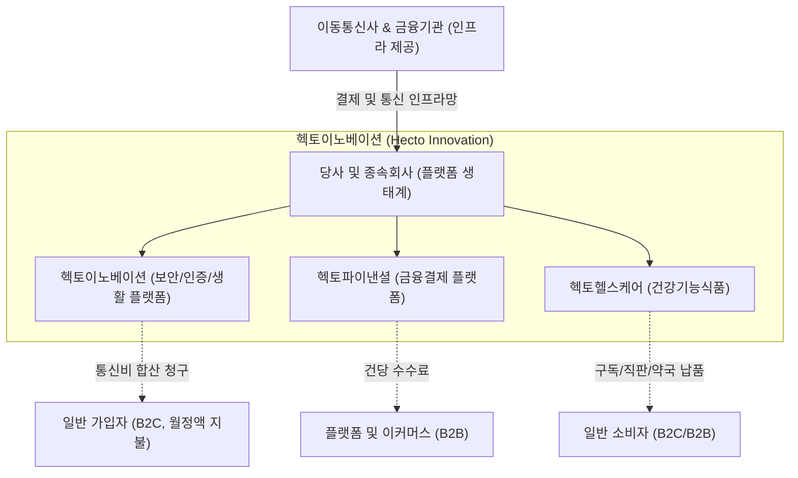

# 🔍 Phase 1: 기업 해독기 (심층 팩트체크 코어)

## 1. 비즈니스 모델 및 돈 버는 구조
[공시 팩트] 헥토이노베이션은 통신사 인프라 기반의 개인정보보안 2차 본인인증(로그인플러스 등) 서비스를 핵심 캐시카우로 삼고 있습니다. 종속회사인 헥토파이낸셜을 통해 B2B 금융결제망(가상계좌, 간편현금결제 등)을, 헥토헬스케어를 통해 프리미엄 프로바이오틱스(드시모네) 정기배송 사업을 전개합니다. 모든 사업 포트폴리오가 '월정액 결제, 수수료, 정기구독' 등 고객 락인(Lock-in) 기반의 반복 매출(Recurring Revenue) 성격을 지니며, 강력한 '통행세(Toll-bridge)' 비즈니스 해자를 구축하고 있습니다.

## 2. 주요 사업별 매출 비중 추이 (최근 5년 및 최신 분기)
| 구분 | 핵심 내용 | 비고 |
| :--- | :--- | :--- |
| **헥토이노베이션** | 2021년 714억(32.3%) → 2023년 929억(32.2%) 꾸준한 우상향 유지 | 25년 별도 1,203억으로 가파른 성장세 방어 중 |
| **헥토파이낸셜** | 2021년 1,043억(47.2%) → 2023년 1,404억(48.6%) 최대 비중 차지 | 그룹사 내 캐시카우 및 매출 견인 코어 |
| **헥토헬스케어** | 2021년 456억(20.6%) → 2023년 536억(18.6%) 및 2025년 854억 | 24년 대비 40% 고성장 및 영업이익 98억 달성 |
| **전사 종합** | B2B(금융) 약 48%, B2C(보안+헬스케어) 약 52%의 안정적 포트폴리오 | 전 사업부가 구독형 BM으로 경기방어적 성격 강함 |

## 3. 전사 영업이익률 및 FCF 추이
[공시 팩트] 21년 2,210억이었던 연결 매출액이 25년 3,758억으로 가파르게 성장(YoY 평균 10% 중후반)하고 있으며, 연결 영업이익 역시 24년 488억, 25년 501억으로 성장하고 있습니다. OPM은 신규 사업 마케팅 비용에도 불구하고 13~15% 수준의 안정적인 마진을 방어 중입니다. 생산설비가 필요 없는 무형자산 위주의 지식서비스 기업이므로, 영업활동현금흐름이 대부분 잉여현금흐름(FCF)으로 환산되는 매우 질 좋은 현금 창출력을 보유하고 있습니다.

| 구분 | 핵심 내용 | 비고 |
| :--- | :--- | :--- |
| **연결 매출 성장** | 2021년 2,210억 → 2023년 2,884억 → 2025년 3,758억 달성 | 매년 두자릿수 성장세 입증 |
| **영업이익 및 OPM** | 2024년 488억 (OPM 15.29%) → 2025년 501억 (OPM 13.35%) | 매출 규모 확대에 따라 이익 레벨 업 |
| **잉여현금흐름(FCF)** | 26년 상반기 연결 영업현금흐름 154억 (별도 130억 창출) | 막대한 CAPEX 불필요. 우수한 현금전환 |

## 4. 핵심 KPI 추이 및 분석
[시장 내러티브] 전통적으로 내수 시장에 갇힌 통신사 부가서비스 업체로 인식되며 밸류에이션 할인을 받아왔음. 추가적인 성장 동력이 부재할 것이라는 시장의 편견이 지배적임.
[공시 팩트] 그러나 재고자산 비율이 2% 내외(종속회사)에 불과해 운전자본 부담이 전무한 플랫폼 비즈니스의 특성을 보임. 특히 내수 100% 구조에서 벗어나, 자회사 헥토헬스케어가 중국 '국약약재'와 1,550억 규모의 대형 수출 계약(2024년 말)을 맺음으로써 2025년부터 해외 매출이 반영되기 시작함. 이는 내러티브를 뒤집을 수 있는 강력한 펀더멘털의 변화임.

## 5. 경영진 및 주주환원 이력
[공시 팩트] 최대주주인 이경민 이사가 2025년에 소유 주식수를 189만 주 이상 대폭 늘리며 지분율을 39.13%까지 확대함. 이는 경영권 강화는 물론, 사업 성장에 대한 강한 자신감을 표출한 것으로 해석됨. 아울러 '발행주식 총수의 1% 매년 소각'이라는 파격적인 3개년(24~26년) 주주환원 정책을 발표하고, 24년(약 18.5억)과 25년(약 20억)에 연속으로 자사주를 소각하는 실행력을 증명함. 배당성향 역시 26.6%(24년)까지 상향하였고 주당 배당금도 500원(25년)을 지급하는 등 버핏이 사랑하는 '자본배치 능력이 뛰어난 경영진'의 요건을 모두 갖춤.

| 주주환원 정책 구분 | 최근 3개년 주요 이행 사항 | 경영진 의지 |
| :--- | :--- | :--- |
| **자사주 매입/소각** | 2024년 13.2만주(18.5억), 2025년 13.1만주(20억) 실제 소각 | 매년 1% 소각 공시 완벽 이행 중 |
| **현금 배당** | 배당성향 26.6% (24년 기준), 25년 주당 배당금 500원 | 배당성향 지속 상향 (최소 25% 지향) |
| **내부자 지분 매입** | 최대주주 지분율 24.32%(24년) → 39.13%(25년) 폭증 | 주주가치 제고 및 성장에 대한 절대적 확신 |

## 6. 핵심 리스크 3가지
[공시 팩트] 신사업 확장 및 자회사 실적 의존도가 높아지며 발생하는 잠재적 리스크.

| 구분 | 핵심 내용 | 비고 |
| :--- | :--- | :--- |
| **플랫폼 경쟁 심화** | '발로소득' 등 앱테크/신규 마이데이터 플랫폼의 마케팅 경쟁 격화 | 막대한 선행 마케팅비 투입으로 단기 이익률 훼손 가능성 |
| **금융 인프라 사고** | 헥토파이낸셜 결제망 전산 장애, 통신 오류 및 해킹 사고 | 락인(Lock-in) 훼손 및 손해배상 리스크 직결 |
| **수출 및 자회사 변동성** | 헥토헬스케어 중국 수출 지연 혹은 내수 건기식 침체 가능성 | 전사 이익률 변동성에 영향 |

## 7. 딥리서치 팩트체크 요약
[시장 내러티브] 성장이 멈춘 내수용 B2B/B2C 서비스 기업이자 통신사 하청 비즈니스에 불과함.
[공시 팩트] 시장의 오해와 달리 헥토이노베이션은 완벽한 '구독 경제(Subscription)' 생태계를 구축함. 통신 부가서비스(보안/생활), 금융결제 통행세(가상계좌/간편결제), 헬스케어(정기배송) 3개 축이 톱니바퀴처럼 맞물려 막대한 FCF를 창출하고 있음. 여기에 창업자의 폭발적인 지분 확대, 강력한 자사주 소각(매년 1%), 그리고 1,550억 규모의 중국 수출 모멘텀이 더해지며 펀더멘털은 폭발 직전의 에너지를 응축하고 있음. 시장의 '내수 정체 기업'이라는 내러티브는 공시 데이터 앞에서 철저히 부정됨.
