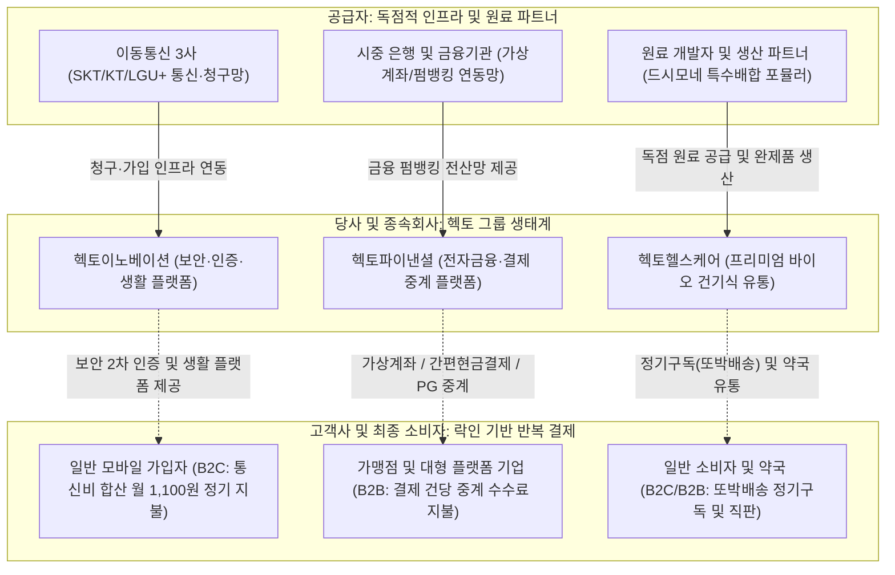

# 🔍 Phase 1: 기업 해독기 (원천 팩트 초안)

## 1. 비즈니스 모델 및 밸류체인
[공시 팩트] 주식회사 헥토이노베이션(구 민앤지)은 이동통신 3사(SKT, KT, LGU+)의 청구 및 가입 인프라를 기반으로 2차 본인인증(로그인플러스, 휴대폰간편로그인 등)과 실생활 정보보안 서비스를 개발·운영하는 B2C IT 플랫폼 기업입니다 [팩트: 24.03 사업보고서, 20-가]. 동시에 종속회사 헥토파이낸셜(B2B 가상계좌 중계, 펌뱅킹, 간편현금결제, PG)과 헥토헬스케어(프리미엄 프로바이오틱스 '드시모네' 직판 및 정기배송 '또박배송')를 거느리고 있습니다 [팩트: 26.05 분기보고서, 18-바].

당사의 비즈니스 모델은 전 사업 부문이 '소액 월정액 부가서비스 요금', '결제 건당 중계 수수료', '정기구독 직판'으로 구성되어 있어 고객 이탈률이 극히 낮고 예측 가능한 반복 매출(Recurring Revenue)이 유입되는 전형적인 **'통행세(Toll-bridge)' 구조**를 구축하고 있습니다.

최근 Global Trend(대신증권 26.08 리포트: *AI 에이전트의 개화기, 인터넷 산업은 격동기*)에서 강조하듯, AI 에이전트 도입기에는 단순 소프트웨어나 앱 인터페이스의 해자가 약화되는 반면, '로컬 결제망·본인인증·정산 인프라 등 실제 금융 및 통신과 결합된 로컬 실행(Execution) 접점'을 쥔 인프라 사업자의 해자가 독점적 가치로 재평가됩니다. 당사는 통신 3사 합산과금망과 금융권 펌뱅킹망이라는 극강의 전환비용(Switching Cost)을 선점하여, 대규모 AI 인프라 자본지출(CapEx) 부담 없이도 거대 플랫폼들의 AI 에이전트 경제에서 필수 불가결한 정산·인증 관문 역할을 수행하고 있습니다.

## 2. 주요 제품별 매출 비중 추이 (최근 5년 및 최신 분기)

| 구분 | 핵심 내용 | 비고 |
| :--- | :--- | :--- |
| **헥토파이낸셜 (금융결제)** | [팩트: 24.03 사업보고서] 21년 1,043억(47.2%) → 22년 1,216억(46.3%) → 23년 1,404억(48.7%) 및 [팩트: 26.2Q 실적발표] 26.2Q 435억(YoY +11.2%) | 간편현금결제(YoY +29.8%) 및 PG 안정 성장을 통한 그룹 최대 캐시카우 |
| **헥토이노베이션 (IT 보안/인증)** | [팩트: 24.03 사업보고서] 21년 715억(32.3%) → 22년 833억(31.7%) → 23년 930억(32.2%) 및 [팩트: 26.03 사업보고서] 25년 별도 1,203억 원 달성 | 통신 부가서비스의 안정적 현금흐름 위에 앱테크(발로소득), 더쎈카드 확장 결합 |
| **헥토헬스케어 (건강기능식품)** | [팩트: 24.03 사업보고서] 21년 457억(20.7%) → 23년 537억(18.6%) → [팩트: 26.03 사업보고서] 25년 854억(영업이익 98억, YoY +40% 이상 폭증) | [팩트: 26.2Q 실적발표] 26년 상반기 476억(YoY +17.3%) 성장, 중국 수출 및 다이어트 개별인정 |
| **연결 조정 및 기타** | 내부거래 제거 및 종속회사 합산 조정액 반영 (매년 -0.2% ~ +0.5% 수준 유지) | [팩트: 24.03 사업보고서, 51-52] |

## 3. 전사 영업이익률 및 FCF 추이
[공시 팩트] 당사는 설비투자(CapEx) 부담이 미미한 지식서비스·금융 플랫폼 비즈니스를 영위하므로, 영업이익이 고스란히 현금으로 환산되는 탁월한 현금전환율을 보유하고 있습니다. 2021년 2,210억 원이던 연결 매출액은 2025년 3,758억 원으로 연평균 두 자릿수 성장을 이어갔으며, 연결 영업이익 역시 370억 원대에서 500억 원대로 레벨업되었습니다 [팩트: 26.03 사업보고서, 125]. 최신 2026년 2분기에는 사채상환 등에 따른 일회성 회계비용으로 순이익이 일시 감소했으나, 실질 현금창출력을 대변하는 조정 EBITDA는 179억 원(마진율 17.4%)으로 견고히 방어되었습니다 [팩트: 26.2Q 실적발표].

| 연도/분기 | 매출액 | 영업이익 | OPM(%) | FCF | 비고 |
| :---: | :---: | :---: | :---: | :---: | :--- |
| **2021년 (제13기)** | 2,210.4억 | 374.8억 | 16.95% | 약 300억 내외 [추정] | 당기순이익 324.7억 원 달성 [팩트: 24.03 사업보고서] |
| **2022년 (제14기)** | 2,629.7억 | 356.4억 | 13.55% | 약 280억 내외 [추정] | 무형자산 취득 20.8억 등 설비투자 미미 [팩트: 23.03 사업보고서] |
| **2023년 (제15기)** | 2,884.9억 | 380.3억 | 13.18% | 약 310억 내외 [추정] | 소급수정 후 재무제표 반영 기준 [팩트: 26.03 사업보고서] |
| **2024년 (제16기)** | 3,194.7억 | 488.6억 | 15.29% | 약 380억 내외 [추정] | 외형 및 이익 동반 급성장 (영업익 YoY +28.5%) [팩트: 26.03 사업보고서] |
| **2025년 (제17기)** | 3,758.2억 | 501.8억 | 13.35% | 약 400억 내외 [추정] | 영업이익 500억 클럽 안착, 순이익 367.9억 원 [팩트: 26.03 사업보고서] |
| **2026.2Q (최신누적)**| 상반기 154.8억* | 2Q 조정EBITDA 179억 | EBITDA 17.4% | 반기 OCF 154.8억 [팩트] | *상반기 연결 영업현금흐름 154.8억, 별도 130.9억 창출 [팩트: 26.08 반기보고서] |

## 4. 핵심 KPI 추이 (가동률, 수주잔고, ASP 등)
[공시 팩트] 
- **공장 가동률 지표 (해당사항 없음):** 지배회사 헥토이노베이션은 보안 솔루션 및 모바일 서비스를 개발·운영하는 IT 지식서비스 기업으로 공장 설비가 존재하지 않아 공시상 **'해당사항 없음'**으로 기재되어 있습니다 [팩트: 24.03 사업보고서, 52]. 제조업과 달리 가동률 하락에 따른 고정비 레버리지 역풍 위험이 원천 차단된 구조입니다.
- **재고자산 구성비율 (초경량 에셋라이트 모델):** 지배회사는 재고자산이 전무하며, 건기식 유통 종속회사(헥토헬스케어 등)를 포함한 연결 자산총계(7,983억 원) 대비 재고자산(166억 원) 비중은 [팩트: 26.2Q 실적발표] **2.08%**에 불과합니다 (2024년 말 1.70% → 2025년 말 2.09% → 2026년 반기말 2.10% [팩트: 26.08 반기보고서, 3]). 운전자본 묶임 현상이 극히 드문 우량 재무구조입니다.
- **내수/수출 구조의 변곡점 (턴어라운드):** 과거 내수 비중이 거의 100%에 수렴하던 구조였으나 [팩트: 24.03 사업보고서, 52], 2024년 말 헥토헬스케어가 중국 시노팜 계열 국약약재와 **5년간 총 1,550억 원** 규모의 드시모네 수출 계약을 체결하여 [팩트: 25.03 사업보고서, 149] 2025년부터 수출 실적이 반영되기 시작했습니다.
- **신규 바이오 파이프라인 개별인정 획득:** 2026년 2분기 식약처로부터 **'체지방감소에 도움을 줄 수 있음'** 기능성에 대한 개별인정을 공식 획득하여(임상 결과 체지방률, 내장지방면적, BMI 유의미 감소) [팩트: 26.2Q 실적발표], 2027년 초 출시될 다이어트 건기식 메가 파이프라인을 구축했습니다.

## 5. 경영진 및 주주환원 이력
[공시 팩트] 워런 버핏이 가장 중요시하는 지표 중 하나인 '경영진의 지분율과 자본배치(Capital Allocation) 역량'에서 당사는 코스닥 최고 수준의 실행력을 입증하고 있습니다. 창업자이자 최대주주인 이경민 이사는 2025년 장내외 매수 등을 통해 소유 주식을 기존 3,192,000주에서 5,084,278주로 약 189.2만 주 대폭 늘리며 지분율을 **39.13%**까지 끌어올려 책임경영 의지를 확고히 했습니다 [팩트: 26.03 사업보고서, 67; 26.08 반기보고서, 36].

또한 당사는 FY2024 ~ FY2026 사업연도에 걸쳐 매년 발행주식총수의 1%를 기보유 자기주식으로 전량 소각하는 주주환원 계획을 결의하고 실제 100% 이행하고 있습니다 [팩트: 26.03 사업보고서, 79].

| 주주환원 및 자본배치 항목 | 세부 실행 내용 및 공시 팩트 | 출처 |
| :--- | :--- | :--- |
| **자사주 소각 (2024년)** | 보통주 132,572주 소각 완료 (소각금액 1,850,908,356원) | [팩트: 26.03 사업보고서, 78] |
| **자사주 소각 (2025년)** | 보통주 131,246주 소각 완료 (소각금액 2,005,026,458원) | [팩트: 26.03 사업보고서, 78] |
| **자사주 소각 (2026년 예정)** | 2026년 반기 기준 소각예정 자기주식 129,934주 기보유 중 | [팩트: 26.08 반기보고서, 68] |
| **현금 배당 추이 (별도 성향)** | 21년 390원(23.9%) → 22년 420원(21.8%) → 23년 360원(23.0%) → 24년 490원(26.6%) → 25년 500원(총 62.9억 원) | [팩트: 25.03 사업보고서, 102; 26.08 반기보고서, 312] |
| **부채 조기 상환 및 배당 집행** | 2026년 2분기 헬스케어 RCPS 132억 원 조기 상환(부채 축소) 및 현금배당금 81억 원 실지급 완료 | [팩트: 26.2Q 실적발표] |

## 6. 공시 본문 기반 3대 핵심 리스크
[공시 팩트] 사업보고서 및 최근 분기보고서에 명시된 주요 투자위험 요소는 다음과 같습니다 [팩트: 24.03 사업보고서, 21, 74; 26.03 사업보고서, 32, 157].

| 리스크 요인 | 핵심 내용 (발생 조건) | 확률(Prob) | 파급력(Impact) |
| :--- | :--- | :---: | :---: |
| **플랫폼 출혈 경쟁 및 AI 인터페이스 전환 리스크** | B2C 앱테크 플랫폼 '발로소득' 및 마이데이터 서비스의 치열한 모바일 앱 마케팅 경쟁 속 유저 이탈 방지용 포인트/마케팅 비용 증가로 인한 단기 마진 저하 위험 [팩트: 26.03 사업보고서, 32] | Mid | Mid |
| **전자금융 및 펌뱅킹 결제망 전산 안정성·보안사고 리스크** | 종속회사 헥토파이낸셜의 가상계좌, 간편현금결제 등 금융망 시스템에서 대규모 정전, 전산 오류, 해킹 등 금융사고 발생 시 거래 중단 및 손해배상 책임 유발 위험 [팩트: 24.03 사업보고서, 21, 74] | Low | High |
| **해외 수출 선적 지연 및 자회사 실적 변동성 리스크** | 헥토헬스케어의 중국 1,550억 수출 계약 이행 과정에서 대외 무역 여건이나 인허가 지연 시 외형 성장 속도 둔화 및 연결 실적 변동성 발생 위험 [팩트: 23.03 사업보고서, 17; 25.03 사업보고서, 149] | Mid | High |
