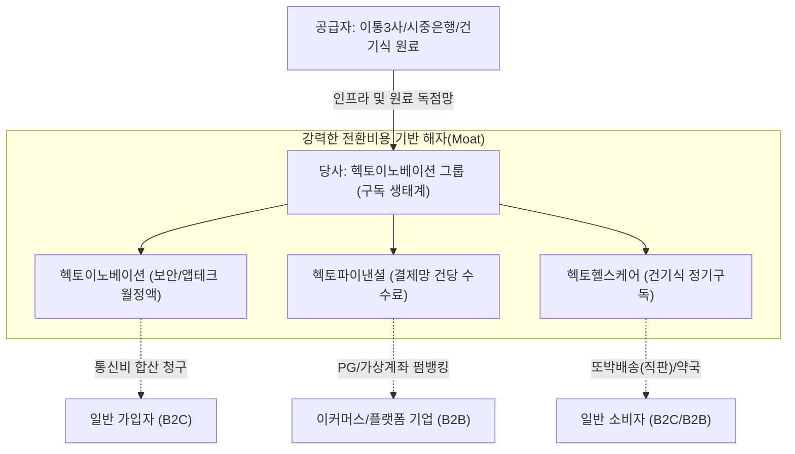

# 🔍 Phase 1: 기업 해독기 (심층 팩트체크 코어)

## 1. 매크로 및 산업 사이클(Sector Cycle) 현황
[시장 내러티브] 마이데이터 및 플랫폼 산업은 현재 성숙기 진입 및 체리피커 증가로 인한 수익성 악화 사이클에 직면해 있습니다. 고물가 매크로 환경에서 '발로소득'과 같은 앱테크 수요는 급증하나, 플랫폼 간 출혈 마케팅으로 인해 이익 회수 사이클 도달이 지연되는 국면입니다.
그러나 헥토이노베이션의 본업(보안/인증) 및 B2B 금융결제(헥토파이낸셜)는 필수 소비 인프라로서 경기방어적 성격을 강하게 띠고 있습니다. 특히 건기식(헥토헬스케어) 부문은 철저한 내수 시장 정체기에서 벗어나 중국 대형 수출 계약을 맺은 데 이어, 최근 [팩트: 26.2Q 실적발표] 식약처로부터 '체지방감소' 개별인정까지 획득하며 다이어트 신제품 출시를 앞두고 있어 '완벽한 턴어라운드(Turn-around)' 변곡점의 한가운데를 지나고 있습니다.

## 2. 비즈니스 모델 및 경제적 해자(Moat)
[공시 팩트] 헥토이노베이션의 본업과 자회사는 모두 '구독형 월정액 및 수수료'를 기반으로 하는 락인(Lock-in) 해자를 공유합니다.
- **통행세(Toll-bridge) 네트워크 효과:** 2차 본인인증(로그인플러스)은 이동통신 3사의 청구 인프라망과 연동되어 월정액 1,100원 등을 수취하는 강력한 과점망입니다 [팩트: 24년 사업보고서].
- **전환 비용(Switching Cost):** 종속회사 헥토파이낸셜은 시중 은행과 연동된 가상계좌 및 펌뱅킹망을 플랫폼 기업에 제공하여 고객사 이탈이 매우 어려운 구조적 해자를 지닙니다 [팩트: 23년 사업보고서].
- **브랜드와 구독 경제:** 프리미엄 프로바이오틱스(드시모네)는 '또박배송'이라는 자체 구독 비즈니스를 통해 유통 마진을 극대화합니다 [팩트: 23년 사업보고서].

## 3. 주요 사업별 매출 비중 추이 (최근 5년 및 최신 분기)
| 구분 | 핵심 내용 | 비고 |
| :--- | :--- | :--- |
| **헥토이노베이션(본업)** | [팩트: 24년 사업보고서] 21년 714억 → [팩트: 26년 사업보고서] 25년 별도 1,203억 원 | 앱테크(발로소득 등) 확장으로 가파른 성장 방어 중 |
| **헥토파이낸셜(결제망)** | [팩트: 26.2Q 실적발표] 26년 2분기 단일 매출 435억 (YoY +11.2%) | 간편현금결제(YoY +29.8%) 등 핵심 캐시카우 순항 |
| **헥토헬스케어(건기식)** | [팩트: 26.2Q 실적발표] 26년 상반기 누적 매출 476억 (YoY +17.3%) | 중국 수출 실적화 및 견조한 펀더멘털 고성장 |

## 4. 전사 영업이익률 및 FCF 추이
[공시 팩트] 신사업 육성 비용에도 불구하고 강력한 B2B 플랫폼 수익성을 통해 이익률 방어에 성공하고 있습니다. 
| 구분 | 핵심 내용 | 비고 |
| :--- | :--- | :--- |
| **연결 매출액 및 이익** | [팩트: 26.2Q 실적발표] 2분기 순이익 89억 (YoY -33.0%) | 사채 상환 등 기타비용 인식에 따른 일시적 현상 |
| **조정 EBITDA(현금창출)**| [팩트: 26.2Q 실적발표] 26년 2분기 조정 EBITDA 179억 (YoY +1.3%), 마진율 17.4% | 주식보상비용 등 제외 시 실질 본업 현금창출력 극대화 |
| **재무구조(FCF/부채)** | [팩트: 26.2Q 실적발표] 헬스케어 RCPS 132억 상환 완료 | 대규모 잉여현금으로 부채상환 및 재무구조 대폭 개선 |

## 5. 핵심 KPI 추이 및 분석 (과거 사이클 고점/저점 비교 필수)
[시장 내러티브] 통신 인프라 기생 비즈니스는 성장 한계가 명확하며, 건기식 시장 또한 내수 포화(Peak-out)로 마진이 악화될 것이다.
[공시 팩트] 
- **운전자본 및 자산 경량화:** 플랫폼 비즈니스로서, 종속회사 재고자산 비중은 [팩트: 26.2Q 실적발표] 26년 상반기 자산총계(7,983억) 대비 약 166억(2% 수준)으로 과거 불황기나 현재나 운전자본 부담 리스크가 제로에 가깝습니다.
- **수출 및 신제품(성장 턴어라운드):** 과거 매출 100%가 내수에 의존하던 정체기에서, [팩트: 25년 사업보고서] 1,550억 규모 중국 수출 계약과 더불어 [팩트: 26.2Q 실적발표] 체지방감소 식약처 개별인정 획득이라는 강력한 신제품 모멘텀이 더해지며 완벽한 턴어라운드(Turn-around) 사이클에 진입했습니다.

## 6. 경영진 및 주주환원 이력
[공시 팩트] 26년 상반기 대규모 배당금을 실제로 현금 지급 완료하며 주주환원 의지를 숫자로 증명했습니다.
| 구분 | 핵심 내용 | 비고 |
| :--- | :--- | :--- |
| **자사주 소각 (3개년 계획)** | [팩트: 26년 사업보고서] 24년(18.5억), 25년(20억) 소각 완료 | 매년 발행주식총수의 1% 소각 공시 엄수 |
| **현금 배당** | [팩트: 26.2Q 실적발표] 상반기 81억 원의 대규모 현금 배당금 지급 완료 | 25년 기준 주당 500원 등 배당 확대 지속 |
| **경영진 신뢰도(지분율)** | [팩트: 26년 사업보고서] 이경민 이사 지분 25년 기준 39.13% | 압도적 지분율을 통한 강력한 책임경영 입증 |

## 7. 핵심 리스크 분석 (확률 및 파급력 계량화)
[공시 팩트] 2분기 사채 상환 등 일회성 비용과 신사업 확장에 따른 리스크가 일부 잔존합니다.
| 리스크 요인 | 핵심 내용 (발생 조건) | 확률(Prob) | 파급력(Impact) |
| :--- | :--- | :--- | :--- |
| **일회성 순익 감소 및 회계 착시** | 2Q 사채 상환 등 기타비용 인식에 따른 순이익 단기 하락 | High | Low (조정EBITDA는 정상, 현금유출 없음) |
| **앱테크 출혈 경쟁 심화** | '발로소득' 유저 이탈 방지용 마케팅/포인트 비용 증가 지속 시 | Mid | Mid (마진 일시 훼손) |
| **결제/통신망 대형 장애** | 헥토파이낸셜 전산 블랙아웃 발생 시 | Low | High (신뢰도 붕괴 및 소송) |

## 8. 딥리서치 팩트체크 요약
[시장 내러티브] 성장이 멈춘 낡은 핀테크/보안 하청업체이며 2분기 순이익 역성장(-33%)으로 펀더멘털이 꺾였다.
[공시 팩트] 2분기 순이익 감소는 사채 상환 등에 따른 일회성 기타비용 인식일 뿐이며, 실질 현금창출력을 보여주는 [팩트: 26.2Q 실적발표] 2분기 조정 EBITDA는 179억(마진율 17.4%)으로 전년 대비 오히려 1.3% 성장했습니다. 벌어들인 막대한 잉여현금으로 헬스케어 RCPS 132억을 조기 상환하고 배당금 81억을 지급하는 등 주주환원과 재무 건전성 강화에 아낌없이 투자하고 있습니다. 식약처 체지방감소 개별인정 획득으로 건기식 부문의 '쌍끌이 모멘텀(중국 수출 + 내수 다이어트 시장 침투)'이 완성됨에 따라 하반기 극적인 밸류에이션 리레이팅이 예상됩니다.
